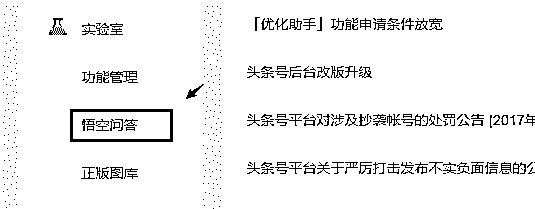
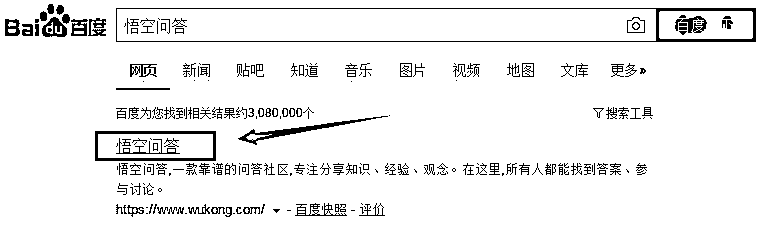
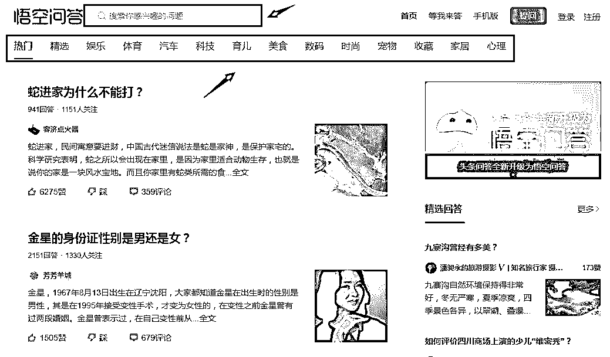
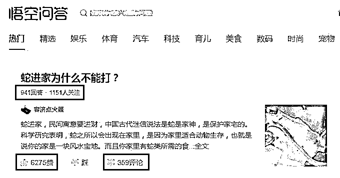
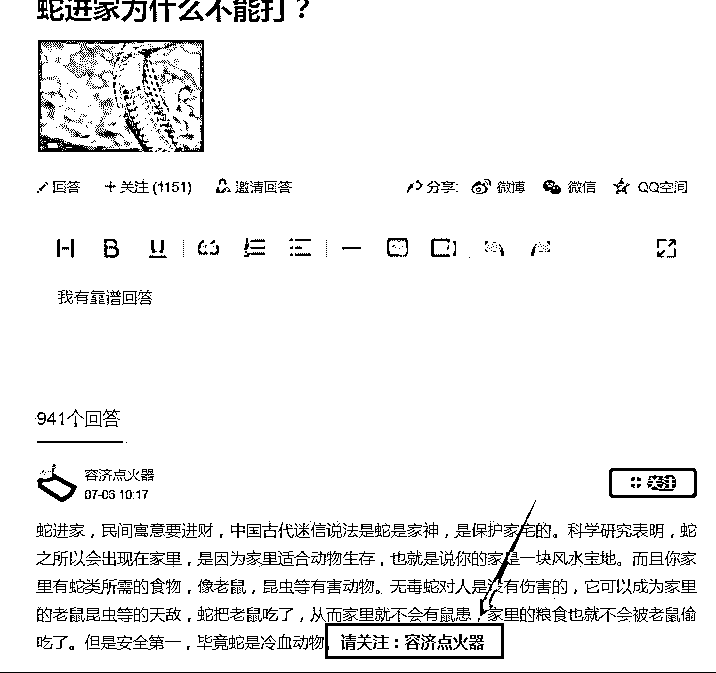

# 灰产哥:其实利用问答来引流,效果不比写软文差

> 原文：[`mp.weixin.qq.com/s?__biz=MzIyMDYwMTk0Mw==&mid=2247487881&idx=1&sn=ab072284fa0958d7fba2fdcb379627d5&chksm=97c8dab1a0bf53a7a393afbad6c268deb15aaaced0461af69f4fe9be783b6410df0975b6d6a6&scene=27#wechat_redirect`](http://mp.weixin.qq.com/s?__biz=MzIyMDYwMTk0Mw==&mid=2247487881&idx=1&sn=ab072284fa0958d7fba2fdcb379627d5&chksm=97c8dab1a0bf53a7a393afbad6c268deb15aaaced0461af69f4fe9be783b6410df0975b6d6a6&scene=27#wechat_redirect)

过今日头条来引流吸粉，主要有 4 种方式：文章、微头条（类似微博）、视频和问答。

这篇文章灰产哥先介绍下利用头条问答给微信公众号引流吸粉的技巧。头条问答，现在改名叫“悟空问答”。如果已经注册了头条号，在后台点击左边导航可进入首页。

没有头条号的，可以百度搜索“悟空问答”进入首页。

可以在首页选择自己所从事领域的分类导航，如果导航上没有你的行业分类，可以直接在搜索框输入关键词查找。

优先选择那些最新的还没什么人回答的问题，这样只要你的回答足够好、足够专业就可以排在第一位，曝光的机会最大效果更好。

问答平台的流量非常大，可以看看下图的问题：941 个回答、1151 人关注、6275 个赞、359 条评论，初步分析该条问答的访问量至少有 60000。

更重要的是点开这一问题的，基本都是对问题感兴趣、比较精准的潜在人群。

可以用之前写过的相关文章复制过来回答，还可以用图片和视频来回答问题，同时在回答里面植入广告信息，引导关注微信公众号。

文字和图片引导关注微信公众号，有时审核比较严格无法通过；但目前头条对于视频里的广告信息审核还比较宽松，所以建议有可能的还是尽量用视频来回答效果更好。

不能留文字，就用图片（打水印）； 不能留图片，就用视频；

不能留微信公众号，就留手机号、QQ 号、邮箱。

不能出现的字眼，就找能被理解但不易被屏蔽的字代替。植入广告信息之前，一定要了解每个平台对于这方面有什么要求，如果随意留下广告信息，轻则屏蔽，重则可能封号。可以先用小号测试，避免造成不必要的后果。

能成功回答不被删除，会源源不断的为你带来粉丝，只要不是太冷门的问题。

其他类似的主流问答平台：

知乎问答

百度知道

搜狗问问

新浪爱问

360 问答

天涯问答

果壳问答

不同的领域还会有很多垂直的问答平台。根据你具体的行业，可以去百度搜索。

同一个回答的内容，可以在多个不同的问答平台去回答类似的问题。

悟空问答的优势在哪里？

第一，回答者不乏专业机构和头条号作者，甚至更多都是“千元万元计划”的大咖，，回复内容都很权威，高质量的内容可以有效的增加用户的活跃度和粉丝的粘性。

第二，多一条赚钱的途径。无论是“人气奖”等直接奖项的设置，还是无限次发文的机制（作者每认真回答一个问题，相当于创作了一篇优质原创内容），都给了作者更多的利益。

第三，可以引流增粉。用户看到作者优质的回答后，有可能直接去该作者的主页上浏览内容，个人资料上可以填写联系方式。

比方说，寻找一些我们潜在可能会提的问题，然后给出专业的或者建议性的答案。如果你是做宝妈产品的，那么你可以直接搜索关于宝妈一切的话题问题。

可以看到这些问题问答上有很多，关注量和回复量都不错。那么，我们只需要用自己的专业知识写下答案，留下自己的联系方式就可以了。

只要我们的回答足够专业，内容干货十足，能够帮助到他人，那么别人就会对我们产生信任，从而添加联系，起到了很好的一个引流作用。

当然，这里不仅仅可以留下联系方式，我们还可以给自己的公众号、网站引流，玩法都是一样的。

这种模式其实很多平台都是适用，比如百度知道，分答等，而且这种引流模式是会一直存在下去了。

项目前期准备

准备头条号，可以多准备几个，如果没有太多的资料申请，可以去某宝买，目前新手头条号的价格在 60 元左右，需要注意的是要确定好头条号的领域，在后期的回答和引流中是有一定作用的。

可以在前期或者是有起色的时候购买一定的粉丝量，有一定的粉丝量之后在增粉方面会更加的容易，头条上有很多人在文章、视频下面评论互粉的，要是觉得这种方法太慢，浪费时间可以选择买粉，现在头条粉丝的价格是相对低廉的，一千粉大概在十几块左右。

项目具体操作

最主要的一点是，选择擅长的领域，写出走心的回答

很多人都是直接从今日头条 APP 内才知道悟空问答，其实悟空问答是可以直接通过搜索引擎搜索“悟空问答”来展现的，就像知乎一样，如今是独立出来的。

它的展现机制是在悟空问答中回答问题，然后头条会选择把你的回答连带问题推荐给感兴趣的用户。

所以要擅长的领域，写出走心的回答，这样你的回答才会被感兴趣的人阅读点赞，推荐机制才会觉得你的回答受欢迎就会推给更多的人。

还有就是要选择关注人数多、阅读量高的回答。

对于这方面的问题也不能放弃，如果自己对于这方面的问题不熟悉的话，可以去别人问答平台找素材，然后整理成自己的回答。

一些关注人数比较多，阅读量高的问题，在其他的问答平台也会有类似的问题的，综合一下高票答案，然后整理成自己的回答写上去。

第三点是回答尽量详细易懂。

举个例子：比如说头条上面有很多有关于网赚兼职的问题，例如如何通过业余时间在互联网上赚钱。

对于这样的答案，即使很回答淘宝客、自媒体等很普遍的项目时，你也要回答的仔细一点，简单一点，因为头条面向的用户是大部分没有接触过网赚的人，把很多细节上的东西或者是你觉得简单的东西省略掉，他们就看的云里雾里，不利于答案的再次推荐。

可以选择一个点一条线去回答，比如说头条上面做短视频自媒体，如何获取头条号，如何寻找视频素材，如何剪辑，如何取标题等等方面。让大部分人能看得懂，可以去操作。

第四点是了解推荐机制

悟空问题的推荐机制也是沿用今日头条文章视频的推荐机制，即先推荐给一部分用户看，如果用户看的时间比较长，有点赞评论等行为，那么下次就推荐给更多的人。

所以这个时候，自己也可以给自己加一把油，去外面买阅读、买点赞评论，只要前期的推荐量起来了，后期就不需要自己操心了。

 ↙“阅读原文” 加入高端社群