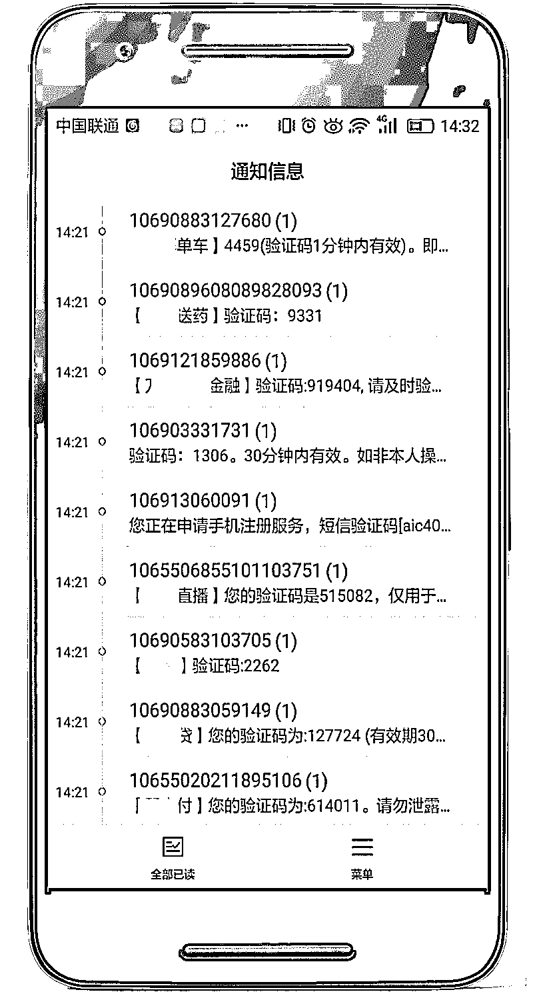
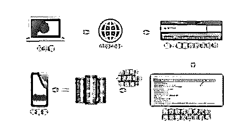
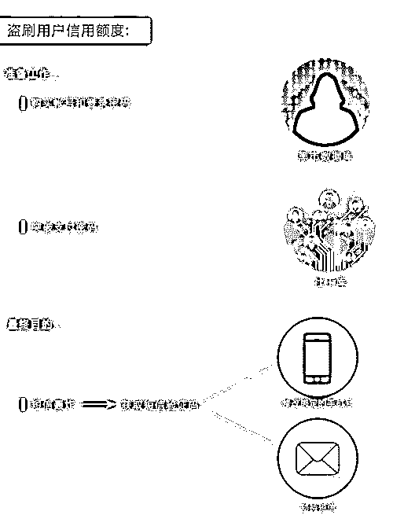

# 揭秘短信轰炸机背后的真相，盗刷者一夜赚十万

> 原文：[`mp.weixin.qq.com/s?__biz=MzIyMDYwMTk0Mw==&mid=2247487857&idx=1&sn=dc4d404d1b1a150dd6fe99e93c2ea3e6&chksm=97c8da49a0bf535f9f1ed0f12e2043ee532d4686f253250bd7763b446de09c847e28dd5825f6&scene=27#wechat_redirect`](http://mp.weixin.qq.com/s?__biz=MzIyMDYwMTk0Mw==&mid=2247487857&idx=1&sn=dc4d404d1b1a150dd6fe99e93c2ea3e6&chksm=97c8da49a0bf535f9f1ed0f12e2043ee532d4686f253250bd7763b446de09c847e28dd5825f6&scene=27#wechat_redirect)

“验证码”几乎是我们每天都要接收的信息

然而，一天几百条的“验证码”

你还 HOLD 得住吗！

近日，不少网友的手机突然“**炸**”了，

在未进行任何操作的情况下，

十分钟内就收到了**百余条验证码短信**。

出现这样的情况疑似遭遇了

“短信轰炸软件”的攻击

这类软件通常被用于

欠钱不还的人、给差评的客户、情敌等

因其效果强大，能使对方手机瞬间崩溃

被网友形象地称为“复仇大杀器”

@日耳耳：嗯，上次也是收到轰炸，没几分钟京东白条就被盗刷了。

@才疏学浅 NML：我也遇到过，淘宝也没给过差评，莫名其妙的就收到短信和电话。

@不群不党 VIP：本人因为给一个淘宝卖家差评，他就用过这手段，用一堆电话软件打电话骚扰注册软件把你的手机号注册无数应用，就接到无数验证短信。

@北山雀：被朋友恶作剧过，拉黑了。

然而，这种短信轰炸除了被用于复仇泄愤之外，背后还暗藏着许多安全隐患。一些不法分子利用这类软件从事盗刷蚂蚁花呗、京东白条……套现以及敲诈等非法行业。

**什么是短信轰炸？**

这种“短信炸弹”主要是通过特制的软件不断往一个手机号码发重复的垃圾短信，以达到骚扰目标用户的效果。只要在网上搜索“短信轰炸”关键词，就会找到大量的软件下载地址。

一个强大的短信轰炸机能做到每秒发送上百条短信。

那么它的原理是什么呢？我们都知道，**现在很多的网站和移动应用都需要用户的手机号来进行注册和修改资料，为了确定为机主本人操作，网站会通过向用户的手机发送验证码的形式来进行确认。** 

“短信轰炸软件”正是利用了这一点，将多个网站的注册端口对接起来，输入手机号码后，软件会在短时间内自动向这些网站发送注册请求，因此就会有大量的验证码信息不间断地发送到用户的手机里，造成手机崩溃。

短信轰炸软件攻击流程

1\.  恶意攻击者在前端页面输入被攻击者的手机号；

2\. 短信轰炸后台服务器，将该手机号与互联网收集的可不需要经过认证即可发送动态短信的 URL 进行组合，形成可发送动态短信的 URL 请求；

3\. 通过后台请求页面，伪造用户的请求发给不同的多个业务服务器；

4\. 业务服务器收到该请求后，发送动态短信到被攻击用户的手机上。

用户一旦遭受这种攻击，手机就会时刻处于接收短信状态，不得不关机、换号或者使用第三方软件进行拦截。当用户的手机崩溃时，不法分子就有可能趁虚而入。

**不法分子利用短信轰炸软件做什么？**

第一种比较粗糙的敲诈手法就是，**挑选那些“手机靓号”进行轰炸，威胁机主不给钱就继续骚扰**。通常这些靓号机主手头宽裕，为了省事和避免在其它生意方面造成损失，往往会选择妥协。然而这只能得到短暂的停歇，隔断时间又会被不法分子当成提款机提款。

另一种手法就是**将真实的验证码信息掩藏在轰炸短信海洋之中，从而实施盗刷行为。**

背景：从 2014 年开始，众多消费金融平台开通“透支”、“零首付分期”功能。根据用户的信用消费记录，平台提供一定的“透支”额度，购买商品，最典型的就是蚂蚁花呗。

这些平台，正在成为黑产眼中的肥肉。一个晚上盗刷十几个账号，就可以赚近 10 万。

不法分子只需要**花 0.5 元到 5 元不等，就可以通过黑市购买一个可登陆的金融帐号和密码**。这些信息的来源众多，而最直接的，就是黑客入侵某些平台，从后台将整个用户信息数据库拖出来。

有了登录密码后，接下来就要突破支付密码。一般来说，大部分人最多只有 4 个常用密码，一旦超过 4 个，就经常记混。而不法分子**通过地下数据库就可以找到这个账户曾经用过的其他密码**。

有了双密之后，几乎锁定可入侵目标，剩下的操作中最重要的就是获取短信验证码了。**只需要有**两******种手段，一个是“**修改**绑定的手机号”，一个就是“劫持短信”。**

在此之前，盗刷者还会利用软件轰炸用户的手机，一下蹦出来几十条各个平台的验证码短信，“目的就是**迷惑用户，然后将盗刷平台的验证码藏在其中**，一般用户只会认为是骚扰，就不会打开账户来查看信息”。

修改绑定的手机号：盗刷者会用一个新号码给客服打电话，说自己原来的手机丢失，只要提供身份证、银行卡、最近收货地址、购买物品等信息后，就能修改手机号。

拦截短信：黑客通过短信、美女图片、红包、社交软件等形式将短信拦截病毒发送到用户的手机，一旦安装，短信将会完全被黑客监管。用户收到任何一条验证码，就会同时发送到盗刷者绑定的邮箱中，或者直接拦截用户短信，让他完全收不到。

**拿到验证码之后，盗刷者就可以肆无忌惮地用你的余额和你的透支额度来买买买了。**先盗刷的，是虚拟物品，比如 QQ 币、话费、油卡等。因为虚拟物品不需要物流，更容易套现。一般平台也为防止大规模套现，对虚拟物品的额度较低，一般只有几百元。

虚拟物品之后，盗刷物品才是更为复杂的产业链。手机、电脑、手表、金项链、茅台，一般都是这些好变现的商品。收到货以后，盗刷者通过某些渠道“销赃”，将这些盗刷物品套现。物品会流向专门的二手黑市，比如一个全新的 iPhone，打 8 折出售。

> 文章授权转载自“微信 110 ”

**◆ 微信安全 tips **◆****

短信轰炸：如果遭遇短信轰炸，可以下载杀毒软件来解决，设置关键词屏蔽垃圾短信，拦截陌生号码。

盗刷：如果发现自己的金融账户被盗刷，应当及时去公安部门报警处理。

 **↙****“阅读原文” 加入高端社群**