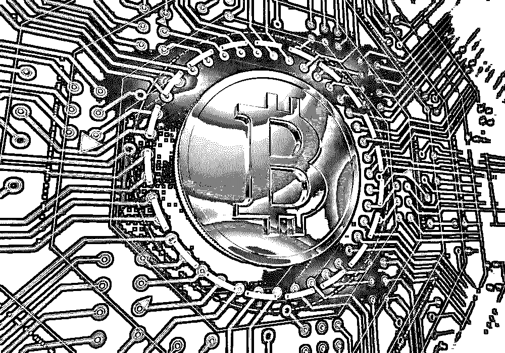
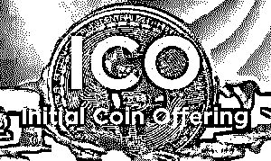
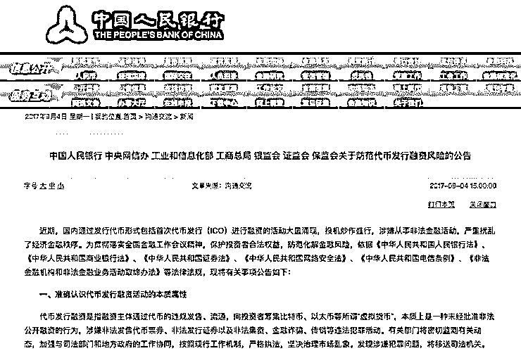
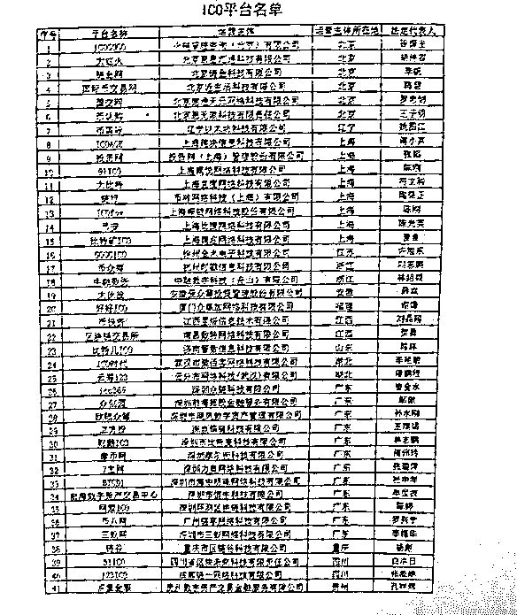
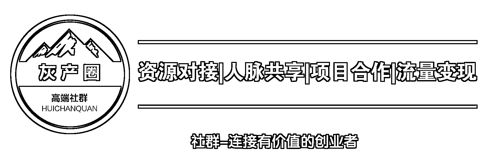

# ICO 监管一刀切:是灰色融资链新工具？还是非法集资？

> 原文：[`mp.weixin.qq.com/s?__biz=MzIyMDYwMTk0Mw==&mid=2247487829&idx=1&sn=1b6718748bf132df53e4843857247a5e&chksm=97c8da6da0bf537b543ad940c89fa73182439822dcb063cc768c394f51429d81b63ffeb8028e&scene=27#wechat_redirect`](http://mp.weixin.qq.com/s?__biz=MzIyMDYwMTk0Mw==&mid=2247487829&idx=1&sn=1b6718748bf132df53e4843857247a5e&chksm=97c8da6da0bf537b543ad940c89fa73182439822dcb063cc768c394f51429d81b63ffeb8028e&scene=27#wechat_redirect)

当众多巨头和创业者还在为共享打车、共享单车、VR、IP 化、互联网金融沉迷时，一种全新的“众筹”正在造就一个又一个暴富神话。其名为 ICO，即首次代币众筹，一般指区块链初创项目在众筹平台上发行项目代币，投资者使用指定数字货币购买代币为项目进行众筹行为。而近段时间以来，国内外 ICO 市场井喷式爆发。

资质的鱼龙混杂，千奇百怪

ICO 的特点就是足够“隐形”，区块链创业公司不以公司股票或债券为融资工具，而是直接发行自己的数字代币，交换比特币、以太币等较为流行的数字货币，以达到融资创业的目的。简单来看，就是拿自己制造的钱，去换真正的数字化“真金白银”。

不要以为 ICO 看起来似乎非常简单，会让很多人谨慎对待，实际上其火爆之势已经超越大众想象。国家互联网金融风险分析技术平台 7 月 25 日发布的《2017 上半年国内 ICO 发展情况报告》显示，今年上半年，国内已完成的 ICO 项目共计 65 个，累计融资规模 26.16 亿元，累计参与人次达 10.5 万。

这样的暴利和敛钱速度，让很多创业者为之眼红，由此产生的乱象与投机者也层出不穷。最典型的现象，就是“草台班子”泛滥。很多团队规模小到只有几个人，不需要花钱去制造一个公司，也不需要有具体的产品，只要创造一个区块链的概念，就能找到所谓的业内“大牛”、“大佬”展台，然后以全面发散的营销方式进行宣传、造势。只要自己制造的新数字货币暴涨，就能吸引众多“韭菜们”入局。然后，就可以坐等“收割”。

洗脑般的传播手段

国内的 ICO 团队非常善于“洗脑”，他们的传播手段总结起来很简单，就是“全面撒网、重点捞鱼”。QQ 群、微信群、小密圈、行业网站、路演等，几乎就是他们全部的洗脑传播渠道。QQ 群、微信群等吸引那些“韭菜们”的注意，通过小密圈继续发酵，而在行业网站上发表高大上且艰涩难懂的文章，证明自己的正规性和美好前景。

最终则是进行各种路演，邀请业内“大佬”来站台，疯狂炒作自身新币的前景，成功构建出一个有着极大潜力的 ICO 投资形象。效果显然是很显著的，某 ICO 第一天最高价格 66.66 元，涨幅 33 倍；另外一个 ICO 从最初的一股几毛，翻了 90 多倍；甚至还有的 ICO，一年涨了 1500 倍……

“韭菜们”无法去甄别这些 ICO 的真假，只能是通过 ICP 团队给出的项目信息进行自己的判断。但在 ICO 团队精心的包装下，不是真正的金融界专业人士根本难以分辨，“韭菜们”只有任人宰割。

未受到监管的 ICO 会不会是下一个 P2P 的重灾区？

其实，并不是所有的 ICO 都存在问题。就像 P2P 平台，“跑路”的虽然有很多，不过也有一部分正规的。但是从 ICO 行业目前的形势来看，其面临的主要问题是信息披露不充分、风险揭示不完整。

大部分 ICO 项目处于初创阶段，参与 ICO 前也没有像 IPO、VC 等传统融资前完善的尽职调查。项目是否合规，不是专业人员难以甄别。而对于法律、政治、经营风险，很多项目避重就轻，甚至不予披露。ICO 自以为不触犯法律，但其中却存在着极难以把控的风险。未受到监管的 ICO，很有可能随着时间的推移变成下一个 P2P 重灾区。

不过，ICO 并非真的能够“纵情狂欢”。在国外，已经有政府监管部门开始对 ICO 进行关注并且进行严格的监管。而在国内，中国人民银行数字货币研究所所长姚前在一次研讨会中直言，“从制度建设出发，我们应该尽快在法律上给予 ICO 一个说法，一个完整的监管框架，对于促进整个区块链行业健康发展非常重要”。

　　监管将至的信号越来越明确

　　9 月 2 日晚间，中国首家比特币交易平台——比特币中国宣布即日起暂停 ICOCOIN 充值与交易业务。这是自 ICOINFO 之后又一家平台主动关停业务。

　

　这一天，ICOCOIN 暴跌近 36%，总流通市值在 24 小时内蒸发约 2440 万美元(约合人民币 1.6 亿)。

　　另一个值得关注的消息是，一场本应于 9 月 2 日召开的区块链盛会据报道被有关部门叫停。

　　此前，证监会、中国互联网金融协会等多个监管部门提示风险。坊间传言，针对 ICO 的监管办法正在进一步制定当中。

　　ICO 这种另类投资方式，似乎打开了一只潘多拉的盒子。从 20 万裂变成 600 万的暴富传说时至今日仍然不绝于耳。然而，26 亿人民币规模背后，创新与非法集资混为一谈，ICO 未来究竟将走向何方？

是不是非法集资？

　　无数个一夜暴富的新闻之后，ICO 究竟是不是非法集资的讨论日益盛行：ICO 融的“资金”身份并不明晰的比特币等所谓的数字货币，然而其投资玩法却又并不符合我国几乎所有与金融相关的法律法规。

　　实际上，从当下监管层针对 ICO 的风险提示中，也并不难看出将 ICO 定义为非法集资的倾向。上周三晚间，中国互联网金融协会发布《关于防范各类以 ICO 名义吸收投资相关风险的提示》中便指出，部分机构以 ICO 为名义从事融资活动，相关金融活动未获得任何许可，其中涉嫌诈骗、非法证券、非法集资等行为。

未被阳光照射的土地，比你想象中的还要失控和毒辣。而当阳光照射进来后，迷障退散，妖魔鬼怪也就该现出原形了。

最后说一句：ICO 有风险   投资需谨慎 ！

 **↙****“阅读原文” 加入高端社群**