# 朋友圈“一元购画”刷屏了 腾讯是在做真公益还是假慈善？

> 原文：[`mp.weixin.qq.com/s?__biz=MzIyMDYwMTk0Mw==&mid=2247487713&idx=1&sn=4ffee8d646ca02cea6629cd0b5534ea1&chksm=97c8dbd9a0bf52cf84e61e4be085142c164cb7d60ee2ae82bd97dda42d16b31a1963f2bec03b&scene=27#wechat_redirect`](http://mp.weixin.qq.com/s?__biz=MzIyMDYwMTk0Mw==&mid=2247487713&idx=1&sn=4ffee8d646ca02cea6629cd0b5534ea1&chksm=97c8dbd9a0bf52cf84e61e4be085142c164cb7d60ee2ae82bd97dda42d16b31a1963f2bec03b&scene=27#wechat_redirect)

朋友圈“一元购画”刷屏了 腾讯是在做真公益还是假慈善？

今天上午

朋友圈被这些优美精致的画作刷屏了：

▼

向👈滑动，查看更多作品

这些画都是腾讯公益平台的《“小朋友”画廊》项目上的，

很难想象的是，这些小朋友指的是患有自闭症的患者。

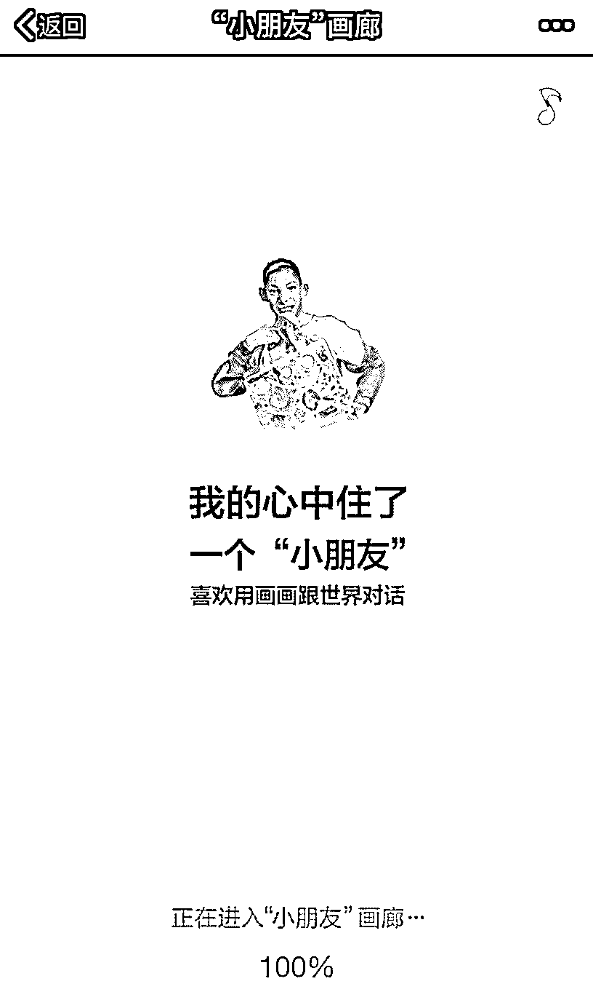

进入 html5 之后，就能看见小朋友们不同风格的画，

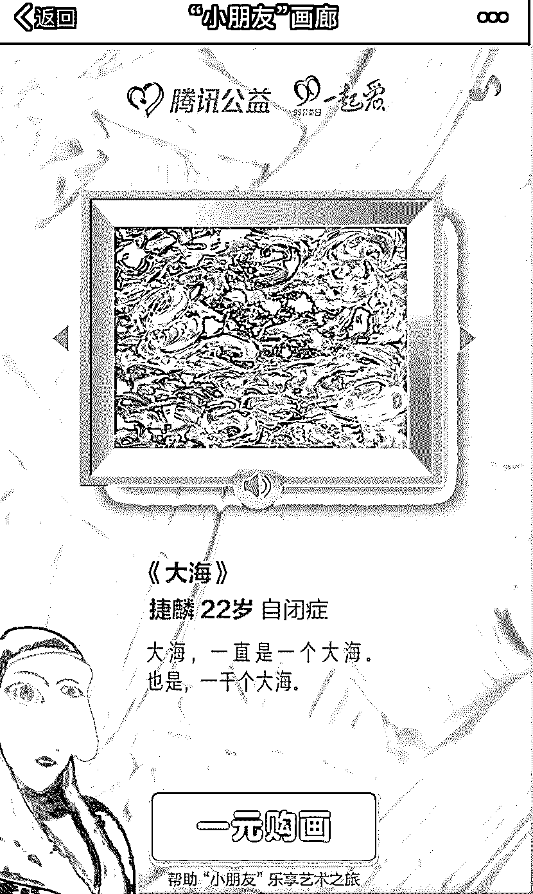

点击“一元购画”，就可以按照意愿输入不同的金额（整数），进行支付捐款，

有偿获得该幅画的电子复刻版作为屏保。

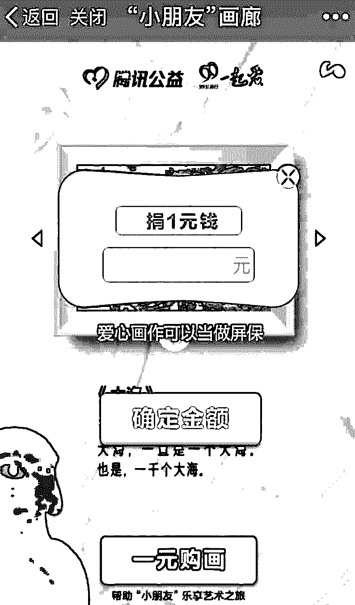

短短一上午的时间，就造成了大规模的朋友圈刷屏。

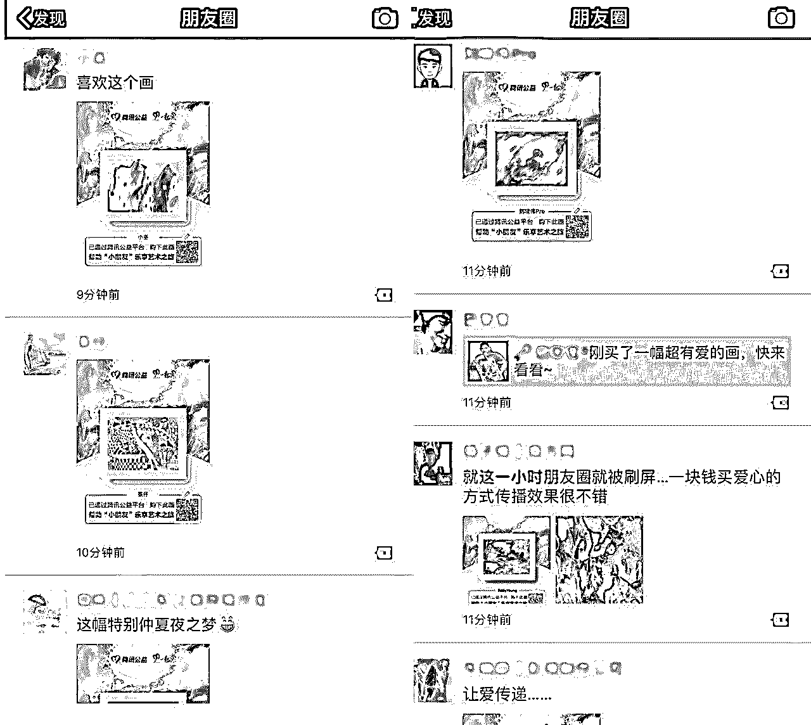

▼

之所以造成大规模的刷屏主要有以下 4 个原因：

**一、腾讯平台流量大， 朋友圈 KOL 加速传播：**

首先毋庸置疑的是这个传播 HTML5 是由腾讯旗下官方的腾讯公益推出的，日活高、流量大的腾讯平台是这个页面快速传播的基础。

而腾讯公益在最近通过小程序进行捐款公益，也吸引了很多微信重度用户的关注。

这些重度用户刚好就是朋友圈里的一部分 KOL，通过他们一层层的传播，让更多的人看见了这个腾讯公益的页面。

**而且**

据内部人员透露，这个页面还没有完全做完，未曾想被人传了出来，之后完整页面将会呈现出来。

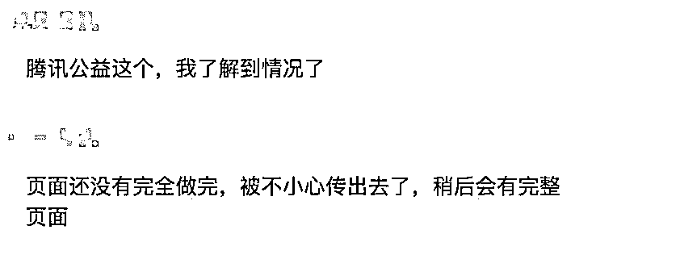

可想而知，如果腾讯想要主推这个项目，收获的流量将有多大。

◆◆◆

**二、公益事业关注度高、参与性高、****自发性强：**

本身自闭症群体就是备受关注的弱势群体之一，对于这些封闭自己，经常伴有语言障碍、智力低下的特殊人群。

影视作品中也不乏对他们的关注，《海洋天堂》、《星星的孩子》都是记录自闭症家庭里患者的生活、情感的刻画。

在这些电影手法下，经常会把自闭者患者偶发性的文艺天赋夸大，神化。

当并没有和自闭症患者接触的人群，看见这么多风格各异、色彩艳丽的图画时，巨大的差异化加剧了这个 html5 的转发传播。 

就如纪录片《二十二》一般，这些朋友圈里被画作惊艳到的人，成了这次传播扩散的自来水。

而朋友圈发布画作，并附上二维码，更激发了朋友圈内好友的互动性。

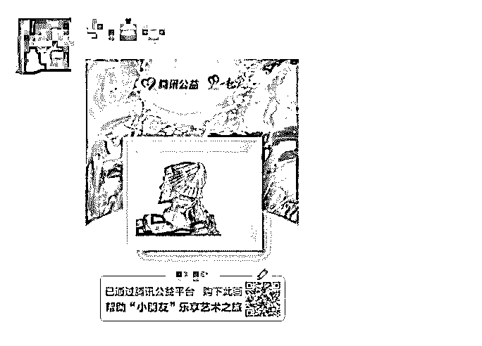

设置的并不高的捐款金额更是降低了捐款门槛。

◆◆◆

**三、新颖的公益捐助方式、多元化的展现形式：**

很多时候提到公益，大家想到的都是眼泪和同情。

但是这次的推广却完全不一样，用小考拉朋友圈里好友的转发语来说就是：

不卖惨，不搏出位。

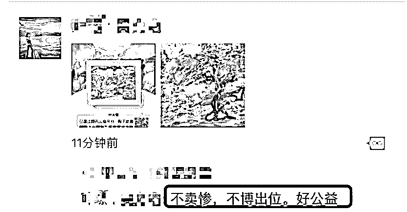

这比传统公益上的“这是心的呼唤，这是爱的奉献”更加自然，走心。

从对画作对欣赏上来看，更加生活化的场景，让每一个人对公益事业献爱心更加生活化 、场景化。

在每一副画还有语音按钮，点击之后能听到自闭症患者并不流畅的自述，更直击内心，触动用户的情感，也更好的连接起了这些特别的画家和普通大众。

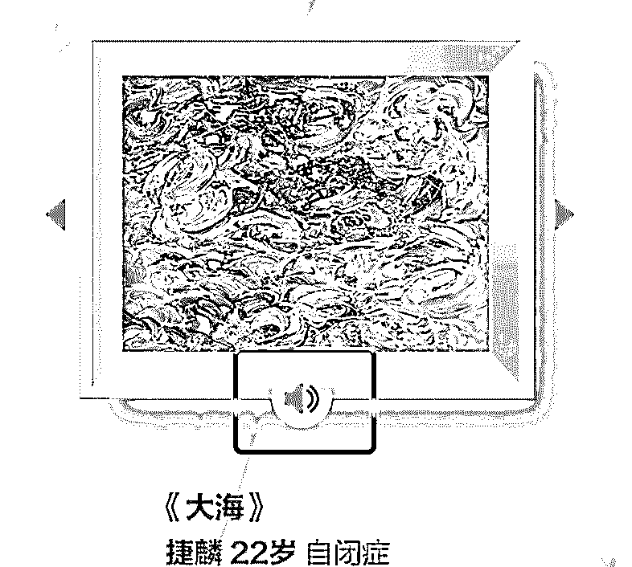

◆◆◆

**四、捐出款项透明化、实时更新数据，增加了公益捐款的可信度：**

在输入捐款金额、进入支付页面，页面上清楚的写着捐款的去向：

“深圳市爱佑未来慈善基金会”

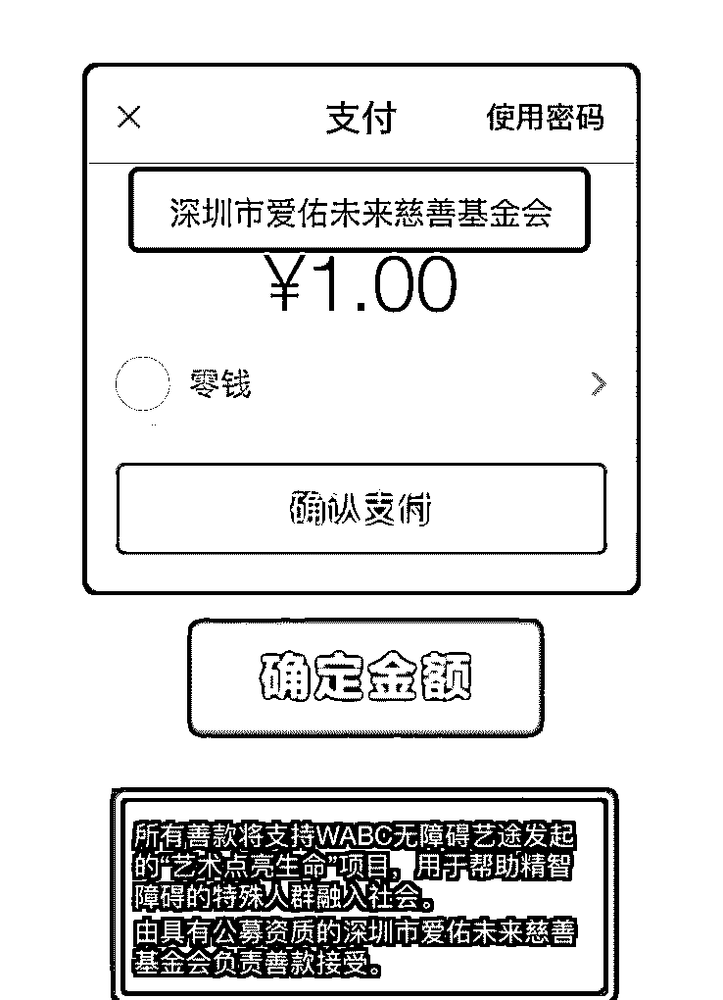

页面末端，也注明所有善款将支持由上海艺途公益基金会(WABC）在腾讯公益平台上发起“艺术点亮生命”项目。

由具有公募资质的深圳市爱佑未来慈善基金会负责善款接受。

WABC——公开资料显示，WABC 无障碍艺途成立于 2010 年，是一家为精智障碍人群提供艺术疗愈的公益机构，目前已经在北京、上海、杭州、广州、深圳、成都、西安、珠海等城市联合了近 40 个社区和学校。

在支付完成后，“了解更多”的页面上更是有此次捐款人数和金额的实时更新：

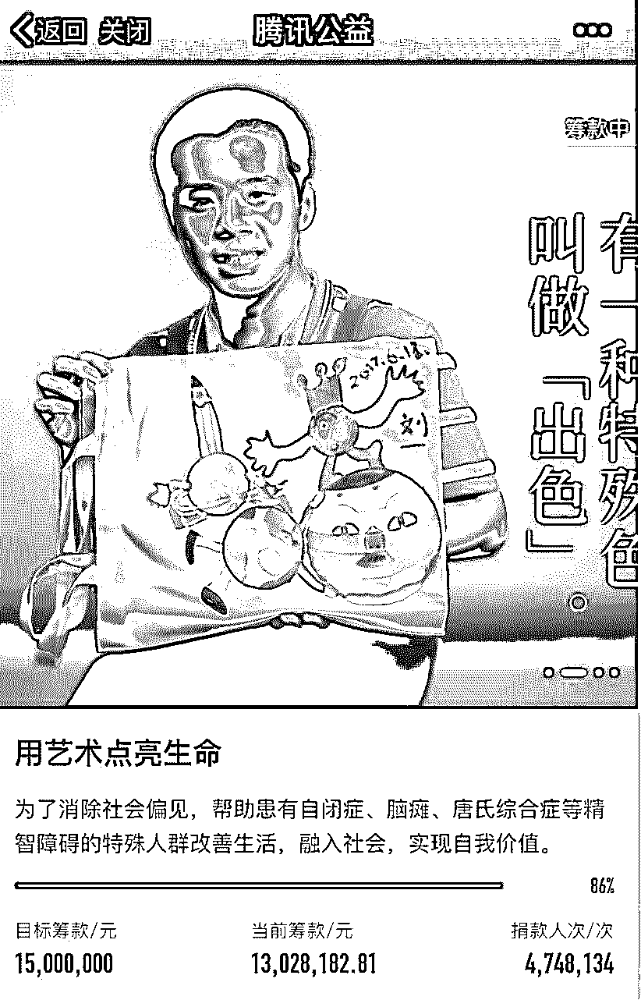

合理化、透明化、公开化、实时更新更加剧了这次捐款人数和金额不断扩大。

▼

这次刷屏到底带来了多少捐款金额，带来了多少传播？

通过链接、图片等形式在朋友圈传播后，该项目的募款参与人数、金额飞速上升。

> **29 日：**
> 
> 12:00——参与人数 2,048,462，已筹 8,410,768.71 元（56%）
> 
> 12:15——参与人数 2,522,987，已筹 9,073,321.08 元（60%）
> 
> 12:30——参与人数 3,086,894，已筹 10,046,875.15 元（66%）
> 
> 13:00——参与人数 3,673,744，已筹 11,095,682.75 元（73%）

截止到 29 日下午 13 点 30 分，该活动募集资金已超 1300 多万元，捐款人次达到 474.8 万人次，据了解该活动的筹款目标是 1500 万元。

而就在刚刚，此项目已筹满！

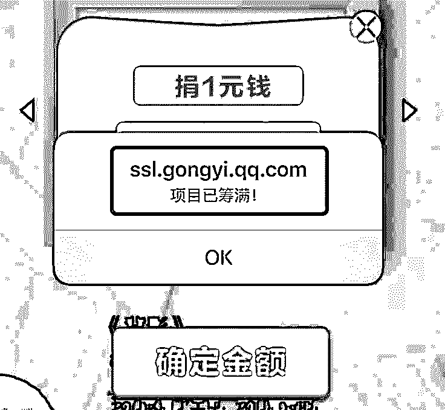

◆◆◆

此次传播，无论从公益角度，还是从营销传播角度都是非常成功的。

**是慈善还是欺骗?**

　　在收获一片好评声中，随后剧情出现了“反转”，有自媒体称，该项目涉嫌“投资商欺骗行为”。

　　一、善款去向：有人点击付款页面要求不断刷新，刷新很多次之后突然又弹出了付款密码填写框，输入密码之后扣款成功却没有保存到画。二、你的项目说明书在哪：做过公益的小伙伴都知道，组织一次活动，必须要有像样的项目说明书。三、孩子的画没有版权吗：这样的病毒式传播，一人一元买一副画，没有拷贝限制，我是不是可以理解小朋友的画没有版权，还是版权在腾讯手里?

　　甚至还有网民向深圳公安报警—

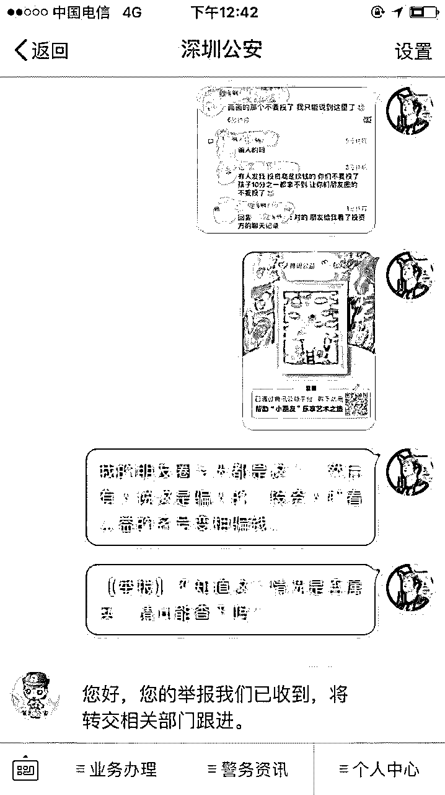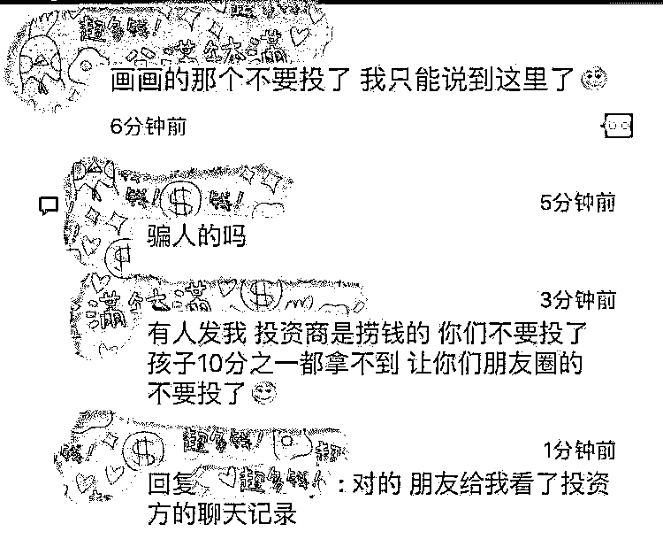

投资商圈钱？

不过，到了午间，画风突变，一则怀疑投资商捞钱的传闻刷爆各个微信群。贴上说：“投资商是捞钱的，孩子十分之一都拿不到”。

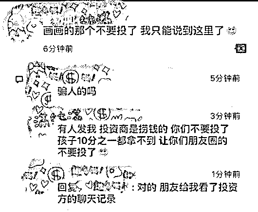

对此，腾讯回应：99 公益日“小朋友画廊”H5，是由腾讯公益和“wabc 无障碍艺途”公益机构联合出品的线上线下互动公益项目，不存在所谓的“投资商”。用户捐赠的善款不会进入腾讯公益，而是由深圳市爱佑未来慈善基金会接受。

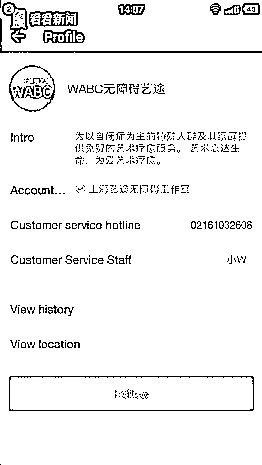

用户每购买一副自闭症儿童的电子画作，就相当于向腾讯公益平台上的“用艺术点亮生命”公益项目进行了捐赠。善款将用于帮助患有自闭症、脑瘫、唐氏综合症等精智障碍的特殊人群改善生活，融入社会，实现自我价值，不存在“分成”。

此外，善款使用情况，将在腾讯公益平台上进行定期公示，接受所有公众的监督和询问（查询路径：打开微信，我-钱包-腾讯公益-个人中心-捐款记录）。用户若关注了“腾讯公益”微信服务号，也会收到善款执行明细情况的及时推送。

是否违背慈善法规定

不过，也有网友提出质疑，《中华人民共和国慈善法》第二十五条规定：开展公开募捐，应当在募捐活动现场或者募捐活动载体的显著位置，公布募捐组织名称、公开募捐资格证书、募捐方案、联系方式、募捐信息查询方法等。

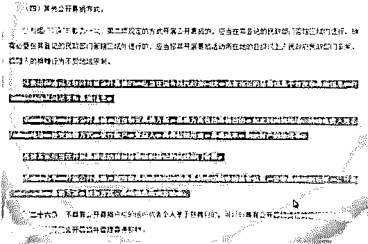

某记者进行了 4 次捐款，但从头至尾，在项目页面上都没有发现公开募捐资格证书、联系方式等信息，仅在最后支付页面出现了深圳市爱佑未来慈善基金会。但是在该基金会官网上，记者也没有查询到资格证书等信息。

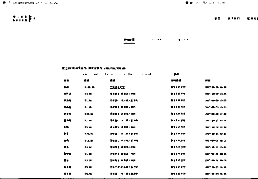

对此，负责人表示：此前因为人手有限，所以未能在项目页、官网等公开渠道上传资格证书，后续会跟进、公开募捐资格。

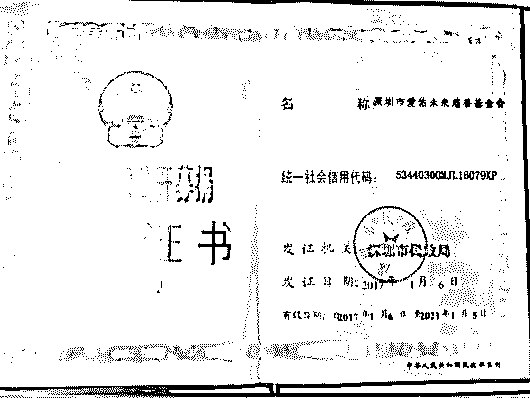

下午 3 点半，腾讯向记者传来了深圳爱佑未来的公开募捐资格证书。同时，在腾讯公益有关爱佑未来的公司介绍中，资格证书等信息也能同步查询，显示这是一家符合资质的慈善机构。

 **↙****“阅读原文” 加入高端社群**