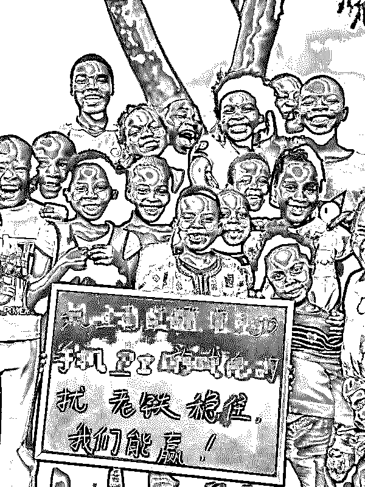
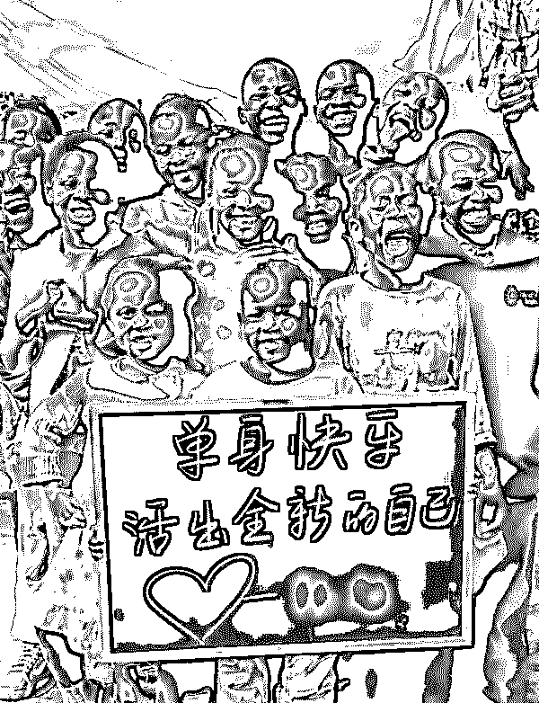
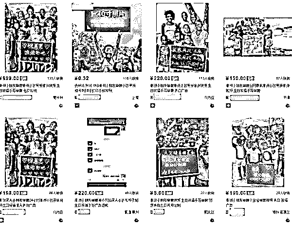
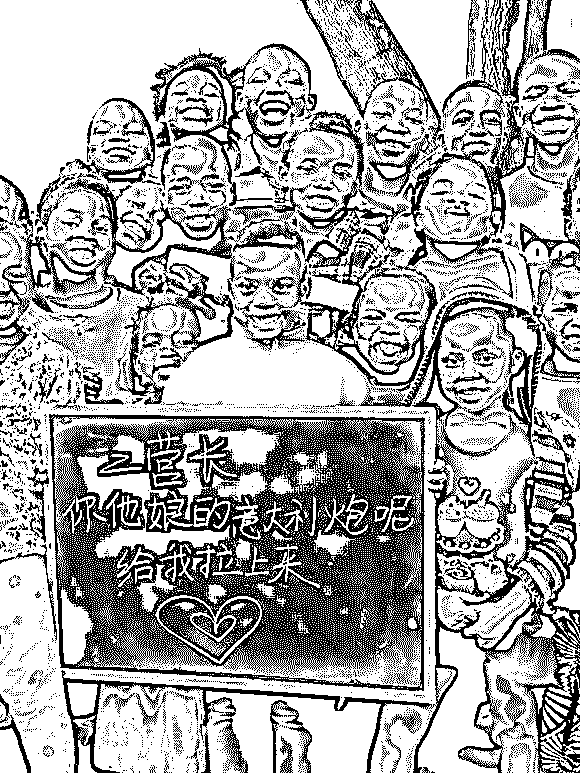
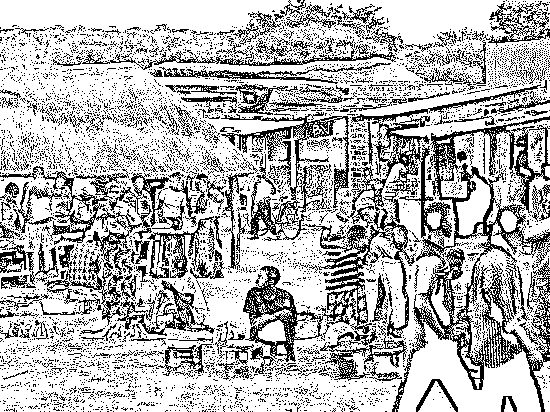
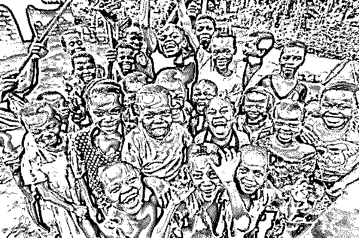
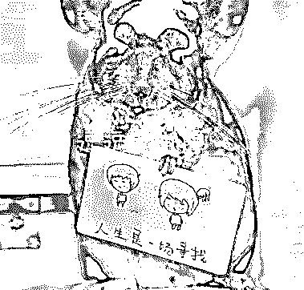

# 灰产哥|最近火热的“非洲小孩举牌”视频，快乐的背后是公益还是利益？

> 原文：[`mp.weixin.qq.com/s?__biz=MzIyMDYwMTk0Mw==&mid=2247487625&idx=1&sn=da92287982d5e5ef376bc1036eb6b4ed&chksm=97c8dbb1a0bf52a75634613fe9bcd257905757c20faf8f5a6e71751361794f882a1563918f86&scene=27#wechat_redirect`](http://mp.weixin.qq.com/s?__biz=MzIyMDYwMTk0Mw==&mid=2247487625&idx=1&sn=da92287982d5e5ef376bc1036eb6b4ed&chksm=97c8dbb1a0bf52a75634613fe9bcd257905757c20faf8f5a6e71751361794f882a1563918f86&scene=27#wechat_redirect)

打广告最厉害的方式是什么？上电视、上头条、上网站？那都不好使，这些高大上的广告方法，恐怕今天都要输给一个不到 20 秒的小视频。

连日来，一种时长在 20 秒以内，非洲小朋友举牌送祝福、打广告的视频，在朋友圈和微博上走热。

不标准的中文发音，灿烂的笑脸和一口口的大白牙，一群群非洲小朋友最近在交际媒体上传递着魔性般的高兴。

视频里，一群热情活泼的非洲小孩，在远离中国 8000 公里之外，隔着 6 个小时的时差，举着牌子朝我们喊话，虽然间隔悠远，但丝毫不影响这些视频在朋友圈、微信群里的疯狂刷屏。

这类举牌视频，时长大多在 20 秒以内，通常会呈现十几名非洲儿童，围聚在一块小黑板背面，跟着拍照者念着黑板上的中文，内容大多是送生日祝福、代人表白或给产品打广告等。

看完这些相片或视频，你是不是也忍俊不禁，被孩子们的单纯给逗笑了？其实，这类短视频能火，本质上是利用了文化差异和群众的猎奇心思。

你想，一口不太流利的中文从一群可爱的非洲小孩的嘴里蹦出来，并且还配上中文小黑板，这幅别致的画风你不猎奇都难，所以就有许多商家盯上了这种比较非主流的广告形式，借势给自己的企业打广告了。

一说到打广告，那就涉及到利益了，其实这么一段搞笑的视频里暗藏着一条明显的利益链。

作为正常人的榜首反响，我就想问这种效劳在某宝上卖吗？于是就猎奇搜了一下“非洲小朋友举牌”这个关键词。

全能的某宝总会给人惊喜。

页面上的“非洲小朋友举牌”效劳，单价从 10 元至 220 元不等。对此，多名商家解说，10 元只是标出来的单张相片价格，如果拍照视频，收费则从 150 元至 220 元不等。

其实视频拍照者并不是店家，而是他们的在非的华人朋友，店家通过电商平台接单，然后拍照者让“非洲小朋友举牌”，制造产品广告或祝福语，制造后通过微信或 QQ 交货，每段广告的价格多为 200 元左右。

那么我们就要问了，一条 200 块的视频，这些非洲小朋友能拿多少呢？其实只有一些零食或许每人几块钱的酬劳。因而，大部分的钱还是进了拍照者和商家的腰包。所以有些站在商业视点的人看来，这是商家对小朋友的一种剥削压榨。

可是商家自有说法，他们表明，拍照地点在赞比亚，需要从市区开车到贫民窟，油费是自己承担，还要掏钱买黑板和粉笔，关于小朋友们的酬劳，如果给的少了，他们的妈妈还会追着问你要。

有些商家乃至还拿着爱心公益来说事，表明拍这个视频也不赚什么钱，就是期望那些非洲小朋友能过好一点，能帮一点是一点。关于这一点我就想骂人了，榜首个做这个的我还相信他是做公益，可是你们现在一窝蜂的上，难道各各都是活雷锋？

在视频带给我们高兴的背面，还有一种声音，他们觉得拍照者利用非洲小孩来博眼球乃至是盈利，是对这些小朋友的耍弄，是一种种族歧视，是对非洲人民的不尊重。

一条 20 秒的视频，带给我们欢乐的一起，也带来了其他的问题，到底是爱心公益，还是剥削压榨，亦或是种族歧视，你们对此时有何看法呢？

抛开 非洲小孩举牌照的是公益或者是利益不谈

随着媒体的报道，有拍摄需求的人一定会越来越多，这是一的蓝海项目，灰产哥简单谈下‘非洲小孩举牌’运作模式

> 我们可以去海外留学生的论坛，贴吧，社群去找愿意合作的留学生。也可以在国内的大学找非洲留学生，他们在非洲肯定有亲戚、朋友吧。然后谈合作，比如拍摄一次 50 块钱，但是每天几单都是集中拍摄的，他也没什么成本，肯定是愿意去合作的。
> 
> 现在随着媒体的曝光，非洲小朋友举牌会有更多的需求者知道，借助风口，立刻操作。

> 甚至，相关的广告创意举牌项目还可以延伸、裂变，比如宠物举牌，美女举牌等等。所以互联网思维，一定融会贯通，不要说什么，你就做什么，你可以再细分领域，占领空白市场，但这个市场是真空白，还是根本没有需求，需要经验去判断。

 **↙****“阅读原文” 加入高端社群**