# 百亿人倾家荡产，“一元购”终于被定性为诈骗

> 原文：[`mp.weixin.qq.com/s?__biz=MzIyMDYwMTk0Mw==&mid=2247487597&idx=1&sn=69f5181e7bdd73f05cfedd20c50712d9&chksm=97c8db55a0bf52436bf8c35147bcdbc8f7f02a1ff5861822c846147e4c3f5863dba7754fefbc&scene=27#wechat_redirect`](http://mp.weixin.qq.com/s?__biz=MzIyMDYwMTk0Mw==&mid=2247487597&idx=1&sn=69f5181e7bdd73f05cfedd20c50712d9&chksm=97c8db55a0bf52436bf8c35147bcdbc8f7f02a1ff5861822c846147e4c3f5863dba7754fefbc&scene=27#wechat_redirect)

相信很多人都听过“一元乐购”、“1 元夺宝”、“幸运购”“一元云购”、“必中夺宝”等平台的名字，他们都有一个共同的身份，那就是“一元购”。

无一例外都是以 1 元博得价值几千甚至几十万元商品的“抽奖式购物”平台。在这些平台上，有人“好运的”获得了奖品，也有人一步步走向深渊，最终倾家荡产。

日前，已经存在五六年的监管灰色地带“一元购”终迎来官方定性，“一元购”是赌博、诈骗和骗局！

其实早在 2016 年 8 月，《人民日报》曾发文——《谁在打“博彩”擦边球》对一元购表示过质疑。

[`v.qq.com/iframe/preview.html?vid=j0328y3y1qj&width=500&height=375&auto=0`](https://v.qq.com/iframe/preview.html?vid=j0328y3y1qj&width=500&height=375&auto=0)

文中有这样一句话：“有位小公司老板一年多在‘一元夺宝‘亏掉了 300 多万元，导致公司倒闭、信用卡严重透支；一位来自湖南偏远农村的网友 4 天输光 16 万元......在‘晒单分享‘区，很多网友留言，有的抱怨投入太多、收获不值，有的质疑确定中奖用户方式不公平、参与多次都没成功。”

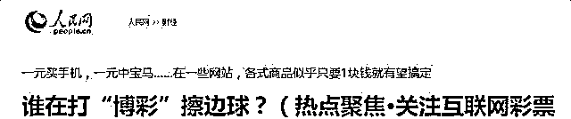

根据最高人民法院印发《最高人民法院关于进一步加强金融审判工作的若干意见》(以下简称《意见》)，互联网金融专项整治办下发文件，对于此前央视曾曝光多次的 1 元购进行定性，全国范围进行严打这种骗局！

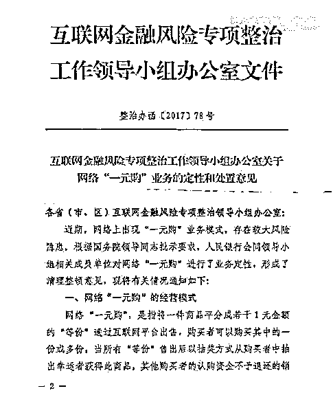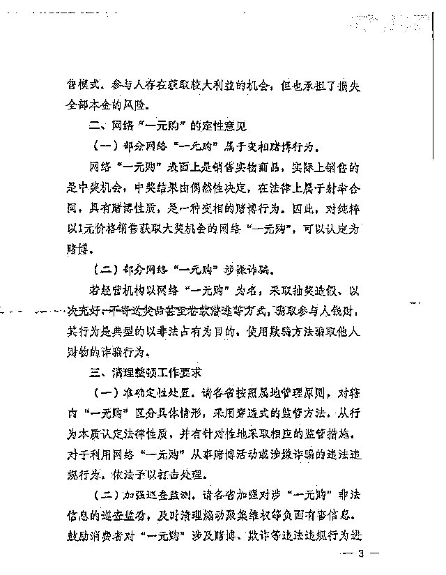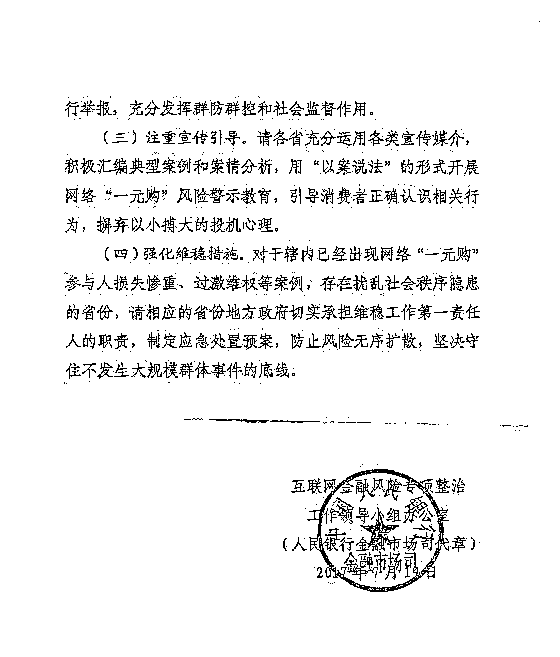

一元购简单来说，就是把网站上所有产品都拆分红一元一份。一个号码可以购买多份，最后再由系统公布中奖号码。从正常的逻辑上来讲，一次性购买份数越多，抽中商品的几率就越大。因此，用户就会产生一种 1 块钱就能抢到 iPhone 7、单反相机、金条等价值数千元商品的错觉。

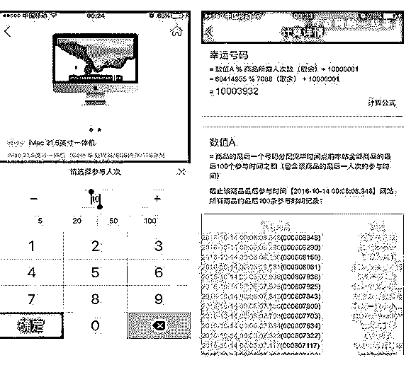

这种玩法：钱一旦投出概不退还。

明知是陷阱，为何一元购还如此火爆？

因为你只需要花一元钱，就可以得到丰厚奖品，大到开走宝马、抢购手机，小到百元充值卡、加油票等等。

某家网站近日曝光了累计参与一元购的人次已经超过了 110 亿，然而这个数字一直在以秒为单位不断上涨。

相关人士记录：下午 1 点时参与人数为一百一十亿零三百万；下午 5 时，这个数字就已经变成了一百一十亿零八百万，增加了五百多万人次。短短 4 个小时，流水额高达五百万元，按照 15%的利润来计算，这家网站 4 个小时的获利就已经达到了 75 万元。

下注金额从小到大。收回本金的欲望越强烈，就越难以抽身，最终靠四处借债继续投注。

一名“一元购”的参与者表示：以前玩过网易游戏，通过网易公司发来的一些短信，点入“1 元夺宝”界面。开始从一块两块投，然后三十五十，然后成百上千，最后就上万。大概从去年 12 月份开始玩，到如今，大概亏了四十几万。

“一元购”无非就是抓住了人们“不劳而获”的心态。

迄今为止，“一元购”已经存在了五六年，在百度搜索出来的结果至少有 20 余家网站，手机上的类似 APP 更是不计其数。有的网站甚至显示累积参与人次已近百亿。

随便挑选打开其中一家网站，首页呈现出的都是生活用品、大额话费充值卡、电子产品、黄金珠宝甚至豪华汽车等高价值商品，最便宜的也得上千。

不过，这种玩法钱一旦投出概不交还。但这仍然挡不住用户疯狂的投机心理。

在某个一元购平台网页上，实时更新参与者信息。经粗略统计，平均 1 分钟就有超过 30 人次的参与者加入。一天下来，有 43200 人次参与，即支付 43200 元。

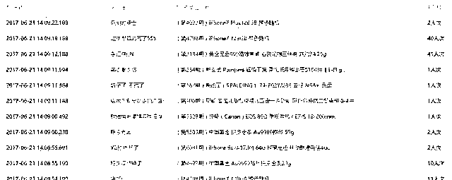

按照商家的说法，“一元购”是一种新型“电商创新”形式。他们解释，这种“众筹”方式，对于买家而言，花一块钱就有可能得到几万元的商品，即使没抽中，损失也是很小的;对于卖家而言，商品价格不变，反而能够更快地销售出去，是一种双赢模式。

一时间，“一元购”网站成为电商时代的宠儿，吸引了无数网民参与，多家大型电商、互联网企业一度涉足。据中国商业联合会媒体购物专业委员会近日发布的行业通报监测数据，截至 2017 年 4 月 27 日，“一元云购”参与者已超 160 亿人次。

是馅饼？是陷阱？

披着“购物”、“众筹”的外衣，吸引众多用户参与到“一元购”后，赚了的想继续赚，亏了的则想弥补亏空，于是不断投入大额资金。其中不乏一些用户，能在一天之内下单多达几百次。

除了用户的投机心理之外，更重要的是，平台有很多引诱行为。一些 APP 为了吸引客户会美其名曰为新客户送钱让其获取免费体验资格，但是送出的这些红包只能“抵现金使用，不可提现”，还有例如推荐好友加入可获得现金奖励的规定。

再就是用户如果中奖了，可兑换成欢乐豆等继续参与抽奖，参与金额不设限，这就让玩家几乎上瘾，无法自拔。

到了后续阶段，此类网站还会推荐介绍“靠谱”的借贷平台，“一条龙”的服务只会让人越陷越深。这种行为已不再是简单的购物，也不是所谓“众筹”，而具有赌博性质。

平台猫腻多

在“一元购”网站或者手机软件上，多的是你不知道的猫腻。

首先是商品标价明显高于市场价 20%。不过在 1 元就可以获得奖品的引诱下，溢价也在用户的承受范围内。

很多平台上虽然包括豪车豪表，实际上玩家只能抽中充值卡、购物卡等低价值商品。而这些充值卡是由平台预先低价买入的，再以卡面价值或者溢价“众筹”出去，从中赚取差价。“即便众筹不出去，也可以倒手重新变现。”

其次是极低的投资费用。在专门提供软件服务的公司，类似“一元购”APP 的全套服务:安卓和苹果通用版本报价为 7 万元，网页版则为 1.5 万元，另外免费赠送一年的软件维护服务。再加上后期拉拢客户的投资，一个类似小平台的投入大约为 8 万元，只要能拉拢到一定数量的客户，平台总是稳赚不赔。

最后也是最重要的一点，暗箱操作。

“一元购”平台声称有着严格的开奖方式，然而央视此前早就爆出很多“一元购”平台开奖过程并没有监督，甚至可以控制中奖者和开奖进度：在后台添加虚拟机器人参与开奖过程，通过人为操纵，让这些机器人中奖。

如果将“一元购”视为购物平台，其参与者购买的也不是商品，而是运气，该行为不构成买卖关系。”因此，公安、工商部门没有明确法律依据去进行查处，“一元购”也就成了没人管。

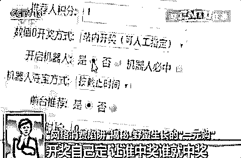

最后，这类“抽奖式购物”平台游走于法律与监管的边缘，造成倾家荡产妻离子散的案例不胜枚举。如今，“一元购”已被定性为赌博和诈骗，还望深陷其中的无辜群众及早收手。

另一方面，和人性的贪婪也脱不了关系。大家也要切记不要随便贪小便宜，天上没有掉馅饼的事情！

　**一元购实质是一场赌博**

　  网易一元夺宝项目宣告正式退场。而复盘这一切，就会发现很多值得后来者思索与借鉴之处。

　　**商业模式率遭质疑，一元夺宝是众筹还是博彩？**

　　据此，包括网易、1 元云购、1 元畅享、快夺宝等等等诸多一元夺宝的运营平台都宣称自家的运营模式是众筹+电商这种新颖的商业模式。

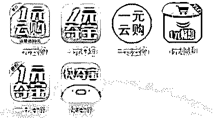

　　但一元夺宝真的就是这些平台声称的众筹+电商吗？的确，其在资金募集方面确实与众筹相似，但在**回报与风险方面却截！然！不！同！**

　　众筹的回报是群体均等回报（风险是群体均无回报），一元夺宝的回报则是特定个体必有回报（风险是除特定个体外均无回报）。

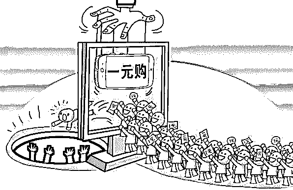

　　此外，有律师认为一元夺宝在交易过程中并不具备所有权或民事权益的转移，因此无法构成买卖关系合同。

　　由此可见，在平台眼里属于众筹+电商新模式的一元夺宝，实质上并不能和前者划上等号。

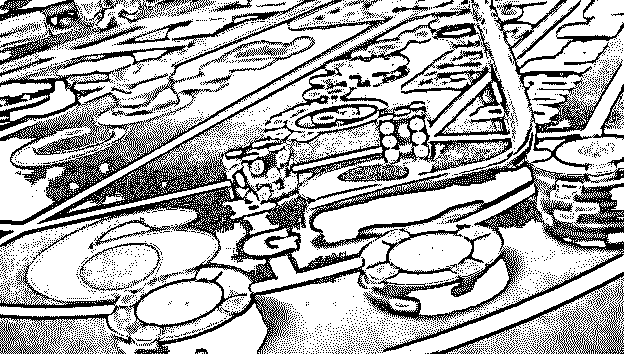

　　事实上，**一元夺宝的性质与博彩更加相仿**，从“一元夺宝”这个名字就可充分看出这种玩法是在充分利用人们以小博大的赌徒心理。

　　**开奖自己定，让谁中奖谁就中奖**

　　截止到目前，市面上仍旧有 2000 多家夺宝平台在运营，其中最大的年营业额上百亿。

　　▼

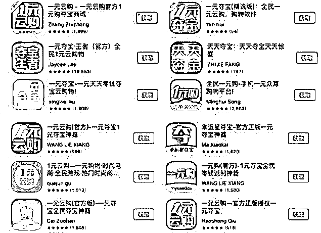

　　而细数这类平台最简单的盈利手段，其实就是通过产品加价，例如将官网售价 3000 元的手机以 5000 份每份一元的价格进行夺宝销售，在所有份额卖出之后才开奖的基本规则下，可以保证平台收益就是那多出的 2000 元。

　　但是，在这种稳定、简单且高效的收益背后，我们仍然要看到一元夺宝的实际抽奖流程仍然是在**平台方的黑匣子中运营**。

　　这也就意味着一元夺宝甚至比博彩还少了一项公证流程，**难以真正避免排除平台方内定造假的可能**。

　　简单来说，

　　就是平台是他的，

　　他想开给谁就开给谁！

　　且央视也已经针对平台方的内定中奖黑幕进行了曝光。

　　“一元购”平台搭建者还对央视记者表示，“整个商场都是你的，后台都由你控制，人流量、粉丝、指定中奖等都可以控制。”

　　平台搭建者称，商家可在后台添加虚拟机器人参与开奖过程，通过人为操纵，让这些机器人中奖。我们一起来看下操纵过程：

　　▼

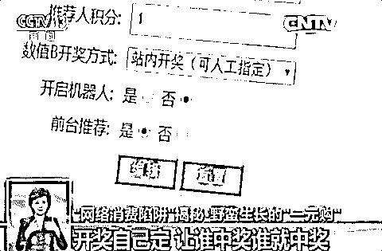

　　“机器人必中”，将这个勾选，这就意味着这次开奖的中奖人一定会是这个虚拟的机器人，真实买家不可能中奖。

　　▼

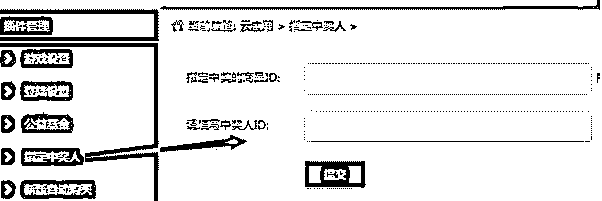

　　**写在最后**

　　“一元购”，包裹着“电商创新”的外衣，甚至以“众筹”概念，为售卖商品包装，赚取高额利润。

　　这些网站主要存在以下几种猫腻：**抽奖规则不透明**，没有第三方机构公证；平台**拒发奖品**或者售出假货；**打政策擦边球**，涉嫌博彩。

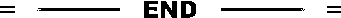

↙ “阅读原文” 加入高端社群