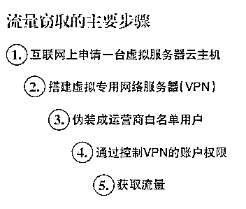

# 免费流量背后的黑色产业链 运营商每年损失上亿

> 原文：[`mp.weixin.qq.com/s?__biz=MzIyMDYwMTk0Mw==&mid=2247487401&idx=1&sn=4d0c83373f2ca506165cff3d8f1948d8&chksm=97c8c491a0bf4d87179a1b66a24672d338cba622ba7bb8466b9007f3aede2c7904f42761f360&scene=27#wechat_redirect`](http://mp.weixin.qq.com/s?__biz=MzIyMDYwMTk0Mw==&mid=2247487401&idx=1&sn=4d0c83373f2ca506165cff3d8f1948d8&chksm=97c8c491a0bf4d87179a1b66a24672d338cba622ba7bb8466b9007f3aede2c7904f42761f360&scene=27#wechat_redirect)

> **免费流量背后的黑色产业链 运营商每年损失上亿**

“免费流量”背后实际是一条黑色的产业链。包括手机、软件、教程等“免费流量”产品已经遍布网络。不过，据运营商内部人士透露，这些所谓的免费流量产品都是钻运营商空子的产物，利用了运营商定向免费流量的漏洞，这一漏洞每年可导致运营商上亿元的损失。这种现象一旦形成规模就会加剧运营商的网络压力和经济损失，同时也提升了运营商对网络建设的维护和服务成本。虽然运营商已经开始采取措施补漏洞，但技术人员仍有新的对抗方法不断出现。

“免费流量”产品泛滥

在某电商平台上，记者输入“免费流量”，查到的产品信息有近 3000 条，比较具有代表性的是以下三种产品：

第一种产品叫做“免费无限流量手机”，价格在几百元上下，商家这样描述称：“本手机在乎的是卡外加核心技术和手机的型号成色无关，本款手机是机卡一体的，不需要充值任何额外费用，直接开启热点即可使用，容易操作。最高可连接 8 台设备。”商家表示，手机流量的供给是基于服务器终端，实现远程接受网络，不扣卡内任何流量和话费。

第二种产品是“无限流量软件”，价格只有 1 元。根据介绍，卖家会给买家账号和密码，软件每次登录或连接时可能需要消耗 50KB 左右的手机套餐流量，手机自带软件在后台允许需要少量流量。一位卖家称：“我公司通过与移动合作，承包的包月流量和流量池，通过我公司技术开发流量分配系统，来实现流量无限使用。”

此外，也有卖“免费刷流量教程”的商家，价格为 9.9 元。在店家的页面上，并没有太多关于产品的介绍，只写着：“小店已与工作室合作，从工作室那里得到的新教程的成功率有 99%以上，会不定期更新教程，不会再收取任何费用，一次购买永久使用。”由于客服无人应答，北京商报记者无从得知这种免费刷流量教程是如何使用的。该店的评论区显示，不管是手机、软件还是教程，购买的消费者都不在少数，不过，其中一些的评论是“好用”，也有消费者称商家是“骗子”，产品无法使用。

钻运营商漏洞

最初看到这些产品，会让人误以为这些种类的产品是商家与运营商合作产生的。所谓的“免费无限流量”都是不法商贩从运营商那里“偷”来的。即相关技术人员钻了运营商“免费定向流量”的漏洞。

为给用户改善服务，运营商一直以来都有免费的定向流量。大批互联网公司与运营商进行合作，双方共同承担流量成本，就指定业务给予用户定向免流量。运营商既可提升用户的移动互联体验和移动网络黏性，又可增加流量访问量，形成用户流量使用习惯，进而带来收费内容等业务上的营收。

为了规避漏洞和风险，运营商会清楚地区分用户使用的是免流量业务，还是正常访问互联网业务。通常运营商会将免流服务的服务器 IP 地址加入白名单，访问白名单网址就可免费流量上网，访问不计费，甚至为了简化维护复杂度，直接进行标签化认证。

但这样的方式却被不法商贩利用变成了谋取利益的工具。流量贩卖者只需要在互联网上申请一台 VPS 云主机，搭建虚拟专用网络服务器（VPN），再通过并不复杂的伪装，就可以让运营商认为，这个 VPN 请求的流量都来自于运营商的免流量网站。这样，他们控制的 VPN 流量就变成了由运营商买单。其后，通过控制 VPN 的账户权限，流量倒卖者就可以将运营商的“免费流量”低价卖给用户。

每年损失上亿

去年，运营商为了给客户提供方便，设置了免收取流量费的白名单，当计费系统检测到用户访问的是白名单中的网址或接收彩信时就不会进行扣费，若漏洞扩大会使运营商损失过大。

这种情况实际上是计费指令或计费信息存在漏洞，有人在传递信息过程中修改计费指令，错误的指令被发送给计费系统，就会导致上述结果，但这并不是计费系统的问题，若计费系统存在漏洞会产生很严重的后果；运营商已对计费信息这一单元进行了优化。

其实这个漏洞就是利用了一些特殊应用的免费通道，但是这个模拟的空间是有限的，导致的损失对于运营商来说并不算大。中国电信相关负责人表示，目前尚未统计出不法商贩“偷”流量损失的具体数字，不过，有专家认为，“免费流量”的灰色产业链已经形成规模，按照如此速度发展下去，对运营商将造成不小的财产损失，按照估算，每年三大运营商在此项问题上的损失总额将数以亿计。

北京联通已经修改计费模式，对目前的部分定向流量免流方案进行屏蔽，其他运营商也已对这一业务展开全面的过滤和排查。但由于运营商在全国铺设的服务器很多，且各省都有自己的计费系统，要一一查漏补缺验证难度极大。

“阅读原文”加入社群