# 云集微店”的真实面目:30 万传销大军养成记

> 原文：[`mp.weixin.qq.com/s?__biz=MzIyMDYwMTk0Mw==&mid=2247487334&idx=1&sn=4509cbc4e769cd9b390daf4d54b3da0f&chksm=97c8c45ea0bf4d48b300d8f4fb00104b9a4a26f53f7aa065a649fd134d2667bc9fe916e049cb&scene=27#wechat_redirect`](http://mp.weixin.qq.com/s?__biz=MzIyMDYwMTk0Mw==&mid=2247487334&idx=1&sn=4509cbc4e769cd9b390daf4d54b3da0f&chksm=97c8c45ea0bf4d48b300d8f4fb00104b9a4a26f53f7aa065a649fd134d2667bc9fe916e049cb&scene=27#wechat_redirect)

天下熙熙，皆为利来。天下攘攘，皆为利往。“利”字身旁一把刀，夫妻为之反目，亲朋为之成仇。“云集微店”是互联网一种新型传销形式，截至 2017 年 5 月 12 日，杭州市工商对云集罚款千万元时，网上受害者已经蔓延至数十万人。

　　前段时间，家里人跟我说：一个亲戚最近老在朋友圈刷她的“云集微店”，这个“云集微店”号称是响应国家发改委等八部委共同支持的“共享经济”国家战略，要做中国最大的微商平台，一年只花 365 元即可成为“云集微店”店主，花了 365 元，不仅免费得到一套面膜，而且会拥有比淘宝、京东、亚马逊更大的网上零售店，不用考虑购货、囤货、物流，“云集微店”全部搞定。做“云集微店”的店主，自己买省钱，卖给亲戚朋友赚钱，成为店主后月入数万甚至十数万，从此踏上成功人生。我听了一笑，骗人而已。然而，使我不曾想到的是，身边陆续有人加入骗局，尊敬的长辈、多年的朋友、曾经的校友……我不禁纳闷儿了，一个这么简单而又明显的传销形式，为什么会有这么多人入彀？

　　一、“云集微店”的真实面目

　　“云集微店”到底是个什么东东？国家企业信用信息公示系统显示，“云集微店”的运营实体是“浙江集商网络科技有限公司”，是一人有限公司，法定代表人是肖尚略，成立于 2015 年 4 月 29 日，注册资本是人民币 5,000 万元（认缴）。注意，公司是一人有限公司，人民币 5,000 万元的注册资本是认缴。这意味着，肖尚略并未实际出钱，这家公司并没有履行法律责任的能力，或者用普通人能够理解的说法，这家公司是一家空壳公司。任何人通过国家企业信用信息公示系统都可以查询到，短短两年时间，这家公司已经被杭州市工商部门连续处罚两次，第一次是因为虚假宣传，第二次是因为非法传销。

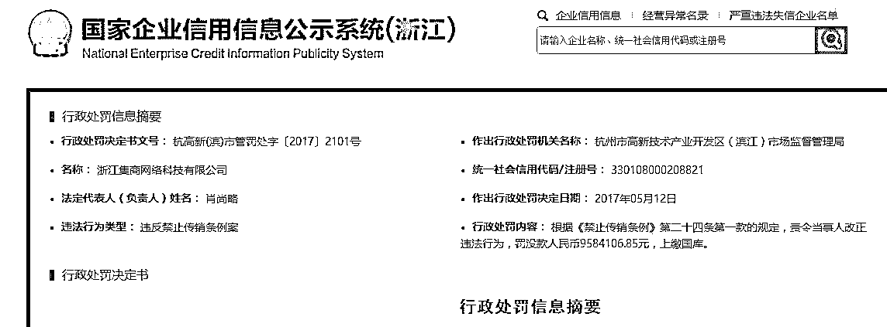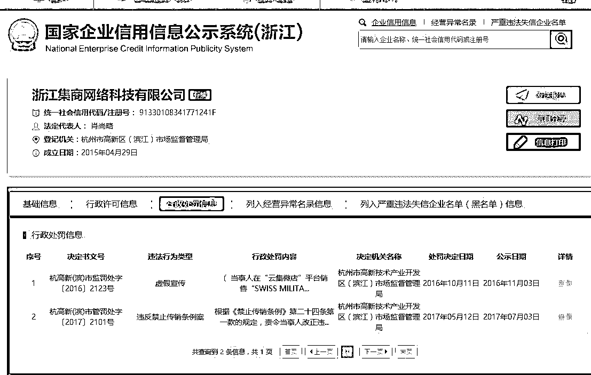

　　二、如何做到一年培养传销店主 30 万人

　　根据杭州市高新技术产业开发区（滨江）市场监督管理局对肖尚略的行政处罚决定书（杭高新（滨）市监处字（2017）2101 号），“云集微店”平台上线运营的时间是 2015 年 2 月 12 日，3 月 26 日开始组织策划设定。要成为“云集微店”店主，须缴纳一年 365 元的平台服务费，成为“店主”后，可以邀请其他人员加入成为新店主，“店主”邀请新“店主”满 160 名（直接邀请 30 名和间接邀请 130 名），即可成为“导师”，团队人数达到 1,000 名，即可向肖尚略申请成为“合伙人”。至 2016 年 3 月 8 日，“云集微店”在全国范围内的店主达到了 316,735 人，其中缴纳 365 元平台服务费的店主 310,221 人，“合伙人”达到 167 名，“导师”1,805 名，肖尚略共收取平台服务费 365×310221=113,230,665 元。可以看出，肖尚略算是一个传销天才，他充分利用道家“一生二、二生三、三生万物”的道理，借助互联网工具，将传销发挥到了极致。

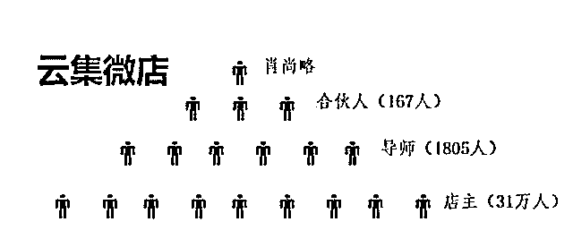

　　肖尚略是“云集微店”这座金字塔的顶端，他的下面是合伙人、导师，一共是 1,973 人，最底层为 31 万店主。金字塔顶层在全部店主中占比约为 0.6%，可谓是比百里挑一还严格。那么，成为导师、合伙人的动力在哪里？还是脱离不了传统传销的发展下线拿提成的盈利模式。杭州市工商部门调查，“店主”只有发展成为“导师”以后，才能拿提成，成为“导师”后，导师所带领的团队每新发展一名“店主”，“导师”能从 365 元的平台服务费中拿走 170 元，“导师”的上线“合伙人”能拿走 70 元，剩下的归肖尚略所有。讲到这里很明显了，你看到朋友圈里自己的朋友、亲戚、甚至爱人近乎歇斯底里得为“云集微店”摇旗呐喊拉你入伙，无非是想拉满 160 个人成为导师、合伙人，拿提成而已。

　　三、包装：百度、吴秀波、电子商务司无所不用其极

　　众所周知的是，传销手段是立体式的，尤其互联网时代，网络包装必不可少。百度中，输入“云集微店”四个字，你看到的是如下内容：
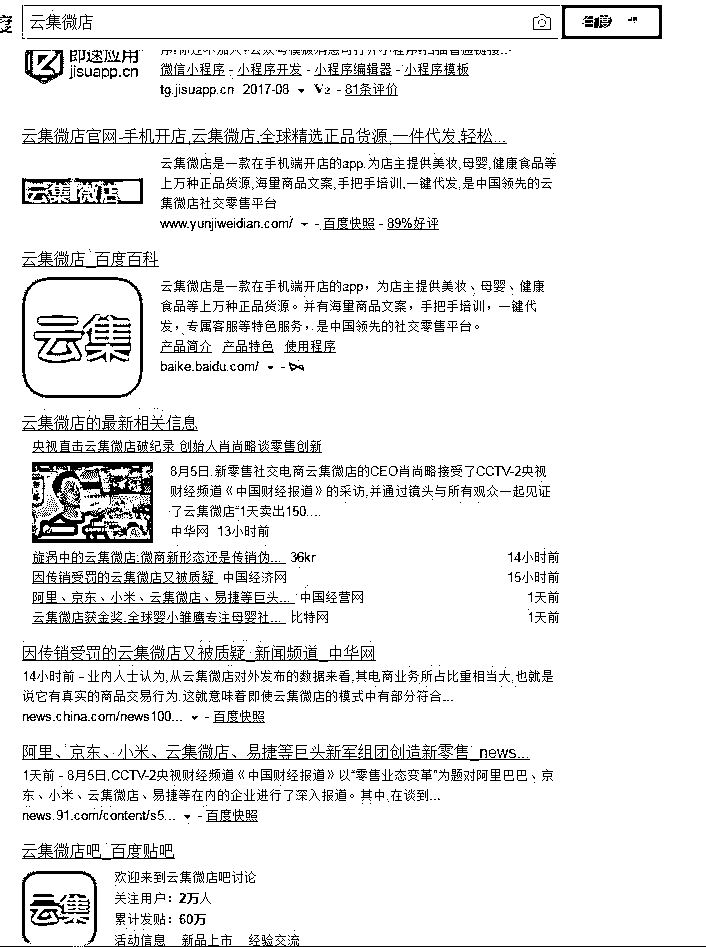

以上都是【云集微店】的公关文章 

四、云集微店老总承认传销并且发文

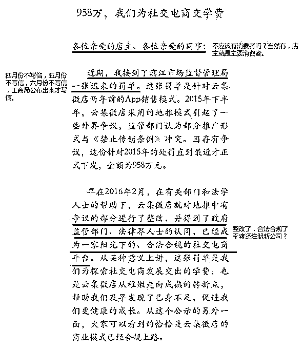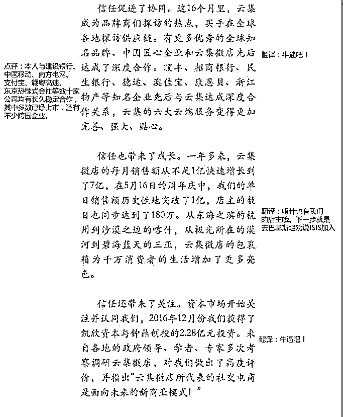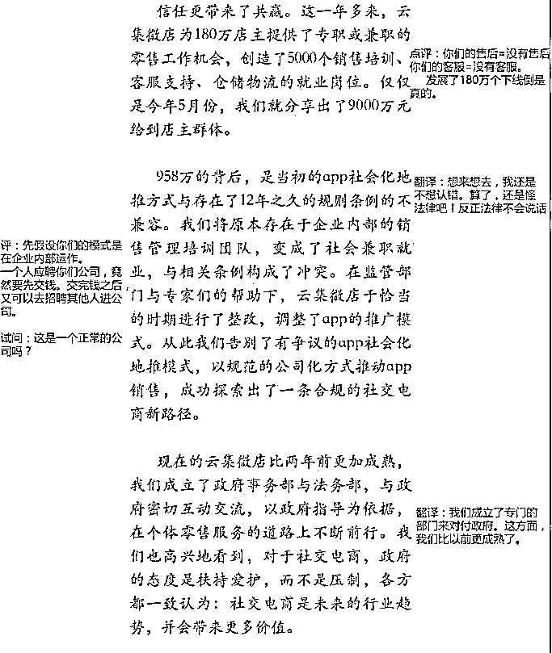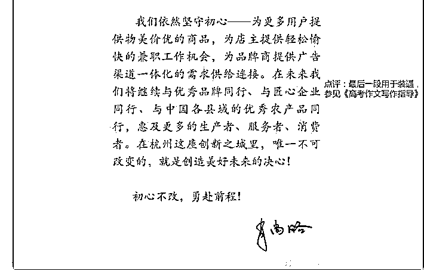

五，【云集微店】公众号被封

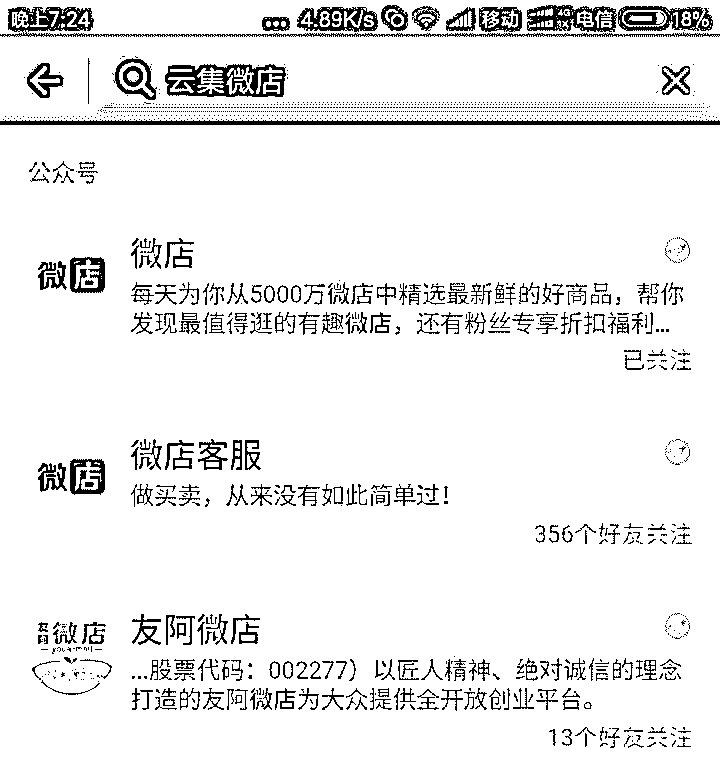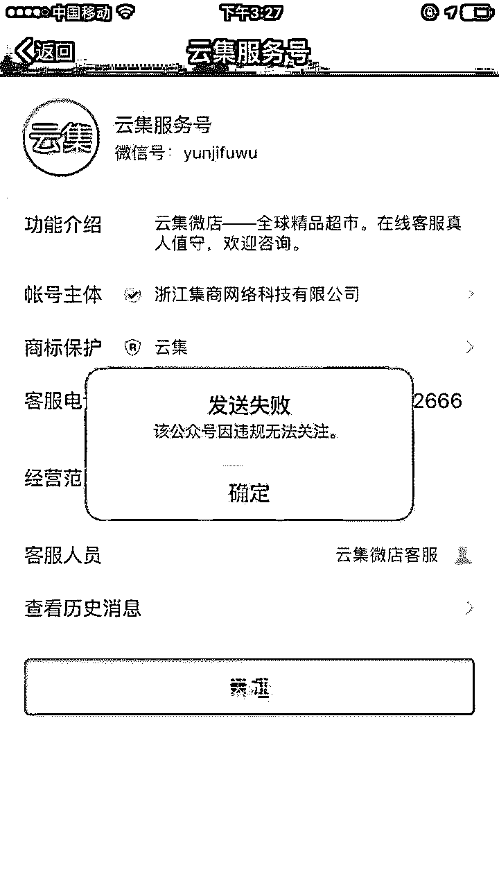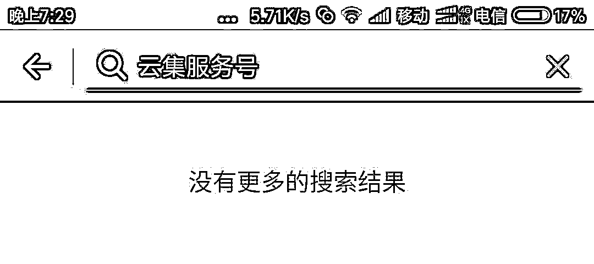

继【环球捕鱼】公众号被封 ，【云集微店】也被封，我想说，靠三级分销的传销模式是走不长远的。

总结：

从以‘善心汇’为代表的资金盘倒闭，到以‘环球捕手’为代表的传销商城模式再到‘云集微店’  ，再到最近的‘即付宝’‘云付’

我想说的是，任何以拉人头为盈利点的模式

国家和法律不允许你走的很长远。

被查封是时间早晚的事情。

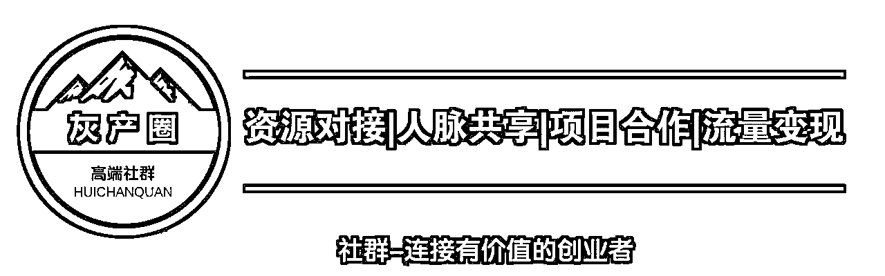

“阅读原文”加入社群