# 揭秘“挂马”黑产最新态势

> 原文：[`mp.weixin.qq.com/s?__biz=MzIyMDYwMTk0Mw==&mid=2247487217&idx=1&sn=94f2d0696fabc973bd3fc0a9a94e2877&chksm=97c8c5c9a0bf4cdf0d8341c71620ed39bd6f952a0a70445bd3436d4360aa333cb95e96acf81a&scene=27#wechat_redirect`](http://mp.weixin.qq.com/s?__biz=MzIyMDYwMTk0Mw==&mid=2247487217&idx=1&sn=94f2d0696fabc973bd3fc0a9a94e2877&chksm=97c8c5c9a0bf4cdf0d8341c71620ed39bd6f952a0a70445bd3436d4360aa333cb95e96acf81a&scene=27#wechat_redirect)

## 摘要

> 腾讯安全反病毒实验室监测发现，近期有大量“挂马”攻击，受影响地域广泛，涉及全国 31 个省份。
> 
> 传播方式分为“大站广告挂马”和“自运营网站”等方式。
> 
> “自运营挂马”攻击的传播过程中搭配使用国内、国外服务器，规避国内审查，利用“域名迁移通知”诱导用户访问境外带毒服务器。
> 
> 攻击盈利模式主要依靠下载推广软件和盗取游戏账号，盈利能力较高。
> 
> 腾讯安全反病毒实验室根据木马的在线流量特征，捕获了一批家族及变种木马，同时将这些特征用于持续跟踪机制，建立态势感知，确保第一时间发现新的威胁。

前段时间，腾讯安全反病毒实验室分析了一类通过网页广告挂马方式传播的恶意程序，木马通过色情链接广告诱导用户点击后，在受害者电脑上添加后门，同时还会运行数字货币挖矿的程序从中获利。

实际上，经我们监测发现，近期通过大型网站以及“激情视频”等小型网站实施的“挂马”攻击，存在新的发展态势。结合腾讯电脑管家和哈勃系统的威胁感知数据，我们对此轮“挂马”攻击在传播方式、攻击目标、盈利模式等方面的变化，进行了研究分析。

## 一、整体态势

此轮攻击已经持续约一年，涉及到 payload15 个，各类域名 72 个，感染近 10W 用户，涉及全国 31 个省份，其中 Top10 省份为：

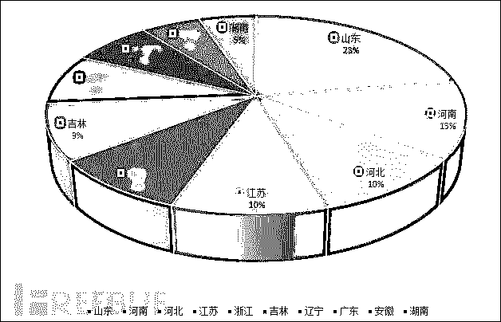

## 二、传播渠道

本次攻击开始于 2016 年 7 月，挂马网站日访问量峰值 3.4W，日感染量峰值 6.8K，由于杀软安装率较低等使用场景（如网吧等）的存在，实际感染量可能远远超过目前监测到的 10W 台 PC，哈勃大数据预测，最严重情况下，木马的感染量可达到 200W。

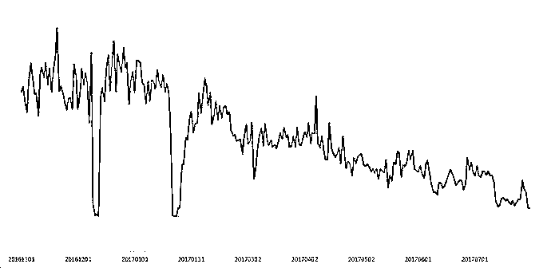

### 1.    挂马方式

常见挂马方式有：

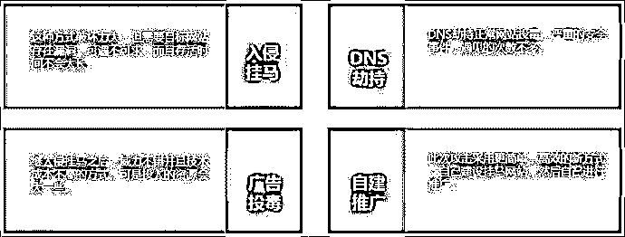

> 入侵挂马，这种方式破坏力大，但需要目标网站存在漏洞，可遇不可求，而且存活时间不会太长。
> 
> 广告位投毒，继入侵挂马之后，威力不错且技术成本不高的方式，可是投入的资源过多。
> 
> DNS 劫持正常网站投毒，严重的安全事件，遇见的次数不多。
> 
> 新的挂马方式：“自运营”，自己建设挂马网站，然后自己进行推广，更简单，高效。

### 2.    “大站广告挂马”流程分析

木马集团通过在大型网站上投放广告的方式，借助某些网站对于广告审查不严格的空子，将自己带毒的网页代码向用户进行展示，并触发用户侧浏览器的漏洞，达到大范围传播的目的。

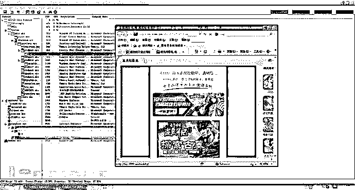

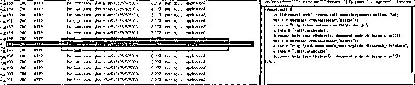

受影响的网站类型分布如下（已排除无法归类的小网站）：

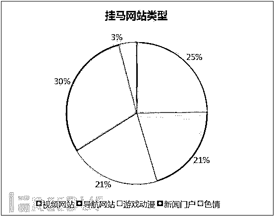

本次攻击主要使用了 CVE-2016-0189，相比其他漏洞，CVE-2016-0189 不会造成宿主程序崩溃，稳定利用，效率奇高。

其中几次影响范围比较大的挂马事件为：

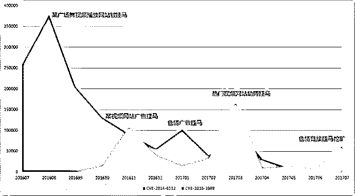

CVE-2014-6332 和 CVE-2016-0189 两个漏洞，受限于 windows 的补丁策略，仍有极大量 PC 系统受到攻击威胁。比如去年哈勃态势感知监控到的两次大范围的入侵式挂马都是利用了这两个漏洞进行传播,同时，CVE-2016-0189 自 16 年第四季度开始，传播广度明显提升。

此次捕获到的受漏洞影响的操作系统和 IE 版本分布：

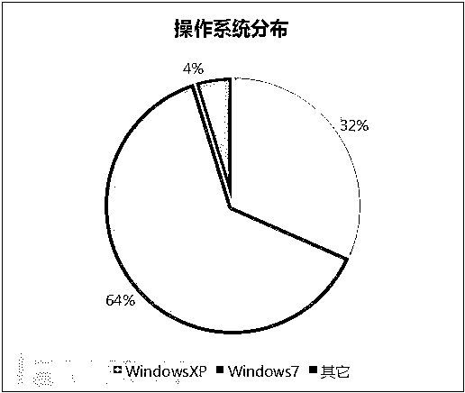

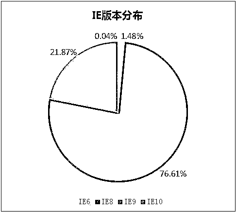

### 3.    “自运营挂马”流程分析

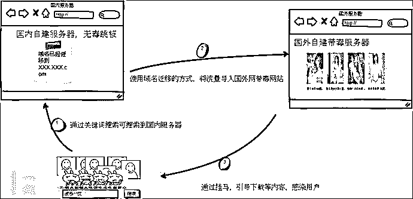

传播过程中涉及域名 64 个，经分析发现传播域名分为两类：

> A 类，传播类域名，在国内，内容无毒，方便推广
> 
> B 类，病毒内容类域名，位于美国，存在漏洞利用代码

使用搜索引擎，通过关键字即可搜索到 A 类域名：

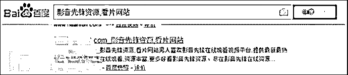

用户访问以后，用“域名迁移提醒”的方式引导用户访问 B 类域名。

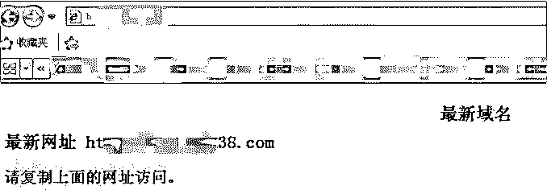

B 类服务器位于美国，用户访问后会触发漏洞执行：

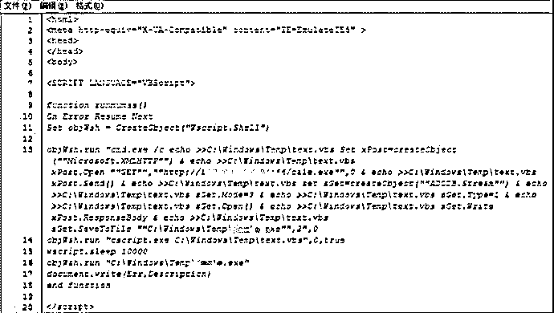

作者为了增加感染量，使用了明枪暗箭双管齐下的方式进行传播，即使浏览器没有漏洞，也会引导用户下载伪造的播放器传播病毒

涉及到的部分传播域名信息如下：

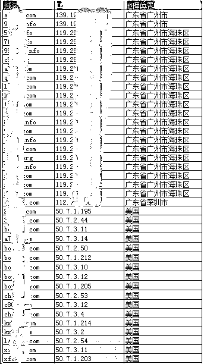

通过分析可以发现，“挂马”攻击的传播方式已经衍生出技术门槛较低的“自运营”模式，这种模式受外界环境影响较小，不依赖其他网站漏洞，不依赖广告渠道，适合大范围推广。

## 三、Payload 分析

### 1.      Payload 执行整体流程如下：

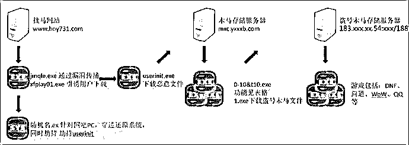 

jmqle.exe 与 xfplay01.exe 是整个木马集团的母体

启动后会释放驱动”随机名.ex”穿透还原系统保护，并且劫持 userinit 实现自启动

环境就绪后会释放 userinit.exe 下载位于 http://mmc.xxxxxx.com:81/xx/in10.txt 的地址列表进行作恶

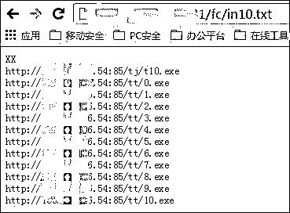

涉及到 PayLoad15 个，功能如下：

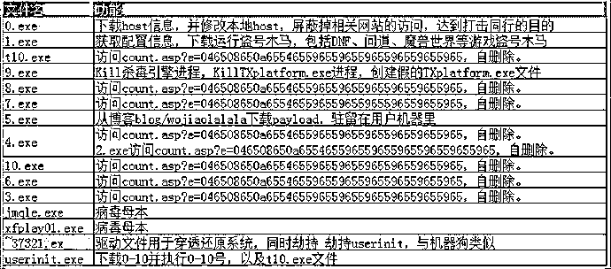

以其中的 5.exe 为例，此木马会将某著名博客地址中的个人页面作为 C&C 服务器的地址，通过上传文章的方式控制木马的行为，木马会访问页面并获取文章的内容，然后将其转换为控制命令数据：

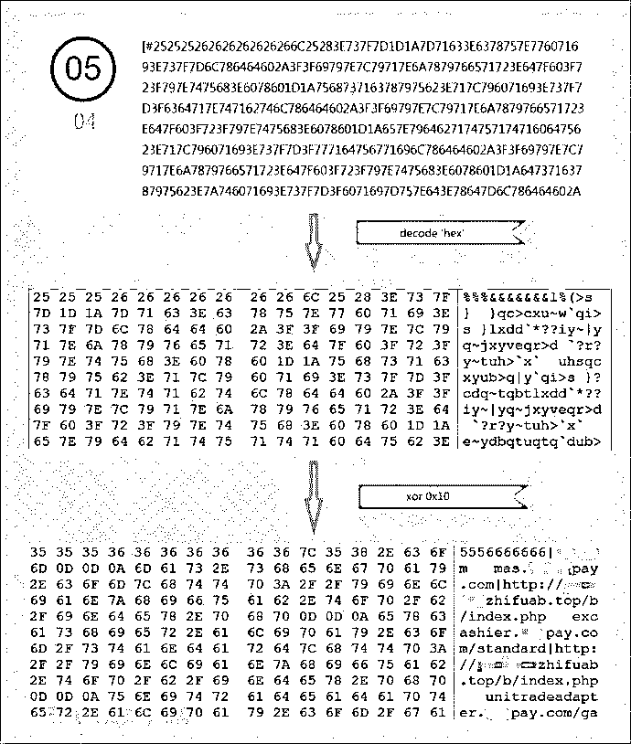

最终得到的数据为：

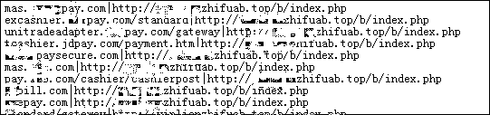

木马会利用这些配置控制受害者浏览器，将正在进行支付的网页重定向到木马作者自己搭建的 xxxxzhifuab.top 网站上，用于截获受害者的支付数据并从中窃取巨额利益。

### 2.      流量检测

木马攻击过程中，可以捕获到木马连接 C&C 服务器的流量包，如下所示：

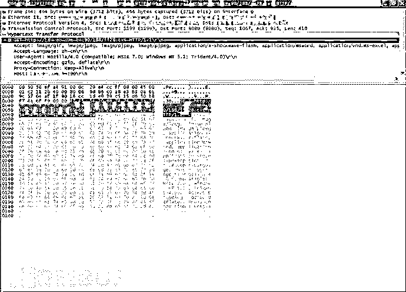

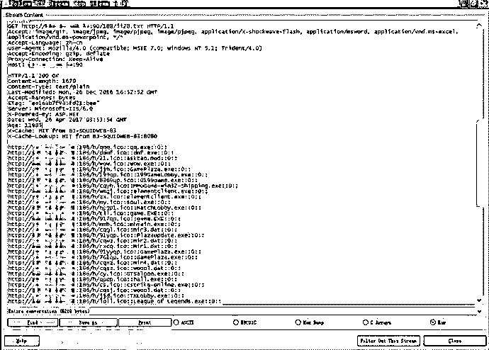

通过对类似流量的整理，发现涉及的 C&C 10 个

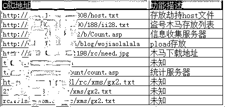

作者为了防止其他统计网站爬取数据所有病毒服务器都使用非默认的 http 端口，如 81,808 等

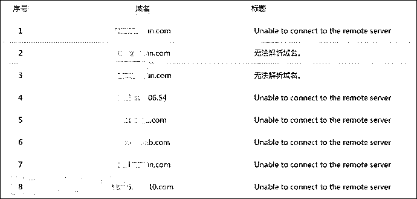

### 3.      Payload 变化规律

根据 Payload 连接 C&C 服务器的流量包特征，进一步搜索分析发现，Payload 作者的作品还有以下几个，功能与上述分析没有本质区别，但是并未广泛传播。

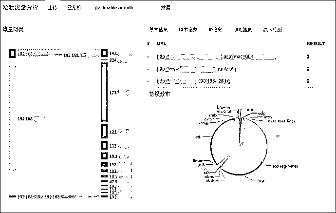

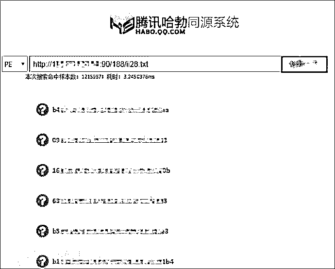

从上传时间观察，要晚于传播广泛的样本，可能是作者在为下一轮传播做准备。

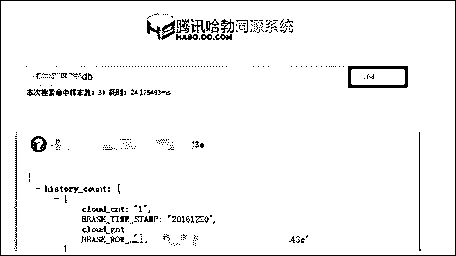

## 四、盈利能力分析

目前木马集团的盈利模式有四个：

### 盈利模式 1、伪造交友软件欺骗用户充值

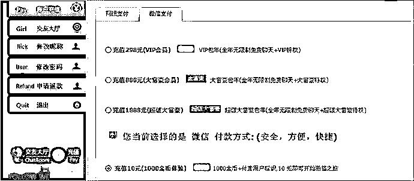

### 盈利模式 2、推广博彩类软件天天棋牌游戏中心

这种博彩软件收益涉及到的安装收费案例如下：

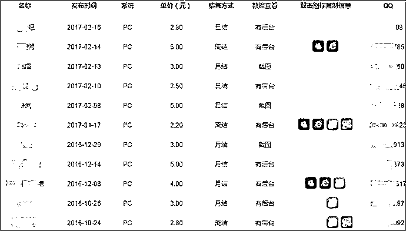

### 盈利模式 3、推广软件

通过在受害者电脑上安装各种推广软件后，从软件推广商处分成。

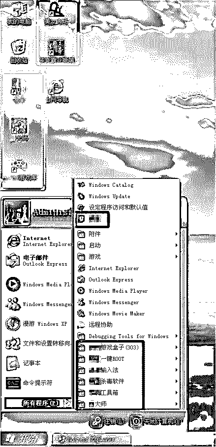

### 盈利模式 4、盗取游戏账号

假设挂马站长不参与洗号，金币出售等下游环节，直接通过卖账号信息获利。

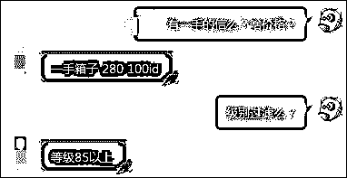

以某知名网游为例，洗完的账号经过等级过滤：

> 85 级以上价格：2.8 元一个。
> 
> 40 级以上价格：1.8 元一个。
> 
> 没过滤的价格：一个账号 0.2-0.5 元。

通过估算，游戏黑产在黑产盈利中的比例明显上升，已经超过软件推广，稳稳坐上第一把交椅，这和近些年游戏产业蓬勃发展有密不可分的关系。

## 五、持续跟踪

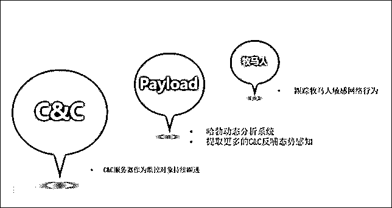

### 1.      流量检测持续跟进

目前哈勃态势感知已经将收集到的 C&C 服务器，作为监控对象持续跟进。

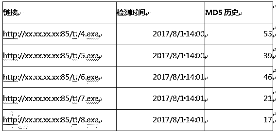

木马至今还是处于活跃状态。

### 2.      Payload 持续跟进

这些收集到的 Payload 样本还会实时进入哈勃动态分析系统进行分析

提取更多的流量特征反哺态势感知，第一时间发现新的威胁，保护用户安全。

### 3.      牧马人持续跟进

同时对牧马人的最新动向，我们也会持续跟踪，例如牧马人敏感网络行为。结合 Payload，C&C，牧马人动态，建立立体式的态势感知。

## 六、总结

### 1.      传播趋势变化

挂马传播方式的技术门槛也逐渐降低，由入侵挂马 DNS 劫持等技术门槛较高的方式向“自运营”的方式演变。

### 2.      盈利方式变化

游戏黑产在黑产盈利中的比例明显上升，已经超过软件推广，稳稳坐上第一把交椅，这和近些年游戏产业蓬勃发展有密不可分的关系。

*本文作者：腾讯电脑管家

“阅读原文”加入社群