# 营销，就是营销人性的弱点！

> 原文：[`mp.weixin.qq.com/s?__biz=MzIyMDYwMTk0Mw==&mid=2247486937&idx=1&sn=223a87afa0094b743c8795216c11a8c8&chksm=97c8c6e1a0bf4ff7186025abec82c60f5d5e146c996ddd576e4f05ae46e76d7c64f5d539faac&scene=27#wechat_redirect`](http://mp.weixin.qq.com/s?__biz=MzIyMDYwMTk0Mw==&mid=2247486937&idx=1&sn=223a87afa0094b743c8795216c11a8c8&chksm=97c8c6e1a0bf4ff7186025abec82c60f5d5e146c996ddd576e4f05ae46e76d7c64f5d539faac&scene=27#wechat_redirect)

**营销，就是营销人性的弱点！**

      如何利用人性弱点营销？星巴克卖的不是咖啡，是休闲；法拉利卖的不是跑车，是驾驶快感和高贵；劳力士卖的不是表，是奢侈和自信。 

一切的营销，其实都是针对满足人性的各种需求、焦虑和欲望而做的：冲动、贪婪、功能、满足、炫耀、自豪、面子等等

**什么是弱点营销？**

  “宇宙的精灵，万物的灵长”，说的是人类。

  但现实中，人性的弱点也不少：贪婪、恐惧、嫉妒、懒惰、好色、贪慕虚荣、难抵诱惑、害怕孤独、热爱免费、重视等级、迷信专家、崇拜名人、喜随波逐流……关于人性的一切弱点，正在被消费社会利用和营销。

**一切营销都是弱点营销，针对的是我们与生俱来的人性弱点和后天养成的世俗判断**。

但你为什么消费之后会失望、欲望满足后会悔恨？

  斯拉沃伊·齐泽克说：“**我们需要知道自己想要什么。” 而弱点营销所做的，就是引导人一直需要、永不满足**。《善恶经济学》作者托马斯·赛德拉切克说： 「不满足」成为让我们进步和成长的引擎，也会让我们自己成为一个永不满足的引擎。

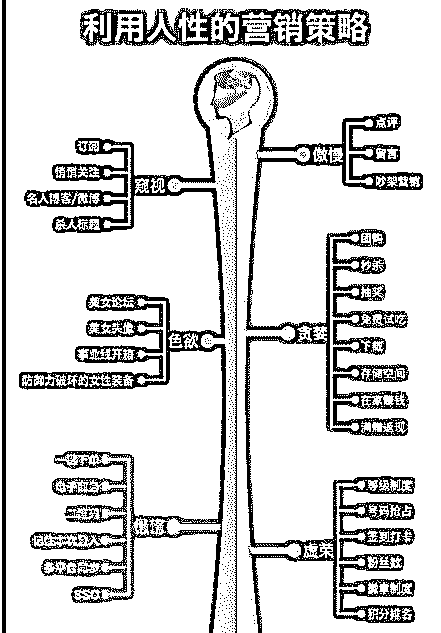

首先给出一个基本原则：

**支撑我们做出购买行为的，不是理性的判断，而是我们自以为理性实际上十分感性的判断。**

别着急反对，看完底下的文章，你会发现，大部分时间，我们还确实是不过脑子就买了很多东西呢。

想让消费者自行脑补，最简单的套路有三种：

**（1）：多就是好，看起来牛逼就是牛逼。**

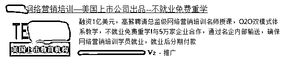美国上市公司耶，牛逼耶，如果你正好想学网络营销，看到一个美国上市公司，此时是不是已经动心了？

如果你是目标用户，你的潜意识是这样想的：

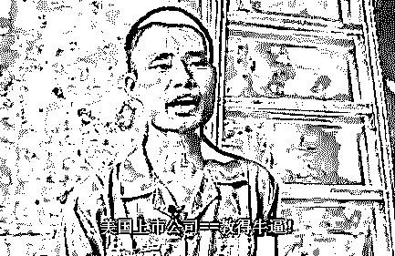

然而谁都知道，美国上市公司和教得牛逼之间——

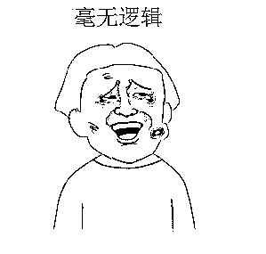但是，消费者就会吃这一套，而且吃得非常心安理得。

为什么？因为——

**在无法 100%了解产品时，消费者倾向于从侧面出发，去推测产品的好坏。**

所以，请记住这一点：

**真正的营销，不在于告诉消费者“我们的产品 NB”，而是让消费者自己得出结论“他们的产品 NB”。**

原因：人最相信的，永远是自己，因为我们都觉得“自己不会害自己”、“只有我会对自己 100%负责”。

你告诉消费者的，消费者会觉得“他这么夸自己，还不是想让我买东西！我偏不信！”

相反，如果你告诉消费者，“我们是上市公司，很牛逼哒！”

消费者自己就会进入这样一个脑补状态：

> 美国上市公司耶=很有钱耶=说明之前赚了钱呀=钱从学费里来=学费是学生交的=钱多=所以学费多=所以学生多=大家又不是傻子，能买肯定说明不错=教的不错的=我也试试吧！

再想一想，是不是，你看到的大多数非常流行的广告，好像都没有直接说自己的产品哪儿好哪儿好？

随便举个例子
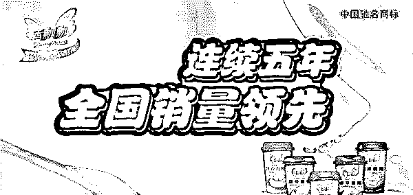

> 销量多==喝的人多==产品好==我也要喝

再比如这个：
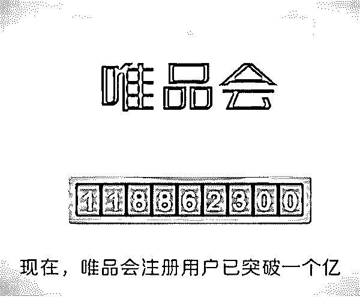
唯品会说自己的注册用户突破一个亿
也是一样的道理——选择我的人多，这么多人选择，应该没错。

再举个反例：
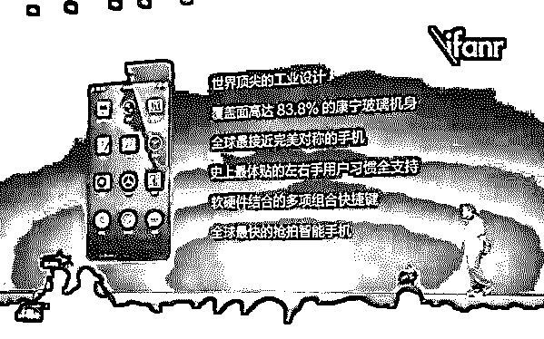
顶尖的工业设计==嗯，怎么个顶尖法？
康宁玻璃机身==嗯，康宁，有啥用？
完美对称==嗯，完美……嗯？

**没有脑补，想把消费者都变成理性的人？**

（说明：我不是锤黑，我很吃罗永浩的“情怀”，至于情怀的本质是什么，后面也会说）

看看别人家是怎么玩的：
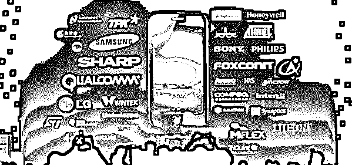

> 三星啊==牛逼==下血本==牛逼
> 满屏幕都在告诉你：“我们用的东西牛逼，所以我们也很牛逼”

所以，以后写文案的时候，别光顾着夸自己了，适当吹一些牛逼，让消费者觉得你牛逼，就好了。

简单来说就是：
1，用巨大的数字来让消费者震惊
                      2，如果没有巨大的数字，就跟你的竞争对手对比一下
                      3，尽量与普通人觉得“牛逼”的符号靠拢

**（2）：同类感——别人觉得好就是好，别人有效果就是有效果，别人买了就说明没问题**

**典型案例 1：**

你有没有买东西先看评价的习惯？你为什么要先看评价？评价好，商品就好吗？

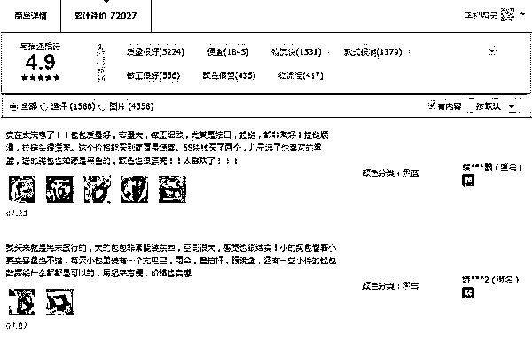**典型案例 2：**
看完评价你还要看看用户案例？就不说现在的用户案例有几个是真的了。他们用了有效果，你用就也有效果吗？

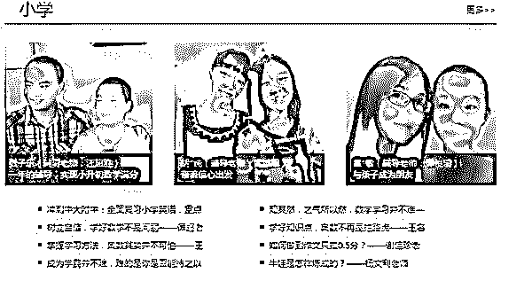
此时消费者的脑袋中想的是：

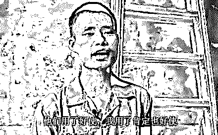好吧，还用我多说么？
脑补过程很简单：

> 他用了好使==商家一般不会骗人的吧==这么多人用了都好使==这么多人见证就更不会骗人了吧==这个产品一定好使==我用也好使==“添加购物车”

**所以这就是为什么有人会刷评价，并且刷了还不算，还要截成乱七八糟的图出来逼着你看**
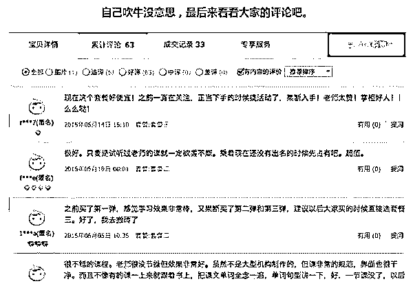

总结：
商家之所以这么做（我们之所以吃这一套），本质原因是：

**“跟着大家，不要乱跑，危险系数会小一些”——这是自几十万年前开始，就根植于我们骨子里的本能。发生购买行为前，我们也会本能地去找大家对这个产品的评价。**

实际上：
一个产品好不好跟评价有必然联系吗？
尤其是中国这网络环境，人家说好，你就敢信？
所以买东西之前，啥都别废话，试用一下再说。

OK，言归正传，我们在写文案的时候如何营造同类感呢？

其实最简单的方法，就是多写案例：
1，长篇的案例，比如 XX 用了我们的产品之后的心得体验。
2，短篇的案例，包括【用户评价】【购买评价】等
3，直接的用户证言：大家去书店逛一圈，看看每本书的封面或者封底，是不是都得找几个大牛过来做一下推荐？

**（3）制造认同感——“我们是一类人啊朋友们”**

说在前面：现在很多人都喜欢谈情怀
其实世界上没有情怀，有的只是认同感而已

教英语的老罗为什么牛逼？
因为他教得好？
因为他幽默？
也许，但没说到本质上。
因为他正好符合了大多数人心目中好老师应该有的样子，所以大家**认同他。**

试想一下，你被 12 年填鸭教育、各路老师折磨得死去活来的时候，突然有一天，你的同学说：

“有个叫罗永浩的胖子，会在上课的时候讲段子诶。”

然后你去搜了他的演讲视频，发现他不仅讲段子，还不喜欢站在讲台上，跟学生们各种逗贫……总之，那一瞬间，你的心里早已被丘比特射成了筛子：**这特么才是老师嘛！**

后来，老罗做了手机。
此时的熊孩子已经长大，到了能够自己买手机的年龄了。

他们的情况（市场的情况）：

*   被某米牌暖宝宝暖得死去活来

*   为了肾系手机，除了肾什么都卖了

*   有人宣传发烧，有人宣传性价比，没钱的大学生和小蓝领被关心得不要不要的

*   就是没人关心一下没钱的文艺青年（老子家具买不起，但是买个衬衫一定要 MUJI 的啊！）

*   于是这时候，一款以匠人工具为 LOGO，以“难得的匠心”为核心卖点的手机，出世了。

*   当老罗在台上大谈他花大力气优化的 UI 特效时。

*   你的眼睛看到了匠心、精细、慢工出细活、认真、较真……等等等等

*   而你的脑子里却在说：

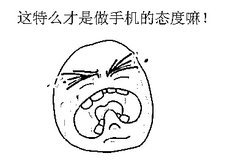

*   此时此刻，你对这个浮躁、功利、冷漠的世界的一切蔑视和抵抗，就像洪水遇上了豆腐渣工程，终于有了宣泄的出口。

**你认同了老罗**

**老罗成功地让你认同了他（再一次）**

**你在心里，已经跟老罗站在了同一个战壕里**

**此时此刻，所有一年出 N 款手机的企业，都变成了你们的共同敌人** 

*   于是你变成了死忠粉，你有了锤子的情怀

*   其实，死忠粉（情怀）的本质是：

**你认同这个人，你认同他做事的态度，你觉得你们是同一类人，为了让你生存下去，你需要尽力帮助整个群体生存下去，所以你要保护这个群体，因为保护群体，就等于保护了你自己**

*   于是不管这个手机有这样那样的不好，你都不会管了，一切说锤子手机不好的人，就是在跟你做对。

*   后来小米也开始玩这一套：

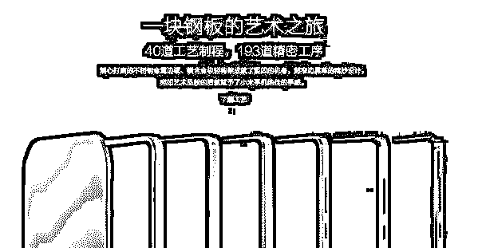

> 我做一块钢板都这么细致，40 道工艺，193 道精密工序，怎么样，你们这些“活得认真”的消费者，是否认同我了？咱也是有情怀的人啊

**总结：**
让消费者脑补，应用在营销中，最简单的三个套路**：吹牛逼、找例子、找认同。**

“阅读原文”加入社群