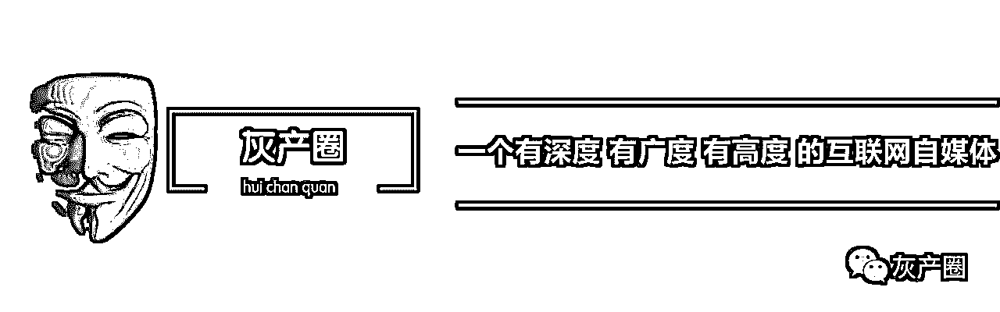
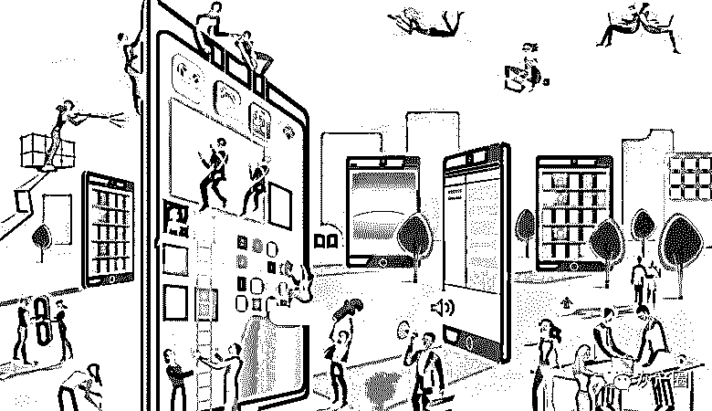
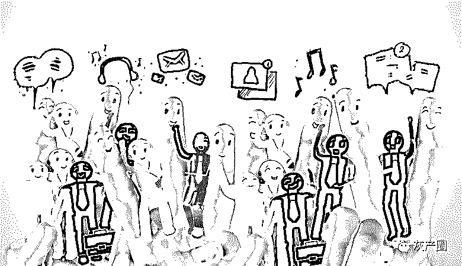
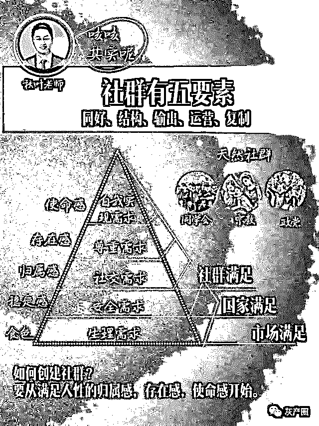
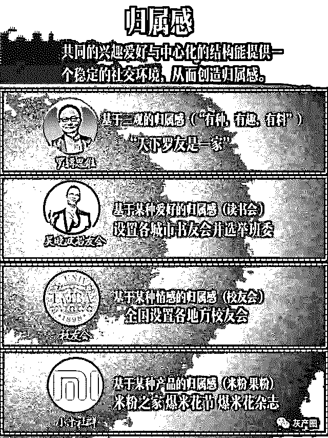
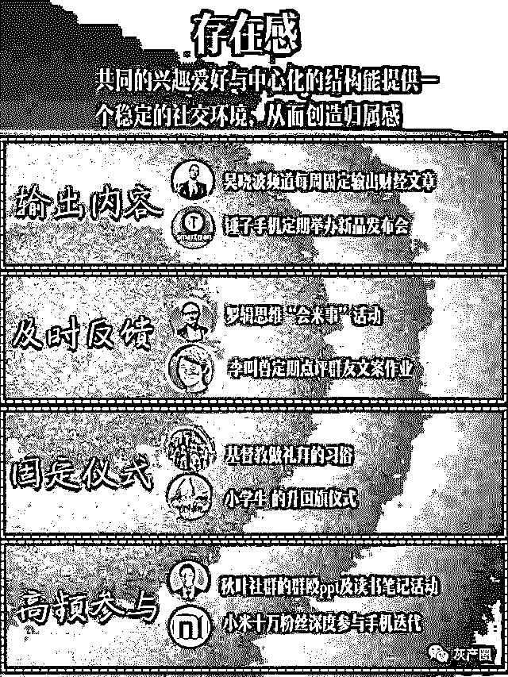
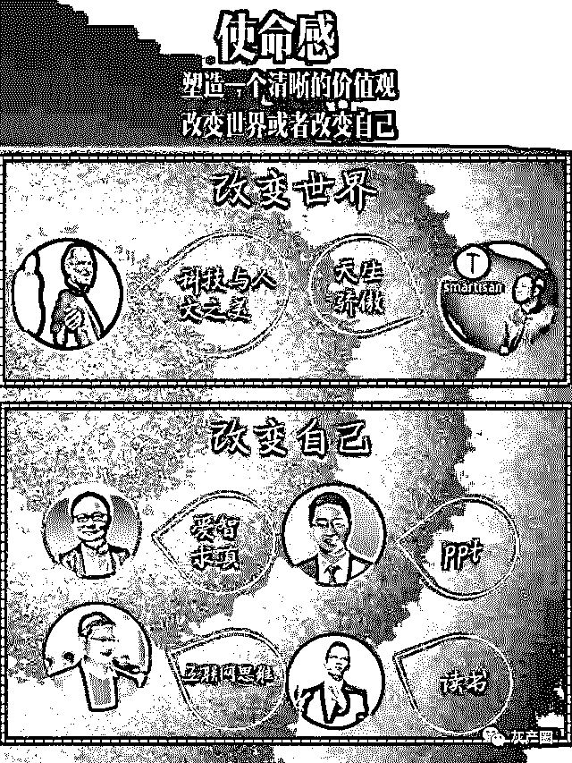
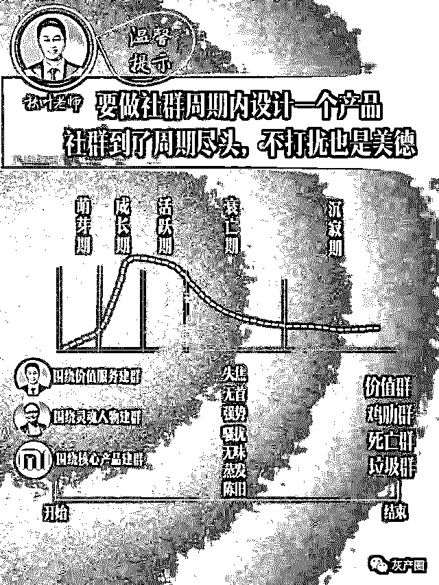
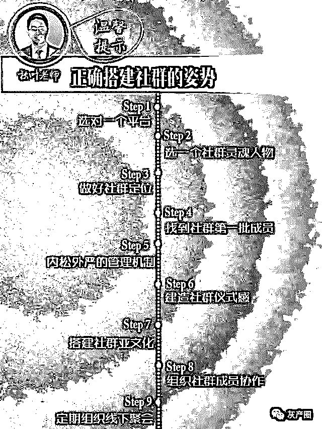
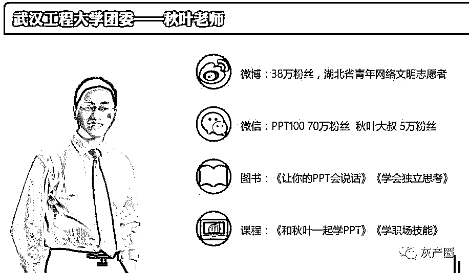

# 8 分钟读懂 19 万字的《社群营销》

> 原文：[`mp.weixin.qq.com/s?__biz=MzIyMDYwMTk0Mw==&mid=2247486888&idx=1&sn=cc67c5f32b105b18b68b6be99a195ec5&chksm=97c8c690a0bf4f86e503632c13c32d12692c7826e5b169cd1e380c69c4bcdc89299bfb210f19&scene=27#wechat_redirect`](http://mp.weixin.qq.com/s?__biz=MzIyMDYwMTk0Mw==&mid=2247486888&idx=1&sn=cc67c5f32b105b18b68b6be99a195ec5&chksm=97c8c690a0bf4f86e503632c13c32d12692c7826e5b169cd1e380c69c4bcdc89299bfb210f19&scene=27#wechat_redirect)

**8 分钟读懂 19 万字的《社群营销》**

**文章福利：《如何玩转社群营销升级版》（靠社群发家的 PPT 大神秋叶 独家撰写） **

**文章末尾领取**

我想讨论社群经济 

尝试社群经济的绝大多数人，应该都失败了，所以研究为什么失败才有意义。 
社群经济这个话题不好写，很容易被证伪，所以我才写，因为我亲身实践了 3 年，悟出了其中的真谛。 
我不打算谈操作层面的事，我只想谈社群经济的思维本质。

那些名人说过的话 

这里我想罗列一些名人说过关于社群经济的论调： 

吴晓波 
互联网=连接+价值观+内容 
在商业上，社群的意义有三条： 
其一，社群能够让消费者从“高速公路”上跑下来，形成真实的闭环互动关系，重新夺取信息和利益分配的能力； 
其二，社群让互动和交易的成本大幅降低，从而令优质内容的溢价得以实现，而消费者的支付也得以下降； 
其三，社群能够内生出独特的共享内容，彻底改变内容者与消费者之间的单向关系，出现凯文·凯利所谓的“产销者”。 

李善友 
互联网思维的本质是关注事物间的关系 
关于社群你必须知道的三句话： 
第一句话，你们这些懒人，应该向蚂蚁学习，蚂蚁可以让你变得更聪明。这句话来自于《圣经》 
第二句话是心理学家格兰诺维特讲的：无论找工作还是找对象，弱关系比强关系更重要。 
第三句话，重要不是你认识多少人，而是你认识多少种人。 
如果你建立社群，这个社群网络的核心属于那些在多个小圈子里面都有位置的连接者。过去有一句话叫得社群者得天下，更精确的表达得弱关系者得天下。 

如果你没看懂，没关系，接着看下去。

社群经济究竟是什么 

什么是社群经济？ 

百度上说：“社群经济是指互联网时代，一群有共同兴趣、认知、价值观的用户抱成团，发生群蜂效应，在一起互动、交流、协作、感染，对产品品牌本身产生反哺的价值关系，这种建立在产品与粉丝群体之间的情感信任+价值反哺，共同作用形成的自运转、自循环的范围经济系统。产品与消费者之间不再是单纯功能上的连接，消费者开始在意附着在产品功能之上的诸如口碑、文化、逼格、魅力人格等灵魂性的东西，从而建立情感上的无缝信任。这里，我想罗列别人说过的几句话。” 

通俗点说：一群差不多的人在一起，像农民伯伯一样自产自销。

社群经济究竟怎么才能产生经济效益？ 
只要发生经济行为，那就有需求与供给关系。 
消费建立在信任关系之上。 
社群是一个团体，他就有凝聚力的问题，人心散了，队伍就不好带了。 
社群里的成员要有共同语言/共同目标 

不难得出结论： 
社群里的人对你的产品有真实需求（伪需求不能持久），而且是持续的需求。 
社群成员之间建立信任关系，才会发生购买（排除一些极端情况）。 
社群由一群有共同价值观和目标的人组成。 
社群成员基本拥有同一经济基础。

总结 

归根到底，社群经济的意思就是同阶级的一群人，因为共同利益而在一起做一件产生经济利益的事。所以无所谓什么载体，微博，微信，QQ 等都行。无所谓线上、线下，社团，黑帮都行，无所谓卖货，卖知识，卖春，只要大家社会身份，地位，经济实力差不多，不管认识不认识，在一起共同做一件事，产生经济效益了就叫社群经济。 

我打个更简单的比方，你和一群朋友一人出 5000 集资做生意，你们在网上建个微信群，商量着怎么赚钱，然后忽悠了身边的朋友一起干，就叫社群经济。所以这个概念一点都不新鲜，80 年代温州老板就这样玩了，现在只是用一堆华丽辞藻堆砌概念。 

所以罗胖说，未来大家越来越尿不到一块去了，什么意思？大家财富、身份、地位、兴趣不一样，不在同一阶级了，没有共同语言了。 

所以有人玩过很多社群后说， 你不牛，认识再多的人也没用。 

所以大家也应该理解，同一阶级的弱关系才有价值，少了这个大前提就是妄想。 

所以大家也应该理解，社群形成价值闭环，不如说：小团体不带外人分享即得利益。 

我见过最成功的社群经济，就是微商内部群，分层销售，下家买上家的货，自买自卖，三年了，社群依旧充满活力。 

我所见过最失败的社群经济，就是一群天南海北不知道谁是谁的人，因为爱好或者行业相关聚在一起，没有任何共同利益，随着人越来越多，群最终炸毁了。

也许你的老板会对你说，小李啊，我们公司也来建一个社群吧，你脑子灵活，这事儿你来办。那么问题来了，真正的社群是如何炼成的呢？营销机构会这样告诉你，社群就是线上建个微信群，线下聚个会，目的是将来为你发个广告呗。被开过光的社群达人会告诉你，只要把人拉齐了，设定一个最小规则，你什么都不需要做，连接自然就会产生奇妙的化学反应。可是，这些所谓的“社群”真的是社群吗？当我看完秋叶老师的《社群营销》这本书之后，我才知道，社群从来就不是什么新鲜事物，它一直就存在于我们每一个人的身边，互联网的到来，只是让社群的形式更丰富一些罢了。 

为什么这么说呢？那就要看看秋叶是怎么说的了。《社群营销》这本书告诉我们，一个成熟的社群需要具备五个要素：同好、结构、输出、运营、复制。我来翻译一下，其实社群就是一个自给自足的小社会，它满足了人性中对社交的需求——归属感、对尊重的需求——存在感、对自我实现的需求——使命感这三个层次的需求。秋叶老师所讲的社群五要素都是为满足人性的这三个需求而创造的方法论。

什么是人性的基本需求

我们先来看看人性的基本需求有哪些？美国心理家马斯洛早在 1943 年就提出，人性的需求层次一共分为五个等级，分别是生理需求（食色）、安全需求（稳定感）、社交需求（归属感）、尊重需求（存在感）和自我实现的需求（使命感），这就是著名的马斯洛需求五层次。如果说市场满足的是生理需求，国家满足的是安全需求，那么社群满足的就是社交、尊重和自我实现的需求。从这个意义上来说，一个宗教、一个政党、甚至一个大家族、一个同学会都是自然存在的社群。如何创建社群，就是要从满足人性的这三个需求做起，接下来我将从社交需求——归属感、尊重需求——存在感、自我实现需求——使命感，这三个角度来为大家分析一下社群成立的条件。

社交需求——归属感

我们先来看第一个，社交需求——归属感。如何给你的社群制造归属感呢？《社群营销》这本书告诉我们，共同的兴趣爱好与中心化的结构能为我们提供一个稳定的社交环境，为我们创造归属感，这就是秋叶老师所说的“同好”和“结构”。举个例子，小米手机公司把手机发烧友们聚集到一起，为他们提供同城交友的机会，还别出心裁地设计了米粉节，这种为共同兴趣爱好的人提供社交服务，就能使大家产生强烈地归属感，吴晓波书友会也是如此。

罗辑思维社群的那句“天下罗友是一家”的口号，就是赤裸裸地归属感的口语化表达。什么是归属感？家的感觉，就是归属感。当然因为罗辑思维很少与普通罗友接触，所以罗友们的归属感实际上不如米粉和书友会的书友的。可能是因为罗胖想让一切美好的事情自然发生，在他看来产品好才是王道，社群是因为产品好，所导致地自然现象，比如苹果公司从来不组织果粉社交，但狂热的果粉依然会自组织、自社交、自建归属感。

为什么是中心化的结构？近几年“去中心化”几乎已成共识，但是很多人只是简单的从字面上理解，一味反对中心化人物的形成。这就进入误区了，去中心化，不是“不要中心”，而是“创造出更多的中心”；是去一个大中心，发展众多的小中心；一场大雨看似没用中心，但每一个小雨滴都是一个小中心；大家要明白，这个世界不可能出现绝对均匀的结构，如果有，那就是“热寂”了。“热寂”是宇宙最终的宿命，是所有物质的尽头，那里没用任何活动，只有永恒的荒凉。

尊重需求——存在感

光有了归属感还不行，每个人都需要在社交中找到自己的存在感，存在感就是尊重的需求。《社群营销》这本书告诉我们，要为社群成员制造存在感，要做好以下四点：内容输出、及时的反馈、固定的仪式和高频的参与。

第一个，内容输出。内容输出很容易理解，就是知识的生产，比如逻辑思维和吴晓波频道每天一推的公众号文章，每周一播的视频节目，都是内容输出。第二个，及时的反馈。社群运营者要对社群成员作出的有影响力的行为，给予褒奖或者惩戒，罗辑思维的会来事，吴晓波书友会的书友活动专题报道，小米手机的爆米花奖等都是一种及时地反馈行为。第三个，固定的仪式。固定的仪式可以给人提供一种稳定的期待感，比如基督教和伊斯兰教的做礼拜，甚至我们读书时代的升国旗，都是想通过仪式感来捕获我们的芳心。第四个，高频的参与。据说小米公司有十万粉丝，每天都在参与小米系统的内测，他们是小米公司不花钱的员工，但是他们却以此为荣，对小米手机爱的更深沉，因为他们亲自参与了手机系统的改进，这就是参与感。

自我实现需求——使命感

最后也是最重要的一点——自我实现的需求。如何给社群成员制造使命感来满足他们自我实现的需求。答案是，塑造一个清晰的价值观。一般来说价值观有两种，一种是改变世界，一种是改变自己。

比如基督教、伊斯兰教都是改变世界类的价值观，所以他们要传教，要让全世界的人都信他们的真主。苹果公司、锤子公司这样的理想主义类公司，也是走的这条路线，比如老罗曾经饱含热泪的说过，每个人来到这个世上，都注定改变世界，只要他一辈子不偷不抢，勤勤恳恳的做一个好人，世界就因为他而多了一个好人，那么他也改变了世界，哪怕只是一点点而已。很明显锤粉社群就是属于“改变世界”类的价值观，这就是他们的使命感。

再比如秋叶 ppt 社群的使命，是教大家快速学会 ppt，逻辑思维社群的使命是爱智求真，吴晓波书友会的使命是引导大家读书，这一类社群就是属于“改变自己”类的价值观，社群的使命是帮助大家改变自己。

现在明白了吧，创建一个真正的社群，需要满足成员的社交需求、尊重需求和自我实现的需求，从而为成员提供归属感、存在感和使命感。只有做好了这三点，才算一个合格的社群。最后声明一下，我们千锤百炼不做社群，我们坚持输出高品质的知识内容，我们期待有朝一日，千锤百炼的社群会自然生长出来。

社群周期理论

九步教你搭建一个社群

**文章福利：秋叶老师 独家撰写《如何玩转社群营销升级版》**

**关注公众号 灰产圈                                回复：社群经济**

“阅读原文”加入社群