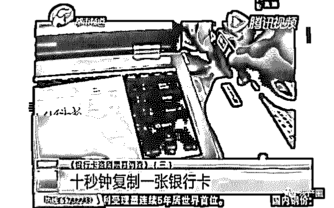
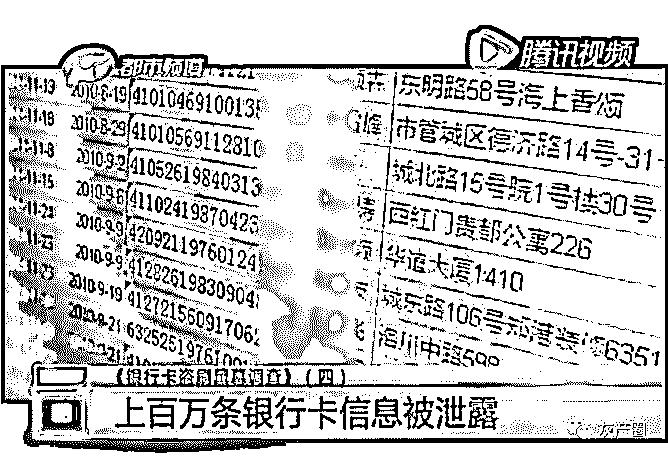
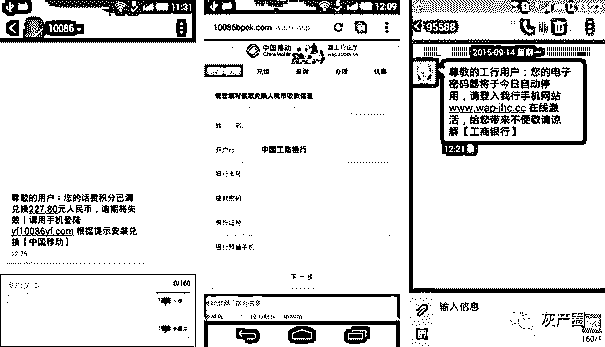

# 银行卡被神秘复制 揭秘背后黑色产业链

> 原文：[`mp.weixin.qq.com/s?__biz=MzIyMDYwMTk0Mw==&mid=2247486812&idx=1&sn=693737b68e53bff0ffda665480a64210&chksm=97c8c664a0bf4f7250984a2a434863bf5649bfdefc3d417d0493f7d0478dc866d50a2554d64b&scene=27#wechat_redirect`](http://mp.weixin.qq.com/s?__biz=MzIyMDYwMTk0Mw==&mid=2247486812&idx=1&sn=693737b68e53bff0ffda665480a64210&chksm=97c8c664a0bf4f7250984a2a434863bf5649bfdefc3d417d0493f7d0478dc866d50a2554d64b&scene=27#wechat_redirect)

银行卡在身上钱却被盗走，到底发生了什么事？

据《都市频道》报道，记者深入卧底银行卡盗刷黑幕调查，只要使用一特定的复制设备和软件，就可以在十秒钟内复制出一张跟原卡一模一样的银行卡，支持在银行 ATM 机直接查询余额、提取现金，与原银行卡无异。

此外，通过网络渠道还可以购买到上百万条银行卡信息，包括姓名、身份证、银行帐号、取款密码等详细的信息，通过复制设备软件和这些泄露的银行卡帐号信息，就可以轻松在异地复制出一张一模一样的银行卡，支持 POS 机直接支付、ATM 取款等功能，成功实现异地盗刷、盗取资金。

类似的资金被盗刷案例时有发生，在这些案例的背后到底发生了什么？

报道中提到的银行卡复制设备其实是一套 M1 卡复制器，通过特定的软件和掌握到的个人帐号信息就可以成功复制新卡，早前银行使用的银行卡都是以这一类 M1 卡为主，这一类的 M1 卡是存在被复制风险的，后来银行逐渐升级为 IC 芯片卡，也就是带黄色芯片卡的银行卡，然后就没那么容易复制了。陆兆华建议广大用户到银行尽早更换 IC 芯片卡，特别是那些大额储蓄卡，可以从源头上降低被盗刷的风险。持卡人也最好定期更改密码，这样更能保证资金的安全。

另外，在互联网“黑市”里，每天都进行着银行卡、支付账户信息的买卖。只要几分钟就可以买到上百万条银行卡姓名、卡号、身份证号、电话和密码等隐私信息。而这些个人银行信息是怎么泄露出去的呢？

银行帐号等个人信息的泄露途径是多种多样的，主要包括以下四个方面

### 四大途径泄露个人银行卡账户信息

第一：伪基站发送钓鱼网址、诱导用户输入

伪基站发送大量假冒 10086、95533、95555 等所谓的电信运营商或银行发来的“积分兑换现金”短信，并内置一个假冒运营商、银行的钓鱼网址。

用户登录后就会被要求输入账号、密码、姓名、身份证号、银行预留手机号等信息，而一旦填写了这些信息，骗子就记录这些信息，并用于盗刷资金或贩卖信息。

除了钓鱼网址外，还可能通过伪基站发送诈骗短信，短信中内置木马病毒。比如，腾讯手机管家多次拦截的“相册陷阱病毒”以及大量变种就是通过“诈骗短信+恶意网址”实施传播。

第二：改装 POS 机提取银行卡信息

除了以上两种获取信息的方式，陆兆华分析，犯罪分子还有第三种方法——那就是利用改装的 POS 机提取用户银行卡信息。对此，央视等媒体也进行过相关报道。

通过特制的设备可以记录银行卡的账户、密码信息，然后通过这些信息可以制作一张仿冒卡，实施资金的盗取。

第三：系统平台漏洞导致个人信息关联泄露

部分网络平台由于缺乏健全的安全管理机制而存在系统漏洞，而被黑客恶意下载数据库，比如之前就盛传过某邮箱平台海量用户数据被恶意下载。各种被泄露的数据库又被黑客整合成巨大的社工库，通过社工库可以输入部分用户信息反查用户全部信息和常用密码，由于用户习惯使用一套密码管理个人帐号，所以黑客很容易通过撞库等方式截获用户注册登记的个人资料等完整信息。

第四：连接公共钓鱼 WIFI 窃取个人信息

除了伪基站配合钓鱼网址外，诈骗分子还通过免费钓鱼 WIFI 窃取个人信息。陆兆华介绍，一些公共 WIFI 很可能是黑客搭设，一旦用户接入，便可通过专业软件窃取电脑、手机这些联网设备上用户的账户、密码等信息。而这些个人信息或被贩卖，或被用于盗刷受害人资金。