# 互联网业务安全背后的黑灰产业链故事

> 原文：[`mp.weixin.qq.com/s?__biz=MzIyMDYwMTk0Mw==&mid=2247486801&idx=1&sn=dba3e3e640a6232339eeb33c6a0c999b&chksm=97c8c669a0bf4f7fc0d6b6b1c94a752bf1bd2fb09a29e13a22eec04cea031edb771d981ac916&scene=27#wechat_redirect`](http://mp.weixin.qq.com/s?__biz=MzIyMDYwMTk0Mw==&mid=2247486801&idx=1&sn=dba3e3e640a6232339eeb33c6a0c999b&chksm=97c8c669a0bf4f7fc0d6b6b1c94a752bf1bd2fb09a29e13a22eec04cea031edb771d981ac916&scene=27#wechat_redirect)

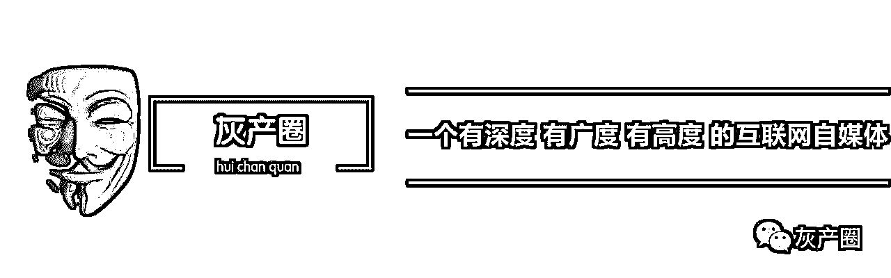

**互联网业务安全背后的黑灰产业链故事**

在互联网行业做风控，首先需要学会的是：**你要知道你的对手是谁、他们是怎么做的、他们想做什么、他们在哪做、他们什么时候做**（who，how，what，where，when），这样才能不断提高现有的业务风控水平，在不断变化的业务环境中 get 到新业务可能存在的风险点并做好对预知风险的防范措施。所谓道魔互博，只有对对手足够了解，才能不断提高风险防范水平，在用户感知不到的节点为所有业务部门提供业务的支撑保护。

不以盈利为目的的黑产都不是好黑产，如下图：

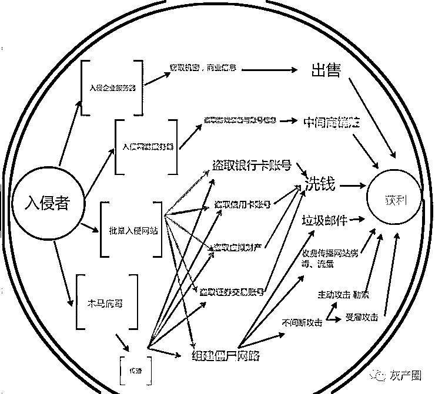

图一：黑产链的获利渠道

当然，我这里指的仅仅是电商/信贷行业的业务风险，对于互联网这个圈子而言，会被黑产盯上的行业太多，比如游戏私服、网络彩票、色情赌博等，但凡有利益的行业都会有人去干；而企业面临的黑产风险类型也很多，主要分为技术风险与业务风险，大体上可以如下分类，为了配合本文行文方便，对我所已知的风险做了如下分类：

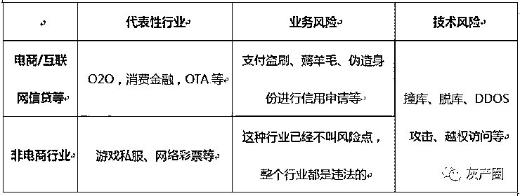

表 1：互联网行业面临的风险分类

当然这里对风险的分类其实并不准确，但是结合我之前的工作，本文想阐述的仅仅是表格中的阴影部分。

这些风险点对于企业而言就犹如溃坝的蚁穴一般，单个风险点损失不是很大，几千几万的损失而已，但是不加控制就会全节点开花。因此对于一家略微成熟的互联网企业，所面临的风险一定是多层次全方位的，单单只对一个节点的控制是远远不能满足业务发展的需要的。

另外，很想跟大家说的一点是，很多业务风险的黑色产业从业者基本没有太高的技术水平，他们是整个环节的下游部分，基于网络上形形色色的数据信息来钻公司流程规则的漏洞。

这些对于业务风险点的风控体系设计后续可能会单独另开一篇文章，但是作为一名立志要干好风控的同学来说，知己知彼，知道这些业务风险的黑色产业链对于做好风险点的业务防控至关重要，这么好学的宝宝真是一个励志的 boy。当然，从业这么长时间来，通过各种途径接触了形形色色的黑产介入的欺诈场景，也在与同行的交流中收益良多。

黑产看似离我们很遥远，但是其实就在黑产早已遍布我们的身边，离我们是如此之近。欢迎本文的主人公王小明，一个机票代理公司的小白领，要用他的经历跟大家分享这些黑色产业链的故事。

**一、支付盗刷**

**（一）盗刷端**

> 王小明昨天发工资了，好开心，准备下班之后边吃火锅边唱歌，突然，收到一连串消费短信：您的尾号为 xxxx 的 xx 银行卡在 XX 易购消费 5999 元，当前余额 0.89 元。正在吃着撒尿牛丸的王小明一脸懵逼，看看自己的银行卡还在自己干瘪的钱包里，王小明已经预感到未来一个月这顿火锅会是他最好的一顿饭了。

这样的案例屡见不鲜，且从有银行卡的历史开始就开始有盗刷。对于电商网站而言，对此也苦不堪言，因为品牌形象受损、资产损失赔付。但是王小明的卡到底是怎么被干掉了呢。

**1.卡号、身份证信息、手机号的泄露**

等等，excuse me？这个也叫泄露，难道这个不都是算是公开的了么，银行内部人员泄露、社工库、定制化数据脱取、公共场合不安全刷卡方式泄密等等，是不是有人还收到送 pos 机给你的情况？哦，对了，还有爱占便宜的刷卡送米送油的活动是可以的哦~

图二：盗卡渠道  

**2.验证码窃取**

一张图，不多说，诸多技术手段老实说我也不是很了解，但是只想说，**短信验证码绝对不安全**。

图三：手机验证码泄露渠道

其实很多时候验证码泄露并没有想象的那么难，就跟我文章刚开始说的一样，业务风险方向的很多黑产是基于最简单的流程漏洞和人的心理，利用社会工程学很有可能就捞到验证码信息。

这里举一个曾经非常有名的利用社会工程学窃取 G 行网银用户验证码的案例：

> G 行网银里的余额转移到贵金属账户里面是不需要短信验证码的，黑产利用盗窃到的账户密码（不要问我怎么盗取到的，有多少人一条密码走天下？）将余额转到贵金属账户，然后伪装 G 行客服给客人电话说他的账户涉及 xx 操作，客人去登录自己的 G 行账户确实发现余额变少了（账户余额看不到贵金属的金额）。当时就急了呀，这时客服又适时的来电话说我帮你操作可以把余额转回来，需要你提供下发到你手机上的验证码（其实这个时候收到的验证码可能就是转账或者消费的验证码了），但是这个时候客户心理着急啊，哪想得到那么多，收到验证码之后就给骗子报过去了。于是，贵金属账户里面的余额就真的拜拜了。

这一起案例到底有多少 G 行客户收到影响、金额是多少至今我没有拿到有效数据，但是从我与 G 行人员的接触来看，这批案件已经惊动到了 G 行总行高层，所以金额不会少。

让我们继续说说王小明：

> 上个月王小明家里没油的时候小区门口有个 xxx 送温暖进小区的活动，刷卡 9.9 送一桶油，但是活动主办方说为了保证活动用户真实性，需要每个人带着自己身份证登记刷卡的卡号、手机号、身份证号，王小明作为一个单纯的宝宝深信不疑，并从内心表示深深的感恩 xx 品牌；双 11 晚上，作为单身狗的王小明寂寞难耐，打开了手机某个小 H 网的地址排解心中的寂寥，于是，基于以上种种，王小明这个月只能吃土了。

**（二）销赃端**

> 俗话说，祸兮福所倚，吃土的王小明总算不再走背运了，被盗刷的第二天，王小明的同事李小花听闻了王小明的悲催故事，萌生出一丝怜悯之意。考虑自己已经失恋 33 天了，王小花决定答应了追求了自己 32 天的王小明，王小明终于不再是单身狗了。经过 134 个小时的相处，两个人觉得需要更深层次的了解彼此，于是准备在一个夜黑风高之夜把最珍贵的交给对方。
> 
> 因为这个时候的王小明已经在吃土了，300 块钱一晚的 R 家对于王小明来说已经非常奢侈了。这个时候一个好哥们张大飞知道了王小明的窘况，把王小明拉到一个“全国酒店机票内部低价折扣群”，群主知道的王晓明的需求之后，爽快的答应王小明先预定成功再付款，不得不说王小明背运终于过了，给了群主 200 块钱就收到 X 程的预定短信入住了高端大气的 R 家酒店，在一个夜黑风高夜与李小花同学好好的了解了彼此。王小明对群主感恩戴德。

可是王小明不知道，上次自己的卡无缘无故被盗刷也是拜这个群主所赐。作为盗卡团伙的小喽啰，群主仅仅是作为整个盗刷链条的最下面一环进行销赃，无论是借记卡或者贷记卡，收集完信息之后都会卖给下家的；具体能卖多少钱就要看借记卡的余额或者贷记卡的额度了。总之，这条产业链已经非常成熟，每一个环节都有一拨人在做这件事，对于此，我只想说：老司机带带我。

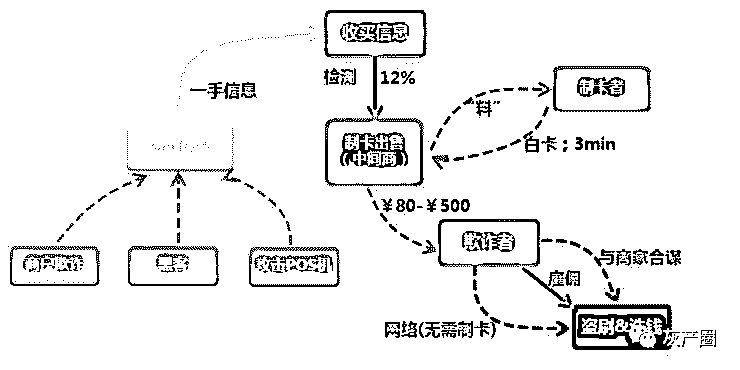

图四：盗卡/伪卡交易产业链

**二、电商业务作弊/流程漏洞产业链**

其实电商环节中的可作弊的点太多，刷点评、刷排名、刷销量这些都已经老生常谈，TB 对这块也构建了十分详细的风控规则，比如用户浏览行为、跳转前后页面、收货地址、支付流水等进行规则性监控。这里想说另外一个也很常见的产业链，俗称薅羊毛。

每次我跟别人说我的工作内容之一是“薅羊毛”的时候，人家都会说你的工作性质好可爱哦~~求我的心理阴影面积。

我们来继续开始王小明的故事。

> 王小明与李小花恩爱到了情人节，正在吃土的王小明想要送给李小花一份礼物，但是电商网站上的东西都挺不菲的，王小明一筹莫展。这个时候，王小明的好哥们张大飞又出现了，给他指了 TB 这个道，so~就这样，王小明同学又好开森~

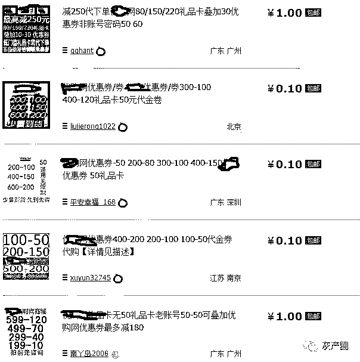

图五：网上大量优惠券售卖示意

至于优惠券、新手礼包被刷对于电商网站来说已经是足够正常，至于是否该重视这件事，则看公司老板的态度，是不是要把这些营销费用用到最真实的客户那里。当然，提到这条薅羊毛产业链，还得从一开始的源头说起。

**注册领券端**

说到注册领券，简直是风控圈人人憎恶的问题，比盗刷还可恨，因为这是一条合法的黑色产业，不出事还好，出事了只能怨自己风控措施做的不严，不过这样的也能带来虚假的繁荣。

一套成熟的黑产肯定都会有猫池插大量的银行卡，刷单稍微低级点的黑产团伙拥有几千上万张卡，再比如就是：

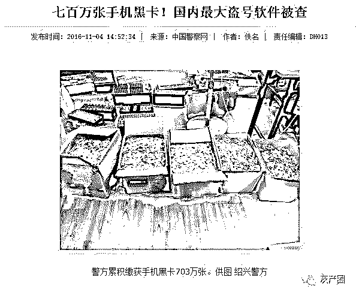

图六：黑产团伙拥有大量黑卡

当我看到 700 万张卡被打击的时候，我的内心是拔凉拔凉的，警方你要是都打击完了我是不是以后也要失业了？

当然，高级点的黑产团伙才不会用这些，人家用的都是真实手机号，还会交月租的哟，20 块钱的月租薅羊毛收入绰绰有余，电话拨过去人家还会跟你周旋哟~

哦，对了，肯定会有人会问关于验证码的问题，在这只能说连 12306 都不是事，还有什么~

至于该如何防范，以前我们使用过国内某第三方公司 x 安的号码识别服务，从对空号等的识别效果来看还是能够应用在生产业务当中的。

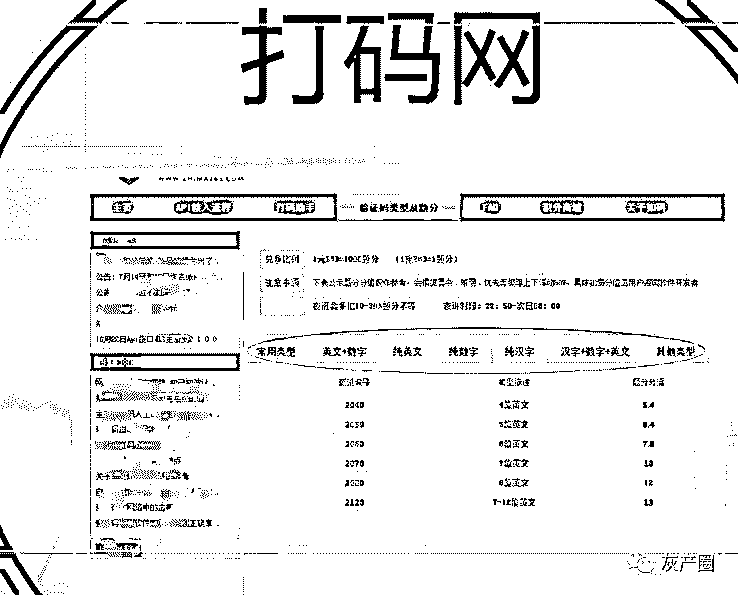

图七：验证码打码网站

**销赃端**

至于销赃端，不多说渠道太多，小打小闹的卖给个人那就算了，其实对于电商企业而言，最怕的就是黑产联合供应商刷单套利，而面对这种套利行为对于电商企业而言最大的问题是该如何给其定性，因为无论怎么样稍有用心的供应商都会让这条证据链无从查起。

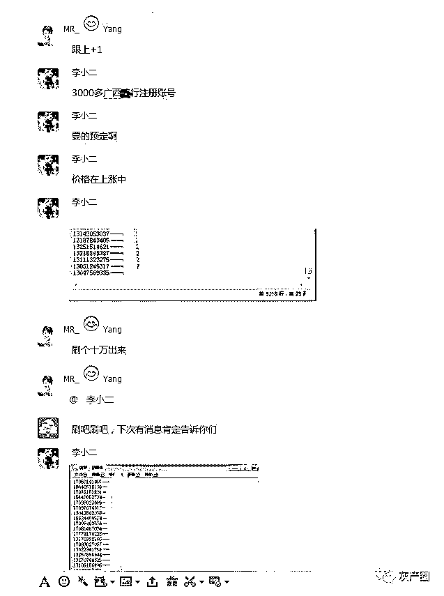

图八：可刷的网站优惠券信息共享群

> 我们的主人公王小明同学在一家机票代理公司工作，所谓机票代理公司就是帮别人下机票订单的。王小明同学是一名普通的操作员，公司老板每天都会给王小明 1000 个新注册的 x 哪儿 x 程的账号，每个账号里面都有好几十的机票优惠券，王小明每天都使用这些优惠券给客人下单。他一直很好奇老板从哪里搞来的这么多账号，直到他把心中的疑问跟张大飞说了。张大飞深谙此道，告诉了王小明同学其中端倪。王小明同学心中一阵窃喜，回去准备干一番自己的大事业，当然王小明不准备干机票了，王小明跟张大飞合伙开了一家酒店，采用同样的方法，事业蒸蒸日上，跟李小花的日子也过的风生水起。

当然，这些黄牛号可不单单只是用来享受优惠券，还可以用来参加网站的抽奖活动、刷点评、电商的秒杀活动等，用处大着呢。

**三、供应商商户端账户泄露/虚假供应商**

**商户端信息泄露**

> 王小明的酒店在各大 OTA 上面都挂牌了，除了使用虚假账号代客下单把前台转化的客人在 OTA 下单套取红包补贴之外，作为一名上进青年王小明还是很希望自己的酒店在 OTA 上能够有一番作为的，至少希望可以把自己的酒店可以在商圈搜索的时候暴露在首页。
> 
> 这个时候，张大飞又介绍了一个哥们给王小明说可以帮忙刷销量，但是呢需要王小明提供各大 OTA 的商户端账号密码。确实，在接下来的一个月里酒店销量风生水起，但是到结算佣金的时候，王小明一脸懵逼，产生了大量的现付结算佣金，但是这些间夜在自己酒店从来没有住过。突然想到那个刷单的哥们，结果发现失去联系，现付订单里的返现也全部被套空。

现在带有 O2O 性质的企业都有自己的商户端，而对于商户而言对密码的重视程度不高，因此会有很多黑产团伙利用诸多手段套取商户手里的密码。当然如何获取到的途径是有多方面的，可能采用一些技术手段，但是就如我前文提的那样，绝大多数的黑产团伙都是采用比较低级的手段，比如会有专人去酒店应聘前台服务人员。所以，很多黑产业务都是非常低技术门槛的，就跟前文说的一样钻的就是整个公司的流程管理漏洞。

**虚假供应商**

> 王小明不甘心，一定要发誓把在 OTA 上损失的钱给追回来。我们的王小明同学是很机智的。结合到自己被骗的场景以及发现在某个 OTA 上的酒店上线门槛很低，王小明偷偷的使用诸多虚假证件做了一家虚假酒店提交给 OTA 申请挂牌，很快就被通知挂牌通过，该酒店订单目前能够享受约 8%的现付订单返现。
> 
> 王小明同学不甘示弱，每天都要在这家虚假酒店上下数十万的订单套取几千元的补贴，等到要结算佣金的时候，关机再也找不到人，王小明同学一阵开心。可是不巧的是，该 OTA 的风控部门事后分析能力还是挺强的，通过诸多路径还是找到了王小明同学作案的事实。

对于供应商的审核也是很多 O2O 和电商行业的漏洞，一个虚假供应商能做的事情很多，除了套用平台发放的优惠券之外，还有一个非常重要的套现的作用，我们以王小明的视角来继续开始我们的故事。

**四、电商信贷欺诈**

**信用额度套现**

> 王小明的酒店投入了大量的资金，现在手头开始吃紧了，几张信用卡已经被刷爆了，现在手头已经开始急需用现金了，王小明一筹莫展。
> 
> 紧急时候，一定要推荐这位张大飞同学，张大飞给王小明一个 QQ 号，QQ 签名是蚂蚁花呗、苏宁任性付、京东白条套现。在这个 QQ 主人的教导下，王小明顺利开通了这三个网站的信用额度，并且顺利的从这三个网站购物套现了 2 万元，只是王小明需要付出 10-20%的套现手续费。

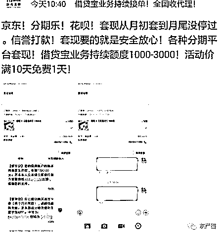

图九：信用额度套现广告

对于有信用支付的电商网站而言，这种类型的信用套现危害暂时体现不出来，可能过了几个月的时候开始出现坏账，美团点评曾经紧急关停过花呗支付渠道。

而在短期 KPI 考核的压力下，电商公司会很欢迎这些套现的行为，因为这会提升信用产品的用户使用频率。但是不置可否，这些需要套现的用户其还款能力是很值得质疑的。而一家店铺使用大量的信用支付，对这家店的真实性也应该表示质疑。所以这就是刚刚说的一家虚假供应商能够做很多事情。

对于电商行业，我想他们的风控体系大概都对每家店铺的信用交易情况进行了监控，我相信黑市上这么多套现渠道肯定是基于大量的虚假电商店铺；另外，作为心机 biao 的风控 er 去埋伏套现群也是精确打击虚假店铺的的有效方法之一。

**身份冒用欺诈**

> 王小明跟李小花要去买房了，好不容易看上一套三室一厅 90 平，等到去办房贷的时候征信报告打出来一脸懵逼，为什么会有信贷逾期坏账记录？王小明去人行咨询获得自己逾期信息来源于一家上报征信记录的消费金融公司，再去跟消费金融掰扯终于搞清了自己有过一笔网上信用贷款，王小明打死不认，但是各种信息都是他的身份认证信息，王小明二脸懵逼。在各种掰扯之下，消金公司终于答应王小明从 PBOC 里面撤销逾期记录。

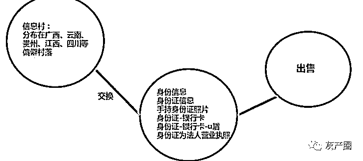

图十：身份证信息泄露渠道

目前形形色色的电商公司都有自己的消费金融公司，也有很多需要上报人行征信，在网上申请额度的过程也特别简单，因此欺诈风险成为网上信贷机构不可估量的损失，**对于网贷来说欺诈风险远远大于常见的信用风险。**

而为了用户体验，申请额度所需要的材料其实非常简单，因此网上有诸多利用很多虚假材料来获得信用额度并用来购物、提现的案例，具体过程与操作手法暂不详表，只能说，这是一条基本没办法抓到的暴利的黑色产业链。

**总结**

限于篇幅以及一些黑产操作流程，所以很多细节没有阐述特别清晰。另外，业务环节的风险远远比这篇文章里面的东西要多，而且各家互联网公司随着自身业务的多样性和特异性，会衍生出新的风险，所以公司与公司之间的风控体系在业务层面还是有较大的差异。

而对于互联网行业来说，对于这种高频次的用户非面对面的行为，面临黑产的肆虐是不可避免的，这也是攻防不断提升的过程，需要在业务运营过程中不断预知风险、发现风险、提高风险门槛，所以说风控体系的形成也是随着业务量的提升、风险事件的案例来不断优化完善的。

黑灰产的利润很诱人，但是这条产业链毕竟是游走在法律边缘，在过去的工作中，也参与了数起案件协同网警、刑警抓获在公司运营中的黑灰产犯罪团伙并得到了有期徒刑的法律制裁。因此，君子爱财取之有道，各位珍重。

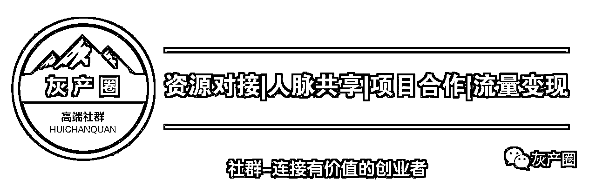

“阅读原文”加入社群