# 黑产大数据：手机黑卡调查

> 原文：[`mp.weixin.qq.com/s?__biz=MzIyMDYwMTk0Mw==&mid=2247486704&idx=1&sn=229ee529ea0a4af176cff633fa7f7926&chksm=97c8c7c8a0bf4ede306c5e82e330f0ea6b4ed228511e7350f7a1ce99bc70e58e678d3cb997b4&scene=27#wechat_redirect`](http://mp.weixin.qq.com/s?__biz=MzIyMDYwMTk0Mw==&mid=2247486704&idx=1&sn=229ee529ea0a4af176cff633fa7f7926&chksm=97c8c7c8a0bf4ede306c5e82e330f0ea6b4ed228511e7350f7a1ce99bc70e58e678d3cb997b4&scene=27#wechat_redirect)

手机黑卡似乎和大众没什么关系，但据说见过下面这张图的同学，每天的生活品质能提升 30%。

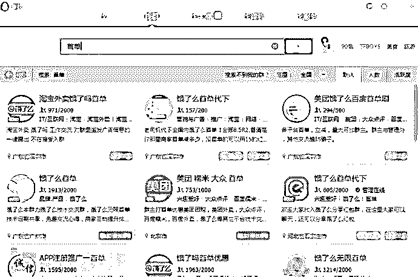

## 楔子

言归正传，作为一家严肃的安全公司，其实猎人君是来尝试解决这类问题的。

> 作为老板，你是否发现搞活动时用户热火朝天，活动一撤就一潭死水？
> 
> 作为策划，你是否只顾了活动的吸引人，而没有考虑对付虚假用户？
> 
> 作为程序员，你是否觉得通过短信确认下用户就万事大吉了？
> 
> ……
> 
> 辛辛苦苦筹划的活动，好不容易申请了一批福利准备搞上一个月拉上几万优质用户，结果三天就来了十几万，五天就掏完了精心准备的小红包，第六天在线就蹭蹭掉，然而用户就像一阵风，再也不出现了。

如果你是活动策划，相信多少都经历过类似的场景，此时你的心情，一定是这样的。

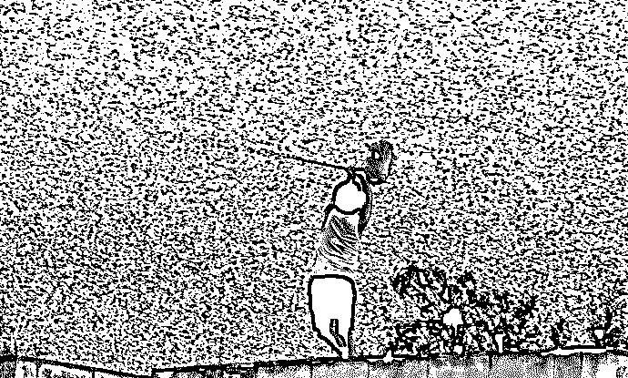

如果想识别这些虚假用户，找猎人君就可以了，猎人君的“黑卡猎人”产品拥有经过多维度分析的海量恶意手机号码库，可以直接接入使用。但对猎人君来说，仅仅识别这些恶意手机号是不够的，更深的问题是，掌握如此海量手机黑卡的产业背后的故事：

> 他们是谁？
> 都是什么卡？
> 谁家流出的号？
> 他们又攻击了谁？
> 造成了多大的危害？
> 背后是怎样的产业链？

这不但是猎人君想知道的，更是每个活动策划应该知道的（先给老板打预防针，老板不但觉得你考虑周到，还能延长 deadline，关键是出问题了锅还有人背不是么。。）

## 一. 他们是谁

你以为他们是这样点外卖的？

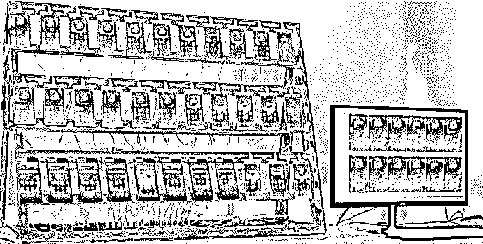

图森破！下面才是他们背后的装备：猫池（上图是另一个产业，以后也会深挖，可以关注公众号：ThreatHunter 第一时间获取后续爆料）：

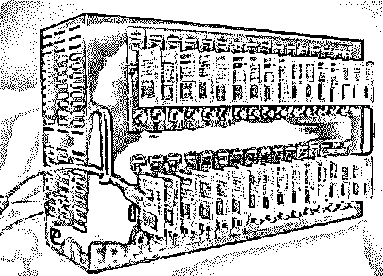

当然，并不是代点个外卖还需要猫池这么高级的装备，这些装备由养卡人负责维护，并把收到的验证码通过软件传到特定的接码平台上，然后代点外卖的在平台付费获取验证码并在自己手机上登陆下单。看一下接码平台的收费：

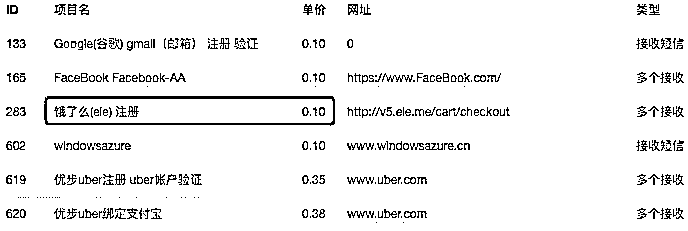

看到没，只要 1 毛钱！再看看群里卖首单的喊价：

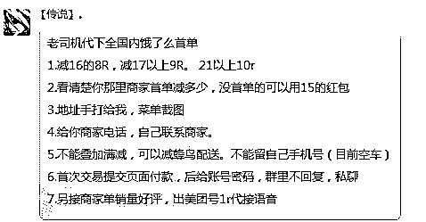

卖 8-10 块钱，80-100 倍的利润啊，这 TM 让人如何能忍！！

## 二. 都是什么卡

为了调查这些手机黑卡的来源，猎人君决定亲自购买一些手机黑卡进行研究，来反向追踪黑卡来源。依旧是靠万能的 QQ 群，找到一些相关 QQ 群后，以收卡的名义和多位手机黑卡卖家进行了多番友好交流，获取了一些信息，并从不同渠道买到了几批卡。随后用买到黑卡的服务密码登陆运营商页面，查看这些卡的相关信息。并进一步通过电话的方式从部分官方渠道愉快地进行了核实。得到结论如下：

### 物联网卡

目前流通的手机黑卡中 80%以上是物联网卡，无需实名认证。主要用于工业、交通、医疗、物流等领域。物联网卡只能以企业名义办理，需提供营业执照。物联网卡有不同套餐，手机黑卡主要使用的是以下两种套餐：

*   套餐一：0 月租（或 1 月租），只能收短信或给 1069 打头的服务号码发送短信，没有语音功能不能接打电话，在手机黑卡产业内称作注册卡或短信卡。

*   套餐二：0 月租（或 1 月租），有短信和语音功能，可以正常的接打电话和收发短信功能，在黑卡产业内被称作语音卡，除了可以用于接收短信验证码，还可用于接收语音验证码、发送验证短信这些单价更高的业务。

下图依次为在中国移动、中国联通、分享通信、银盛通信网上营业厅查到的卖到的黑卡的相关信息，可以看出都是没有实名认证的，都是企业认证的物联网卡。

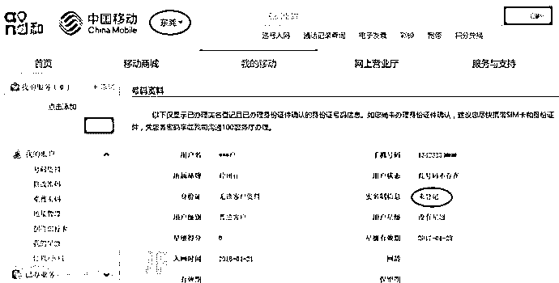

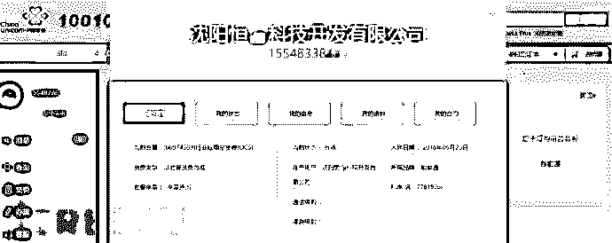

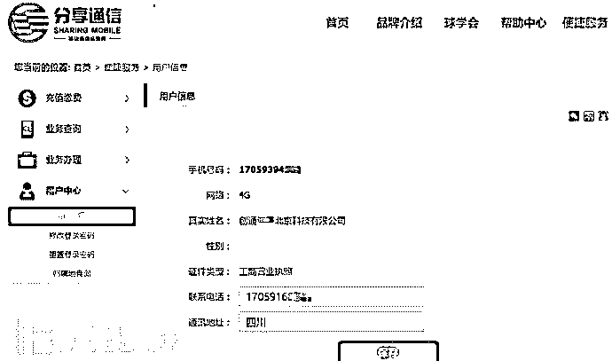

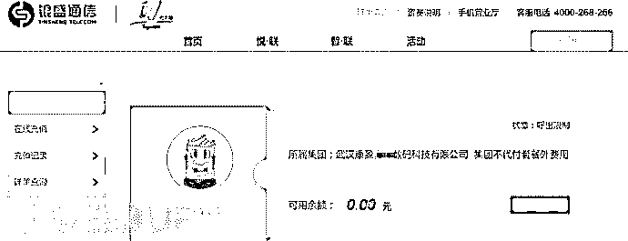

物联网卡只能以企业名义办理，但企业可办理的物联网卡数量通常没有太大限制，可以大批量开卡。可以通过开设皮包公司方式轻松办理大量的物联网卡，如上图中的几家公司，手机黑卡灰产以这种方式轻易将办理的物联网卡转手用于灰产获取巨额收入。在这个过程中，运营商又是什么角色呢？在银盛通信这家虚拟运营商的网上营业厅，猎人君发现买到的黑卡的已订业务栏显示的居然是“验证码年卡”，有效期为一年。

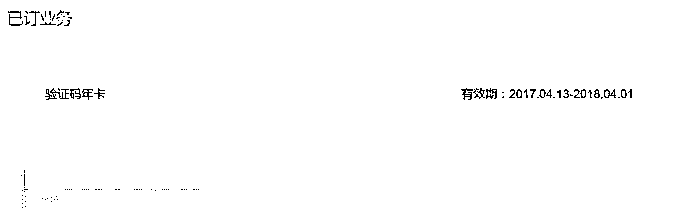

据此，推测有些运营商会为灰产定制专用的物联网卡套餐。为了验证这一推测，猎人君联系上了某物联网卡业务经理，询问如何大量办理 0 月租只能收短信的物联网卡。果然，该业务经理主动问猎人君办卡是否是用于接码。当得到肯定回答后，对方给出了报价，并表示只需提供公司营业执照即可直接通过网络办理。

### 实名卡

按说实名制已经是硬性要求，但业绩和金钱如此迷人心智，是否能有完卵？勾勾搭搭这事情猎人君并不擅长，但还是不小心撩到了远特通信这家虚拟运营商。从上线了解到的消息，通过关系可以从这家虚拟运营商那里拿到大量未实名的卡，然后再从网络收集身份证信息来批量实名认证。在量足够大的情况下，远特通信甚至可以开放认证后台并提供批量的身份证信息给灰产人员自行去认证。此处应有后台界面一张：

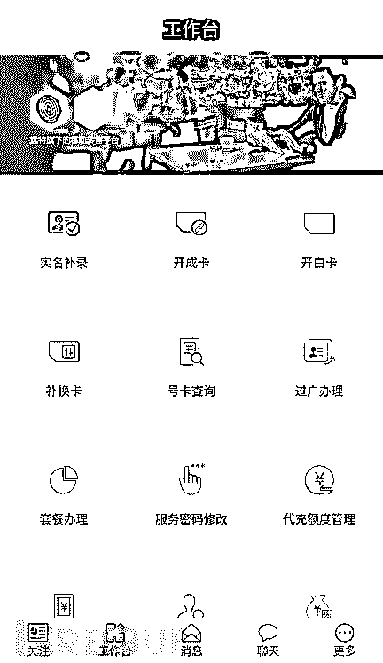

### 海外卡

由于国内实名制的原因，手机黑卡产业大量获取国内手机卡将变得越来越困难。从 2016 年下半年开始，大量来自缅甸、越南、印尼等东南亚国家的手机卡开始进入国内手机黑卡产业。这些卡支持 GSM 网络，进入国内后可以直接使用，无需实名认证。同时，这些手机卡基本是 0 月租，收短信免费，成本低，非常适合手机黑卡产业使用，且使用比例越来越高。

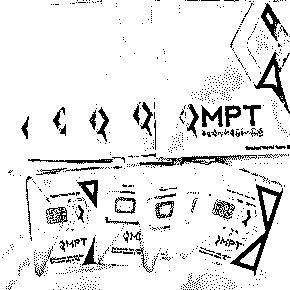

## 三. 谁家流出的号

在调查手机黑卡产业链过程中，猎人君经过持续监控捕获了大量手机黑卡号码，并对这些黑卡进行了分析，分析结果如下：

*   虚拟运营商下的手机黑卡占所有黑卡的比例确高达 59.81%，乃当之无愧的黑卡主力来源。虚拟运营商分配到手机卡号段只有 170、171 这两个号段，而所有运营商已发放号段有近 40 个，虚拟运营商以少量的号码资源贡献了大部分的黑卡。由此可见，虚拟运营商的手机卡中很大一部分流向了灰产领域。而实体运营商里中国联通与中国移动则旗鼓相当，相比之下，中国电信的管理则好很多，其手机卡流向灰产较少。

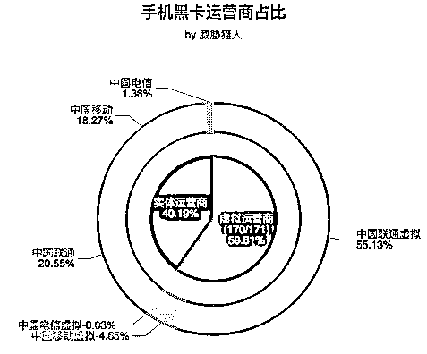

*   虚拟运营商由于找不到完整的号段分配表，大量联通的虚拟号段无法查到分配给了哪家虚拟运营商。能查到的迪信通、极信通信、普泰移动、蜗牛移动、远特通信、分享通信这 6 家的手机黑卡占所有手机黑卡的比例共 4.85%，其内部占比情况如下：

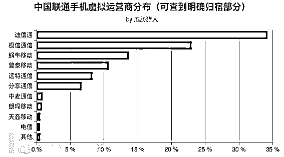

*   由于中国移动、中国联通实行的是各地区分治，地区运营商的权限很大，导致各地区的管理差异非常大。中国移动的手机黑卡中仅广东东莞、辽宁辽阳、广东汕头这 3 个地区就占了 80.5%，其中广东东莞更是重灾区，占比达 54%。中国联通则呈现出遍地开花的态势，但也以江浙一带为高发区，占比达 55%。

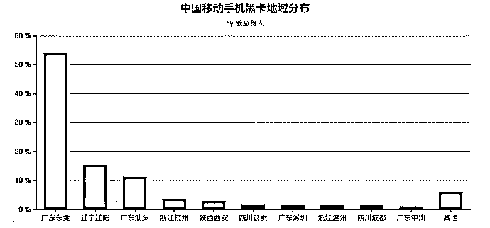

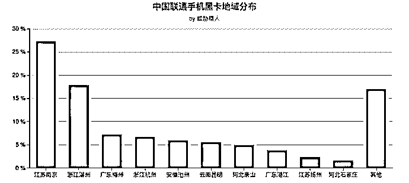

## 四. 谁在被攻击

通过对手机黑卡产业的攻击数据挖掘，猎人君发现攻击最多的前 4 大行业依次为互联网金融、电商、社交、O2O，占所有攻击的 64.7%。

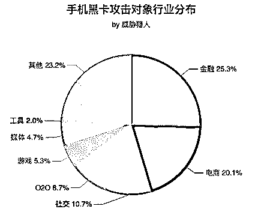

### 互联网金融

互联网金融行业可以说是受手机黑卡产业影响最严重的，各互联网金融平台为了吸引客户到自己的平台，争相砸入重金做各种新用户注册活动。羊毛党利用手机黑卡到各互联网金融平台大量的注册新用户，平台的活动经费大量的落入羊毛党的口袋中，活动的效果大打折扣，有的平台直接就被薅羊毛薅到倒闭。

### 电商

电商行业的攻击者主要通过各大电商平台注册账号，利用这些账号进行帮商家刷单、刷信誉等作弊行为，对电商的评价体系造成冲击，损害电商平台、正常经营的商家、买家的利益。被攻击的电商平台有：淘宝、京东、1 号店、蘑菇街、唯品会等。

### 社交

攻击者在社交平台大量注册小号，用这些小号从事发广告、刷粉、刷阅读量、充当网络水军、传播色情内容、进行网络诈骗等等。被攻击最多的社交平台包括：微信、QQ、新浪微博、陌陌等。

### O2O

近几年，O2O 行业在国内的发展迅猛，各平台为了争夺用户下了血本，从 2010 年团购网站间的千团大战，到 2014 年滴滴和快的之间的 24 亿天价补贴大战，再到最近共享单车领域的红包单车大战，战况之激烈举世罕见。广大用户在这些大战中确实获取到了实惠，但获得收益更多的还是手里掌握着巨量手机黑卡资源的羊毛党们。像大众点评这样有商家入驻的 O2O 平台则跟电商平台一样遭受着来自养号者的攻击，评价体系被影响。

### 新趋势

随着互联网金融、电商、社交、o2o 这些行业趋于成熟与稳定，可获取利益逐渐减少，手机黑卡产业开始寻找新的获利点，呈现出以下趋势：

*   由于国内市场趋于饱和，且竞争激烈，近几年国内的互联网公司开始进入海外市场，手机黑卡产业也追随着他们的步伐寻找海外市场的攻击目标。例如微信作为全球为数不多的可以跟 Facebook、Whatsapp 抗衡的社交平台，在积极开拓东南亚市场，手机黑卡产业敏锐的嗅到了商机，开始大规模的从东南亚获取手机黑卡，注册微信东南亚地区账号，从中获取灰色收入。

*   冷门的软件和服务称为攻击目标。由于热门目标的价值已经被开发得比较彻底，一些冷门的软件和服务开始被陆续手机黑卡产业发掘出来以获取更大的收益。比如：迅雷赚钱宝预约服务被黄牛党攻击，大量注册账号提升命中概率；一些积分墙软件也被大量注册账号，骗取任务奖励来获利。

## 五. 背后的产业链

关于黑卡产业背后的产业链，先看一张图：

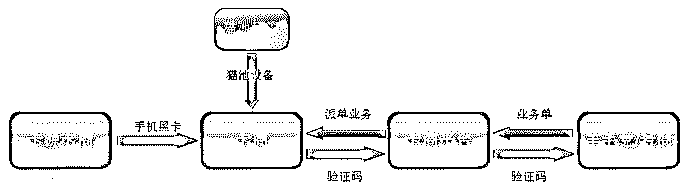

### 卡源卡商

卡源卡商通过各种渠道（如：开皮包公司、与代理商打通关系等）从运营商或代理商那里办理大量的手机卡，然后加价转卖给下游卡商赚取差价，他们掌握着手机黑卡货源。

### 猫池厂家

猫池厂家负责生产猫池设备，并将设备卖给卡商使用。猫池是一种插上手机卡就可以模拟手机进行收发短信、接打电话、上网等功能的设备，在正常行业也有广泛应用，如邮电局、银行、证券商、各类交易所、各类信息呼叫中心等。猫池设备可以实现对多张手机卡的管理。前文插了许多卡的设备图就是猫池。

### 卡商

卡商从卡源卡商那里大量购买手机黑卡，将黑卡插入猫池设备并接入卡商平台，然后通过卡商平台接各种验证码业务，根据业务类型的不同，每条验证码可以获得 0.1 元-3 元不等的收入。

### 卡商平台

负责连接卡商和羊毛党、号商等有手机验证码需求的群体，提供软件支持、业务结算等平台服务，通过业务分成获利。卡商平台很多，活跃的有数十家，比较知名的卡商平台有：Thewolf、星辰、爱乐赞、玉米等，其中 Thewolf 和星辰可以接语音验证码。2016 年 11 月当时最大的卡商平台爱码被警方查处，随后很多平台转入地下。

### 羊毛党/号商

当某个企业做活动奖励时（比如：去年很火的 P2P 新用户奖励、最近比较火的摩拜、ofo 的红包单车），羊毛党就会出动，大批量注册账号获取活动奖励。号商则是大量注册并养各种互联网服务的账号，通过出售养的账号获取收益，如：微信账号、淘宝账号、微博账号、陌陌账号等。这些账号可以用于发广告、做水军、代刷信誉、代刷粉等。由于注册账号需要进行手机短信验证或语音验证，羊毛党/号商就会找到卡商平台去获取手机号来接收验证码。

## 六. 造成多大的危害

经过和手机黑卡产业内不同的人进行友好交流，猎人君得到了一份还算靠谱的黑卡产业各分工获利数据，由此推算每年手机黑卡产业给企业造成的直接经济损失超过 40 亿。由于有些数据的可靠性暂无其它渠道可以验证，这份数据还需大家自行判断可靠性。下面就以注册卡（国内物联网卡）为例介绍下一张手机黑卡经过产业各环节后如何价值放大的，并有此推算手机黑卡产业造成的直接经济损失：

### 卡源卡商

从运营商或代理商处拿卡成本为每张卡 6-10 元，然后加价转卖给卡商，每张卡收益为 5-8 元。拿卡成本根据卡的有效期长短波动，例如 3 个月有效期的卡拿卡成本在 6 元左右。

### 卡商

从卡源卡商处拿卡成本为每张卡 12-18 元，通过接验证码业务，每张卡收入可以做到 25-35 元左右，收益为 10-20 元。以每月经手 5000 张卡的中等规模卡商为例，扣除成本后每月可获利 7-8 万。

### 卡商平台

主要成本为平台前期的开发费用和后续的维护费用，通过对每单业务收入分成 20%左右获得收益，每张加入平台的卡可以从中获得 5 元左右的收入。

### 羊毛党/号商

以微信为例，号商注册一个微信号付给卡商平台的费用为 2.5 元左右，将微信号养一段时间后出售，满月号（注册满一个月的微信号，下同理类推）、三月号、半年号、一年号分别可以卖到 15 元、40 元、65 元、90 元左右。号商获利空间丰厚，相应的，由于养号需要大量手机和相应技术，成本和门槛较高。羊毛党的收入则波动较大，在互联网金融、o2o 大战、滴滴快的大战、共享单车大战时，羊毛党可谓是日经斗金。大战过后，收入有所下降。

> 一张手机黑卡最终在羊毛党/号商手中能产生至少 100 元的收入，按每年 4 千万张黑卡计算，这个产业每年有 40 亿以上的产值。有进必有出，这也意味着企业每年因手机黑卡产业攻击造成的直接损失在 40 亿元以上，间接损失还得另算。

## 七. 如何防范

运营商掌握着所有手机卡，理论上从运营商入手才能根治手机黑卡问题。

*   物联网卡采用专门号段，停止发放正常号段的物联网卡。

*   加强地区代理商的权限管理，建立实名制审计流程，及时发现内鬼。

作为企业，最快捷的方式则是从专业公司获取经过审计的恶意手机号码，在注册或活动流程中接入审计策略，让企业投入的经费能得到有效利用，并尽量减少因黑卡产业带来的损失。当然，猎人君也提供相关服务，详情请关注公众号：ThreatHunter。

## 写在最后

正如大草原上狮子周围总有成群的鬣狗，伺机从狮子口中夺取食物，甚至敢于直接攻击狮子。

互联网大公司的周围同样环绕着众多随时掠食的黑灰产从业者，也不乏被黑灰产直接干倒的正规公司。丛林法则在人类的生态系统中不断上演，并将在黑白博弈中一直持续下去，往复循环，不曾更改。

年轻的时候总喜欢分清黑白，站更高才发现世界其实一直如此博弈循环着。我们努力使天平倒向白方，也并非为了能改变局面，只是觉得，不能把世界让给那些不喜欢的人和事。

*本文原创作者：威胁猎人

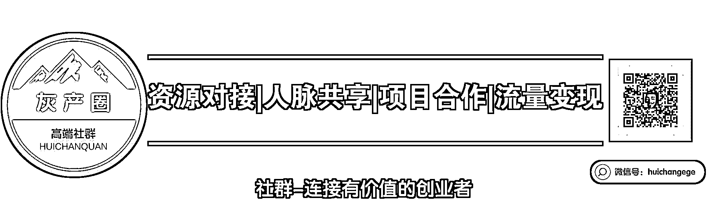

“阅读原文”加入社群