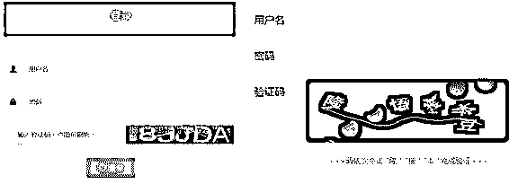
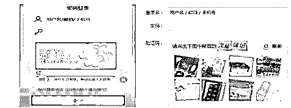
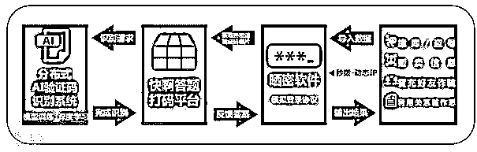
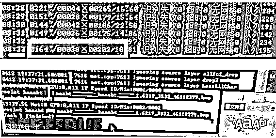
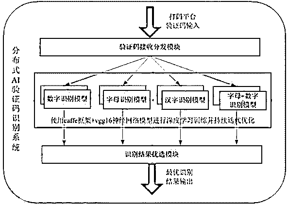
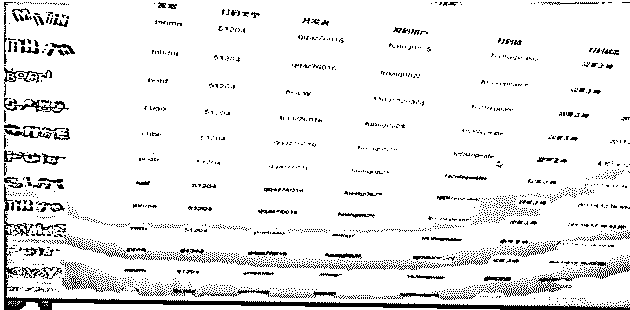

# 黑产用“未来武器”破解验证码，打码小工都哭了

> 原文：[`mp.weixin.qq.com/s?__biz=MzIyMDYwMTk0Mw==&mid=2247486693&idx=1&sn=583f86de316df6f35e4c0a7a1bb770e1&chksm=97c8c7dda0bf4ecb18be8ae8727dde671938132865dc572b4fcba00219b5a0498d56a6d00747&scene=27#wechat_redirect`](http://mp.weixin.qq.com/s?__biz=MzIyMDYwMTk0Mw==&mid=2247486693&idx=1&sn=583f86de316df6f35e4c0a7a1bb770e1&chksm=97c8c7dda0bf4ecb18be8ae8727dde671938132865dc572b4fcba00219b5a0498d56a6d00747&scene=27#wechat_redirect)

当我们正讨论如何用 AI 推动产业升级、改变未来生活时，不法分子也在研究 AI 技术，并通过各种手段非法牟利。近日，腾讯守护者计划安全团队协助警方打掉市面上最大打码平台“快啊答题”，挖掘出一条从撞库盗号、破解验证码到贩卖公民信息、实施网络诈骗的全链条黑产。而在识别验证码这一关键环节，黑产竟已用上 AI 人工智能技术。该团伙运用 AI 技术训练机器，极大提升了单位时间内识别验证码的数量，2017 年一季度打码量达到 259 亿次，且识别验证码的精准度超过 80%。借此案件，我们也深入研究 AI 打码平台黑产领域，对其犯罪模式进行剖析。

## 打码平台：对抗验证码系统而生

对于“验证码”，大家并不陌生。在登录各网站、平台、APP 时，经常见到。常见的“验证码”有“字符式”、“字符+点选式”、“滑块拼图式”和难度逆天的“12306 式”。

  

                                               字符式                                                                       字符+点选式 

                                                 滑块拼图式                                                                 12306 式

验证码（CAPTCHA ，Completely Automated Public Turing Test to Tell Computers and Humans Apart，全自动区分计算机和人类的图灵测试），是区分计算机和人类的一种程序算法，简单解释是一个答题的验证。系统向请求发起方提问，能正确回答的即是人类，反之则为机器。从安全角度讲，CAPTCHA 经过不断演化，已成为目前国内外各大互联网公司用于对抗网络黑产恶意行为（如恶意登录）的验证码安全策略，即我们现在俗称的验证码系统。

在网络黑产中，不法分子窃取网站数据库后，需要确认帐号对应的密码是否正确，将有价值的数据通过验证的方式筛选出来，这一过程黑话叫“晒密”，意即撞库。而“晒密”最核心的障碍就是互联网公司设置的验证码安全体系。每天面对数以亿计的“晒密”需求，黑产分子不可能人工逐个识别，而是需要提高“晒密”效率，批量识别。“打码平台”这一专业服务便应运而生。

## “打码平台”会与“晒密”软件作者合作：

> 1) 黑产团伙把盗取的帐号密码信息导入到“晒密”软件，“晒密”软件模拟登录协议，向互联网公司服务器发送登录请求。
> 
> 2) 服务器检测到登录异常时，会下发验证码，进行安全策略拦截。
> 
> 3) “晒密”软件将收到的验证码图片发送给“打码平台”，请求将图片转化为字符。
> 
> 4) 打码平台后台破解验证码，将字符结果返回“晒密”软件，完成“晒密”（撞库）流程。
> 
> 5) 这些“晒密”后得到的用户信息，则可能被骗子直接用于实施诈骗犯罪。

下面这张图，可以看到“快啊答题”打码平台所涉及的从撞库到晒密再到打码的整个黑色产业链：

 

早期的打码平台，对验证码的识别基本是通过“人工+OCR 降维识别图片”完成。但是，互联网公司的验证码安全策略升级后，包括出现像 12306 这样识别难度高的验证码体系，“人工+OCR”方式的识别效率降低、成本升高，一段时期内，确实降低了黑产犯罪。

但是，黑产人员并不会因为一条路被堵死,就放弃犯罪，他们又想出了更前沿的手法来应对。目前市面上最大的 “快啊答题” 打码平台就是典型代表，他们运用目前最流行的人工智能 AI 技术训练机器，大大提高了识别验证码的精准度，也极大提升了犯罪嫌疑人在单位时间内识别验证码的数量。通过这个打码平台管理后台的统计信息显示，2017 年 1-3 月，其打码量达到 259 亿次，平台累计打码量超过 1700 亿次。这套 AI 系统识别验证码成功率非常高，以下图红框标识处为例，当天的整体识别率会输出成日志文件，通过随机调取某日的日志文件，该日整体验证码识别率高达 83.4%。

 

## AI 技术破解“晒密”低效难题

“快啊答题”打码平台基于主流 AI 深度学习 Caffe 框架，使用 vgg16 卷积核神经网络模型，可以直接输入原始图像（避免了对图像的复杂前期预处理），并能通过深度的机器学习来获得较高的验证码识别率。

 

（分布式 AI 验证码识别系统简易流程介绍）

由于不同方式生成的验证码风格迥异，且经常变换，为了实现精准识别，提高准确度，“快啊答题”收集了大量不同风格的样本，并开发了验证码接收与分发模块，输入端对接打码平台，输出端根据验证码类型轮询选择并推送到相应的验证码识别模型，验证码识别完成，返回验证码字符串到打码平台，打码平台确认是否识别正确，并将结果反馈至该分布式 AI 验证码识别系统进行进一步优化。

 

（图为识别平台自身的管理界面）

### 1、生成方法

打码平台犯罪团伙通过以下步骤，迅速低成本地获得海量验证码训练数据：

> （1）从互联网公开渠道获取字体样本，输出数字、字母、字母+数字、中文等不同类型验证码识别模型，获得的公开字体库，并且搜集背景图片，如壁纸/风景类图片。                                                       
> 
> （2）通过工具将不同字体的验证码进行加工处理（加干扰、变形等）后，写入到背景图片中，生成带标定的训练样本。

由于目标问题是不定长度的字符序列识别，生成的训练样本的字符个数也是不定长度的，可以是 1-6 个任意字符，最多支持 6 个标签的识别。黑产人员用一系列的验证码生成工具，来生成不同风格的验证码图片，如下图：

 

（作者通过工具生成的训练样本示例）

（3）打码平台犯罪团伙基于收集到的超过 10000 个字体库，通过网络采集和字库背景生成训练样本，针对验证码识别业务，积累超过 5000 万的样本库，覆盖常见验证码模型。由此训练得到的模型具有非常强的适用性，即便新型的验证码变种，也可达到较高识别率。

### 2、多标签训练

“快啊答题”打码平台的 AI 系统，能将一张验证码图片作为一个整体，将单字识别转换成单图多标签、端到端的识别出验证码中的所有字符。

针对网络上主流验证码图片一般不超过 6 个字符的特点，该 AI 系统设计 6 个标签的分类，对于少于 6 个字符的验证码图片，未含字符的标签会判定为负样本不予输出。因此，最终的输出结果只包含给定字符的有效标签。也就是，原本的 OCR 识别只能简单识别图形上的文字，而在文字变化后识别率就大大降低。而使用 Caffe 框架，就可以对图形内的局部特征进行分类提取。

“快啊答题”打码平台基于海量训练样本，建立了多标签分类网络来训练验证码的识别网络。汉字的网络训练周期为 1 个月左右，而英文+数字的网络训练周期则只需要 1 个星期。

另外，“快啊答题”打码平台还会通过搜集反馈回来的失败样本，以及人工打码的标定数据，来实时训练和更新识别网络，不断迭代训练进行优化，进一步提高神经网络模型的识别能力。

在以往的对抗黑产过程中，由于犯罪行为认定、法律适用等问题，即使对下游从事诈骗的团伙开展打击，但在针对“打码平台”这一犯罪上游环节上，能真正认定为共同犯罪，形成的实际判例非常少，无法实现全链条打击。下游团伙借助“打码平台”死灰复燃，也是多类网络黑灰产屡禁不止的原因之一。在市场上，“快啊答题”打码平台通过对接晒密软件，根据打码数量收取下游使用晒密软件的黑产犯罪团伙费用，而后再按比例进行分成。

像 “快啊答题” 这类的打码平台，不仅破坏了互联网公司的验证码安全体系，也直接或间接的为更多网络黑产提供了帮助。在腾讯守护者计划安全团队和警方的共同努力下， “快啊答题” 平台负责人及核心人员被公安机关以提供侵入、非法控制计算机信息系统程序工具罪批准逮捕。

*本文作者：守护者观察

“阅读原文”加入社群