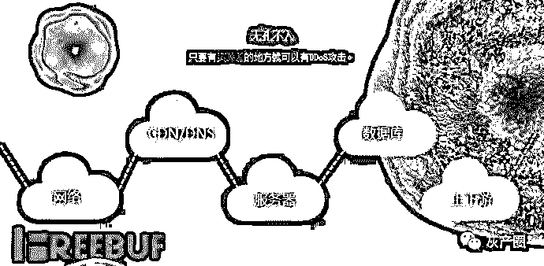
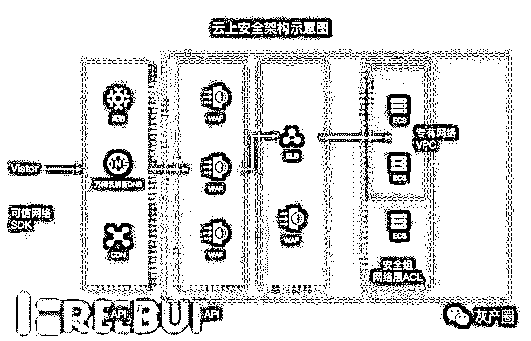

# 游戏行业 DDoS ：什么样的架构才可以对 DDoS 免疫？

> 原文：[`mp.weixin.qq.com/s?__biz=MzIyMDYwMTk0Mw==&mid=2247486656&idx=1&sn=9e2cee1a2efb939d7eb33fec7fa128b7&chksm=97c8c7f8a0bf4eeefd48e983abc995801634d328ec38d200d59d1869176ba92d8aebea034dbe&scene=27#wechat_redirect`](http://mp.weixin.qq.com/s?__biz=MzIyMDYwMTk0Mw==&mid=2247486656&idx=1&sn=9e2cee1a2efb939d7eb33fec7fa128b7&chksm=97c8c7f8a0bf4eeefd48e983abc995801634d328ec38d200d59d1869176ba92d8aebea034dbe&scene=27#wechat_redirect)

**游戏行业 DDoS ：什么样的架构才可以对 DDoS 免疫？**

在我看来，游戏行业一直是竞争、攻击最复杂的一个“江湖”。许多游戏公司在发展业务时，对自身的系统、业务安全，存在诸多盲区；对 DDoS 攻击究竟是什么，怎么打，也没有真正了解。

我曾看到充满激情的创业团队、一个个玩法很有特色的产品，被这种互联网攻击问题扼杀在摇篮里； 也看到过一个运营很好的产品，因为遭受 DDoS 攻击，而一蹶不振。

这也是为什么想把自己 6 年做游戏行业 DDoS 的经验，与大家一起分享，帮助在游戏领域内全速前进的企业，了解本行业的安全态势，并给出一些可用的建议。

在与游戏公司安全团队接触的过程中，看到游戏行业对安全有两个很大的误区。

## 两个误区

第一个误区是：没有直接损失，就代表我很安全。 

事实上，相比其它行业，游戏行业的攻击量和复杂度都要高一筹。 每个游戏公司，每个应用，其实都遭受过攻击。但许多游戏安全负责人，仍然会“蒙在鼓里听打雷”，没有察觉正在发生的攻击，或者干脆视而不见，由此埋下安全隐患。 

第二个误区是：很多游戏行业安全负责人会认为，只要装了防火墙，就能挡住绝大部分的攻击。

然而，防火墙的功能其实很有限。这也从侧面说明了许多游戏行业安全薄弱的根源：只去做好一个点，却看不到整个面。

然而，攻击者总会从意想不到的薄弱点，攻陷整个游戏行业的内部系统。

以 DDoS 攻击为例，2016 年，全球有记录的 DDoS 峰值已近 600G，300G 以上的 DDoS 攻击，在游戏行业内已经毫不稀奇。

为什么游戏会是 DDoS 攻击的重灾区呢？这里说几点主要的原因。

首先是因为游戏行业的攻击成本低廉，是防护成本的 1/N，攻防两端极度不平衡。随着攻击方的打法越来越复杂、攻击点越来越多，基本的静态防护策略无法达到较好的效果，也就加剧了这种不平衡。

其次，游戏行业生命周期短。一款游戏从出生，到消亡，很多都是半年的时间，如果抗不过一次大的攻击，很可能就死在半路上。黑客也是瞄中了这一点，认定：只要发起攻击，游戏公司一定会给“保护费”。

再次，游戏行业对连续性的要求很高，需要 7*24 在线，因此如果受到 DDoS 攻击，游戏业务很容易会造成大量的玩家流失。我曾经见过在被攻击的 2-3 天后，游戏公司的玩家数量，从几万人掉到几百人。

最后，游戏公司之间的恶性竞争，也加剧了针对行业的 DDoS 攻击。

而针对游戏行业的 DDoS 攻击类型也非常的复杂多样。总结下来，大致分为这几种：

## DDoS 分类

首先是空连接：攻击者与服务器频繁建立 TCP 连接，占用服务端的连接资源，有的会断开，有的一直保持；比如开了一家面馆，“黑帮势力”总是去排队，但是并不消费，那么此时正常的客人也会无法进去消费。

其次是流量型攻击：攻击者采用 udp 报文攻击服务器的游戏端口，影响正常玩家的速度；还是上面的例子，流量型攻击相当于坏人直接把面馆的门给堵了。

再次，CC 攻击：攻击者攻击服务器的认证页面，登陆页面，游戏论坛等，这是一类比较高级的攻击了。这种情况相当于，坏人霸占了收银台结账，找服务员去点菜，导致正常的客人无法享受到服务。

而后，假人攻击：模拟游戏登陆和创建角色过程，造成服务器人满为患，影响正常玩家。

还有对玩家的 DDoS 攻击：针对对战类游戏，攻击对方玩家的网络使其游戏掉线或者速度慢和对网关 DDoS 攻击:攻击游戏服务器的网关，游戏运行缓慢。

最后是连接攻击：频繁的攻击服务器，发垃圾报文，造成服务器忙于解码垃圾数据。

我以常见的 DDoS 和 CC 攻击为例，对他们的攻击方式做一个解释。

## 攻击方式

DDoS 攻击的主要的方式是 syn flood,ack flood,udpflood 等流量型的攻击，本身从攻击方式来是非常简单的，无论是哪种方式，流量大是前提。如果防御方有充足的带宽资源，目前的技术手段防御都不会是难事；针对 UDPflood，实际上很多游戏目前都不需要用到 UDP 协议，可以直接丢弃掉。

而 CC 攻击分为两种。一般针对 WEB 网站的攻击叫 CC 攻击，但是针对游戏服务器的攻击，很多人一般也叫 CC 攻击，两种都是模拟真实的客户端与服务端建立连接之后，发送请求。

针对网站的 CC 如下，一般是建立连接之后，伪造浏览器，发起很多 httpget 的请求，耗尽服务器的资源。

针对游戏服务器的 CC，一般是建立连接之后，伪造游戏的通信报文保持连接不断开，有些攻击程序甚至也不看游戏的正常报文，而是直接伪造一些垃圾报文保持连接。

那么，游戏公司如何才能判断自己是否正在被攻击？

## 识别方式

假定可排除线路和硬件故障的情况下，突然发现连接服务器困难，正在游戏的用户掉线等现象，则说明很有可能是遭受了 DDoS 攻击。

目前，游戏行业的 IT 基础设施一般有两种部署模式：一种是采用云计算或者托管 IDC 模式，另外一种是自拉网络专线。但基于接入费用的考虑，绝大多数采用前者。

无论是前者还是后者接入，在正常情况下，游戏用户都可以自由流畅的进入服务器并参与娱乐。所以，如果突然出现下面这几种现象，就可以基本判断是“被攻击”状态：

> （1） 主机的 IN/OUT 流量较平时有显著的增长
> 
> （2）主机的 CPU 或者内存利用率出现无预期的暴涨
> 
> （3）通过查看当前主机的连接状态，发现有很多半开连接，或者是很多外部 IP 地址，都与本机的服务端口建立几十个以上的 ESTABLISHED 状态的连接，则说明遭到了 TCP 多连接攻击
> 
> （4）游戏客户端连接游戏服务器失败或者登录过程非常缓慢
> 
> （5）正在进行游戏的用户突然无法操作或者非常缓慢或者总是断线

在知道难点，和攻击状态的判断方法之后，来说说我所了解的 DDoS 防护方法。

## 防护方式

目前，可用的 DDoS 缓解方法，有三大类。首先是架构优化，其次是服务器加固，最后是商用的 DDoS 防护服务。

游戏公司需要根据自己的预算、攻击严重程度，来决定使用哪一种。

在预算有限的情况下，可以从免费的 DDoS 缓解方案，和自身架构的优化上下功夫，减缓 DDoS 攻击的影响。

> a.     如果系统部署在云上，可以使用云解析，优化 DNS 的智能解析，同时建议托管多家 DNS 服务商，这样可以避免 DNS 攻击的风险。
> 
> b.    使用 SLB，通过负载均衡减缓 CC 攻击的影响，后端负载多台 ECS 服务器，这样可以对 DDoS 攻击中的 CC 攻击进行防护。在企业网站加了负载均衡方案后，不仅有对网站起到 CC 攻击防护作用，也能将访问用户进行均衡分配到各个 web 服务器上，减少单个 web 服务器负担，加快网站访问速度。
> 
> c.     使用专有网络 VPC，防止内网攻击。
> 
> d.    做好服务器的性能测试，评估正常业务环境下能承受的带宽和请求数，确保可以随时的弹性扩容。
> 
> e.     服务器防御 DDoS 攻击最根本的措施就是隐藏服务器真实 IP 地址。当服务器对外传送信息时，就可能会泄露 IP，例如，我们常见的使用服务器发送邮件功能就会泄露服务器的 IP。

因而，我们在发送邮件时，需要通过第三方代理发送，这样子显示出来的 IP 是代理 IP，因而不会泄露真实 IP 地址。在资金充足的情况下，可以选择 DDoS 高防服务器，且在服务器前端加 CDN 中转，所有的域名和子域都使用 CDN 来解析。

也可以对自身服务器做安全加固。

## 安全加固方式

> a.     控制 TCP 连接，通过 iptable 之类的软件防火墙可以限制某些 IP 的新建连接；
> 
> b.     控制某些 IP 的速率；
> 
> c.     识别游戏特征，针对不符合游戏特征的连接可以断开；
> 
> d.     控制空连接和假人，针对空连接的 IP 可以加黑；
> 
> e.     学习机制，保护游戏在线玩家不掉线，通过服务器可以搜集正常玩家的信息，当面对攻击的时候可以将正常玩家导入预先准备的服务器，新进玩家可以暂时放弃；
> 
> f.      确保服务器系统安全；
> 
> g.     确保服务器的系统文件是最新的版本,并及时更新系统补丁；
> 
> h.     管理员需对所有主机进行检查，知道访问者的来源；
> 
> i.      过滤不必要的服务和端口：可以使用工具来过滤不必要的服务和端口（即在路由器上过滤假 IP，只开放服务端口）。这也成为目前很多服务器的流行做法。例如，“WWW”服务器，只开放 80 端口，将其他所有端口关闭，或在防火墙上做阻止策略；
> 
> j.      限制同时打开的 SYN 半连接数目,缩短 SYN 半连接的 timeout 时间,限制 SYN/ICMP 流量；
> 
> k.     认真检查网络设备和主机/服务器系统的日志。只要日志出现漏洞或是时间变更,那这台机器就可能遭到了攻击；
> 
> l.      限制在防火墙外与网络文件共享。这样会给黑客截取系统文件的机会,若黑客以特洛伊木马替换它，文件传输功能无疑会陷入瘫痪；
> 
> m.    充分利用网络设备保护网络资源；
> 
> n.     禁用 ICMP。仅在需要测试时开放 ICMP。在配置路由器时也考虑下面的策略：流控，包过滤，半连接超时，垃圾包丢弃，来源伪造的数据包丢弃，SYN 阀值，禁用 ICMP 和 UDP 广播；
> 
> o.     使用高可扩展性的 DNS 设备来保护针对 DNS 的 DDoS 攻击。可以考虑购买 DNS 商业解决方案，它可以提供针对 DNS 或 TCP/IP3 到 7 层的 DDoS 攻击保护。

再就是商用的 DDoS 解决方案。

## 商用 DDoS 解决方案

针对超大流量的攻击或者复杂的游戏 CC 攻击，可以考虑采用专业的 DDoS 解决方案。目前，通用的游戏行业安全解决方案，做法是在 IDC 机房前端部署防火墙或者流量清洗的一些设备，或者采用大带宽的高防机房来清洗攻击。

当宽带资源充足时，此技术模式的确是防御游戏行业 DDoS 攻击的有效方式。不过带宽资源有时也会成为瓶颈：例如单点的 IDC 很容易被打满，对游戏公司本身的成本要求也比较高。

在阿里云，我们团队去颠覆带宽“军备竞赛”的策略，是提供一个可信的访问网络，这也是游戏盾诞生的初衷。

游戏盾风控模式的初衷，是从收到访问的第一刻起，便判断它是“好”还是“坏”，从而决定它是不是可以访问到它想访问的资源；而当攻击真的发生时，也可以通过智能流量调度，将所有的业务流量切换到一个正常运作的机房，保证游戏正常运行。

## 某棋牌行业基于游戏盾的架构示意图

所以，通过风控理论和 SDK 接入技术，游戏盾可以有效地将黑客和正常玩家进行拆分，可以防御超过 300G 以上的超大流量攻击。

风控理论需要用到大量的云计算资源和网络资源，阿里云天然的优势为游戏盾带来了很好的土壤，当游戏盾能调度 10 万以上节点进行快速计算和快速调度的时候，那给攻击者的感觉是这个游戏已经从他们的攻击目标里面消失。

游戏盾，是阿里云的人工智能技术与调度算法，在安全行业中的成功实践。

而随着攻防进程的推进，网络层和接入层逐步壮大，我们希望“游戏盾”的风控模式，会逐步延展到各个行业中，建立起一张安全、可信的网络。这张网络中，传输着干净的流量，而攻击被前置到网络的边缘处。所有的端，在接入这张网络时，都会经过风险控制的识别，网内的风控系统，也让坏人无法访问到他锁定资源。

> 未来，以资源为基础的 DDoS 防护时代终将被打破，演进出对 DDoS 真正免疫的风控架构。
> 
> 而我们所做的，只是一个开始。

