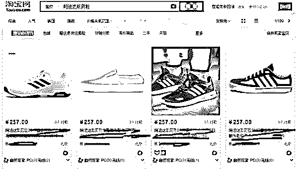
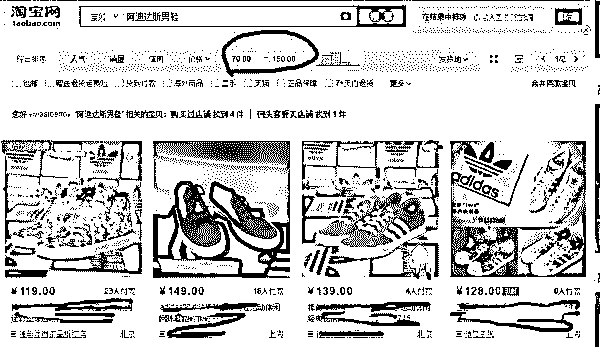
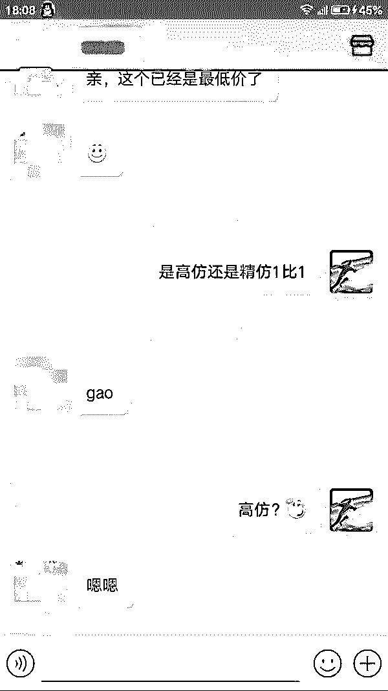
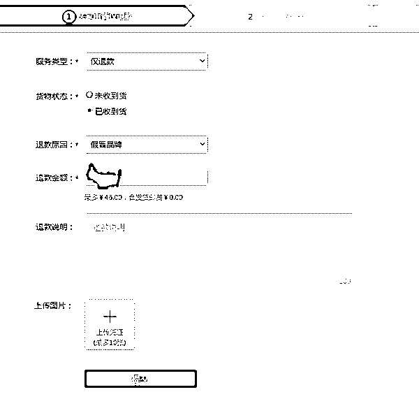
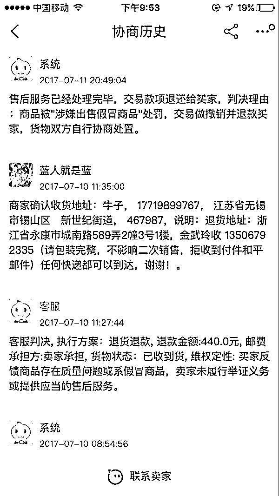
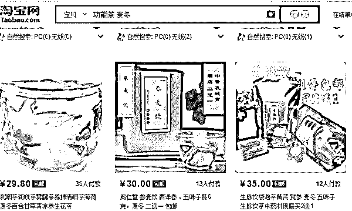
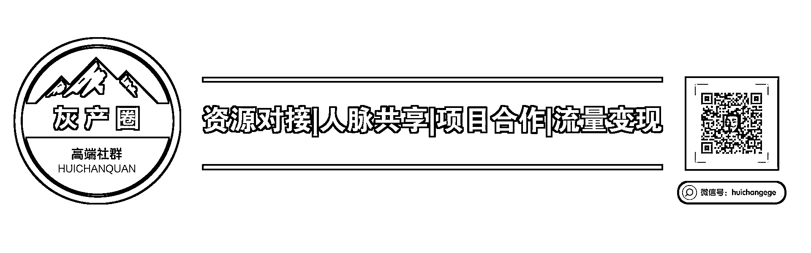

# “职业打假师”绝不会告诉你，他们收入轻松过百万

> 原文：[`mp.weixin.qq.com/s?__biz=MzIyMDYwMTk0Mw==&mid=2247486635&idx=1&sn=da20350338eb69791f8e0a92923f00ad&chksm=97c8c793a0bf4e8585fce39bd7738cb5a1c15120c1440dc132ad4174aefcad81137208958502&scene=27#wechat_redirect`](http://mp.weixin.qq.com/s?__biz=MzIyMDYwMTk0Mw==&mid=2247486635&idx=1&sn=da20350338eb69791f8e0a92923f00ad&chksm=97c8c793a0bf4e8585fce39bd7738cb5a1c15120c1440dc132ad4174aefcad81137208958502&scene=27#wechat_redirect)

**职业打假及其背后的灰色产业链**

**仿佛是上天的眷顾，也许是命运的垂青……**

他们拥有着人类史上最具技巧性的禀赋，凭借着强大的固有属性：厚脸皮，对商家残暴嗜血无恶不作，在商界异常繁荣而体制存在漏洞的背景下，一跃成为商界最强家族，翻云覆雨只手遮天，他们就是：**“职业差评师”、“职业退货师”、“职业打假师”。**

他们，号称中国电商界三大混世魔王。

好了，赞美的话到此结束，今天我们主要讨论**“职业打假师”**，以下是他们的简介：

“职业打假人”是指一种职业，指以赚钱为目的打假，明知商品有问题故意大量买入然后通过打假要求商家支付赔偿的行为。

**打假师职业化是个很恐怖的词**，当然主要是针对天猫的卖家……

以食品为例，打假师首先是熟读各类法律书籍，食品法里规定，食品宣传不得以食物原材料的药效最为食品宣传的卖点；所以打假师真是抓住了这点，打假师分别用 10 多个 id 从卖家购得价值近万元的的商品，大家肯定猜到，这个商品肯定是存在宣传不当的地方。**所以打假师团队会不断的分几个人将这些信息直接通过 315 消费者投诉**，当地工商局迫于压力，会立即对卖家所属企业进行督察。这样打假师的目的基本能达到了，要么私了，赔偿货款三倍价格，要么继续投诉，工商局直接罚款。**大多数企业选择了私了，这样一笔打假师团队就能获利几万元。**之前我看过一个打假师，不到一年的时间，就获利上百万元……

2016 年 11 月 21 日上午，武汉光谷某法庭，一场关于某品牌零食的庭审紧张进行中。双方的庭辩剑拔弩张，以至于法官不得不多次介入打断并重申庭审规则。

不过，谁也没有想到的是，双方争论的居然是一个极其“无厘头”的问题：按照国标，该产品的保质期应该是 12 个月，但企业为了加快周转，将产品的保质期标为 6 个月。

正是因为这样的原因，这名购买了 5 万多元产品的“消费者”将该企业告上法庭，索赔金额合计 60 多万元。

知情人士说，这实际上是职业打假人的惯常操作手法。

1995 年 3 月，王海“验证”了 1993 年颁布的消费者权益保护法的惩罚性赔偿条款，成为“中国职业打假第一人”；2014 年 3 月 15 日，新版消费者权益保护法正式实施，更多的人走上职业打假之路；2015 年职业打假从线下逐步走到线上——发展至今，职业打假已经成为一个可能拥有万名从业者的隐秘的灰色“产业”。

“职业打假诞生之初，一定程度上打击了不法商家，维护了消费者的利益。但是，随着社会消费经济的发展，大品牌商家的产品质量问题几乎不可能存在，职业打假人以盈利为唯一目的，通过寻找瑕疵，更甚者为打假而造假，让商家付出沉重的代价，也极大地浪费了社会的行政执法资源”

**线上职业打假模式解析  **

如果要说不需要投入太多时间以及金钱（基本上是 0 投入）的项目，非线上职业打假莫属了

职业打假人并不是个陌生的职业。从王海那时开始算，到现在也发展了几十年的时间了，随着线下经营者的“防碰瓷意识”越来越高以及打假人对于自身安全的考虑，已经逐步的由线下转到线上。

线上打假入门**非常快**，甚至各位客官老爷看完这篇回答马上就可以去操作，而且现在打假基本上都开通了**蚂蚁花呗**和**京东白条**，所以基本上就是**0 投入**，但是想要学精就很难了。

我们常说学会数理化，走遍天下都不怕。但是在这个圈子里，你只要学会**《消费者权益保护法》**、**《食品安全法》**、**《广告法》**，基本上在淘宝上横着走没什么问题。

线上打假分为“吃货”和“赔偿”，吃货可以满足日常衣食住行的基本需求，赔偿用来让我们获得收益维持生存。

如果单纯想吃货，比如最近缺鞋子，已阿迪达斯为例吧。

我们用价格从低到高排名，因为淘宝对于低价的商品做了屏蔽，我们无法看到比这个价格更低的鞋子，如果我们直接在这个阶段搜寻目标，真假难辨，费时费神。

但并不是没有其他方法，我们只需要把价格区间设置一下就可以了，如下图

接着我们就要开始套话，为什么要套话呢？因为淘宝的交易规则中规定了如果**卖家承认售假**，是可以作为证据之一。并且淘宝也是允许**知假买假**。

接着我们要做的就是在收到货物之后申请**仅退款，**具体如下图，并且说明理由以及上传好凭证。（卖家承认售假的聊天记录）

如果卖家拒绝，我们就申请淘宝介入，用不了几天，我们就会受到退款，如下图

再说说**赔偿**，下面以功能茶为例。

我们为什么会选择功能茶呢？因为功能茶中的很多原材料是既可以作为药材也可以作为食材使用的，也就是“**食药同源**”。

但是**麦冬**在国家药品食品监督管理总局的网站上公布的**《药食同源目录》**、**《保健食品目录》**、**《保健食品禁用物品名单》**中都没有出现，且被收录在我国的**药典**当中。

看到这相信各位都应该可以猜出来了，如果卖家没有相关的资质，只有 QS 或者 SC 的话，也是可以直接以**“非法出售药材”**这个理由投诉到当地食药监局。

如果当地部门不作为，也可以直接起诉到法院。

而且起诉的成本并没有我们想象的那么高。第一，我们用花呗购物，在没有收货之前是不用还款的，这样就没有了资金上的压力；第二，在消法中，我们是可以在收货地法院直接起诉卖家，而不用去卖家的所在地法院起诉，往往到了这一步，卖家都会妥协，答应你的赔偿要求。

在我们和卖家沟通谈赔偿的时候，会以“**敲诈勒索**”为由报警，不管是否真的报警了，有很多才入行的小白听见这句话马上就吓尿了。其实完全没必要怕。因为我们与卖家之间的索赔，是在购物中发生的民事纠纷，和刑事无关。

那**知假买假**在法院会得到支持吗**？**

《**最高人民法院关于审理食品药品纠纷案件适用法律若干问题的规定**》第 3 条规定：“**因食品、药品质量问题发生纠纷，购买者向生产者、销售者主张权利，生产者、销售者以购买者明知食品、药品存在质量问题而仍然购买为由进行抗辩的，人民法院不予支持。**”也就是说，**“知假买假”行为不影响消费者维护自身权益**。

**灰产圈说：**

苍蝇不盯无缝蛋，电商人想要预防职业打假人投诉诈骗，首先要做的就是要把潜在的危险消除掉，有违禁的地方修改好，职业打假人已经成为人人喊打的过街老鼠，一些地方职业打假人被网店卖家打死的案例有很多，职业打假人会受到道德的强烈谴责，因为这些从网店卖家得到的金钱是不义之财，钱乃身外之物，生不带来死不带去，希望职业打假人好自为之。

“阅读原文”加入社群