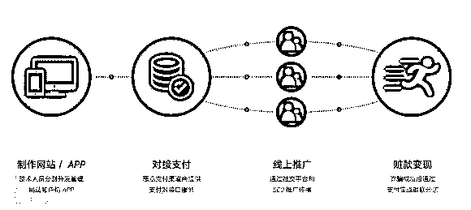
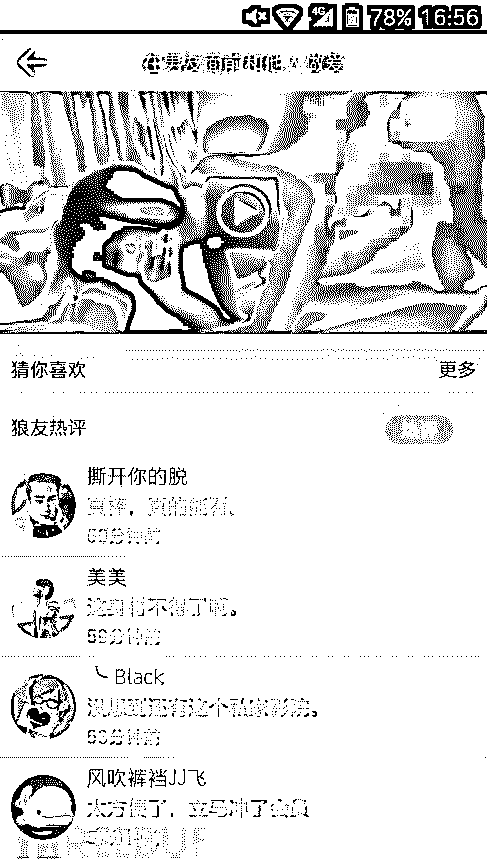
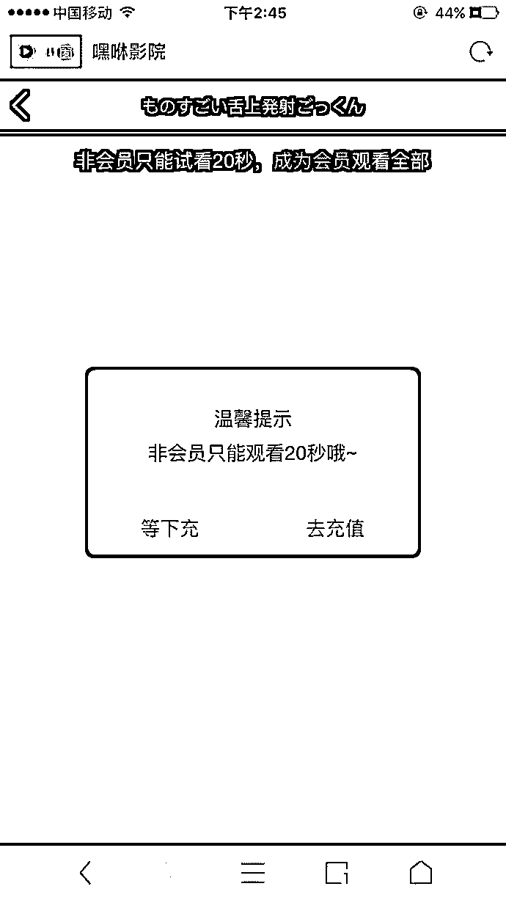
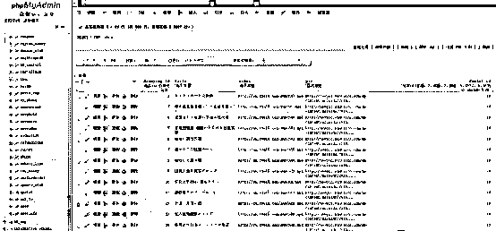
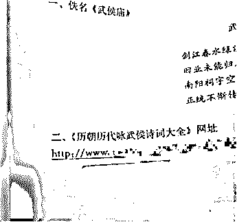
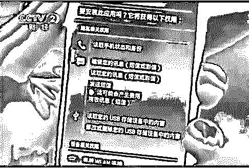
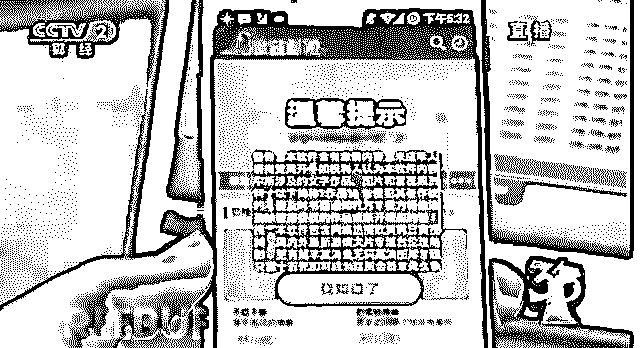

# 色情诱导诈骗：20 秒小电影撑起 6 亿黑产

> 原文：[`mp.weixin.qq.com/s?__biz=MzIyMDYwMTk0Mw==&mid=2247486493&idx=1&sn=ae1b8e4815da082aecf51ee176690686&chksm=97c8c725a0bf4e334c7eff33d5c5db86de9a66e440c92ade9b0baf40849e18b81e66922c9c77&scene=27#wechat_redirect`](http://mp.weixin.qq.com/s?__biz=MzIyMDYwMTk0Mw==&mid=2247486493&idx=1&sn=ae1b8e4815da082aecf51ee176690686&chksm=97c8c725a0bf4e334c7eff33d5c5db86de9a66e440c92ade9b0baf40849e18b81e66922c9c77&scene=27#wechat_redirect)

近日，“高中语文教材网页链接指向涉黄网站”的新闻引发了社会的广泛关注，“涉黄教材”案并非唯一的色情诱导诈骗案例，2017 年 4-6 月期间，腾讯守护者计划安全团队先后协助武汉、大连等地警方，打掉了 3 个大型公司化运营色情诱导诈骗团伙及其黑色产业链，共计抓获犯罪嫌疑人 120 余人，冻结涉案资金超过 6000 万元，初步查明涉案金额达 6 亿元。目前，犯罪嫌疑人因涉嫌诈骗、非法侵入和破坏计算机信息系统罪被刑事拘留。

在协助警方破案过程中，腾讯守护者计划安全团队也对“色情诱导诈骗”背后的这条完整黑色产业链做了深入分析。

（图为色情诱导诈骗黑色产业链）

## 电影试看，层层诱导付费

通常情况下，色情诱导诈骗的 APP 或网站，主界面会有各种勾人心弦的画面和精彩点评，诱导用户点击观看。但是，显示为 2 小时时长的影片，往往只能看 20 秒。接下来，就是提示付费充值的对话框。根据提示的步骤充值成功后，用户会发现，也仅仅能再多看 20 秒的画面。要继续观看，还得充值。这似乎是个无底洞。但即使用户花费了高额的费用，这类 APP 或者网站也不会提供完整的不可描述的内容。

（图为色情网站界面）

此时，绝大多数人会选择暗自咒骂，默默接受被骗的事实。即使找到客服联系方式，想获得退款也是极其困难的。色情诱导诈骗团伙就是在这样的情况下，悄悄骗走了许多用户的钱。此前有媒体报道称，“色情诱导诈骗”是一种年收入过亿的“生意”，一点也不夸张。因为，其背后暗藏一个规模化、组织化、产业链完善的流水性作业程序。甚至，有些黑产团伙会披着科技公司的外壳，表面上做着正经业务，私下里干着见不得人的勾当。

“色情诱导诈骗”黑色产业链的每一个环节，都是经过精心设计、有规模、系统化运作的。

## 内容剪辑，游走于灰色地带

APP 或者视频网站的技术开发门槛很低，有经验的程序员可以用几天时间完成开发。而且，这类开发本身是一个开放的市场，可以公开购买。在某电商平台以“诱导 源码”为关键字，只需要数十元即可买到源代码。

黑产团伙的运营者通常具备一定的“法律意识”。为了保证网站的生存周期，或者 APP 在上架应用市场时能通过审核，同时规避“淫秽物品”的法律界定，其展示出来的内容都是经过精心剪辑的边角料。比如武汉雷胜科技公司，设有研发部、市场部、编辑部、财务部、客服部等，其中编辑部就主要负责色情诱导视频 APP、网站内容的编辑和添加，还雇佣了律师对视频和图片内容进行审核，确保内容能够通过审核、上架。警方在扣押武汉雷胜科技公司的服务器时，查处其中存放的百部电影短片、数万张图片，但都很难直接鉴定为“淫秽物品”。

（图为武汉雷胜科技公司服务器存储内容）

## 企业“三证”黑市，服务收款环节

色情诱导诈骗的支付环节也有成熟的运作流程与渠道。由于支付平台的开放性，只需拥有一套完整的三证及对应的银行卡账户，就能从支付平台或渠道商处申请获得支付接口。通过认证后，商户可以通过私人账户收款。

有人会问，完整的公司三证信息及银行卡账户很难申请吧？答案是否定的。

正因为游犯罪暴利的诱惑，成套的公司“壳”资料早已在黑市上流转。有人专门收集企业信息和虚假注册，企业“三证”信息以层层代理的模式在黑市上面贩卖，用于注册电商企业店、申请支付接口等。

在腾讯守护者计划安全团队协助警方破获的色情诈骗案件中，便打掉两个专门虚假注册公司、贩卖三证资料的团伙。该团伙短短 3 个月内贩卖了近千份资料，提供给诈骗团伙申请支付接口所用，一套三证的售卖价格约为 1000-1500 元，也就是说，该团伙非法牟利数百万元。

即使第三方支付平台设立了各种风控识别模型，对色情诈骗的支付场景做了种种限制。但色情诈骗团伙仍然不断变换作案模式，如准备多个支付接口，或开发短时间切换接口的平台逃避风控打击。

## 捆绑与劫持，推广花样百出

有了平台、内容和收款渠道，黑产团伙接下来需要考虑的就是推广环节。参与这一环节的角色众多，包括广告主、广告联盟、网站主（流量商）等。

广告主——负责寻找推广资源，主要根据客户的需求，拿钱办事。

网站主（流量商）——拥有流量的人，通常是批量网站的拥有者，能修改页面投放广告主的广告；也可能是非法获取的 Webshell 或者流量劫持。

广告联盟——集合了各种网络媒体资源组成的联盟，通过联盟平台帮助广告主实现广告投放，并进行广告投放数据监测统计。

色情诱导诈骗的广告投放和推广引流手法，更是花样百出。

大连警方打掉的北京某科技有限公司，其技术部制作色情付费 APP，定制软件推广网址，研发运维“海*网”黑产平台等工作；其客服部负责发布广告招募站长推广色情付费软件。站长接单后，通过收量或者黑客技术非法入侵网站，加挂非法推广链接进行推广，随后从“海*网”黑产平台获利。截至案发时，该公司制作色情视频 APP 链接 3400 余个，发展挂链站长 3400 余个。

武汉警方打掉的雷胜科技有限公司，则采用编写木马程序，通过客户端、视频网站广告挂马，利用浏览器漏洞在 PC 端植入木马程序，静默安装软件推广获利。同时，该公司还涉嫌通过入侵教育类网站，修改网站内容链接用以推广色情诈骗类网站和 APP，也即著名的“涉黄教材”案。

（图为教材中被篡改为色情网址的链接）

此外，色情诱导诈骗还会通过色情网站、直播聊天室、交友平台、APP 捆绑、路由器及运营商劫持等多种途径进行推广。

## 不仅扣费，还会窃取个人信息

色情诱导诈骗除了通过诱导付费对用户的财产造成损失外，还会通过暗装扣费、恶意推广、捆绑木马等方式侵害用户财产，甚至非法窃取公民个人信息。

1）通常，色情 APP 在安装过程中会获取各种权限，其中就包含发送短信权限。一旦程序获取此权限后，就可以向特定 SP 号码发送短信进行扣费。

（图为暗装扣费）

2）色情 APP 也可能捆绑恶意推广业务，一旦安装，会不断推送并安装其他大量恶意程序，严重影响手机的性能，甚至非法获取用户个人信息，造成其他损失。央视 3.15 晚会曾曝光过恶意扣费和推广手法。

（图为恶意推广）

3）色情 APP 同时也是最大的手机病毒源。根据腾讯手机管家联合腾讯反诈骗实验室发布《2017 年 Q1 安卓 Root 类恶意病毒发展趋势研究报告》显示，Root 类病毒藏身大尺度色情应用、仿冒切水果、疯狂动物园等热门游戏。其中色情应用约占 Root 类病毒的 98%。待用户下载安装后，恶意程序自动提权获得 Root 权限，随后通常会进行恶意扣费、恶意推广和盗取数据等行为，部分具有极强的破坏性，会篡改用户设备信息和破坏系统，顽固木马通常具有极强的防卸载能力，一般的手机安全软件都无法彻底清除。

## 难逃法网，每一环节均有法律规制

不得不说，色情诱导诈骗黑产团伙的法律知识真不是浪得虚名，制作团队剪辑出来的诱导性视频总能游走在法律关于“淫秽物品”的界定边缘之上而不过线，以此规避“制作、传播淫秽物品罪”的追究。殊不知，整个黑产链条的每一个环节，无一不在法律的规制之中：

色诱诈骗团伙通过虚构商户身份获取支付接口，利用非法渠道进行推广，同时虚假宣传以牟取巨额非法利益的行为，构成刑法第 264 条的诈骗罪，诈骗金额超过 50 万元即可达到“数额特别巨大”标准，可能判处十年以上有期徒刑甚至无期徒刑。此外，全黑产链条各个环节的参与者，除了可能构成诈骗的共犯之外，还可能分别构成以下犯罪：

> 1、在“APP 开发与内容剪辑”环节中，为色诱诈骗提供网页制作等技术支持的不法分子可能构成《刑法》第 287 条之一“非法利用信息网络罪”。
> 
> 2、在“收款渠道”环节中，提供虚假企业注册信息的不法分子可能构成《刑法》第 280 条第 2 款“伪造公司、企业、事业单位、人民团体印章罪”。
> 
> 3、在“非法推广”环节中，不法分子为了巨额的不法利益可谓无所不用其极：其中专门为恶意推广编写木马程序的不法分子可能构成《刑法》第 285 条第 3 款“提供侵入、非法控制计算机信息系统的程序、工具罪”；通过恶意推广安装色情 APP 获取短信权限进行恶意扣费的，可能构成盗窃罪；使用网页挂马等非法手段进行推广的流量主可能构成《刑法》第 285 条第 2 款的“非法获取计算机信息系统数据、非法控制计算机信息系统罪”；进行流量劫持的网站主可能构成《刑法》第 286 条“破坏计算机信息系统罪”；通过联盟平台进行广告投放的广告联盟可能会构成《刑法》第 287 条之二“帮助信息网络活动罪”。

另外，色情 APP 在捆绑恶意软件推广业务时，还可能同时构成侵犯公民个人信息罪。总之，法律对于这群欺骗宅男感情和钱财等权益的黑产团伙，自然是不能放过的。

“阅读原文”加入社群