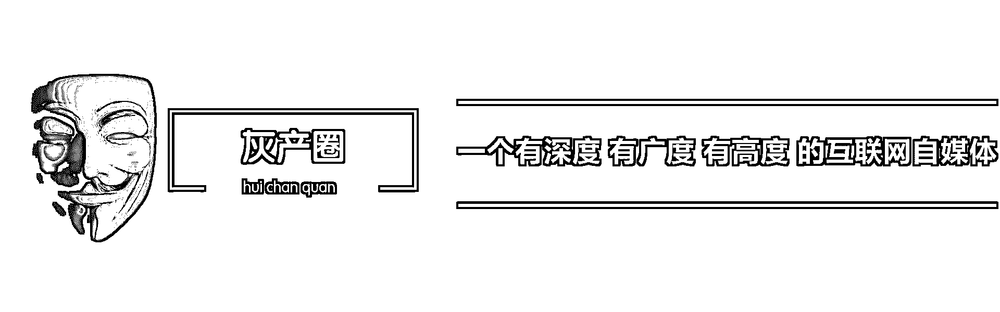
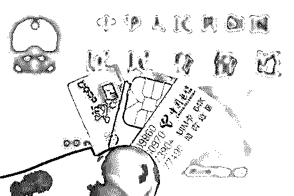
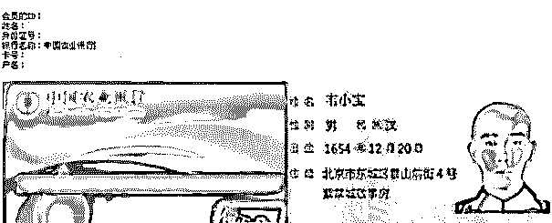
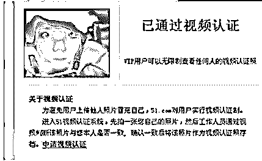
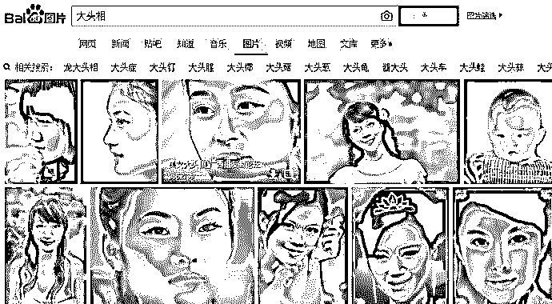
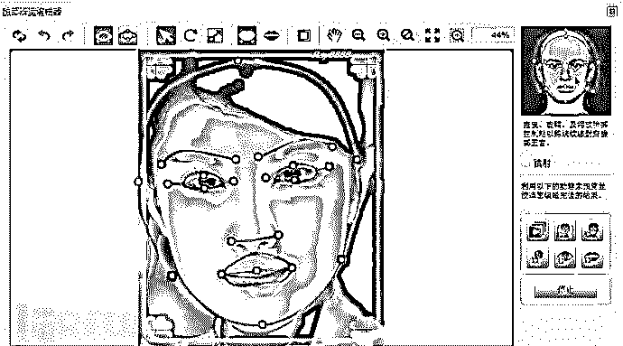
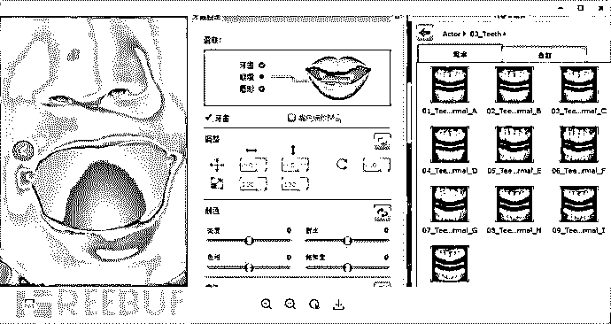
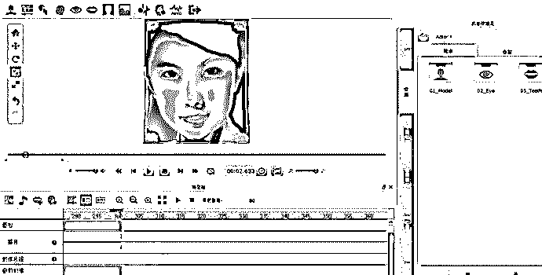

# 灰产哥|身份证产业链：一张身份证如何攻破人脸识别技术

> 原文：[`mp.weixin.qq.com/s?__biz=MzIyMDYwMTk0Mw==&mid=2247486488&idx=1&sn=f00f77937caacdc176bc2402a0e42cfe&chksm=97c8c720a0bf4e362746e1387d8b1d59df00612f2ca9ddc9c48ae0125f83fd9200a556308154&scene=27#wechat_redirect`](http://mp.weixin.qq.com/s?__biz=MzIyMDYwMTk0Mw==&mid=2247486488&idx=1&sn=f00f77937caacdc176bc2402a0e42cfe&chksm=97c8c720a0bf4e362746e1387d8b1d59df00612f2ca9ddc9c48ae0125f83fd9200a556308154&scene=27#wechat_redirect)

守护者计划：2016 年腾讯发挥自身大数据能力和多年对抗网络黑产经验，联合产业链、运营商、银行、警方等多方力量，共同推出“守护者计划”平台，打击危害网络安全的犯罪行为。

以下链接为守护者计划年度 10 大案例介绍

[`v.qq.com/iframe/preview.html?vid=b03556rsanh&width=500&height=375&auto=0`](https://v.qq.com/iframe/preview.html?vid=b03556rsanh&width=500&height=375&auto=0)

央视“315”晚会曝光了人脸识别领域的安全风险之后，一时间引起广泛关注。其实，绕过人脸识别策略的黑产自去年就开始出现。

2016 年 12 月，腾讯守护者计划安全团队协助湖北公安捣毁一专门贩卖公民身份证、动态认证视频（抬头、低头、眨眨眼睛、读一段文字）的团伙，共计抓获犯罪嫌疑人 14 人，扣押赃款 300 余万元，查获的身份证相片及认证用视频高达 1800G，粗略计算超过 50000 人的身份信息被完全曝光。这些信息不仅包括身份证正反面、还有手持自拍、侧拍、拿报纸拍，更为神奇还有抬头、点头、左转、右转、读文字的录像。最令人担忧的是，上述环节黑产人员都可以通过自动化生成，成本颇低。

下面，来看看这样的网络黑产究竟是怎样作案的。

## 一、那些行业需要实名认证

《人民邮电报》官方微信发文称，工信部近日下发通知，要求各基础电信企业确保在 2016 年 12 月 31 日前本企业全部电话用户实名率达到 95%以上，2017 年 6 月 30 日前全部电话用户实现实名登记。此为“史上最严电话实名制”。寄快递要实名制登记，支付宝、微信要实名制登记，网络主播要实名制登记；更别提网络贷款、远程开户、坐火车飞机，这一系列的行业都需要实名制。身份证和远程视频（俗称刷脸）是这一些实名的核心之一，有人要实名就一定有人不想实名，黑产就这么诞生服务于庞大的市场。

一张包括正反面信息的身份证相片，只需 50-100 块钱。一张人证一致的手持身份证相片，也只需要 100-200 元。如果想注册企业账号，你可以再花上 800-1000 元，就能给你出一整套的企业五证，拿去申请注册企业账号，或是申请个网店去搞点偷鸡摸狗的勾当，效果都是有杠杠的。

以下是调研市场后的行情：

（一）注册网店

一个实名认证成功的淘宝网店的黑市价格，个人注册通过一审的店铺可以卖 300 元，而个人注册通过二审的店铺可以卖 800 元，企业认证店铺更贵，可以卖到 1300 元。这些被专门注册用来贩卖的淘宝网店。还有支付宝账号，如果想升级到 V2，也必须通过动态视频来进行身份核查认证。但这一切，都能够被黑产团伙制作出的动态视频轻松搞定。

（二）申请网贷账号

许多网贷平台为追求效率和用户体验，往往只需要在网上提交资料进行身份信息审核，能够在一天甚至更短的时间内完成审核及放贷，平台的很多风控措施在这些黑产团伙面前都能够绕过。而通过冒用他人身份在网贷平台恶意骗贷一直是该行业的暗疮。

（三）第三方支付平台身份认证

用虚假身份来进行第三方平台的账号并进行实名认证，这些账号，无论是自用，还是在黑市上出售，其使用的目的都不会太正经。

（四）账号进行解冻或申诉

黑产人员所用的网店或第三方支付平台账号，多数并非本人实名申请的，因此一旦命中平台的风控策略被冻结，就必须按要求提供注册人本人的身份资料去解封。而这时，通过黑产人员制作一套注册人的身份资料是最安全和快捷的办法。

## 二、量产的身份证

作为企业风控人员，如果觉得跑腿找大爷大妈买卖身份证、住址、年龄、营业执照、转账凭证、银行流水等的成本挺高，黑产规模不大，那就是鸵鸟心态了。

在 PS 面前，不仅可以随意制作各类用于账号身份审核的身份证相片、营业执照、银行流水单等身份证明资料，还能将一张静态的相片，制作成动态视频，从而通过各大网络支付平台的动态视频验证程序。

以湖北警方破获的案件为例，只需提供一个身份证号码，就能 PS 出一整套仿真度极高的身份证相片、手持身份证相片及指定手持各种报纸的相片。全套资料专用于各大平台的实名注册认证。在 PS 面前，这些身份证或手持身份证的可信度基本为零，不仅可以随意变换相片中的姓名、住址、身份证号码等信息。就算是把整个身份证换个脸也是很轻松的事情。同一张脸，不同身份，或是同一个身份，不同的脸。你需要什么都能给你 P 出来。

黑产的威力远不止如此，不光静态的身份证认证已经被攻破，连动态的在线人像视频认证，也已经被轻松搞定。

## 三、动态视频认证——会说话的照片

一些 B2C 平台、第三方支付平台或各类网贷平台，为了提高申请账号真实性，除了需要在线提交手持身份证复印件进行身份验证之外等，在用户在进行一些高危操作或提升更高权限前，往往还需要进行真人视频验证。

这种真人视频验证有两种：

一种是有平台或企业工作人员在线进行一对一的视频验证。但这种视频认证占用人力资源较高，效率低，所以通常只是银行或证券行业使用。各类网络平台，因视频验证的量级大。

另一种是采用机器算法自动识别的非人工验证方式，来完成动态视频的验证过程。

目前比较常见的机器审核的视频验证方式通常有三种：

（一）与开户开启在线视频之后，随机要求用户按指令作出四个指定动作，如点头、摇头、眨眼、张嘴；

（二）在开启在线视频之后中，系统随机生成一个四位数字，让认证用户口述念出；

（三）这种验证方式更加复杂，通常用于网贷类平台，会要求用户手持身份证件，指念出自己的姓名、身份证号或贷款合同条款等字句。但这些视频验证方式，只要不是人工一对一审核，就都有可能被软件制作出来的虚假认证视频给绕过。 

## 四、制作动态视频认证产业

真相远比想象中要简单得多，找到一张与账号注册者身份一致的大头照或是手持身份证的高清照，再加一个 Crazytalk 软件足矣。

用上面的工具，绕过动态视频验证，只需三步：

（一）找到一个账号注册人的大头照。这个并不难，在网上找个信息查询商，提供一个身份证号码，再花上几十块钱，就能很快查到与这个身份证号相关的户籍资料；

（二）用 Crazytalk 软件将拿到的大头照或身份证相片，圈定人脸的轮廓、眼睛、鼻子、嘴角、牙齿等等参数；导入到软件中便可生成初步的信息，但这些都动态无声音、无背景音的；

（三）依据不同平台验证的方式不一，制作出的视频要求也不一样。有的是报一串随时的数字，有的是念一长句话，还有的是点头、摇头、眨眼、张嘴等表情；

（四）最后一步就是验证了，用手机打开验证页面接通在线视频，把视频对着电脑屏幕，你验证要我做嘛动作，我就在电脑屏幕上播放嘛动作，简单吗？真的就这么简单。

也许你会问，视频认证的要求播报的数字是随机的，那提前做好的动态视频认证怎么会知道？确实这是个关键点，无孔不入的黑产人员早就已经发现了这里的 BUG 了。

因为目前多数平台的在线视频验证体系中，并没有设置时效上的要求。也就是说，我可以先打开在线视频认证界面，获取到系统要求我念出的随机数字，只要验证的页面不关，这串数字就不会变。然后黑产人员就可以拿着这串数字去从容的找人做动态视频了。一套动态视频的制作时间，也就一两个小时。至于点头、摇头、眨眼、张嘴等动作，则只要提前把一个相片的四个动作全部做成视频就好了，你需要我做哪一个动作，我就播放哪一个给你看，就这么简单。这样一整套的动态认证视频，制作周期只要 1-2 个小时，而收费则高达 500 到 1000 元。

## 五、买 PS 的身份证是否涉及违法

购买了身份证、帮别人 PS 或者制作了一个视频看似只是做了一些微小的工作，但却已经涉嫌伪造、变造身份证罪。

本罪是行为犯，只要行为人实施了伪造、变造居民身份证的行为，原则上就构成犯罪，应当立案追究刑事责任。刑法第二百八十条第三款伪造、变造居民身份证的，处三年以下有期徒刑、拘役、管制或者剥夺政治权利;情节严重的，处三年以上七年以下有期徒刑。

*原创作者：守护者观察

点击“阅读原文”免费听课