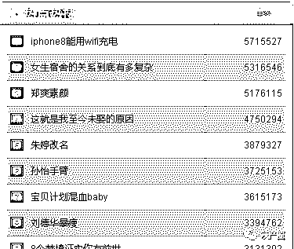

# 事件营销获百万流量+实战方案和案例

> 原文：[`mp.weixin.qq.com/s?__biz=MzIyMDYwMTk0Mw==&mid=2247486391&idx=1&sn=6eb0b857bae004d644a778a460749917&chksm=97c8c08fa0bf4999f2a432527dcb988f50f226ea137134ace9b03eb886018e70d982c3dbf0cd&scene=27#wechat_redirect`](http://mp.weixin.qq.com/s?__biz=MzIyMDYwMTk0Mw==&mid=2247486391&idx=1&sn=6eb0b857bae004d644a778a460749917&chksm=97c8c08fa0bf4999f2a432527dcb988f50f226ea137134ace9b03eb886018e70d982c3dbf0cd&scene=27#wechat_redirect)

 <xbtmpl class="wxb-editor-template before" style="max-width: 100%; display: block; width: 591px; color: rgb(62, 62, 62); font-size: 16px; line-height: 25.6px; white-space: normal; box-sizing: border-box !important; word-wrap: break-word !important;"></xbtmpl> 

  导读：热点事件是目前最懒的一种推广方式，但也需要执行力，光看文章不去操作基本没什么用。 
     

怎么样引流是最快的，绝对是抓住热点事件的时效性引流是最快的，任何一个事件都具有 7 天左右的热点时期，那么我们抓住这 7 天左右的时间，做的差最少可以引流百万流量，做的好千万流量绝对不是很大的问题。 

如何找到热点事件

      通常的情况下热点事件中娱乐热点是互动性相对比较强的，因此关注量也比较大，所以我建议大家在做热点事件营销的时候最好选择娱乐版块的热点事件，那么娱乐版块的热点事件如何去找呢。 

那么百度风云榜是通过大数据收集新闻源的热点事件然后公开数据给大家去挖掘的工具，这个工具可以查看到本周的热点事件和每天的热点时间，从上图我们可以看得出本周热点事件有哪些，热点大小等。 

那么第二个是今日头条的娱乐版块，在今日头条上的热点事件是最新的，因此如果你想抓住时效性，那么最好是今日头条上才可以看到最新的，可能新到 1 分钟内。 

那么第三个是从 360 是实时热搜中可以看到热点内容，360 的热搜榜和百度的有些差距，但大多数都差不多，原理是一样的。 

那么微博热搜榜上，热点事件中相对而言互动性比较强，因为大家都是用微博在说这件事情，所以相对而言发布出去以后，会获得很好的评价与转发之类。

如何利用热点事件引百万流量 
      那么热点事件找到了，我们如何通过热点事件来引流，和通过热点事件来获利呢，今天我把我们做的实战案例给大家分享。 

比如说昨天出的一个热点事件蔡依林穿泳衣，我们今天可以看到，在淘宝上有很多卖家在销售蔡依林同款的泳衣了，当然针对这件事件的泳衣销量还非常好，虽然这款泳衣不怎么样，但依然要卖 160 元，并且销量这么好。 

那么在一个我们在今日头条上可以看到，今日头条上的娱乐新闻信息，几乎每一条都有很高的阅读量，而发布的时间仅几分钟之内，当然今日头条的发布时时间有做手动调整。那么我们在引流推广的时候，可以适当用今日头条去做引流和推广，效果会非常理想。 

那么在一个是使用我们的自动推广系统，利用热点事件，分享之后才可以查看到主体信息，然后通过微博排名获得大量的流量。 
      比如说曾经我用陆家嘴视频做的一个测试，流量效果非常好，很多人首先打开网站都想要看到陆家嘴的视频，但网站程序限制，必须要分享到微博才可以看到，那么用户一旦分享，那么百度上就有相关的排名。 

      那么当时上了这个词的排名，一天可以获得百万流量，包括长尾词，但这种热点事件的词都做不长时间，可能就是那么 7 天左右就没有了。

