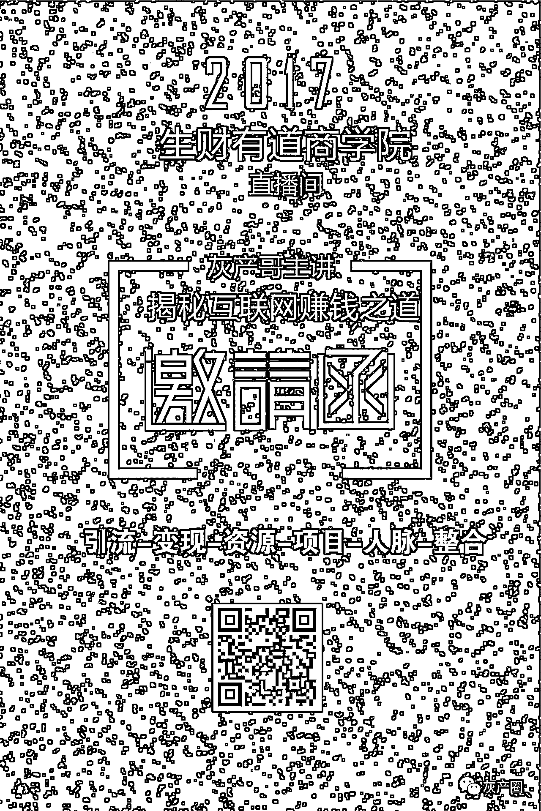

# 别 TM 问了！我有 freestyle！

> 原文：[`mp.weixin.qq.com/s?__biz=MzIyMDYwMTk0Mw==&mid=2247486381&idx=1&sn=65c343f81c159b42f5b66b1ed7a1b862&chksm=97c8c095a0bf49838fda8baff0856fa5947f53a67ef36e62c723e20b0438cb5941cf3ba20a6d&scene=27#wechat_redirect`](http://mp.weixin.qq.com/s?__biz=MzIyMDYwMTk0Mw==&mid=2247486381&idx=1&sn=65c343f81c159b42f5b66b1ed7a1b862&chksm=97c8c095a0bf49838fda8baff0856fa5947f53a67ef36e62c723e20b0438cb5941cf3ba20a6d&scene=27#wechat_redirect)

国内自制的 Hip-hop 选秀比赛《中国有嘻哈》近日首播。第一期播出后，选手们没有一个上热搜，反而是作为制作人的吴亦凡以及他的名言“有 freestyle 吗?”蹭蹭蹭冲上了头条。

freestyle 也成了刷爆朋友圈的一个流行词，看看最新出炉的表情包。

什么是 freestyle？其实 freestyle 有很多含义，一般指即兴的，随性的随意的发挥

很多观众包括我看完一期节目下来，一个选手都没记住，就记住了 freestyle。

当然就像吴亦凡说的，之所以如此强调，是因为他觉得 freestyle 很重要，能够看出选手们的词汇量。

但不管怎么说，才第一期节目，“freestyle”的创始人吴亦凡，火了。

所以，今天你有 freestyle 吗？

为了这个展现出我的 freestyle 

从来只是听课但是不讲课的我

开讲啦！！

扫面下方二维码 ，或者点击阅读原文 ，与你分享我的 freestyle   

