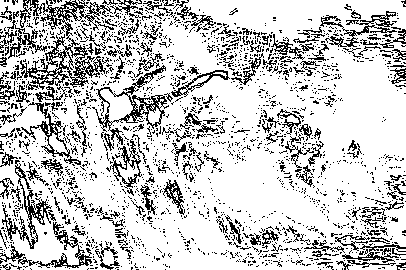
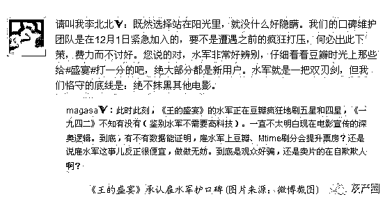
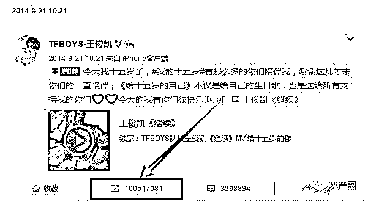

# 灰产圈|揭秘肆虐的水军经济和背后的灰色产业链

> 原文：[`mp.weixin.qq.com/s?__biz=MzIyMDYwMTk0Mw==&mid=2247486343&idx=1&sn=d2a6b5b224a600c0ae7796c0179c2827&chksm=97c8c0bfa0bf49a90282146fb46982adfa2db7364867f918042c523a793cac7470cce434ff72&scene=27#wechat_redirect`](http://mp.weixin.qq.com/s?__biz=MzIyMDYwMTk0Mw==&mid=2247486343&idx=1&sn=d2a6b5b224a600c0ae7796c0179c2827&chksm=97c8c0bfa0bf49a90282146fb46982adfa2db7364867f918042c523a793cac7470cce434ff72&scene=27#wechat_redirect)

十万水军，铁骑十万火急，公司、明星、新上市的影片等等谁都无法逃脱魔掌。一位水军公司负责人如是说。

前段时刻热播的电视剧《公民的名义》里边有一自个物“郑成功 or 郑乾”，小名毛毛虫，即是一家水军公司的负责人。

网络上曾经流传着一篇水军隐退江湖的诀别书，作者在文末最后留下一个疑问：水军在网络上发表的言辞，不是真实志愿，而是被利益绑架。

水军的崛起以及兴衰起伏，是与我国的互联网相互交织的，他们是社交年代的镜子，折射的不仅是屏幕上的瞬息万变，还有公众意识与舆论的替    变迁。

政治大事件的言辞风向、上市公司的大造气势、贴吧里边的某一个帖子张狂灌水、新影片上市的虚拟好评等等，无处不在。

从论坛年代到微博年代再到微信年代，水军一向处于言辞的风口浪尖，他们自称是舆论的“弄潮儿”。

论坛年代：兴起

2005 年，互联网年代爆发式开展，广告人士灵敏的掌握了时代脉搏，网络公关公司应运而生，大举组建水军，水军登上历史舞台，而且迅速变成网络世界中的重要角色。

提起论坛年代的水军，避不开的一个关键词即是“疯客团队”。

2009 年建立，因本身的强大资源整合才干以及运营能力，挤掉大多数水军团队而变成江湖霸主。

 

当时的疯客团队大概有 50 个 QQ 群，每个群 500 人， 这两万多人在其时是水军的中心力气，每自个手里最少养了几百个论坛账号，资深一点的成员甚至是几千个几万个账号。

这批水军开始在网络世界所向无敌。

术业有专攻，在这些水军群里边，有专业发帖的，有写谈论的，有回帖的，各司其职。

小 A 是一位宝妈，是最早参加水军大军中的一员，最开开始做的都是一些基本任务，第一天的任务即是注册各种论坛账号，第一天只挣了 7 块钱，第二天 20 块，第三天 35 块—前期的主要任务即是各项基本的工作，渐渐养天涯、baidu、猫扑、西祠胡同、凯迪、十九楼等大论坛的账号。

这一个月，她天天早上 8 点起床，清晨两点才睡，累死累活挣了 1000 块。渐渐上手以后，从第三个月开端，天天正午 12 点起床，使用空闲时刻完结一些任务，黑夜等着查账即可，每个月能安稳在三千到五千。

这大概是当时水军的平均收入了。

水军的组织是松懈办理，成员也来自全国各地，专职的十分少，大多数兼职。

开展到后期，跟着这块市场蛋糕的增大，人员的增多，渐渐的各种软件代替一些简单繁琐的使命，曾经一个通宵也许就发几百个帖子，可是如果是团队+软件操作，一晚上能够完结五千至一万的发帖、顶帖任务。

论坛年代是言辞粗野成长的年代，所以其时的水军也处于粗野成长的的阶段，没有任何的底线而已，只要给到足够多的钱，什么样的活都接，许多话题敏感的帖子都是超级暴力，也使得水军有只够多的肥沃土壤成长。

潘多拉的魔盒刚刚在网络上翻开，失控慌张、没有规矩、没有底线，一不小心就会构成一场网络暴力的风暴。

微博年代：鼎盛期间

在微博火爆时期，水军构成了完美的产业链条，不断的有新人参加，而一些曾经的老水军也不在满意每月单纯的做做兼职，挣点兼职费，而是构成不断增加的团队、公司，职业分工很明确、利润按比例分成。

微博的崛起，刚好是互联网开展的迅速时期，互联网推广被大家所追捧，一时间也诞生了一大批草根网络大 V。

微博也开端变成各家公司在推广宣传方面所抢夺的战场，腾讯大战 360、加多宝对掐王老吉、魅族与小米这对冤家等等，这些大公司之间的战役中有大批的水军从中作战，今日微博上的舆论对腾讯不利，立马找网络公关公司出马，明天的舆论方向就倾向腾讯，如此反复让水军公司赚的盘满钵满。

还有各种影片上市之初，一些影视公司都是会找大批的水军公司来造势，2012 年的贺岁档期，《一九四二》和》《王的盛宴》两部贺岁大片同期上映，一起也上映了一出水军大战，两边相互诽谤。

《王的盛宴》的导演陆川也在微博上公开回应被迫雇佣水军的现实。这是有史以来首次，躲在黑私自的水军毫不隐讳的呈如今阳光之下。

 

开始的微博账号注册只需要邮箱号码即可，而在网上采购批量注册的邮箱报价是 100 块 1 万个，最常见的即是 163、搜狐和 yahoo 邮箱。

在软件批量注册微博号的情况下，一个微博号售价仅仅 2 毛钱，200 块能刷 1 万粉丝。

在后期微博本身需要手机号才能注册微博号，报价从 2 毛涨到了两三块，达人号 5 块，大 V 号 15 块的报价。

当频频的切换登入地以及频频的操作导致账号被封，出现了需求手机号解绑，这个时分水军就会和一些卡商协作，一般小卡商手里都会有几千张手机卡，大卡商手上则会有上万张手机卡。

移动互联网的开展则是将水军面向了高峰。

2013 年互联网公司 BAT 率先发力，后边跟跟着大批的公司，雇佣水军在移动互联网中各个渠道相爱相杀、推行推行。

不过凡事兴盛而衰。

跟着网络有关法令的完善，互联网实名制的到来，言辞的开放年代结束，水军野蛮成长的年代一去不复返。

2014 年前后，在水军中的核心办理人员以及各大水军头子都被请“喝茶”过，所以水军活动的范畴被大大缩减。

如今的水军主要是充满着两个范畴，一个文娱炒作，一个是企业宣传。

文娱炒作：

文娱炒作方面主要是如今文娱圈以及网红的打造。

各路明星的炒作都少不了水军的影子，微博抢手排行榜的方位都是明码标价，一方面能够经过微博的官方途径采购，另一方面即是和网络公关公司协作。

许多明星的都有固定合作的公关公司，微博以及各路自媒体渠道的发文都是由水军公司把控。之前出现过 TFboy 成员发一条微博居然出现了四千多万次转发，显着是水军太多。

网红则是指向各种草根大 V 以及抢手直播渠道中的主播，草根大 V 主要会集在微博的大 V 以及微信大众号所代表的各自媒体渠道中的大 V 号，一切的阅览量、转发、点赞、评论、都能刷。

直播房间观看人数以及弹幕都是由水军把控，比方斗鱼直播的 55 开弹幕经常是水军一波流带走、又比方 LOL 战队里边的 gogoing 首次在战旗直播观看人数居然达到了惊人的 60 亿。

这都是水军的杰作。

企业宣传：

这方面名声最大的就要数华为了，声称百万水军，余承东任水军总司令。

其实在企业宣传这方面大多会集在国产手机厂商身上，每当新品手机发布的时分就会有大批的水军造势，华为的水军即是延伸到互联网的每个角落，不管是自媒体渠道的正常文章下面的谈论，还是数码大 V 下的批评，新品手机发布，带有相关关键词的文章、微博都是热度很高。

之前华为水军出现一件很搞笑的工作，即是在某一个渠道的一篇文娱性文章下面一致谈论“支持 华为，我国的骄傲 ”相似的句子，一共发布了上千条的谈论。水军走错片场了，差评。

另外一个宣传点主要是对于影片上市的影评，比较突出的渠道也许是豆瓣了，每次新的影片上映发布  都会请一大波水军将豆瓣评分刷上去，或是电影票，形成影片火爆的假象。

所以，即便如今水军由于互联网发展所展现出的发展势头没有之前那么强盛，可是如今存在的这条灰色工业链仍是不能忽视的，许多不起眼的水军背后都是一个活生生的人。

就像文章开头说的：水军在网络上发表的言论不是自己的真是意愿，而是被利益绑架..

点击“阅读原文”加入灰产圈社群