# 灰产哥|起底网赌产业链黑幕——红包群，赛车群，一元夺宝，时时彩，百家乐

> 原文：[`mp.weixin.qq.com/s?__biz=MzIyMDYwMTk0Mw==&mid=2247485861&idx=1&sn=536ce7db9e1c320130e418839e1b168c&chksm=97c8c29da0bf4b8b2a888c8ef63a4599483392cb2532ff8fc2da113561761ce6205a34056f11&scene=27#wechat_redirect`](http://mp.weixin.qq.com/s?__biz=MzIyMDYwMTk0Mw==&mid=2247485861&idx=1&sn=536ce7db9e1c320130e418839e1b168c&chksm=97c8c29da0bf4b8b2a888c8ef63a4599483392cb2532ff8fc2da113561761ce6205a34056f11&scene=27#wechat_redirect)

[`v.qq.com/iframe/preview.html?vid=m0016t4j9bg&width=500&height=375&auto=0`](https://v.qq.com/iframe/preview.html?vid=m0016t4j9bg&width=500&height=375&auto=0)

本文从内地最大网络赌博案告破**50 多万会员参与赌博** 月投注额超 4000 亿 新闻说起  

网络赌博，自古以来就属暴利行业，到现在从线下麻将馆德州扑克到线上网赌，小到棋牌游戏红包群，大到视讯平台，博彩游戏。这个行业充斥着大量的骗局和套路，而且参与人数众多。

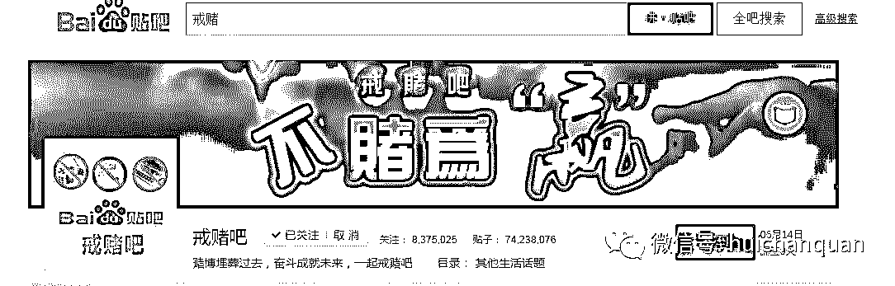

从戒赌吧八百万关注人数，可见网赌套路了多少老哥，又有多少老哥因为网赌倾家荡产，甚至演变成一种戒赌文化 ，里面充斥着“赌狗”“狗代理”“修车”“老哥稳”“团饭”“洗白”“过三关”等流行词汇，有多少老哥又能真正懂得：“不赌为赢”的深刻含义 （以上作为戒赌吧资深潜水者独白）

下面灰产哥将解密网络赌博的几种形式，希望看到的人能真正远离赌博。

**一。时时彩，娱乐城，真人视讯，百家乐等“澳门 XX”网站**

有个曾经是××国际娱乐城的操盘手，跟他聊过，他说赌狗们都是在和他操作的机器人赌钱。这，你还有胜算吗？

灰哥简单说说网站运营模式，管中窥豹见一斑吧

**(1) 大老板**

在整个网赌站体系里，他们拿的比例最大。大概整个网站收入的 90%都被他们拿走了。因为是网赌站的出资人，但是呢并不像我们想的是那种黑社会大哥之类，他们出门你也看不到前呼后拥的保镖。他们是整个网赌站里隐藏最深的家伙。很有可能把整个网赌站都端掉了，也没抓到大老板。

**(2)网站制作团队**

对，是一个团队，专业提供网赌网站一条龙服务。网络上的很多赌网除了页面颜色风格和图片不同，别的都大差不差，千篇一律。包含内容一样，网站界面一样，功能一样，取款和打钱方式都一样。这些就是制作团队做的统一的模板。大老板联系这些制作团队，买或者租用模板，团队负责维护网站的正常运营，包括联系境外服务器，包括做服务器的安全（对，网赌站的服务器安全性很高……）。所以，换汤不换药的说，又有哪个赌狗在乎网站好看不好看呢？只要能快充快提秒到账就好了。

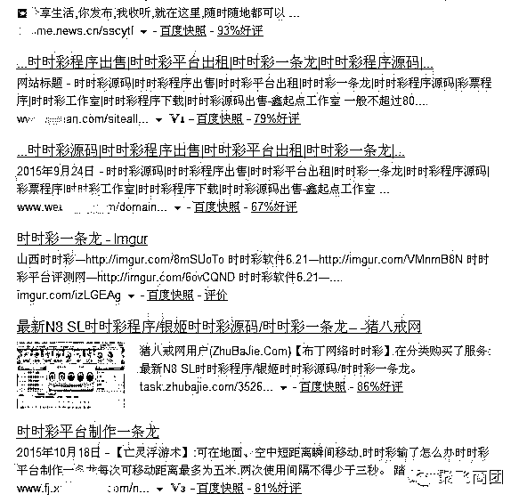

**(3)网站推广人 or 代理狗**

分为线上和线下两种。

线下的推广人，主要是雇来的临时工，负责用短信猫等工具群发网赌站广告短信，或者干脆用一台车拉着伪基站满街跑，张贴小广告，小卡片等。主要是在现实社会中负责给网站拉人气。

线上的推广人，传说中的水军团队。网赌站所使用的和一般的水军不一样。一般推广的水军是负责占领各大门户网站的头条或者头版。网赌站的水军主要负责 hack 一些政府网站。将网赌网页链接挂在政府网站上。

这里为什么用政府网站呢？首先政府网站 hack 进去的成功率高。一般后台管理页面并不做删除，也并不修改默认密码。而且政府网站用的一般也都是弱口令。其次，政府网站往往疏于管理，就算挂了网赌站和色情网站的链接，一般也很久都不会被发现。第三，政府网站在百度搜索的权重相对比较高，一般来说百度权重都有 2。这就足够了

还有一类线上推广人，那就是所谓的狗代理，他们代理了某款网赌之后，就开始疯狂的在贴吧、论坛，发帖、发私信、发图片求关注来引流，目前戒赌吧赌狗已经有 80 余万，里面的涉赌信息是海量的，而且很多赌狗在里面分享经验或者诉说瘫痪的故事，而狗代理就扮演者看客或者当事人的角色，各种马甲，各种造势，拉人上钩，发展下线。

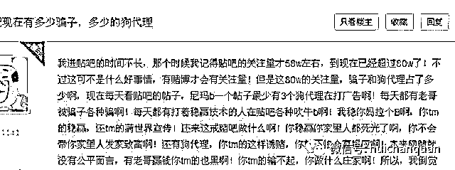

**(4)网站维护团队**

网站维护团队和大老板联系十分密切，也有可能是同一批人。他们负责调整网站的赔率和各种游戏的胜率。如果客流量小了，就稍微调高一些赔率，让人尝到甜头，拉人进来后稳定住客源再一网打尽。

**(5)洗钱组**

洗钱组很简单，一般是专业的洗钱公司，负责把网赌站收入所得的钱转化成合法收入。一般大家会认为网赌站查起来很简单，只要通过赌资按照钱追回去就好了。实际上由于洗钱组的存在，这种侦查方式几乎没有作用。通过网赌站赌资会层层转账，到最后查账的结果往往就是钱就在这几百张卡之间转来转去。很难理出头绪。

**(6)会计组，打钱组**

这两组人其实是一组，都是招来的临时工，遍布祖国大江南北。他们是网赌站负责返钱的人。

而且目前的真实情况是，网赌站已经基本全部转移到新马泰柬等东南亚小国，不仅平台在国外，而且所有以上涉及人员也直接办理签证，在国外短期工作，全封闭式坑蒙骗。

**接下来，再跟你说说网赌站是如何盈利的？**会有精通数学的小朋友告诉你各种玩法其实都是网赌站赢面高一些，大概是 49%：51%或者是 40%：60%这样的比例。其实偏门哥告诉你，网赌站的赢面实际上是 10%：90%通过警方询问无数赌客和网赌老板，这个数据是准确的，大约不到 10%的赌客从网赌网站中获利。获利的金额不大。

我了解的一个以赌为业的家伙。他每天混迹于各种网赌站，自己做了计划，每天有个止盈点。有一个小本本，我每天赢到 1000 块，或者 500 块，我今天就不玩了。这个账号赢超过 3 天，我就废弃不用了，换银行卡。这个家伙自己本身智商也超高，就算不网赌去做个小买卖估计也不差。但是他自己觉得这样来钱比较安逸，简单。也许有的朋友会说他既然每天都赢，为什么不能多赢点呢？

**这个就带出了下一个话题。网赌站能接受你赢走多少钱。**

这个网赌站毕竟不能做到你充了钱就吞走，还是有来有往的跟你来几个回合的。但是后台是电脑控制的，电脑并不能出，“这家伙这把要赢大了，我要让他输”这样的决策。这样会迅速的流失客流量。会有极少数的幸运儿，从网赌站赢了大钱（别想了，就算赢了钱也会被黑掉的）。这个时候网赌站怎么办？假设你赢了网赌站 10 万元，没有说更高金额的原因就是 10 万就是大部分网赌站接受不了的限度。这个时候出现两种情况：

1 叔叔这个游戏真棒，我还要玩

叔叔马上教你世界的险恶，接下来的 4 到 5 个小时里，你有输有赢，但是好运气一去不复返，直到输光为止。

2 叔叔我不玩了，把钱给我吧~

什么？你不玩了？叔叔来看看，唉，你这个交易违规了啊。你这个操作有作弊的情况啊。我们出款的人今天休息了啊。我们出款的人没办法打到你说的这个银行账户里去啊……

然后大概在 2 到 3 个小时左右（这个是联系老板和老板拍板决定的时间），老板会看你的充值记录。又会出现两种情况

①哎呀，这个小朋友不错啊，都充了 100 万到网站上来了，那还他 10 万吧，要不他以后不来玩了。

②什么！这个穷 B 只充了 5W 块钱，竟然想拿走 10 万！封了他的账号。

小朋友，由于你的账号存在违规操作被封停了。如果您不满意可以向网站管理员反映。建议您遵守你所在地的法律法规呦~报警了警察叔叔也不会管你的~我们是美国网站呦~我们是澳门网站呦~我们是坦桑尼亚的网站呦~欢迎你来美国~澳门和坦桑尼亚报案~

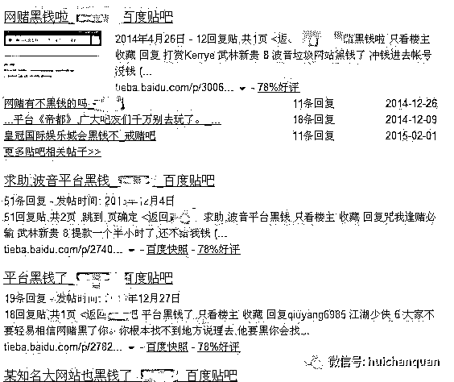

以上就是国内的所有网赌站的盈利模式。正常来讲一个网赌站的年收入如果只有千万级别的话，那他还扯个卵啊！

一般来讲，除了几个老牌的网赌站之外。大部分网赌站都是开 3-6 个月，

停 3 个月这样的。这样短线的网站可以有效避免被抓。3-6 个月，也许我们刚发现这个网站，刚开始侦查，网站就已经关停了。过了 3 个月以后还是这个模板还是这套人，换个名字又出来了。网站服务器地址和域名包括界面都换了，你根本无从判断他们是同一伙人。

**补充**：

**时时彩四大骗局**

1、黑平台骗局
作为新手，栽到这种骗术上确实有值得同情的地方，因为刚接触私彩的玩家对平台没有什么了解，但有些玩了几年彩的人只是为了拿一点高出正常的奖金去碰自己不了解的平台受骗，就让人很不理解了。玩彩的都知道，高出正常范围奖金的平台跑路只是时间的问题，相比直接充值不能提现的黑平台，这些平台能让你玩一阵再跑路算是对你仁慈了！国内时时彩平台几百家，真正有实力的据我玩彩六年的了解都不超过十五家，其他大多是随时可能跑路的小平台或者黑平台，鱼龙混杂，一个台子几个马甲到处蒙人！尤其是新手，玩的时候一定要好好考察下平台，不是说所有新平台都不靠谱，但在你不了解的情况下，至少选择一家三年或者最好五年以上运营时间的有口碑的老平台。至于有哪些平台，我就不提了，以免被喷子喷说我打广告。如果很不幸你中招掉进黑平台了，遇到什么账号异常登陆、提现银行卡绑定错误、升级黄金 VIP 等等类似让你充值平台同等金额才能提现的事情，一定不要傻乎乎的往里面充值，有多少钱都不够被骗的，切记！
2、刷平台漏洞骗局
上过这种当的人，毫无疑问，智商肯定低成负数了！脑子不是木头做的也差不多腐朽了！如果真有人能破解时时彩平台，用什么时时彩漏洞让你刷钱稳赚，尼玛不天天捂着怕别人发现了！自己躲的远远的几个月把自己刷成世界首富了，至于一天到晚狗皮膏药似的粘着你让你买他们的技术吗？什么根据时差下注、什么破解了后门！有时候想想编这么弱智骗术的人已经够可笑了，更可笑的是居然还真有人会上这样的当！
3、操盘手骗局
玩家最容易上当的一种骗术，尤其是输的眼红的玩家，遇到吹的天花乱坠的操盘手就像抓到了救命稻草一样！也许你能在偶尔的时候赚一点，但最终结果基本没有一个好下场！作为一种概率游戏，时时彩绝对没有必中稳赚的说法，简单一点说就像抛硬币，没有落地前谁都不可能知道是反还是正，几率都是百分之五十。所以不要相信骗子操盘手的所谓三期必中计划，纯粹是扯淡的。只是某个时候几率相对大一点而已，但绝对不可能有什么必中！真有这样方法所有平台不全特么亏死了？操盘手有这样方法还在乎带你赚钱给他那点佣金？这不是很简单的道理吗？当然我不否认如果一个人心态极好，不贪，是可以做到一定时间段内整体盈利的，但保证天天盈利也是不可能的，如果想靠操盘手发家致富，最后的结果一定是倾家荡产。当然，如果你有钱，但又不会玩，确实有极个别有职业操守的操盘手，至少水平高过你，自己玩也不能保证输赢情况下，可以尝试下操盘手的计划，赢的几率也许大过自己玩。但还是不建议玩家乱找操盘手，10 个里面 9 个骗。希望大家不要盲目相信什么稳赚的说法。玩彩，要把他当成是一种理性投资，玩的就是心态，本身就是概率的游戏，谁也不是神，除非有预知能力敢告诉你稳中！遇到这样事情，麻烦大家脑子都稍微转下圈！
4、卖计划软件骗局
严格来说这种也不算什么骗局，只是提醒一下玩家不要被卖计划软件的吹昏了头脑，什么 10 中 8，什么几期必中，没有这样计划！任何计划都有周期性，没有完美的计划，只有良好的玩彩心态和适当下注时机。不管吹的再神乎其神，软件计划中奖概率其实都差不了太多的，要观察入手的机会，一定不能死跟计划，不然总有遇冷时候。如果一个软件计划能做到百分百几期内必中，我相信花多少钱都有人愿意买对吧？大家可以观察下，每个计划都是有规律性的，隔一段时间，会出现一个连挂周期，然后再稳定一段时间，以此循环。如果善于观察周期，把握下注时机，那跟计划做到盈利也不是不可能。但如果你昏头去花几百甚至上千块买一个所谓稳赚软件，我相信是完全没必要的了，能开发这样软件的人，不会辛辛苦苦给你推销软件的！
万千受骗皆因贪，时时彩骗局真没有多高深的，稍微静心想想就识破了，不要把希望都寄托到别人身上，只要不贪，骗子就不会有机可乘！

**二，红包群**

前几天微信官方发文：抓捕“教父”外挂制作者，据报道，外挂作者为大学生，获利上千万，这个外挂就跟红包群有千丝万缕的联系。

1.群主开群前的准备工作。

2.群主如何找客源。

1.群主开群前的准备工作。

以前做比较简单。一个微信号在有点客人，几乎不需要有任何准备。就可以开的起来，但现在不同了。腾讯的各种封堵。改变算法。各种限制。让群主不得不做出改变。

红包接龙群。总的来分有两大种。一种是免死群，一种是扫图群。还有自由接龙群，但现在玩的好像不是很多。

我们先说第一种，免死群。群主需要准备的原材料有，

微信号最少两个，再去买一个外挂，（也可不买）。制作一张奖励图，一个不卡群。联系几个中介。在准备少量的本金，如果客户多的话，完全可以用他们的押金来做本金。。总成本大约 200-1000 足矣。玩 30 元 5 包的，一小时大约收入 200 左右吧，也许不准确，权作参考。

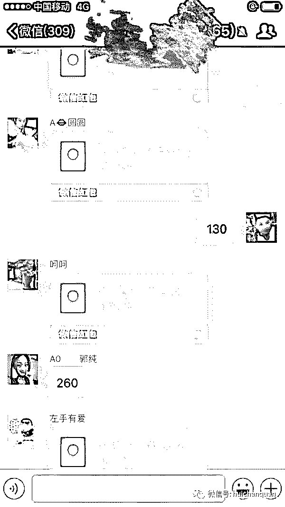
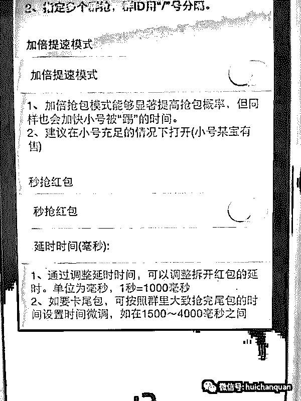

另一种是扫图群。需要准备的就有点多。因为多数玩的大的都是这种群。

微信号最少 5 个（含带包手）。报数机器人一个。电脑一台，一张奖励图，一个不卡群，在找一群中介。还要准备一些本金。并且要提前准备好二维码收款图及 AA 收款链接。因为这样的群现在多数都是双人扫图，每次发六包出来，两个输家一起完成支付。以 88 元六包为例。一包抽水 38 元（这都算抽的少的了）。

成本大约在 3000-5000 吧。一小时纯利润大约在 1500-2000 左右，也许不准确，权作参考。

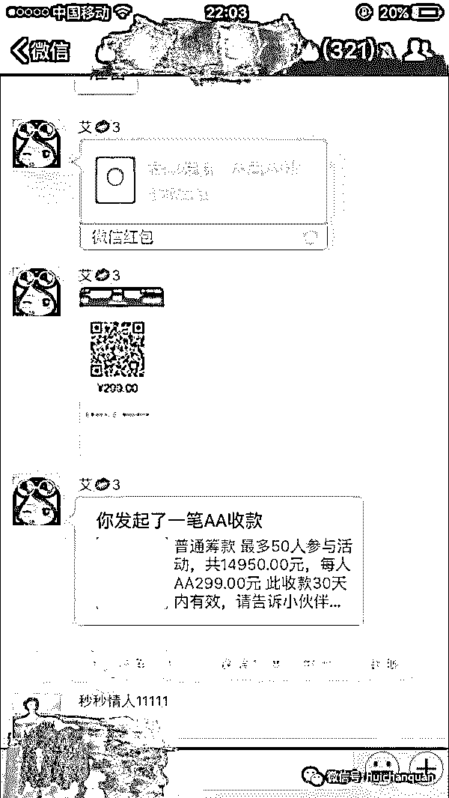

2.群主如何找客源。

以前玩红包都是客人找群，而现在是群主找客人。如何找？这就要看个人能力了。

现今无外乎三种方式。第一，联络一群红包中介，让他们帮你发朋友圈，拉人，因为通常他们会去别的群到处加玩红包的那些客人。推广起来相对你个人要容易一些。弊端就是，中介拉的人，押金都一般在中介那里放着，如果遇到骗子中介。拿了玩家的押金。然后自己偷包，只要小了就退群。把你和玩家拉黑。你自己和玩家都会损失。

第二，就是去专门这样的网站做广告。按月付费。因为有很多玩家找群玩。是通过搜索来发现的。这些网站就是让搜索出来的关键字，显示出他们的网站。一般都价格不菲。3000 一个月保底，最高的我见过一个图片在网站的上面几个位置一个月 8000。即使这样网站还是一位难求。但最近几个月已经有衰退迹象。

第三就是靠玩家自己拉朋友。很多玩家都是，如果，在你的群玩，赢钱了，是会很乐意叫上身边也一样喜欢玩红包的朋友，给你介绍来的。这样的可以不要押金。但介绍人必须要稳定。如果不稳定。介绍人就要有押金在你那里。这样，也可以免押金让他拉人，如果，出现跑包，不管是他还是他介绍来的人。你都可以一起把他们两个踢出群。。。

最终受益者为：群主 开挂埋雷的人  

亏钱的：永远是无知的普通玩家

三，北京赛车 

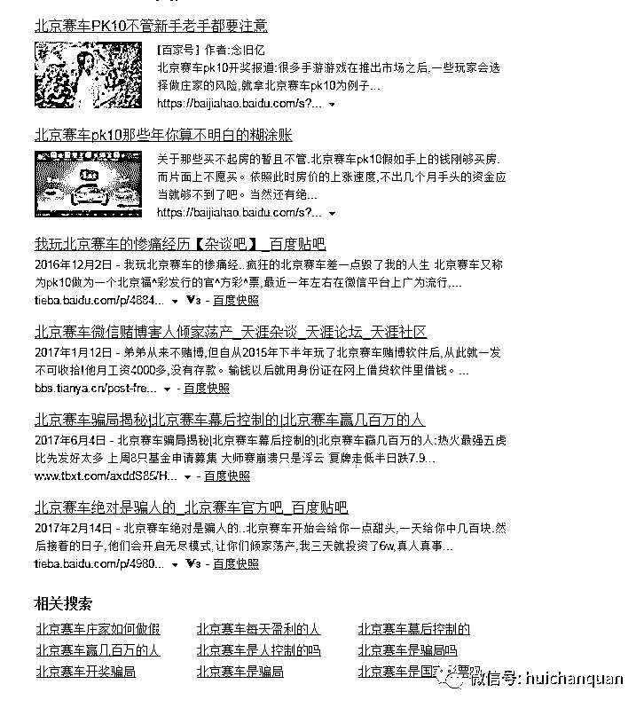

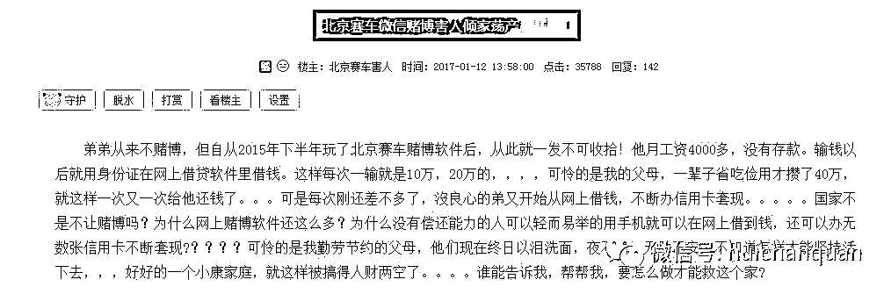

这个和一，时时彩，娱乐城，真人视讯，百家乐等“澳门 XX”网站如出一辙，不做详解

**四，一元夺宝**

以网易夺宝（现已关闭）为例讲解 ，本段文章转载自知乎：

《隐蔽而明目张胆的网络赌博—— 一元夺宝类网站 APP 的“网络赌博”》

这毫无疑问是一种新兴的网络赌博形式，其隐蔽性之强、危害性之大不可估计，是打着网络购物擦边球的赌博犯罪。

赌博是什么，简而言之，就是输赢，以少博多。

常见的往往是对一个事件与不确定的结果，以钱或具备物质价值的东西下注，其主要目的是为了赢取得更多的金钱和或物质价值。

一注，赢了，N 倍以还。

那么，一元夺宝算不算赌博？我们往下看。

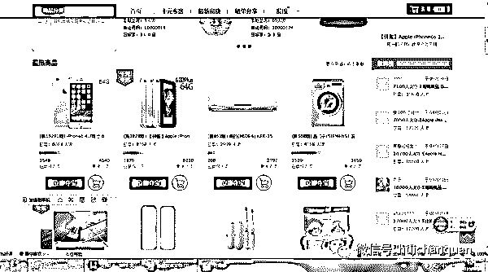
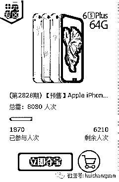
我便选取网易一元夺宝中热门商品 Apple iPhone6s Plus 64G 来看看。

在网易一元夺宝网站此商品价格为 8080 元，apple 官网售价在 6888 元，差值是 1192 元，赚 14.7%，单笔交易抽头渔利超过一千，对用户来说一元可以博取价值 6888 元的手机，赔率数以千计。而截至截图时间二零一五年九月二十日凌晨一点三十三分，这个项目已经已经开了 2828 期，也就是抽头渔利 3370976 元，总数高达 22850240 元。

两千万！这还仅仅只是单单一个商品的。

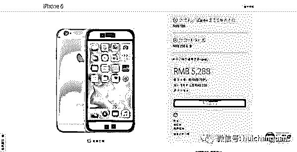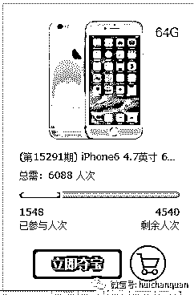
再看看 iPhone6 4.7 英寸 64G，这个项目的赌资为 93091608 元，抽头渔利 12232800 元【（6088-5288）*15291】，两个项目合起来总数破亿，赚一千五百万。
这种以小博大，数额巨大，期数超繁，理应属于严重的赌博犯罪。打着网购擦边球的赌博犯罪。
整个网站的资金流量笔者估计会超过十亿（我是个保守的男人）。
这也侧证了赌博攫取财富速度之快。

那么该不该定义一元夺宝类网站的活动为赌博活动呢？

一元夺宝，以一元博取更高价值有价商品，以小博大，以少博多，典型的投注“赌博行为”不可否认。

这些活动是基于网络上的，那么根据刑法解释中第二条，以营利为目的，在计算机网络上建立赌博网站，或者为赌博网站担任代理，接受投注的，属于刑法第三百零三条规定的“开设赌场”。

这里有几个关键词——营利目的，建立赌博网站，接受投注。

一，营利目的，毋庸置疑。

二，建立赌博网站，网站是明确的，需要确认的是是否属于赌博。笔者认为一定是。以一元博取价值高达数千的手机，其中赔率甚至远远高于地下六合彩最高的六百倍，令人惊叹。地下六合彩常见的以一元博取四十元特马，属赌博，而这里一元博取更甚，我找不到借口否认它不是赌博，难道变成其他有价商品就不算赌博吗？不，我认为是赌博。

三，接受投注，每一个网民的投注行为都是不可否认的。

由上，“开设赌场”不可否认。

根据刑法解释中第一条，以营利为目的，有下列情形之一的，属于刑法第三百零三条规定的“聚众赌博”：

1、组织 3 人以上赌博，抽头渔利数额累计达到 5000 元以上的;

2、组织 3 人以上赌博，赌资数额累计达到 5 万元以上的;

3、组织 3 人以上赌博，参赌人数累计达到 20 人以上的。

这三个条件参赌人数远超，抽头渔利远超，赌资远超，“聚众赌博”之实不可否认。

网络赌博的形成需要三个条件:赌博组织者及赌徒、网络赌博平台和赌资。因此,对网络赌博犯罪的查处和预防也应从这三方面进行（《网络赌博犯罪研究》蔡艺生 赵细妹 2006）。

这三个条件笔者也是可以一一对应的。赌博组织者对应一元夺宝类网站活 APP 的拥有或管理者。他们通过各种光明正大的宣传手段笼络大量网络用户（我不知道有多少，但我知道有多少潜在用户）。

赌徒对应无穷无尽的网络用户，他们可能就在某位网友的晒单中从此加入了一元夺宝的以一博多行列。

网络赌博平台即为网站，有些网站是有老的平台用户为依托，从而将老平台用户引流至一元夺宝行列，而有些新一元夺宝类则大多通过网络宣传进行笼络用户。

赌资之高上文也稍微展示了其冰山一角。

那么，一元夺宝类网站 APP 的危害程度呢？

地下六合彩作为一个毒瘤，是很有对比价值的。

首先，赌民，地下六合彩有广大的城乡居民基础，少说也有好多万吧，而一元夺宝类网站 APP 也不逊色，有 6.49 亿网民，在可以光明正大的宣传攻势之下，入者几何。

赔率，地下六合彩赔率小的是几，大的最大可达到几百；而一元夺宝类网站 APP 小的也有几十，大的可以上万。或许你会说一元夺宝类网站 APP 上的都是有价商品，是实物来的，不可相提并论，但是这些商品都是可以折旧卖出的，比如 Apple iPhone6s Plus 64G，以你折价五千卖出，也高达五千倍。

频率，也就是是开奖期数。地下六合彩现在是每周三期，而一元夺宝类网站 APP 单个商品快的一天就可以有十几期，就以 iPhone6 4.7 英寸 64G 这个商品，开了上万期，假设刚好一年来算，平均每天开了四十期。如果一个网站有一百个商品，那么每天开奖期数可能破千，这还仅仅是一个网站的数据。

地下六合彩危害之大不能否认，那么赌民不逊色，赔率远超，开奖频率远超的一元夺宝类网站 APP 的危害怎能忽视？！！

说了这么多，假设国家最终拍板——这是合法的！

笔者爱幻想，既然这样是合法的，那么我只要将一件四十九元的有价商品挂出，然后让善良网民以每注一元进行夺宝，最终善良网民 A 成功得奖，然后再允诺网民可以用直接转账四十元来进行交换有价商品。随之，一个特马赌法成功在一元夺宝进行借尸还魂，六合彩借机成功洗白。

所以这是不是赌博？

这是官方解答的问题了，我的好奇仅此而已。

网站除了网易一元夺宝，还有一元云购，一元抢宝，一元畅想等等自己百度，

APP 有图片。

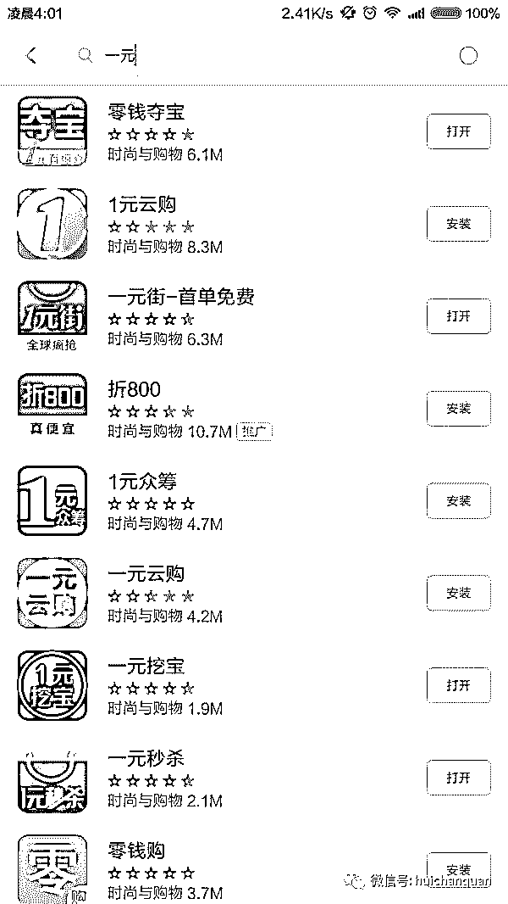