# 灰哥|揭秘不为人知的信用卡盗刷灰色产业链

> 原文：[`mp.weixin.qq.com/s?__biz=MzIyMDYwMTk0Mw==&mid=2247485758&idx=1&sn=128b3efd19da4c98ffa922d6a38889bd&chksm=97c8c206a0bf4b10b16202120ae0b674dd7eb8fcedfcbf3a60765a0d8e955d986fb52504fd96&scene=27#wechat_redirect`](http://mp.weixin.qq.com/s?__biz=MzIyMDYwMTk0Mw==&mid=2247485758&idx=1&sn=128b3efd19da4c98ffa922d6a38889bd&chksm=97c8c206a0bf4b10b16202120ae0b674dd7eb8fcedfcbf3a60765a0d8e955d986fb52504fd96&scene=27#wechat_redirect)

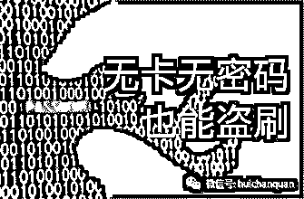

**很多人都听说过信用卡盗刷，国内国外类似新闻很多，如下：**

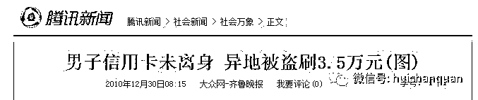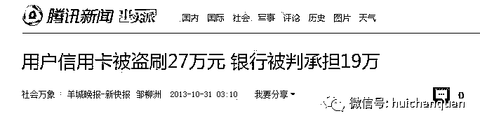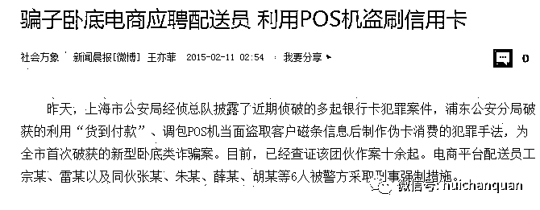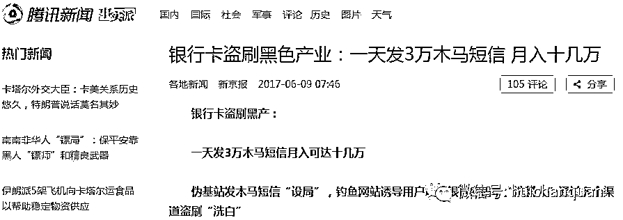

         盗刷信用卡产业链背后隐藏着数量庞大的从业者和错综复杂的利益链条，他们有条不紊，又分工明细，灰哥下面揭秘信用卡是如何被盗刷的：

**一，“代办信用卡 ”**

1、 代办信用卡，获取信息：骗子声称可以代办信用卡，骗取受骗者的信任，取得受骗者的身份证扫描件/复印件、手机号码、住宅地址等私人信息。

2、 截取信用卡邮件：骗子利用现在小区物业管理不规范、邮件可代领的漏洞，冒充受骗者取走信用卡。

3、 伪造身份证，并补办手机号：利用受骗者的信息，伪造身份证。然后挂失并补办受骗者申请信用卡时预留的手机号。

4、 激活信用卡并盗刷：利用补办的手机号码激活信用卡，并进行盗刷。

**二,伪基站盗刷信用卡**

该产业链分工明细，主要分为这几个角色：伪基站设备销售、信使、鱼站程序包、洗钱师、消费老板、黑吃黑等，他们之间的收益都是相互独立的。

**1.伪基站设备销售**

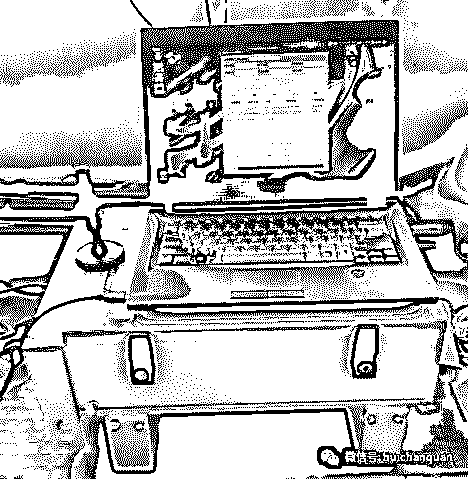伪基站（也叫 SSRP ）设备这两年媒体报的很多，样子就像上图那样，由 SSRP 主板、功率放大器、机箱、控制设备组成。这是老款设备，它的控制需要配一台笔记本电脑，非常笨重容易被发现。去年开始升级为“背包机”，设备小了许多隐蔽性大大增强，而且用手机就能进行控制，如下图

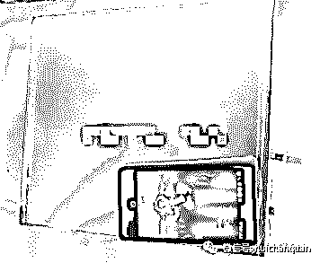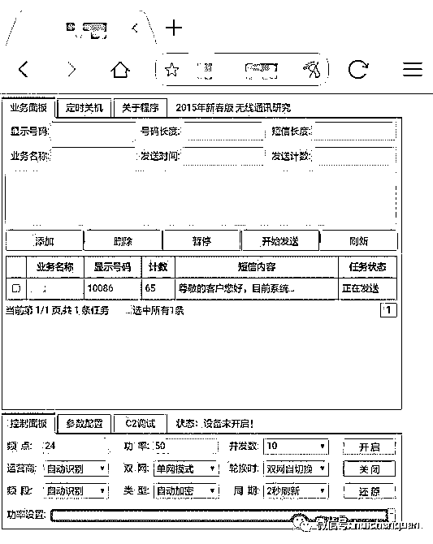

光有硬件还不行，还的有专门发短信的软件，这个一般售价 500 ～ 700 不等，所以乱七八糟加一块，可以上路真正发信的装备得一万块左右。

2、信使

一套设备价格在 1 万块左右，你说好贵！？要知道这个钱信使一天就能给赚回来，下面就是某骗子给信使发的当日“工资”。因为最近行情不是很好，所以一！天！才！能！赚！9500！可想而知在鼎盛时期日进万金绝不是梦！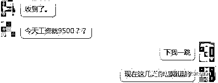

这么高的收入就是信使团队创造的（想象下下游又会收入多少…），他们会购买伪基站设备，开车去人口密集而且管理松懈的二三线城市扫街，通过伪基站下发骗子定制好的短信内容，就是以前咱们经常收到的诈骗短信。

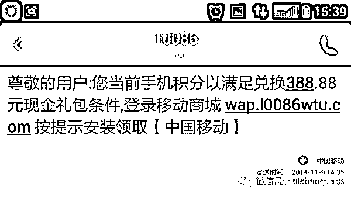地区的选择也挺多说法，比如天津因当地伪基站发信收入少，信使都不愿意去…

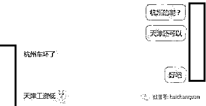

3.鱼站程序包

钓鱼网站程序其实都很简单，重点是在界面的装修上，比如做成银行或运营商的样子。乌云君见到用的最多的钓鱼程序是用一款 ASP 网络留言板改造的。这个链条中有专门的售卖团队，一套程序价格是几百块左右。提供程序的技术团队会给洗钱师保证一系列的技术服务，包括 VPS 服务器设置，网站建设甚至简单的系统安全防护…

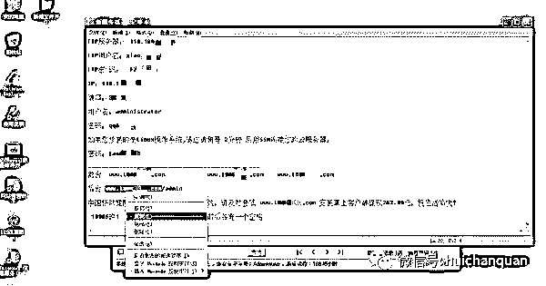

洗钱师利用技术人员给的说明文档部署、配置钓鱼网站和短信拦截木马。值得注意的是，这些钓鱼网站程序几乎全部存在“后门”，也就是说第一波信使撒网钓的鱼，可以被其他人悄悄取走。用户一旦上钩受骗，那就真不知道被哪波人给钱洗走了。

所以很多洗钱师给信使发一万左右的工资，但取回来的鱼被提前洗了，导致收益入不敷出，所以现在洗钱师们也在努力学习 ASP 程序的“后门”清理技术…

钓鱼站配套的“短信拦截马”也是他们提供的，这东西对某个受害者进行的全程短信监控记录，用这个来拦截并查看用户银行卡转账的短信验证码，所以你在被骗的时候一点感觉都木有…

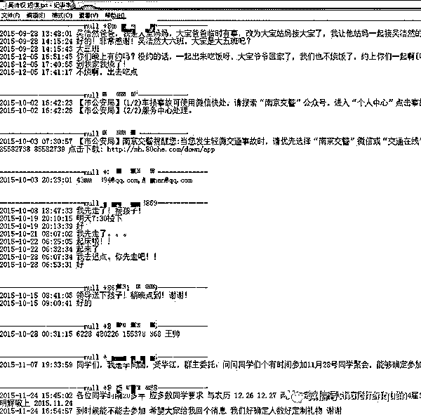

用户总感觉自己没中招，只是你不知道而已。

4.、洗钱师

这个就是最终把你银行卡等账户里面钱洗走的人了，他们大多分散在全国各地区的村子里…据说一旦定位了某个村子，你会发现随便进一家都是干这个的！然后全村都是干这个的！！最后发现连隔壁村也是干这个的！！！

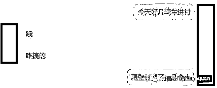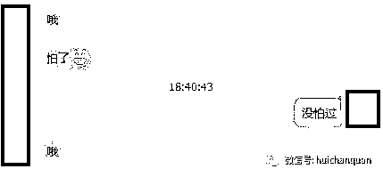

那是因为伪基站诈骗给他们带来的收入是我们很多人都望尘莫及的，比如一个月换陆虎…

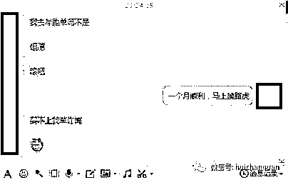

洗钱师们都会标配一款神器，用来方便快捷的进入各种洗钱渠道（殊不知这个软件里面有个隐蔽的后门程序，啧啧这个先不提，行业太恐怖了），如图

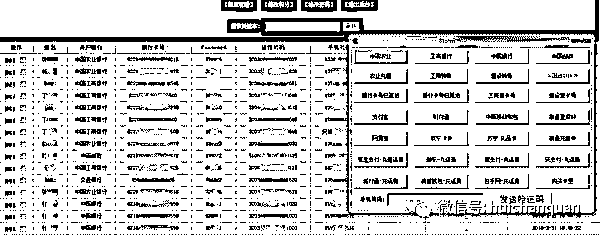

软件细节

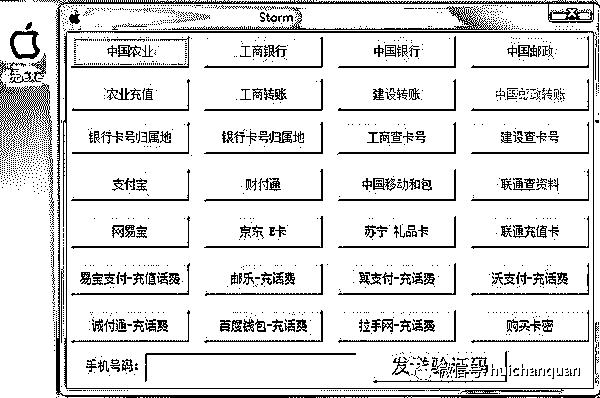从图中可以看出洗钱师都利用什么渠道变现：

*   银行：进行最直接的转账、网购操作，配合钓鱼网站里的手机拦截马

*   第三方支付：直接转账或购买商品

*   电商购物卡：直接买东西、点卷洗卡，与冲话费套现

*   卡密：在京东或各种点卡站购买游戏充值点卡卖给老板

比如洗钱师用骗来的银行卡在京东购买游戏卡

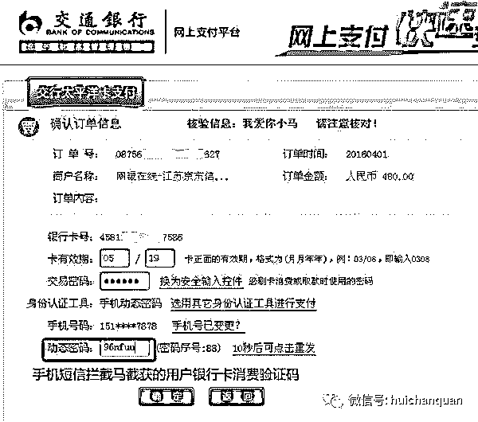

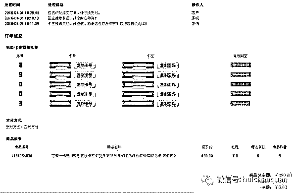他的京东账号

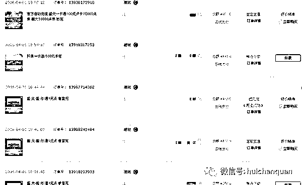仅仅几分钟，就可能 1000 多块钱入账。
5.消费老板

这个是最简单的一个链条环节了，他们只需在各种论坛、QQ 群发布一些售卖广告，或者维护一些回头客即可，只管收钱，找洗钱师要货，给客户出货。

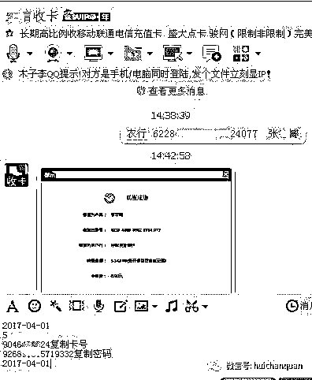6.黑吃黑

这种团队就纯属坐收渔利的，真正的零成本盈利，也是这个链条中最顶端最会玩也是最赚的一波人。他们无需购买设备、无需雇佣信使、无需购买服务器和代码，只需通过后门提取到真正骗子获取的数据尽快完成洗钱或数据二次销售即可。

他们也会通过技术手段获取到钓鱼网站的源代码，进行二次修改，加入自己的后门再次放入市场流通，滚雪球一样二次践踏这个利益链。其中也发现了多起“骗子”被“骗”的事件，令人哭笑不得。但不管怎样，用户就是这些人眼中的肉，也许哪一天伪基站真的会退出时代，但这些人仍然会用更先进的技术，更娴熟的诈骗手段来牟利。

**三，木马软件复制手机信息**

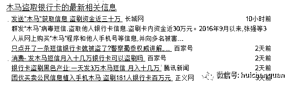                 用户安装程序后，会在手机上自动下载木马病毒，该病毒会复制下载手机上保存的各类信息，包括通话记录、通讯录、使用的 APP 软件。如果用户点击后又登录了一些带用户名、密码的 APP，那么手机内的相关信息也会被不法分子窃取。

**四，消费时卡片信息被“克隆”**

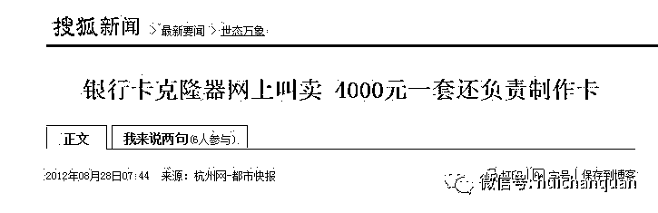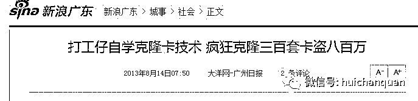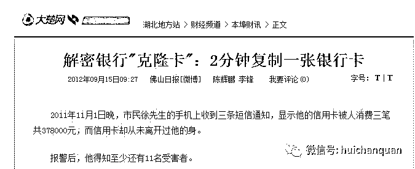

这个比较敏感，不做描述。

**三，泄露 CVV2 码导致被盗刷（国外信用卡）**

信用卡背面的 CVV2 码是网络交易的要件，只要得到卡号、有效期、CVV2 码即可上网刷卡，目前尚无特殊的强制手段来对无需密码的交易形式进行限制。

什么是 cvv？既信用卡和借记卡背面的验证码。目前国外的网站普遍支持信用卡支付方式，只需要输入卡号，有效期，持卡人姓名以及 cvv 和账单即可支付，有些网站甚至不需要持卡人姓名和账单。像这种网站有很多，如：Paypal，Ebay，G2a，Steam。大家熟悉的网站应该就是这几个。

用 CVV 可以购买的物品

1.虚拟类（初级）

包括但不限于 Steam，Psn，Lol，Netfilx,Spotify，色情网站会员。

有 CVV 你可以轻松的购买这些东西，虚拟产品是黑产中最简单的一种，大多数新手都会选择这种方式刷游戏，账号然后再出售给其他人，像 steam 黑礼物直到现在还有许多淘宝商家在做。只得一提的是虚拟也分三六九等，此处不再详谈。

2.实物类（中级）
包括但不限于 Uber，电影票，景点票，飞机票
干此类的数量不少，利润大概在 50%-100%。就像我一开始说的，国外朋友圈里那些半价电影票，uber 打折，都是黑产的一种。

3.实物类（优秀级）
包括但不限于 Ebay，Amazon，淘宝
此类实体类的话搞得人不是很多，因为不是十分安全。一般会刷实体的人是先联系出货的人，再刷。利润也是十分高，搞一次赚几千刀的我也见过。

个人见过过用信用卡刷淘宝的，成功刷得电视一台，并出货（非本人）
4.虚拟钱包（精良级）
包括但不限于 Paypal，Skrill。
搞这种就需要有一定的经验和技术了，做起来的话一天也有上万刀的收入。把钱搞进钱包里你想干什么就干什么，国外支持这些结账的商店有很多。要细讲的话这一类也可以分好几种，如：代打，撤资……

**轨道料**
轨道料，说的也就是写银行卡的数据，有了轨道料，你就可以自己写一张信用卡出来，也就是复制信用卡。复制信用卡主要是国内发生的居多，因为国内的芯片好写，详见下图

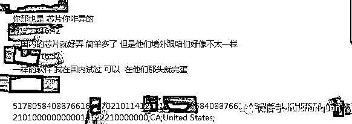此类需有白卡，写卡器，读卡器等工具才可进行，前期准备就需要大笔资金，而且黑吃黑的人也有很多。

这类黑产比较复杂，此处不再细讲。

讲到这里大家应该比较好奇这些信用卡资料是从哪里来的吧？ 答案就是暗网。

一般来说他们会去黑市或者暗网购买信用卡的信息。这些信息其实很容易被买到的。而且买这种信息会用比特币支付，因为比特币支付相对来说很难追踪的到，比较安全。像一些专门出售信用卡信息的网站，我们称之为“料站”

以下几张图片大家可以看到，在网站上交易的信用卡信息一应俱全。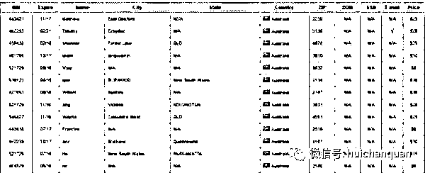

可以看到价格从低到高不等。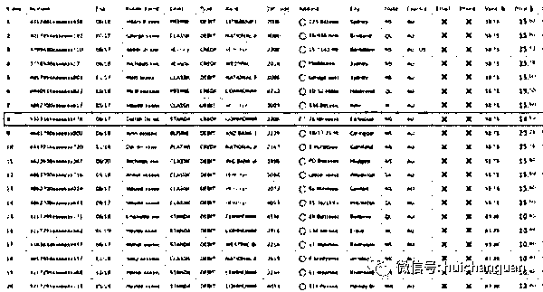

还有根据国家分组的网站，业内称之为 “螃蟹”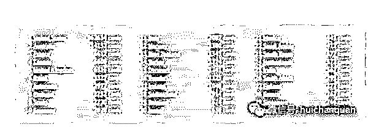

可以看到图中没有中国信用卡的信息，我个人认为中国在安全方面做的是比较好的，但这并不代表没有，中国的信用卡方面可以单独分为一方面讲，一般称为“四大件” 此处暂不详讲。

像做黑产的的人低端一点的话会找中国人提货，因为他们不知道暗网这个地方，即使知道的话也会由于英文不过关而打消念头。高端的话可以与国外黑客互刷，国内刷国外网站，被抓几率几乎为零。

灰哥提醒：

盗刷信用卡为违法行为，切勿操作！

  **我是    灰哥**  

专注引流变现

灰哥微信：huichangege

偏门|灰产|引流|变现

**灰色暴利网赚项目队员招募中**

