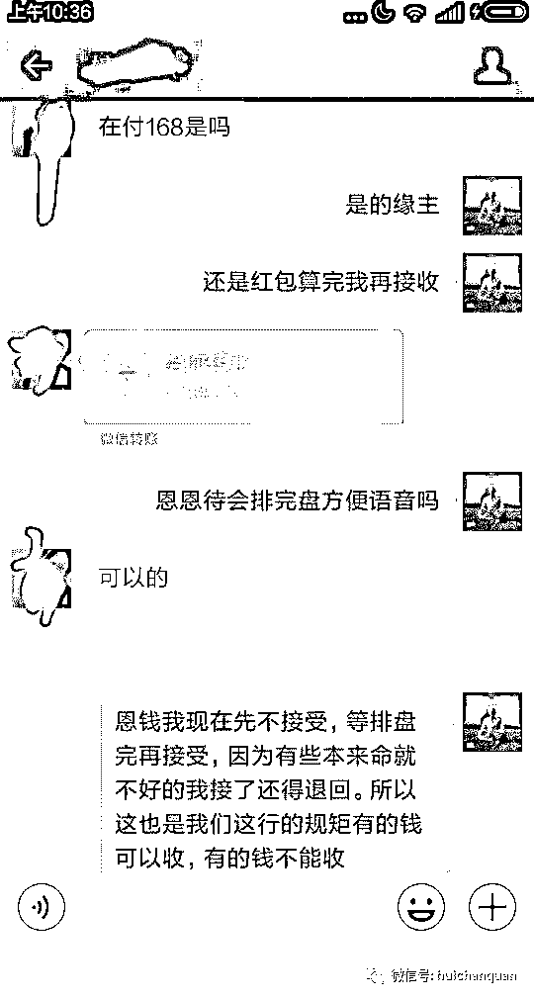
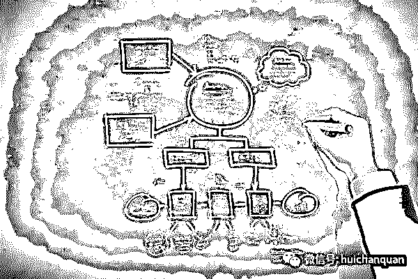
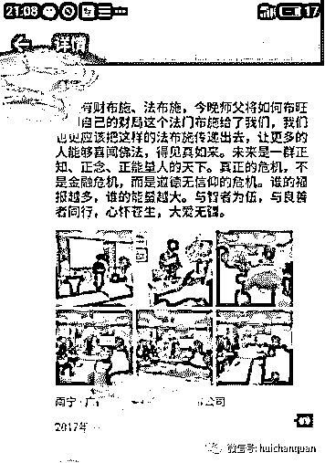
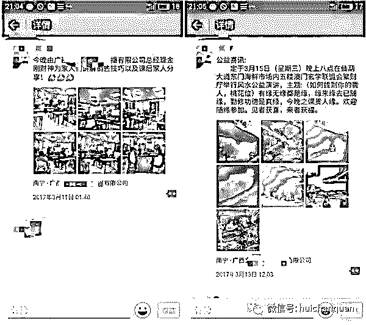
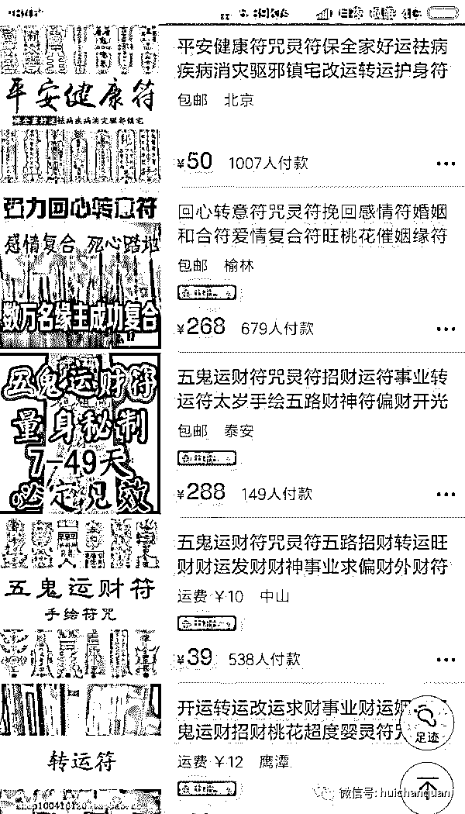
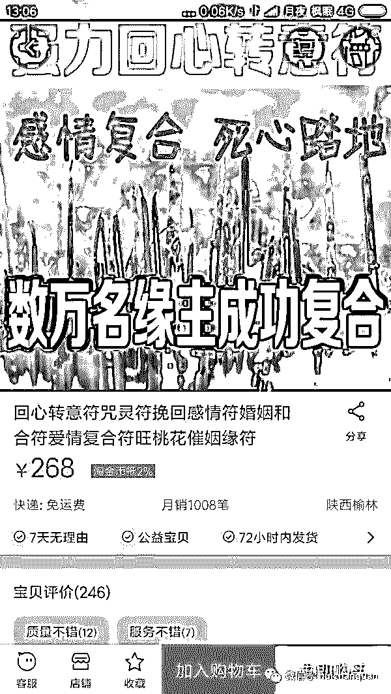
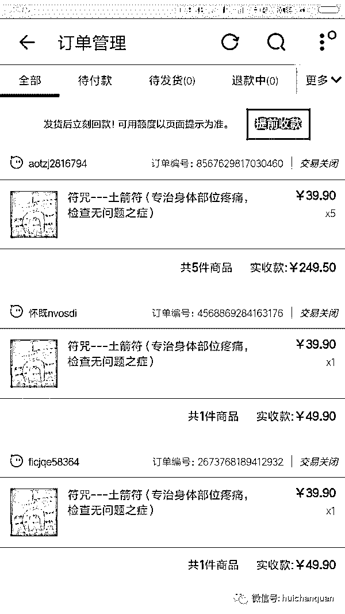
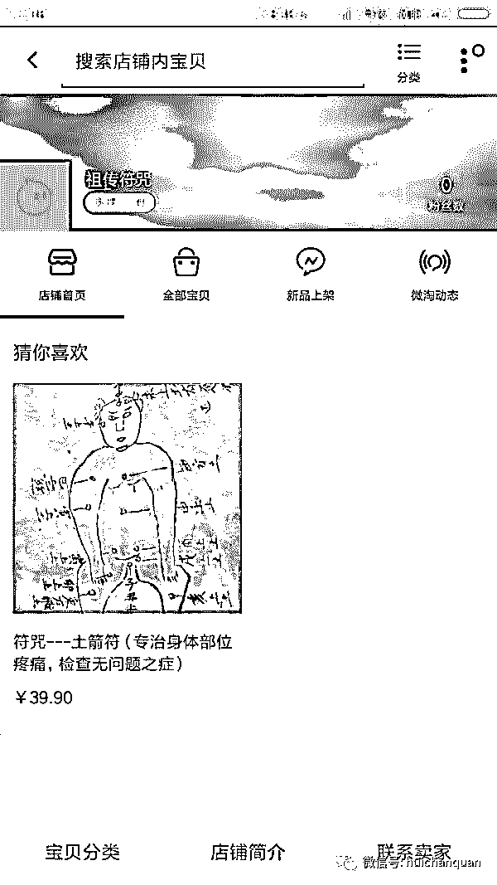

# 再度揭秘暴利风水网赚项目年入百万的秘密

> 原文：[`mp.weixin.qq.com/s?__biz=MzIyMDYwMTk0Mw==&mid=2247485550&idx=1&sn=b62ec6d403ec8ebbd01180ba313f1fc1&chksm=97c8c356a0bf4a4037412e852634e23537517a56c7b9619c87b74c359c63ee9342ac0126bbf6&scene=27#wechat_redirect`](http://mp.weixin.qq.com/s?__biz=MzIyMDYwMTk0Mw==&mid=2247485550&idx=1&sn=b62ec6d403ec8ebbd01180ba313f1fc1&chksm=97c8c356a0bf4a4037412e852634e23537517a56c7b9619c87b74c359c63ee9342ac0126bbf6&scene=27#wechat_redirect)

什么钱最好赚、最暴利？算命算是比较暴利的行业。行业的人说，这个有损阴德。今天，不讨论阴德，只从营销角度客观看待这种身边的现象。仅仅当做是茶余饭后的交流，大家随意就好，不要干杯！

本来想讲佛学寺庙项目，但是寺庙这种暴利的东西并不是每一个人都可以操作的，需要投资很大，对于很多草根来说，只可远观不可亵玩焉。那有没有门槛比较低的暴利项目？有的，和佛学寺庙同一个枝干的“算命”就是一个！

你相信算命吗？ 你相信命运吗？你相信有人能预算到你的未来吗？有的人不相信，有的人相信，因为算命大师能能猜到你某些东西。有人说风水命理也是一种学问，称之为玄学，是中国道家文化的一种，越是有钱人，越是有权人，越相信这一套。就看你自己信不信了。 这几年随着城市的规模扩大，算命师已经很少了，小时候隔壁屯里，镇上还经常能看到，现在已经寥寥无几。其次，算命师局限在一个地方之内，用户流量过于狭隘，走不出，进不来，想算命的人找不到你，你想给别人算命，却找不到要算命的人。

虽然说实体很少了，但是人的需求还是很大的。早在之前有些人就把算命从实体搬上了网上，也就是“网上算命！”算命，不只是那么简单，有的公司现在已经开展到一些公司合作人的形式来批量模块化操作了，虽然没有看到数据，但是身为暴利行业，收入是非常可观的。 算命，不只是那么简单 算命是一种风水命理，一种学问，如果你能学到或者说你本身略知一二，那当然是最好的效果了。可是算命可不是那么容易学的，学了如果效果不好，还影响自己口碑，还被喷，“自己不擅长的东西交给擅长的人去做就好了。”经常有些人不擅长算命，但是他擅长营销，擅长包装，让一些不出名的算命，在互联网的作用之下，效果非常明显。 看看人家如何寻求合作 对于算命师而言，屯里的老一辈的长辈们是最相信也是最熟悉他们的了，很多长辈老人们都相信这一套，从你爸妈或者爷爷奶奶相亲父老们口中总能挖掘得出几个出来。 如果，实在找不到的话，你可以去一些老巷子或者石庙的地方，往往都会有一些求签解签的人，这时候，善于互联网营销的人就开始策划一些形象出来。

他们说服别人的的理由很多，客流逐年变少，用户范围局限，我们有一个项目可以让你赚很多钱，全国用不完的流量用户，我们负责帮你找客户，你只需负责算命，合作分成。有时候，看到类似这些案例获得成功，只能感慨互联网力量的伟大啊！ 我发现他们还会玩粉丝裂变 首先，他们将算命大师包装一下，比如包装成是几代几代大师，算过有多准，成了多少个老板，和什么老板交际等等，唬不住自己怎么能唬得住别人呢？是吧！ 其次，寻求裂变源，准备好文案，以算命大师免费算命为由，吸引用户添加算命大师的 QQ 或者微信，方式很多，比如是在公众号文章底部设立一个小区域推广免费算命的活动或者在公众号自定义菜单处做一个入口，也可以去贴吧、也可以着手朋友圈等等。  

当用户添加后，也就是说有了裂变源，那么就可以开始裂变了，就以免费算命伤人伤己、有损阴德为依据，用两种方式推广： 1）需要帮忙转发你的文案（免费算命海报以及二维码）到朋友圈，5 分钟后截图发你，然后开始算命，算命期间不能删除，否则不帮算命！ 2）需要支付算命费，实地的是 100 左右，线上你可以抬一下价格，128、168、188 等（算命师有一个规则，富人多收，穷人少收）。大多数人都会选择方式一，因为能免费（符合国情，当然也不排除个别土豪），这有符合我们初期积累粉丝的发展需求。前期主要是多做点单子，做回访做文案，把 IP 撑起来，中期再撤掉转发免费算命。 小钱在前，大钱在后 算过命的朋友都知道，算出的结果不管是好还是坏，算到最后他总会给你说你到什么时候会有个大难或者一个好运，你必须要什么东西才能过这关，就比如你是来询问婚姻的，那么婚姻肯是有问题的，问事业的，那么事业肯定是前程渺茫了，这时候来算命的人就会心切，向算命师询问化解的方法，这时候可以化解的风水宝物就派上用场了。 化解之物有很多，符纸、佛珠、挂饰、小铜虎、宝物等等，都是一些几块钱几十几百块的便宜物品，但是开过光的性质就不同了，价格几百几千几万不等，我见过有人花了几百块买了一张佛卡的，也见过有老板花了几万块买一把铜剑的，这些都不为稀奇，人都有一种心理，如果我挺不过去，坏了前途怎么办？花这点钱消个灾，很多人还是愿意的。 培训是另一种业务 培训业务，可以重点说一下。有人赚钱，有人眼红，就有人跟风。在我所在的城市就有一家公司就是从事网上算命的，挺赚。后来发现有挺多人发现这个行业很赚钱，纷纷想来报名学习。21 世纪什么行业最赚钱？培训就是其中一个，公司业务也逐渐开始拓展到培训这块。

 其实，交学费培训只是一种形式，其实公司是另有目的，是想让学徒成为一个传播口，也就是类似代理的模式，利用学徒来为自己的公司做宣传推广。（有些算命公司对学徒的思想影响是非常厉害的）。可以说这些学徒已经成为他们的核心用户。核心用户有哪些特征？ （1）愿意无条件的为你做口碑宣传，到哪里都愿意提到你 （2）能给公司带来源源不断的现金流，你的东西都愿意买单 （3）愿意为你提供最新鲜的行业有价值的咨询，愿意无偿跟你分享 培训圈粉。公司的每一次活动，每一次培训课或者活动，导师都会要求学徒们通过朋友圈共享一次，以达到业务更广的推广效果。这个是比较厉害的，在朋友圈当中，年轻小伙子可能不玩这一套。但是，我发现中年大妈特别喜欢传播这种东西，哪里哪里的谁算命比较灵。 销售型算命。还教学徒们销售技巧。公司的机制是每个人都有带徒弟的机会，通过自己在朋友圈共享的信息以及日常挖掘潜在客户，目标群体则是中老年人，挖掘到学员的学费，学徒会有一定的引路人，导师负责教导学徒，所以导师也会有一定的提成，公司在从其中抽取一部分。其实也就是通过培训行业的代理模式，各自激励导师学徒代理挖掘客户，从各层中盈利。

公益型算命。往往这些网络算命公司还会运用地堆思维去扩大口碑的传播。经常到各个地方做公益算命。运用佛法、玄学作为理论依据，获得更多的民众基础信任。果然是运用了公司的发展模式。我听说日本有家算命公司还上市了。不得不服！ 联盟型算命组织。别笑!真的是有联盟在运作，通常存在合伙人的形式。大家抱团取暖。经常通过朋友圈互推。本来一个人的粉丝量很有限。通过互推，一下子知名度就响亮起来。感觉很像古代的各种分舵，其实也差不多。 算命的项目相对于寺庙而言，相对于简单，而且投资比较小，用户需求和寺庙一样有很强的刚需，算命费+化解消灾的风水宝物费*30 天=等于一笔非常乐观月收入。整个操作流程主要的侧重点是精准引流这块，只有持之不断的流量，才有持之不断的收入。 前期注重用户培养，后期批量模块化放大操作，其次注重老会员上的服务，做服务行业，最重要的就是回头客，回头客比任何都强，因为他们已经信任你了，把他服务好了，他还会继续回来找你化解或者推介朋友过来。 老会员来帮你塑造风水师的 IP，IP 起来了就会有 IP 效应，能被动的吸引到很多用户，在成交率上也会有很大的帮助。 后者，因为有人赚钱，就会有人跟风，培训行业也是一个非常不错的盈利放向，当然，今天讲的只是一小块，把算命产业搬到公司运营，包括后期的培训业务，当然还有很多方块还没有点到的。    

另外说一个项目----符咒，真要说起来它可能还算不上一个行业，应该称为玄学。据我所知，信奉这个的人很多，他们一般通过他人引荐或直接从网上求符。由于好奇我打开淘宝网，随意地搜了一下价格如下:

      一幅普通的符能够卖到 268 元，上面显示月销 1008，我们就打算按 1000 副来算，月赚就达 27 万之多，这是一个什么数字。如果我们按平均 50 元一幅符来算月收入也可上万了。但是对于不知情的大众来说这里面的水又有多深呢？或许我们可以设想一个根本不懂符咒的人在网上竟然可以招摇撞骗月入过万？不知道对待这个事实你们作何感想。
       或许你们会问我为什么会关注这些奇怪的东西？其实一点不奇怪，因为我家算是祖传符咒吧。以前爷爷在的时候给乡里乡亲的画符 20 元一副。今年年初闲来无事随意在淘宝网上注册了一个网店，然后随意挂了一幅符其它什么都没弄，因为我也不指望会有人来光顾，毕竟三无小店。然而事实相反，竟然有人下单，这是我万万没想到的。但从侧面反映一个事实这个需求量很大。或许你某天在地摊上买两本画符的书也可以成为一个大师了。
下面贴图给你看看:

     当然了，这些订单我也没有接，因为压根就忘了这回事。不过那位一次要五副符的头一回见，毕竟一次只求一副，符也是有期限的。

以上项目仅供揭秘，切勿模仿！