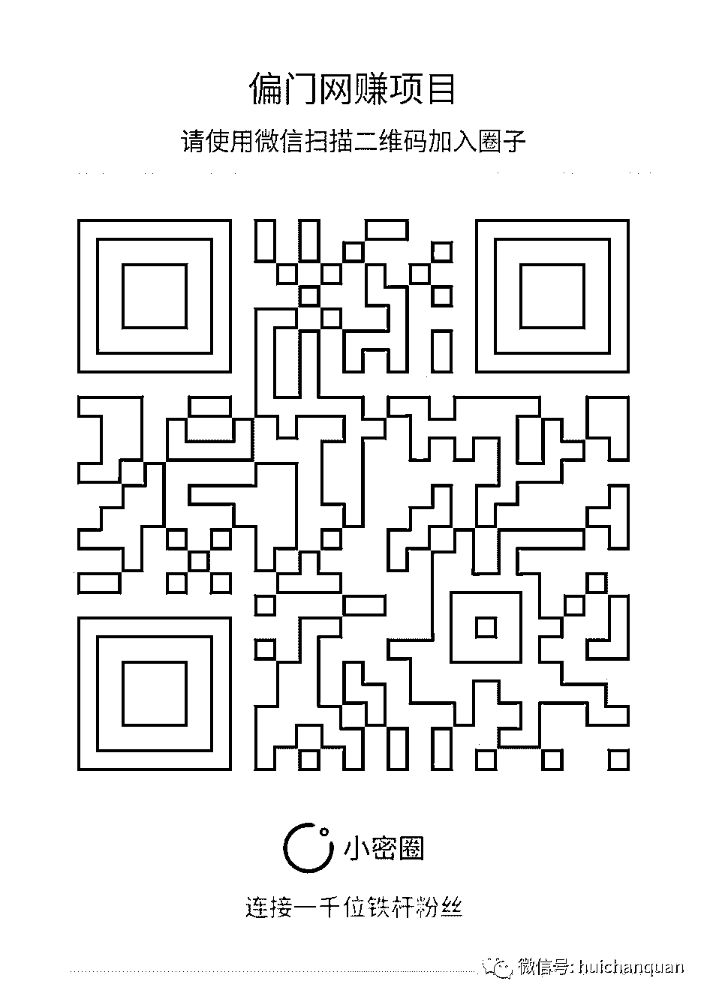

# 原创|互联网金融中贷款领域的黑色产业

> 原文：[`mp.weixin.qq.com/s?__biz=MzIyMDYwMTk0Mw==&mid=2247485383&idx=1&sn=923144949496b8159141a251ddf419dc&chksm=97c8ccffa0bf45e9e170a840e43a897518fcd64a2101588a4b86e527b0fa98d5bc54d9ab395d&scene=27#wechat_redirect`](http://mp.weixin.qq.com/s?__biz=MzIyMDYwMTk0Mw==&mid=2247485383&idx=1&sn=923144949496b8159141a251ddf419dc&chksm=97c8ccffa0bf45e9e170a840e43a897518fcd64a2101588a4b86e527b0fa98d5bc54d9ab395d&scene=27#wechat_redirect)

请输入标题

        之前朋友在 P2P 行业干过一段时间，给我讲过关于 P2P 平台的内幕。由于新平台上线一般都会做各种活动（比如注册送 XX 体验金），于是某些人盗用或购买大量用户信息，利用 P2P 平台规则或系统漏洞，批量注册来获取利益，成绩斐然者月入上万。

 最近，很多 P2P 公司似乎消停了点，没有大规模的烧钱做活动，一部分是因为被淘汰掉了，一部分则在转型，转做综合理财超市（就是将信托，保险，基金等放到网上来卖），还有一部分将精力转移到资产端，也就是放贷。所以大家可以发现一些小额线上贷款公司忽然间就涌现出来~

这类线上贷款，以信用贷款为主，特点是放款快，申请比较简单，额度在几百到几十万不等，费用较一般贷款略高，因为某些人急需资金，所以还是有一定市场的。这种线上贷款就像当年的 P2P 投资，还处在法律的边缘地带，很多规章制度都没有建立起来，这便给某些人可趁之机~

总体来看，贷款的黑色产业主要集中在四个部分：身份冒用；代办申请；专营贷款规则漏洞；利用高科技突破信贷审查.

一.身份冒用

如果哪一天你突然收到法院传票，说你欠下几千万的贷款惹上官司，你的第一反应是什么? 坑爹吧？因为你从来就没有申请过贷款，更何来欠款一说？但如果你的身份被冒用，发生这种事情也并不是没有可能。

那这些人是如何冒用身份并申请到贷款的呢？

一般来说，申请信用贷款需要的资料除了申请贷款的用途和金额外，还有两类，一类是证明“你是你”：包括姓名，身份证信息，联系方式；第二类是证明“你有能力还款”，包括银行流水，收入证明，其它流水证明等等。如果拥有了这些信息，且之前没有进入黑名单的，下款率都会比较高！

那如何获得这些信息呢？

首先是个人的实名信息，这类信息一方面是从某些机构获取（比如 Y 行，B 险公司，D 商等），另外就是利用网上的钓鱼网站，或者木马病毒收集用户信息，然后批量出售。

这些“信息贩子”通常会游荡在某些论坛上，或加入网上的 QQ，如“私家侦探”、“信息资源”等，你在论坛或群里说需要信息，一般就会有人和你私聊，这样就形成了一个买卖市场。

银行流水通过中介也是可以做出来的！因为一般信贷人员只能熟练辨认自家银行的流水，对于其他银行的流水进行审查相对比较困难，再加上有的银行有业绩压力，所以只要纸张和公章没有太大问题，流水便可通过。

当然，收入证明就更好做了~（据说有人将网上的收入证明用修图软件修改就通过审核了~）

（注：上述行为涉嫌犯罪啊！）

曾经有相关媒体爆料称：实名信息：2 元/份；银行流水：300 元/份；收入证明：100—300/份；办理假身份证：100 元一张；由此可见一斑！

二.中介代办申请

中介代办申请其实就是索要用户信息，代为申请，然后按照放贷的额度进行分成。比如大家比较常见的信用卡代办。这类黑产一般有三类： 

1、纯粹骗钱型

这种一般都宣称和内部有关系，先把你的“定金”骗到手，然后消失。 而且骗子还有固定营业场所，租好地段大厦的办公室，当你将信息交给他们办，他们会先告诉你需要时间，拖到他们认为“骗够”了，就退掉办公室后一夜间人间蒸发。

因为这类事件在我朋友上发生过，所以可以说的再详细些。当时那位骗子说自己是某行内部员工，可以通过特殊关系办到大额的信用卡，不过需要收取一定的手续费，比如办理额度的百分之几，先付定金。

我那位朋友刚开始的时候将信将疑，因为定金比较少最后还是给了。没过几天，就有人来做背景调查，弄的像模像样的。一番闲聊之后背景调查就算过了，之后对方就说需要咨信调查，也就是要转账到某个账户，目的是将银行的流水做的“漂亮”，才能申请到大额的信用卡。让我那位朋友转了 5000，我那位“单纯”的朋友 想了一会，最终也转了~

注意，一般这个时候，如果对方是小骗，拿到钱后就应该闪人了，不过这个骗子比较厉害，他将钱又给我那位朋友转回来了。到这个时候，我的那位朋友就相信对方的确“靠的住”，之后对方又说转账 30000，朋友当然继续转了，然后，然后就木有然后了啊......

PS:遇到陌生人让你转账这种事一定要当心啊！无论对方是任何理由~

2、骗取资料型

他们会收集你的身份证、工作证明等个人资料后，向你未选择的银行申请卡，而地址、电话留的是他们自己的。等批卡后把卡的额度刷光，然后又人间蒸发了。又或者收集了大量个人信息卖给第三方。

3、黑中介型

他们虽然不骗取你的资料，但可以伪造些资料，帮助不符合标准的申请人通过审核，从而谋利。

PS：假如批到了卡，虽然可能能够正常用一段时间，但只要被银行复核的时候查出问题来了，可以随时以提供虚假资料为由停你的卡，一旦发生，这种不良记录会导致至少 5 年内办不到任何银行的信用卡、房贷、车贷了。

三.专研贷款规则漏洞申请贷款

不知道大家有没有在线上申请过小额贷款？

现在很多小贷公司拒绝申请人贷款后，不会告诉拒绝的具体原因，只是说不满足要求，其实就是防这批人。

这批人的每天活跃在各种贷款论坛，QQ 群，贴吧中，打听哪些新的小贷公司上线了，哪些小贷公司的系统有问题，一旦发现有合适的标的，就蜂拥而上，要是对方没有明确给出规则，就各种恐吓威胁，给小贷公司施压，说其信息不透明，操作不规范。

所以各位，如果你哪天急需用钱，去申请小额贷款，不幸被拒而贷款公司又不提供具体原因的话，其实不是不规范，只是这些贷款公司要防那些专营漏洞的人。

四.利用高科技工具，突破信贷审查

最后一种就更高端了。

这些人早些年研究 QQ 账号，淘宝刷单，前几年又研究 P2P 的规则刷红包，最近又开始研究贷款平台。

他们先大量收集用户资料，再根据贷款系统的漏洞，研发相应的软件，突破信贷的审查，批量注册，批量申请贷款！

为什么很多小贷公司宣传是纯线上贷款，几分钟快速审核，当天到账。而在实际中依然会用电话，依然是过几天之后才放款？

为什么有的人申请金额几万，但实际下批的额度只有几千甚至几百？

其实，在一定程度上就是为了防止这批人！

说了这么多，其实我们普通老百姓遇到最大的问题就是由于信息被盗导致被“贷款”，那出现这种情况应该如何解决呢？

只能在平时注意自己的隐私，切勿泄露身份证银行卡等个人信息，防患于未然，如果真是遇到这种情况，那么请拿起法律武器保护自己！

灰产圈

**专注引流变现**

长按二维码关注我们

**我的项目团队招募中，欢迎有志之士加入**

  

  

# 

> 原文：[`mp.weixin.qq.com/s?__biz=MzIyMDYwMTk0Mw==&mid=2247485335&idx=1&sn=151e5a3ea75d3ae1bffda721c2c14508&chksm=97c8ccafa0bf45b9e81bec486b0f90a4faa1c2b75e01b361a9f29748d817c211cec6f6d22657&scene=27#wechat_redirect`](http://mp.weixin.qq.com/s?__biz=MzIyMDYwMTk0Mw==&mid=2247485335&idx=1&sn=151e5a3ea75d3ae1bffda721c2c14508&chksm=97c8ccafa0bf45b9e81bec486b0f90a4faa1c2b75e01b361a9f29748d817c211cec6f6d22657&scene=27#wechat_redirect)