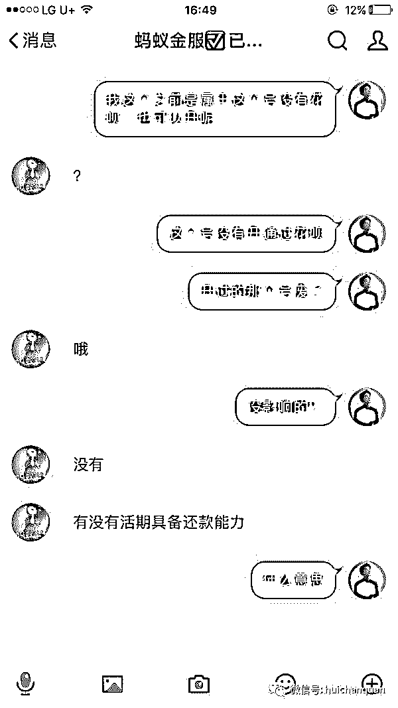
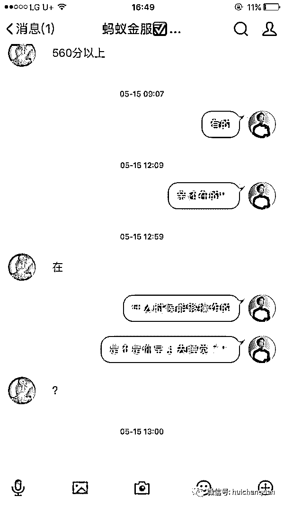
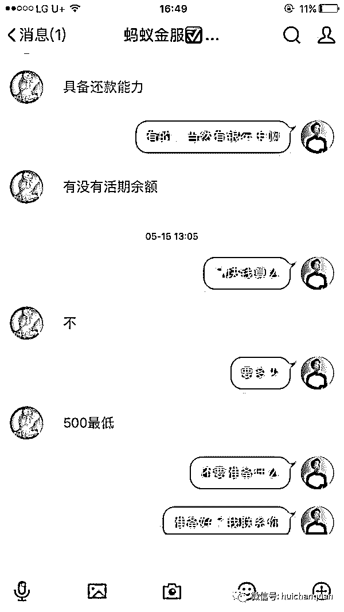
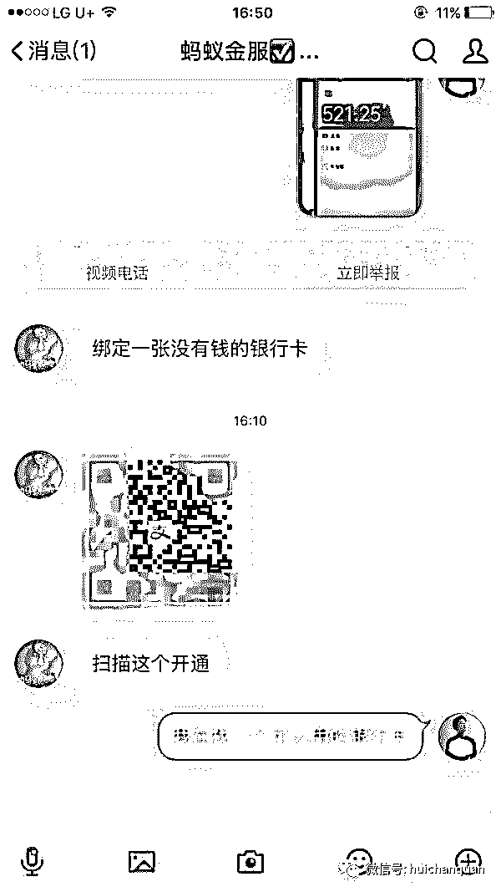
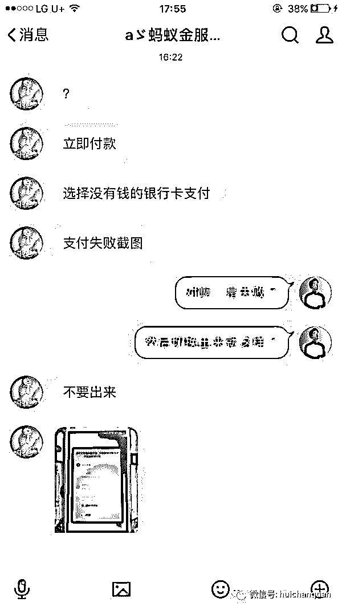
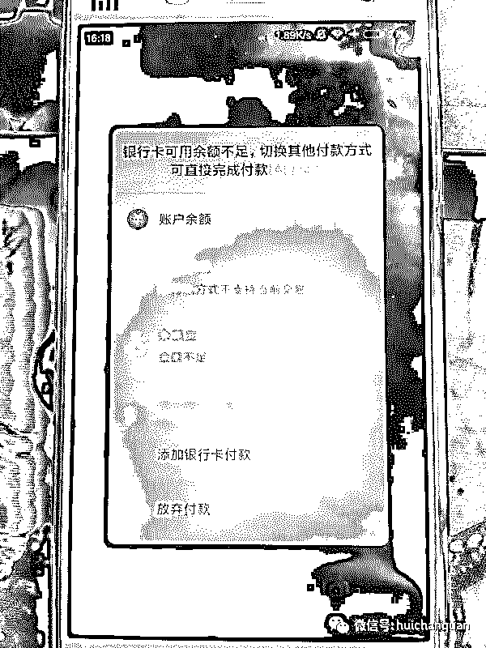
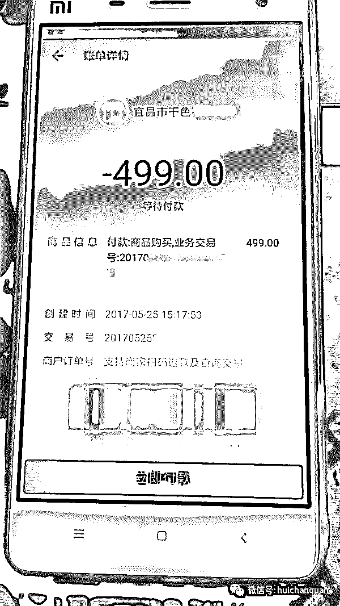

# 灰产哥揭秘支付宝上亿规模的灰色产业链

> 原文：[`mp.weixin.qq.com/s?__biz=MzIyMDYwMTk0Mw==&mid=2247485311&idx=1&sn=bd7c39a6082ef774abaaacf45175c354&chksm=97c8cc47a0bf45518eb1f112c8fe225d6b7a3a5996c5517ed5877f734c674db0debe023c08ca&scene=27#wechat_redirect`](http://mp.weixin.qq.com/s?__biz=MzIyMDYwMTk0Mw==&mid=2247485311&idx=1&sn=bd7c39a6082ef774abaaacf45175c354&chksm=97c8cc47a0bf45518eb1f112c8fe225d6b7a3a5996c5517ed5877f734c674db0debe023c08ca&scene=27#wechat_redirect)

请输入标题

俗话说，人为财死鸟为食亡，这是网赚界的不灭金句。

不少的人，为了暴富往往会做黑灰产业，习惯了赚快钱之后就再也收不了手，你和这些人说什么好好赚钱，慢慢积累，对于他们来说真的就只是浮云。

你永远叫不醒一个装睡的人，同样你也永远不可能让一个赚惯了快钱的人做一些积累的网赚路子。因为黑灰产的人做的多了，我觉得有必要给大家科普一下，避免上当。所以有空的时候给大家写一些网络套路防骗指南吧。

今天我要说的这个，应该很久了，只不过套路又被他们升级了一下。网赚圈子里的人想必都知道，最近贵阳广州几个地方开了公积金的口子。这个东东的好处是，你有个公积金的账号，就能花呗借提额，基本上其他的网贷都能给你增加额度。在这个风口刮起大风的时候，一些网赚骗子也顺风而起。有直接就说先款的骗，也有高级点的。简单的我不想说，稍微想想的人都知道不能先款。

骗局招牌：

花呗套现 开通花呗 开通借呗 提额 催单不接！24 小时在线服务！因为专业/所以信赖！

催单不接，啰嗦勿来。

骗路核心:

1\. 给受骗者营造放心的感觉。

2\. 一定要在受骗者不注意的地方行骗

3\. 充分利用受骗者着急的心态。

首先，我们来一步步说一下这个骗局中的开通花呗。很多人七百多分芝麻分可能还没有花呗，也有一部分人是因为某些违规导致账号封号以后而丧失了花呗。仔细想想这样子有需求的人还不少哈~

一般来讲，先款大家都会防备。但是如果说不需要先款，只需要事后结算呢？这种情况下，大家的警戒心理一下就能去掉一半。

然后，他会问你有没有活期还款能力，有木有备用没钱的银行卡，芝麻分数有木有达到 560 分之类转移你的注意类。这里我要敲黑板啊，看似都是很正常的对话有木有？要知道所有的骗局都是隐藏在正常的表象之下的。

其间你找他办理所谓的业务的时候，他会一步步拖垮你的耐心，利用你想要办理的心理战胜你内心的最后防线。一方面他会装作自己很牛逼的样子，一方面会装作自己很忙，哪怕屏幕前的他无聊到扣指甲也会跟你说他很忙。这些谁有知道呢？你越着急，他就说自己越忙，你一激动，大脑一下被着急冲昏了头脑，那么恭喜你，你很有可能已经在对方给你准备的套路里了。

今天要说的这个骗子，要说包装的还不错，用的是 6 位腾讯靓号，我们知道的人都会笑，因为这个靓号是人家冲会员就能持续用，不充值了就没有帐号使用权。也就是说随时都有跑路的风险啊。这里我要敲黑板，注意啊，是随时跑路的风险。然后再充值各种钻啊，这个号就变得自带逼格。

来来来，我们先看一下具体我的截图。

不知道大家有没有看明白哈，我再来详细说一遍。

首先我们来说说活期还款能力，就是说让你卡里有五百元。然后他会让你充值到余额。然后随手丢给你一个二维码，让你扫描，选择用银行卡付款。这种情况下没钱的银行卡必定是付款失败的。接下来敲黑板啊，重点来了！！！

他会告诉你这个时候你要选择账户余额（诸位可曾记得自己的账户余额还有五百块呢？）

我们来看看二维码里的内容到底是什么鬼

就是这个玩意。你这小伙子不是逗我么~这个时候我就要露出尴尬的微笑了。

一般人不在意的是，你第一次输入正确密码但是余额不足，当你切换付款方式的时候，钱就会自动打过去，根本不需要你再输入密码。然后骗子就带着你的钱，拉黑你，你两就拜拜了，永远的拜拜了。这一块就是我说的骗子在你最不在意的一个小细节上欺骗了你，真是悲惨啊。

不知道我这么一说，要砸了多少人的饭碗啊。你能怪我么？谁让你们是骗纸。

如果大家有兴趣，我后面再写写最近的公积金还有借呗提额之类的。

此贴纯为揭露。

**我的项目团队招募中，欢迎有志之士加入**

  

