# 深度揭秘微博神汉的赚钱伎俩，引出网络风水算卦行业的灰色黑幕

> 原文：[`mp.weixin.qq.com/s?__biz=MzIyMDYwMTk0Mw==&mid=2247484826&idx=1&sn=a7b3ae0af87083853cc99b053528a9ff&chksm=97c8cea2a0bf47b44bf46edf9d73e0b153313808c2da56b027e3d80333b24e72f4614e53c68a&scene=27#wechat_redirect`](http://mp.weixin.qq.com/s?__biz=MzIyMDYwMTk0Mw==&mid=2247484826&idx=1&sn=a7b3ae0af87083853cc99b053528a9ff&chksm=97c8cea2a0bf47b44bf46edf9d73e0b153313808c2da56b027e3d80333b24e72f4614e53c68a&scene=27#wechat_redirect)

事情从我无意间点开一个看相大师的微博说起：

微博粉丝量有三十八万（僵尸粉占一半最少）

作为职业敏感，我深度扒了信息

微博粉丝量有三十八万（僵尸粉占一半最少）

大 V 用户 增加权威性  

首页置顶：免费看相（是不是很诱人？）

免费看相是为了引流引导人们转发评论吸引粉丝

实则是为了付费变现。

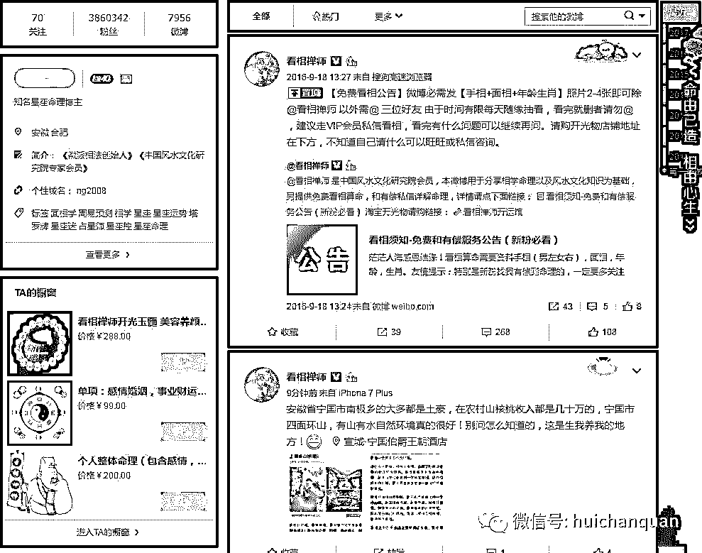

点击博客文章出现下图界面。

重点来了，

免费的基本是噱头

俗话说免费是最贵的服务

接下来引出了需要付费服务

理由是免费的名额已经没了

深深地套路啊

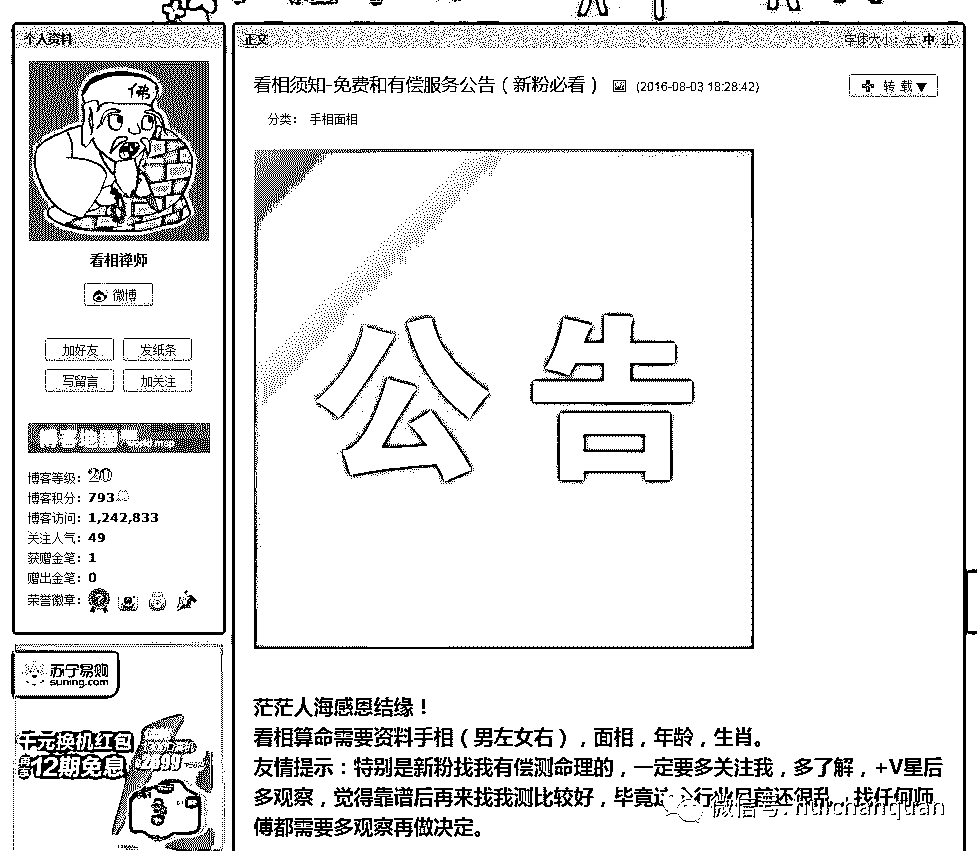

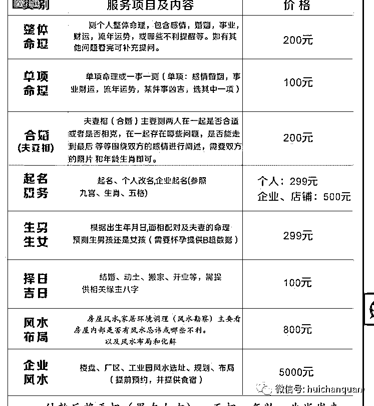

看到服务价格了么？

100 元起步

最高 5000 元

成本呢？

可以忽略不计

简直空手套白狼啊

至于说算得准不准？

那么请问

假如你家媳妇要生宝宝了

你问我

“大师 ，我家宝宝要生了，能不能帮我算算是男孩还是女孩？”

“缘主 ，请把你的生辰八字写下来”

“XXXXXXXX”

“经我测算 ，男孩的概率比较大”

“谢谢大师，200 供金红包请查收”

结果： 生了男孩

“大师 你真神了 ， 200 供金 给你”

“大师能不能帮我给宝宝起个名字？”

.......................

无限套路 带来长期暴利收益

那么有人说了

万一是女孩呢？

大师会说

“缘主 ，您的宝宝是天命所定，女孩会给您的家庭带来无限福报！这是上天赐给你的”

.....................

继续深扒

有的神汉 竟然开了淘宝店？

你不是造福于民嘛？

怎么还开淘宝创业了？

这位博主粉丝十万

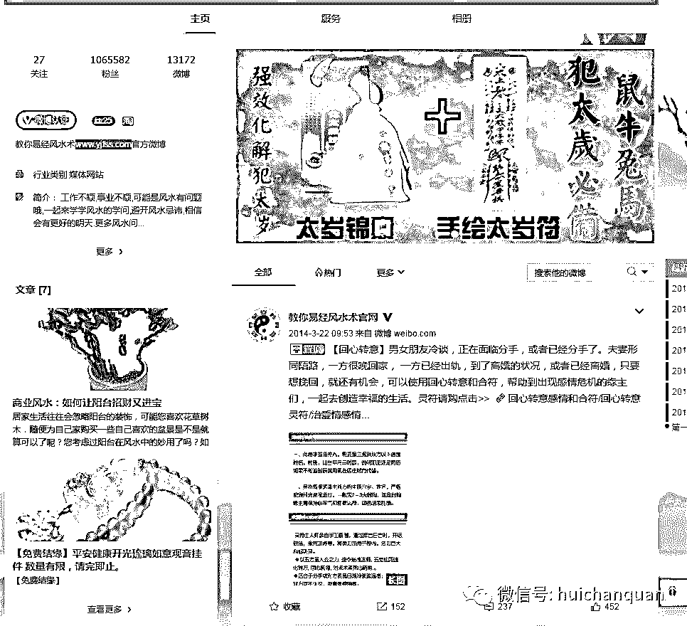

看他的首页

赤裸裸的广告啊

点开那个太岁锦囊

进入淘宝店 习惯性打开淘宝评论，

追评竟然都是差评

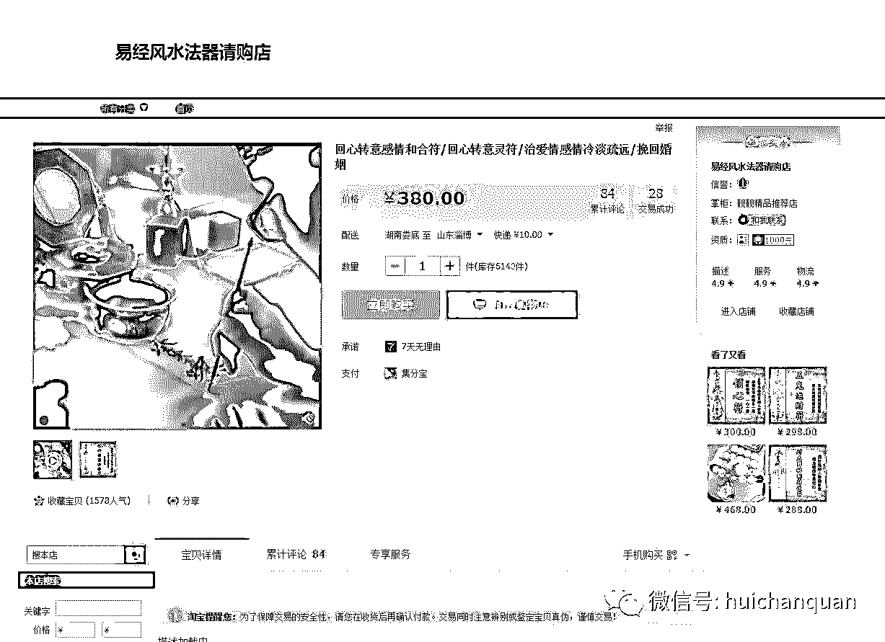

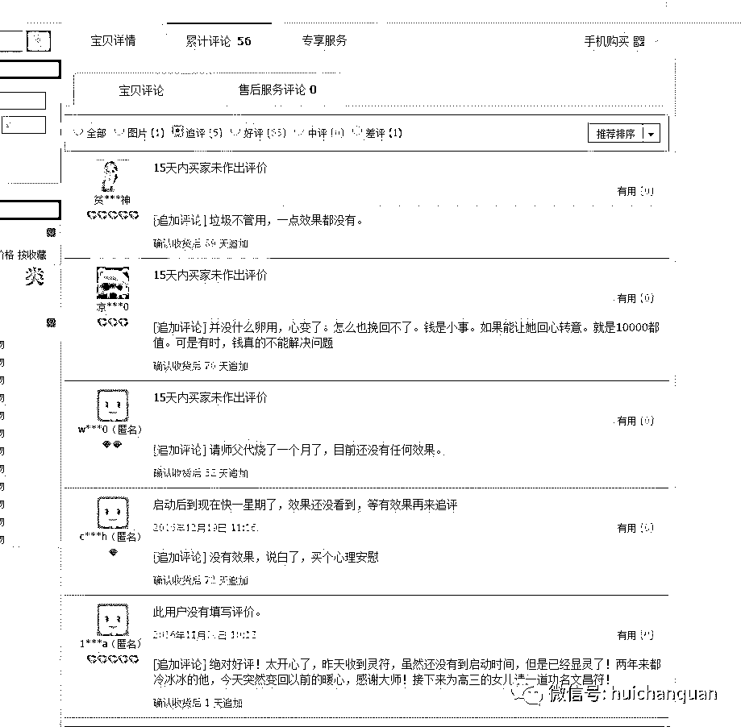

类似博主不下上百个，

看来此产业已经成为产业链 ，粉丝上三十万的有十几位，均是团队运作，甚至是注册公司在运作。有的还有官方主页，大多数只是通过加微信进行算卦。

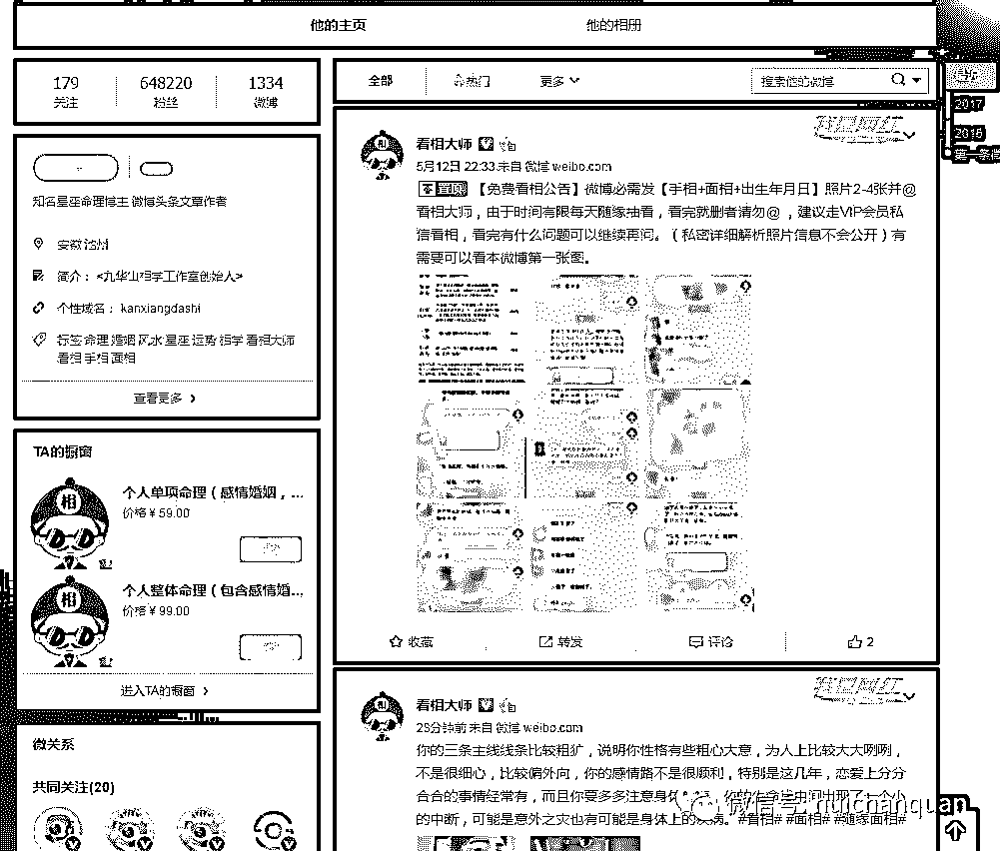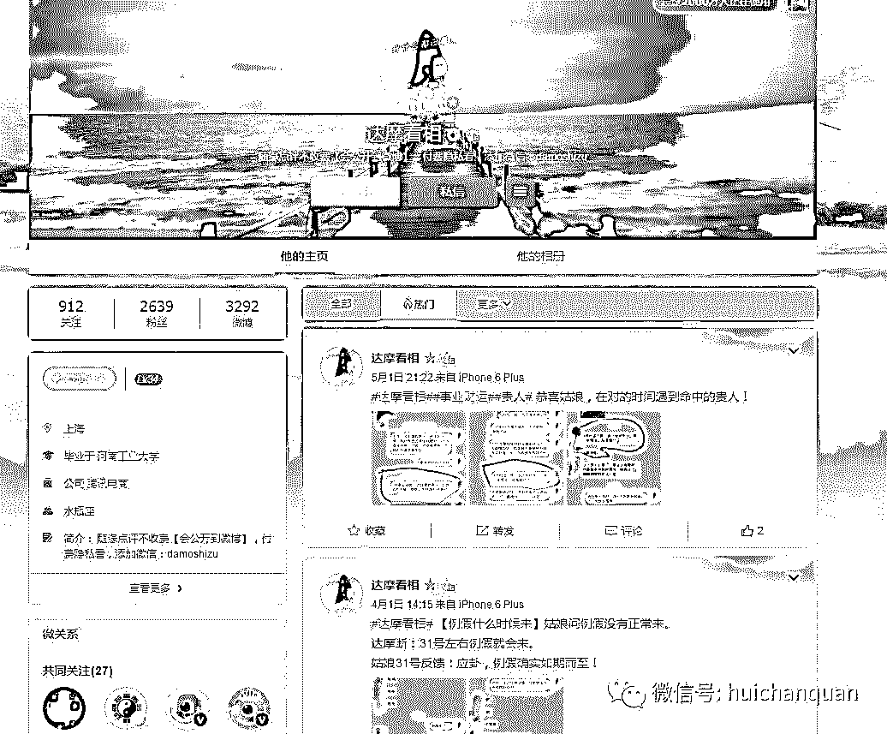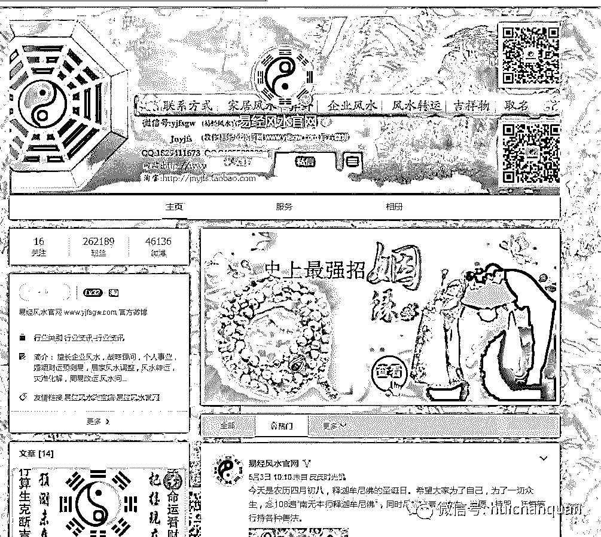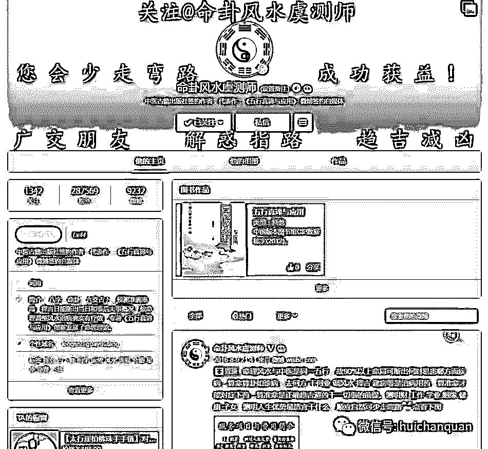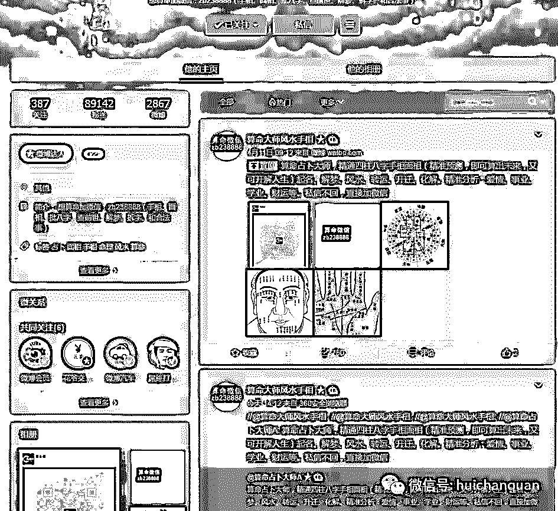

扒到这里我就不深入继续了，

怎么着也要给这个行业留条底裤

风水算卦历来是暴利产业

存在即合理

有需求就有市场

只不过这个通过包装 的所谓的大师

赚钱的时候想没想过 违背道德的透支福报

打着各种大师的幌子欺骗信众

我不做过多评论

总之这是一个灰色暴利的产业链，

从事人数众多，运作也很专业，

写这篇文章不是叫大家如何走偏门致富，

而是让大家提高警觉，不要再上当受骗，

下一篇我将扒一扒 微信金融行业的秘密 。