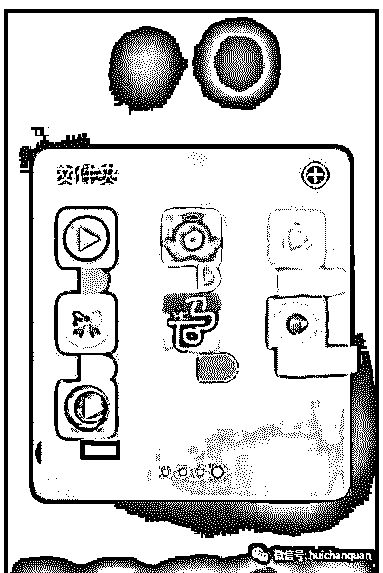
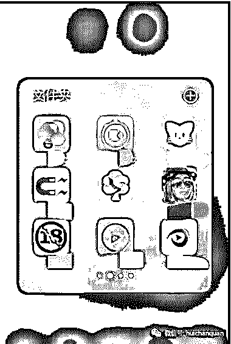
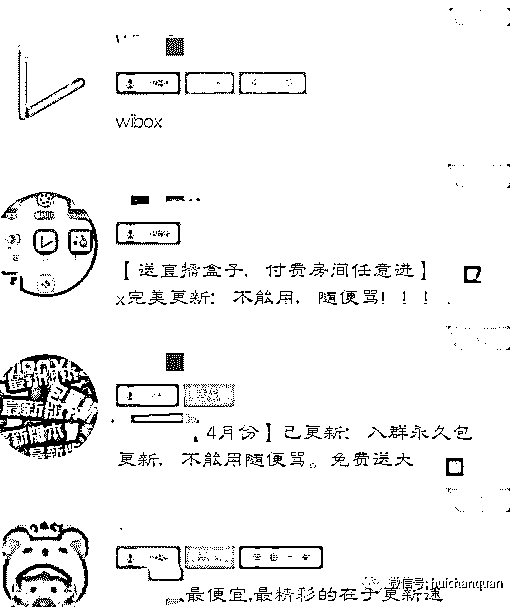
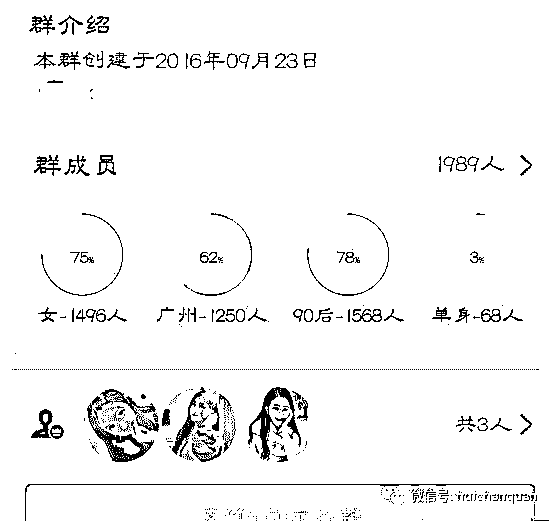

# 揭秘互联网三大灰色产业链：直播平台+QQ 群+淘宝暴利赚钱-网赚经验技术分享

> 原文：[`mp.weixin.qq.com/s?__biz=MzIyMDYwMTk0Mw==&mid=2247484716&idx=1&sn=713f039b26f44058832cfd5846c4c17d&chksm=97c8ce14a0bf4702ae0d1b958e8d10c6612c6c5bbedaa46c3005562114deb85e907a08425ffc&scene=27#wechat_redirect`](http://mp.weixin.qq.com/s?__biz=MzIyMDYwMTk0Mw==&mid=2247484716&idx=1&sn=713f039b26f44058832cfd5846c4c17d&chksm=97c8ce14a0bf4702ae0d1b958e8d10c6612c6c5bbedaa46c3005562114deb85e907a08425ffc&scene=27#wechat_redirect)

 <xbtmpl class="wxb-editor-template before" style="max-width: 100%; display: block; width: 591px; color: rgb(62, 62, 62); font-size: 16px; line-height: 25.6px; white-space: normal; box-sizing: border-box !important; word-wrap: break-word !important;"></xbtmpl> 

   前两天刚看到新闻，说是老虎直播平台涉嫌传播淫秽信息，被有关部门盯上了，12 名嫌疑人已经落网，还有前段时间很火的黄 shan 门主播。

      芸芸众生的互联网世界里，有可能不起眼的一条消息就能叩开一条上千万上亿的产业链，而附在这一条产业链上的人像分工明确的蚂蚁一样，时时刻刻搬运着属于自己的成果，不知疲倦的。  
      大部分的人都活在阳光照射的地方，他们可能永远不知道，看不见的角落里每天会有数以万计的财富在流通，每天赚着几万几十万的人可能在现实生活中就是你身边一个不起眼的人。

      他们真是的存在，而又神秘的不让人发现。  
      好了，思绪收回！

      得到一手资源之后，立马展开推广。

      首先在自己已有的色粉中进行宣传，最新最火爆的黄鳝视频，只要 8.8 打包带走。  
      其次在各大社交平台推广：

      微博，关注点赞转发加微信，免费赠送视频。吸了一波粉。  
      微信，qq 群使劲发。

      贴吧、兴趣部落赶紧发帖评论吸粉、变现。
      ......

      等等

      然后就是在淘宝开店铺。

      淘宝的流量真是大的不行，之前《人民的名义》样审片刚出来的时候，有的人就利用一个淘宝店一晚上就把一个微信号加满了，后面还在持续的吸粉。

      是不是觉得淘宝的流量大的吓人？毕竟是当今全球数一数二的购物网站。聪明的你们是否有一些想法了呢。
  然后是就是几块钱、几块钱的收，手到手软。  
      这只是一个依靠热点的超级短命的超级小项目。

      那么那些存活了很久的那些人、那些平台呢？  
      举个很简单的例子。  
      老虎直播相信很多朋友都听说过一直只听其声不闻其人，只听说很不可描述，但是从来就找不到下载地址，或者找到下载地址竟然不能注册。

      那么赚钱的机会来了，想要下载地址吗？交钱！

      想要注册的账号吗？交钱！  
      每天都是哗啦啦的现金流，从全国各地流向 xx 人都口袋。  
      如果有一天晚上，你躺在床上很无聊，突然一个 QQ 群里面跳出一条消息，xx 直播平台的的宣传或者下载地址还有一些不可描述的词语，再加上一张极其 XG 的女神图片。  
      不用怀疑，此时此刻，他的口袋再一次的鼓了起来。

      之前在网上看到一个名叫 laosiji 直播盒子的下载链接，是的，你没看错，图标就是这么不正经，就是这么直白。

      有人在网上把这个软件直接卖 120，然后你以为花了钱就可以了吗？NoNo！  
      还是太天真！钓鱼当然要钓大鱼。  
      地址买了之后，还需要购买按月会员，就是跟爱奇艺、优酷类似的，貌似 25 一个月，比爱奇艺、优酷贵的多。  
      上淘宝查了查，一个店铺一个月销量将近 8 千。

      然后类似这样的软件大概有多少呢？无法统计，随便举个例子，

      这些也应该只是冰山一角吧。  
      从这些软件我们又要延伸到付费 QQ 群了，QQ 群就像是他们的大本营。
         有的 QQ 群是带有综合性质的，不仅仅为一款 APP 服务，而是集齐很多款软件，因为很多软件的有效期只有那么几天，所以这些人必须要重复的付费，重复的下载。

      当夜色来临之际，所有的群都开始活跃起来。

      这些群便宜也就三五块，贵的就十块三十块，很多群都是近两千人的量，有的一个人就操控五六个，上十个这样的群。

      想想他们的每天的流水量。

      而且这种群由于很多原因，被封之后，所有的会员还得重新付费才能进群。

     想想他们真的好想每天坐在电脑旁就可以日入过万的样子。  
      你以为这就是他们的全部了吗？  
      远远不止！  
      谁也不知道这地底下的世界有多大，水有多深。

      每个环节上的人都在做着自己的事情，不显山不漏水，也不轻易的跨出属于自己的领域。  
      就像是工厂机器里的每一颗螺丝钉一样，那么的不显眼，同时也承载着无数人的**以及得到普通人难以企及的财富。

      孔子说，饮食男女，人之大欲存焉。  
      《孟子》说，食**也。  
      所以只要有人，只要**存在的一天，这个不为大众所熟悉的世界就像是一台永不停歇的机

       **   我的项目团队正在招募中，欢迎有志之士加入** 

