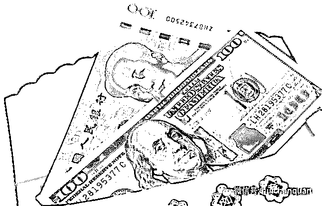

# 你为什么赚不到钱？

> 原文：[`mp.weixin.qq.com/s?__biz=MzIyMDYwMTk0Mw==&mid=2247484461&idx=1&sn=cc164b10c3e9ec8f24e7f9263e92b507&chksm=97c8cf15a0bf46035b79faaa6946c50c8e0bbd0b1609305c200fe739677b4e9a553d68bcacb6&scene=27#wechat_redirect`](http://mp.weixin.qq.com/s?__biz=MzIyMDYwMTk0Mw==&mid=2247484461&idx=1&sn=cc164b10c3e9ec8f24e7f9263e92b507&chksm=97c8cf15a0bf46035b79faaa6946c50c8e0bbd0b1609305c200fe739677b4e9a553d68bcacb6&scene=27#wechat_redirect)

在这个浮躁的钢筋水泥土社会，在互联网快速崛起的大浪潮中，在媒体急功近利的标题上，创业和赚钱似乎变成了我们活下去的唯一目标。

追求财富不是什么坏事，但如果每天都想着赚钱，那就是个彻头彻尾的傻 X。

今天我们就聊一聊赚钱的本质，我们到底为什么会赚不到钱?

1、赚钱不是过程，而是结果

在理解这点之前，我们要先理清下先后顺序——我们的钱到底是从哪儿来的?

实际上，我们的钱是通过价值交换获得的。

所以你不要每天挖空心思想着怎么去赚钱，而是先问问自己有没有价值?

有句话说的好：当你不断追求卓越的时候，成功一定会追赶你的脚步。

同理，当你把全部注意力放到提升自我价值上的时候，钱就会自然而然的飞进你的口袋，你甚至都不知道发生了什么，它自己就这么来了。

在中国你会发现一个现象，一般四五十岁的人都不会穷到哪里去。

即便是个普通人，家里有两三套房子，一两台车都是很正常的。

刨去中国经济发展的红利，你在一个行业或者某个专业领域不辞辛苦耕耘十年。

掌握了一定人脉或练就一身本领，那你就很容易用十年积累的价值去交换财富。

很多商家抱怨说消费者不买我的东西，不买你的东西就对了，因为你不能帮他们解决问题，他们又反问，我的产品能帮他们解决问题呀。

你要明白的是，产品只是价值链里的一个环节，并非全部。 甚至，产品是没有价值的，解决方案才有价值。

你能提出解决方案，你才有付出价值并获得财富的可能。

赚钱不是过程，而是当你做好一件事以后顺带的结果。

2、怎么赚更多钱?

有个段子很流行，说一个人在公司干了 10 年，他每天用同样方法做着同样的工作，每个月都领着同样的薪水。

一天，他愤愤不平的要求老板给他加薪。他对老板说：“毕竟，我已经有了 10 年的经验。”

老板叹气：“你不是有 10 年经验，你是一个经验用了 10 年。”

所以，无论你想赚钱，还是想赚更多钱，就必须不断学习，提升自我价值。

那么问题来了，到底如何不断提升自我价值呢?

因为我们无法预知未来，所以只能尽最大努力掌控现在，无论哪个领域，每天进步一点点即可。

比如昨天我不知道 1+1=2，但是今天我知道了，这就是进步。

昨天我不知道饭后不能马上剧烈运动，今天我知道了，这也是进步。

任何你今天知道的小知识点都有可能改变你的明天，但是如果原地踏步，你就完蛋了。

这不禁让我们思考，到底是什么力量促使我每天都要比昨天知道多一点呢?

答案是，永远保持对这个世界的热爱和好奇。

看到这里，我们得到一个意外的结论，正常人能赚到钱的原因竟然是“对这个世界的热爱和好奇”，而非其他。

如果能做到永远 18 岁，永远热泪盈眶，你就离赚钱不远了。

是不是很意外?我也很意外，但事实就是这样。

3、为什么有些人不努力也能赚很多钱?

任何事都有例外，赚钱也是。

每个时代都有红利，75 后遇上房地产，85 后遇上互联网，当你撞上这些时代大机遇，你基本不用怎么努力就能赚到钱。

十年前房子一两千一平，即便你刚走出社会一个月工资也能买好几平。

在不用交首付拎包入住的情况下，你稀里糊涂买了两套，十年后莫名其妙变成了百万富翁，这种例子太多了，没什么好奇怪的。

但是你又不能把生活重点放到满世界找“红利”这件事上，每代人都有自己的宿命。

或许我们这代人狂干十年连厕所都买不起，但或许下个红利就出现在明天早晨。

你唯一要做的是，今晚准备好。

4、为什么我们如此迫切的想赚钱?

既然我们知道“越想赚钱就越赚不到钱”，那为什么我们依然如此执着、迫切的想赚钱呢?

当然是媒体的功劳，要知道“十年赚一百万”基本没人看的，但是“一天赚一百万”就有点击率了。

人类是从众的，当你每天能看到一万个创富故事，你就再也坐不住了。

所以大部分中国人的人生目标被打磨成了一致性的四个字——我要赚钱！

不可否认，这颗蔚蓝色的星球上每天都在诞生神话和传奇，但大部分人的生活是波澜不惊的。

遗憾的是，现在整个社会都沦为了媒体造神计划的牺牲品。

生活很操蛋，它一边教我们做事一定要有目的，一边又在告诫我们“越想赚钱就越赚不到钱”。

所以很多人在赚钱这件事上做出了错误选择，现在你已经知道怎么做了——追求卓越，成功就会在不经意间追上你。

**                       我的项目团队正在招募中，欢迎有志之士加入**                              

