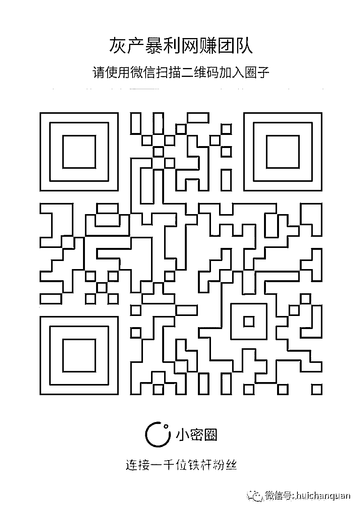

# 没项目？不怕，教你挖掘暴利项目

> 原文：[`mp.weixin.qq.com/s?__biz=MzIyMDYwMTk0Mw==&mid=2247483936&idx=1&sn=9059cb14138bd5aced42b8830f440dd1&chksm=97c8c918a0bf400edac620c0d4877744f657d634749645bd9c27000be7409a252961f9dbe46b&scene=27#wechat_redirect`](http://mp.weixin.qq.com/s?__biz=MzIyMDYwMTk0Mw==&mid=2247483936&idx=1&sn=9059cb14138bd5aced42b8830f440dd1&chksm=97c8c918a0bf400edac620c0d4877744f657d634749645bd9c27000be7409a252961f9dbe46b&scene=27#wechat_redirect)

你想学会挖掘并通过项目嘛？看了今天分享的这篇文章，以后你就不会缺项目了。

只要掌握下面的策略方法，你就可以随时随地挖掘赚钱商机项目，就会发现到处都有赚钱的机会。

也许你常常听人说：“赚钱其实很简单，只是你没有找到对的方法。”

一直以来大家都认为，一个好项目必定要有一个好产品。当然有好产品这只是一部分，要如何卖才是更重要。

作为一个商人来说，利益才是最重要的，所以如何挖掘项目，包装产品，才是卖货最重要的。

今天要分享两个重点：

1、挖掘项目

2、包装产品

第一个重点：挖掘项目

大家都知道减肥这个市场非常大，单单减肥就有 1000 亿级别。那你知道减肥也是有很多细分领域，比如减肥药，减肥操，减肥仪器，减肥书籍、心理教程等等，单单减肥药还可以在细分出来很多市场，比如什么中药减肥，减肥贴之类，产品形态非常多。

该如何挖掘项目，今天就简单分享一种方法，也可以简单的浓缩成一个字。

那就是“求”字。

比如：求减肥，求工作，求女友，求平安等等，每一个领域都可以进行细分挖掘需求，然后进行产品价值包装。

最核心关键，就是要聚焦自己的资源、优势、爱好、兴趣等等，然后进行分析，确定方向，再收集研究同行产品，细分剖析其背后的需求。

前不久有一位宝妈来咨询我，说她对问题孩子的教育引导很有研究心得，这就是属于亲子教育其中的一种细分商机，痛点巨大，需求明显，而且她有优势。

搞定产品非常简单，只要根据自己的优势、兴趣、爱好，按照上面分享的商机发掘方法，选定商机方向，几分钟就可以搞定一个独家产品。

第二个重点：包装项目

这其实还有很多策略，今天简单分享 4 种：

1、实物产品

3、实物+虚拟组合

4、多产品组合

第一种：实物产品

其实这种形式并没有什么好说，无非就是卖。当我们已经选定领域之后，如果我们有能力的话，那就进行 OEM 贴吧销售，如果没有能力的话，可以谈做代理销售，低进高售。如果谈不成代理，又低价进不来，那么我们就可以原价购买，加价销售。

加价销售，就是上阿里巴巴或看淘宝上哪个店销售最好，直接谈合作。要是谈不下来，就直接加价销售。反正赚钱就是，这样秒秒钟就搞定产品了。很多人觉得别人怎么会买，其实我们卖的不是产品，而且需求，如果你搞不懂这个，那么你就不合适做商人。

第二种：虚拟产品

虚拟产品是互联网的产物，主要形式有：电子书、图文 PPT、音频教程、视频教程、实体书、软件、源码，等等。

告诉你一个公开的秘密，虚拟产品的成本是最低，而且最暴力的产品形式。比如我之前参加的王通老师的顶尖文案课程，虽然只是花了 1200 元。后面我在写了一篇文案，把文案课程的全手抄笔记，卖了 3000 块，当时只限制 10 份。如果我现在在继续卖的话，估计还是可以卖很多份。

但是我却只花了 1200 元，同时只花了一点时间写了一篇文案。

第三种：实物+虚拟组合

现在这种形式也很多，比如我们在淘宝上销售美甲工具，那么如何比别人更加具有竞争力，这个时候你只需要增加一个赠品，那就是美甲视频教程大全。那如果你是销售虚拟产品，那你也可以把实物产品当赠品。

以前我卖神油的时候，平时我经常分享一些福利给粉丝。当时我弄了一个福利论坛，我卖收费会员的同时，只要加入会员我就送神油。

第四种：多产品套装组合

还是拿美甲的来举例，如何组合多产品套装，首先应该先给这个套装取一个名字，比如就叫做“默默美甲套装”。

其实就是：“美甲工具+美甲视频教程+VIP 会员交流群+实体书+优惠卷”，这个优惠卷的形式，你可以和其他店铺合作，进行互推，比如这个优惠卷可以是化妆品店铺等等。

这套组合别人家没有，那么这就是创新。

如果在一个竞争比较激烈的行业，你直接就可以从红海种解脱出来，轻松开启蓝海市场。

通过上面分享的方法，你可以轻松挖掘出项目，暴利产品，也可以轻松包装独家产品，同时也可以制作电子书，视频教程等等做为赠品，再在后端追销实现追销。

**                       我的项目团队正在招募中，欢迎有志之士加入**                              

