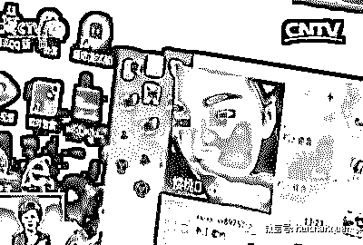
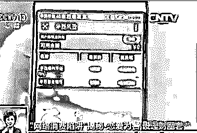
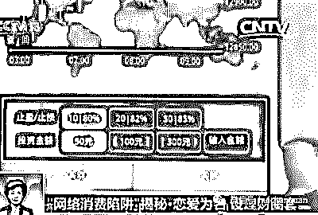
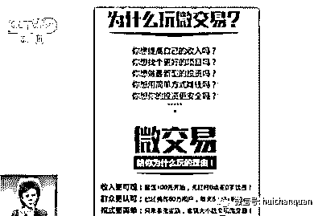
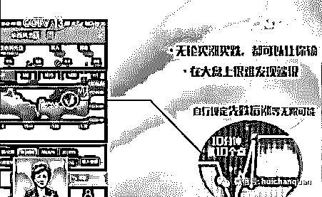
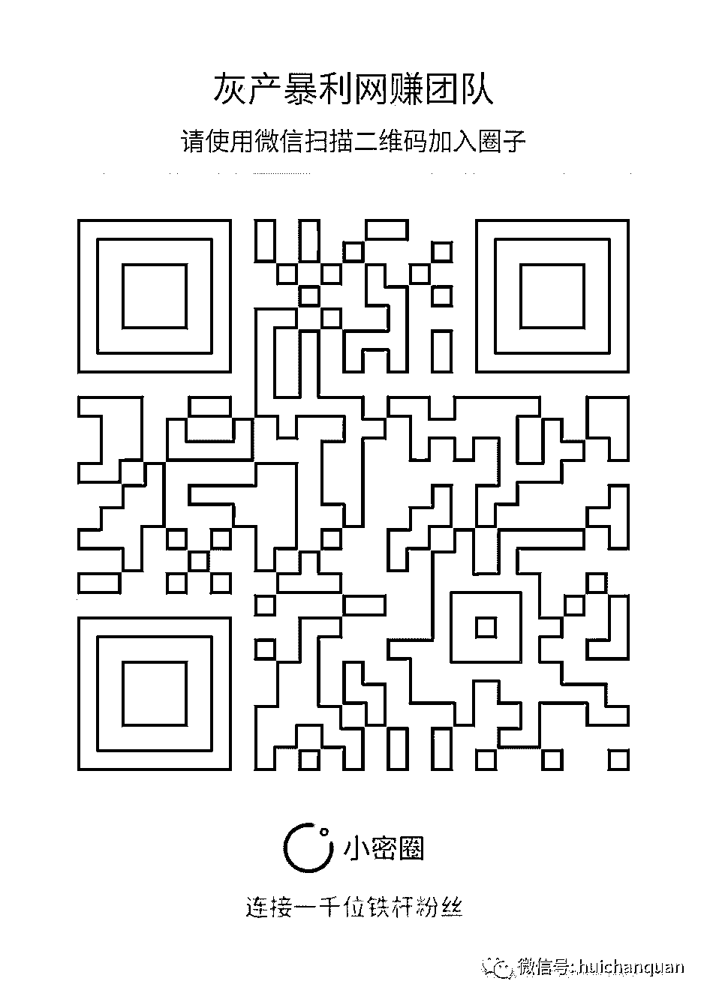

# 为什么总是有美女加你微信？男人陪男人聊天也能赚钱？

> 原文：[`mp.weixin.qq.com/s?__biz=MzIyMDYwMTk0Mw==&mid=2247483834&idx=1&sn=20c61c73f18162e80991383c6a42920c&chksm=97c8ca82a0bf43948f7fe2299e57414ce39e8bf65b4035c71656c55a5b65238e1d491ec27e1d&scene=27#wechat_redirect`](http://mp.weixin.qq.com/s?__biz=MzIyMDYwMTk0Mw==&mid=2247483834&idx=1&sn=20c61c73f18162e80991383c6a42920c&chksm=97c8ca82a0bf43948f7fe2299e57414ce39e8bf65b4035c71656c55a5b65238e1d491ec27e1d&scene=27#wechat_redirect)

“因为我们的工作微信号，都是以女性的身份。”

“三十七八岁的，基本上都是事业稳定的，所以说我们要明白，我们的客户，我们的对象，什么样的年龄段，假如说十七岁的年龄段，想都不用想，聊都不要聊。”

“大家感觉到没有，这个就像一个过山车，第一次聊天，他感觉有希望，包括第二天加深印象当朋友，这个时候他的希望程度是很高的，他热情程度是很高的，到第三步你将有男朋友，稍微泼点冷水的时候，虽然他觉得自己可能是有希望，但是这个时候他的情绪受到一个打击了，现在没有什么大情绪的，到了第四步，你要重新把这把火点着。”

除了教大家如何把握男性客户的心理，这家公司还让新入职人员将目标人群重点锁定在“30 至 50 岁经济收入较高的男性”。

2 诈骗第二步：铺垫酝酿 推销“理财产品”

同时，这家公司每组销售人员中都配备了一两个女销售员，她们的一个重要任务，就是帮组员运用语音欺骗客户；而几个长相俊美的女销售员，则还要充当视频陪聊人员。

铺垫了这么多，最后还是为了推销“理财产品”。所谓的理财产品，做的是包括铜和银在内的国际期货交易，这家公司称为“微交易”。

杭州深言商贸有限公司销售部某主管：

“充值的话，你就点这里，往账户里面充值，一千两千，五千，一万都可以入的，也可以入两百的。”

“感觉好像赌大小一样，可以这么去理解，你可以这么理解，但是你跟客户不能这么去讲，你跟客户讲，这就是理财。”

这款期货交易的理财产品，是通过一个叫做“华西风云”的微信公众号进行操作。单笔充值金额是 10 元至 5000 元，但是次数不限，也就是说充值总额没上限。

在界面上，还有一些期货交易的数据，以及走势图。点击开始

赚钱

，便能进行操作，操作十分简单，只有两项：买跌和买涨。

3.诈骗第三步：先尝甜头 请君入瓮

一般来说，被假冒美女的销售员骗进微交易的客户，为了顾及面子，都会抱着试试看的心态，在平台上充值几百。这个阶段，都会先让客户挣点儿小钱，尝点儿甜头，接下来，就要钓大鱼了，就是要让客户心甘情愿花大钱。为了做到这一步，公司还准备了更深的套路。

如果客户对这款期货交易产品心存疑虑，就会被引导加入一个专门微信群。销售员会告诉客户这个群里都是一些老客户。新客户一旦进入，老客户就开始晒收益，还会热情地传授

赚钱

的技巧。但是这些所谓的老客户，其实都是由公司员工充当的“托”。而一旦客户加大投入，就会血本无归。

杭州深言商贸有限公司销售部某销售员：

“我有一个客户，自从我做微盘之后，一直都跟我做，只要一发工资都全输光。两万块钱做五千的，四单就没了。”

揭秘：交易过程做手脚 骗你百万没商量！

因为操作简单，很多人一学就会，会了就着迷，觉得只要多花钱就能多赢钱。上瘾之后，往往刹不住车，不停往平台上充值。

可就算是赌大小，输赢机率也是各占 50%，而这家公司偏偏可以在“养客户”的时候，让客户稳赚不赔；而后期“杀客户”的时候，又能让客户赔得精光！

杭州深言商贸有限公司销售部某主管：

“我们只能说做一个分控，比如说现在行情在涨，我们只能说让他涨的速度快与慢，但是行情点位是不变的，大盘是一点都没有区别的。”

意思就是说，客户购买的期货根据国际走势，如果在 10 分钟内涨了 10 个点，这个数据是无法改动的；但是，在这 10 分钟的过程内，这家公司却可以自行设定无数种涨跌可能。换句话说，只有交易起点和终点的数字是固定的，而中间的过程，可以大做手脚。这么一来，无论你买涨买跌，公司都可以让你输，而且还让你在大盘上很难发现问题。

警方收网 抓捕上百名涉案人员！

在充分掌握了这家公司的可疑证据以后，卧底记者向杭州西湖区警方报案。

经过缜密侦查，3 月 17 日，杭州市**局西湖区分局调集 300 余名警力，一举抓获以微信交友为诱饵招揽受害人参与“华西风云”投资理财平台的 149 名涉嫌诈骗的嫌疑人，涉案价值五百余万元。经过初步审查，警方目前已对 100 余名犯罪嫌疑人采取刑事强制措施，案件还在进一步调查取证中。

套路太深！抓住必须依法严惩！

但更重要的是，控制心中的贪欲

才不会被别有心之人利用！

**                       我的项目团队正在招募中，欢迎有志之士加入**                              

