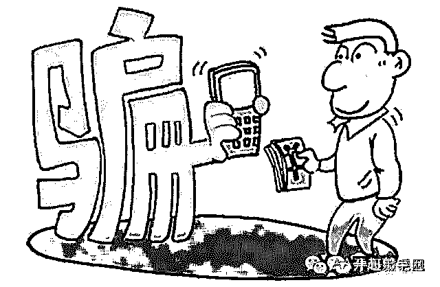

# 揭秘网赚行业 9 个能够年赚千万的骗局网赚项目

> 原文：[`mp.weixin.qq.com/s?__biz=MzIyMDYwMTk0Mw==&mid=2247483709&idx=1&sn=bae89f430d444cc068986e8be17eaa04&chksm=97c8ca05a0bf4313d55373eaeafbd4851ff19f220a109ebd5dcecc2d564399469963adbb51ac&scene=27#wechat_redirect`](http://mp.weixin.qq.com/s?__biz=MzIyMDYwMTk0Mw==&mid=2247483709&idx=1&sn=bae89f430d444cc068986e8be17eaa04&chksm=97c8ca05a0bf4313d55373eaeafbd4851ff19f220a109ebd5dcecc2d564399469963adbb51ac&scene=27#wechat_redirect)

在互联网快速发展变化的年代，很多网赚项目被人们所熟知，但是其背后的黑幕却是很少有人知道。而且很多人都在这些项目上中过招，因为能够玩这 12 种项目的人，在人性把控上可以用大师来称呼，在大师面前不中招才怪。但是玩这些项目的人，基本年收入都能过千万，甚至过亿。

 

太多的话就不说了，直接进入骗局项目介绍吧！

***一：低价手机充值卡***

超低价手机充值卡，无法想象的便宜，只需一折，就是说 100 元的充值卡只需要 10 元就可以买到，叫你拿到网上卖或地面上卖来赚钱。并且还是货到付款的。实际上这些都是空卡，但是做工和包装都是很好的，看着像真的，收货的时候，快递员不让刮开验货的。有的让验货就是最面上一张是真的，其它是假的，这些年我遇到好几个被这个骗术给骗，大多是想赚钱的，还有一个是想买来自已用的。这类广告这两年较少见，但还是有，需要注意别被骗了。

***二：淘宝刷信用，刷单***

现在不仅仅局限于淘宝了，天猫，京东都在刷。这行鱼龙混杂，有真刷的，有骗人的。真实的刷单价格是一单的价格在 1-10 元左右，主要是根据淘宝账号等级来决定的。坚持做下去也可以赚到一些钱，但是累，不多。如果要做也要通过朋友找到靠谱的组织，一般有一千元左右就可以启动了，花几百买账号，几百交平台压金，剩下的来做刷单费用。骗子宣传的技俩是按成交额来算收入的，刷一单 100 元的给 20，刷 1000 一单就给 200 元了，就几分钟就完成的事，实在是诱惑人。这个时候越想赚钱，被骗的越多。刷一次还不够，后面会找各种理由让你接着刷，电视上面经常曝光有人被骗几万元的。这些钱都进入了骗子伪造的网站上面了。现在骗子也学聪明了，刷单价格跟普通的一样，什么都模仿正规刷单平台的来，最后就是本金不给你，刷单佣金更不用谈。对于刷单，我们要拒绝诱惑，找信得过的人介绍靠谱组织。

***三：先培训赚钱再交钱的陷阱***

毫无悬念，绝对的骗子，这个行业没有雷锋。比较好的就是可以免费分享一些心得，但不是免费培训你赚钱，就是免费培训教你赚钱，即然免费了还收什么学费了。先培训赚钱，再交费的都是骗子，培训的过程就是给你洗脑，很多课程看完了就想交钱买他们的网站软件之类的，还有的是自已准备了网站最后做的是他们自已的联盟，最后还是不给结算，又要交钱，总之各种坑。现在这种模式经过各种伪装，你看到的不一定是我刚才说的那样，模式非常多，所以请远离先培训赚钱再交钱，否则要么浪费时间，要么被骗。

***四：支付宝漏洞刷钱***

无论哪种模式都是骗子，你照着演示一次，你自已支付宝的钱就转到骗子支付宝了。不用多考虑，这种是不可能存在的。即使有，没有傻子会把他公布出来。

***五：时时彩保底日赚五百元***

俗话说，十赌九输，靠玩彩票赌博怎么可能日赚五百元了，这个铁定是骗人的。一般会先让你加入 QQ 群，里面全是托，不停的发购买计划，发赢了钱的截图，不少人因这个输的很惨。做时时彩代理可以赚钱，但是这个伤天害理，骗人的，电视上也曝光过，警察叔叔在打击，切记不要操作。

***六：点击赚钱***

真实的点击赚钱项目是存在的，比如国外的 neobux，国内的点击赚钱要么连个电费赚不到，要么就是骗子。常见的手法有先到网站花多少钱买个会员，级别不同，点击广告的价格不高，最少都是几块的，有的夸张到上千块一个点击，简直太浮夸了。还有就是先让你点，最后要提现的时候，要么不给你支付，要么要你交一定的费用再让你提现。就目前来看，一个新人靠点击是赚不到钱的，不用注意这方面的项目，全当骗子来识别就好了，可以有效的防止被骗。

***七：做任务赚钱***

体验任务站点注册送几十元，一个任务几十元真实的任务网，游戏体验站点是存在的，简单做下赚个电费没有问题，做的比较久的朋友也可以月入两三千元。有人专门利用这个可以赚钱来欺骗新人，说的非常诱人，注册一个任务网就送几十元，见过的 10 到 50 元不等，然后做几个任务就可以到一百元提现了。任务也非常简单就是注册某某网站，下载某某软件，修改个签名等。等到提现的时候就不给提了，此时又要交纳一定的费用，交了之后直接拉黑 K 号。诱导目标人群去下载软件或者注册网站是网赚人经常会做的事，这个没什么，你贪小便宜，想快速赚到钱，人家让你去下载几个软件，去注册几个网站没有什么，很正常。但是事后又要交钱提现，交了更不给提，就是骗子了。

***八：挂机赚钱***

有人说挂机赚钱的项目都是骗子，这个也不对的，真实的挂机赚钱项目是存在的，但是涉及的问题太多，软件，平台等等，只有极少数的高手可以操作，并且这样的项目都是自已个人或团队研发，是能真正做到挂机赚钱的，但绝对是不可能收你几百块培训费用就公布出来的。所以说在网上有人跟你说有个挂机项目交个几百块就可以日赚多少的，你全当他放屁就好了，有这么好赚他跟你费话做什么，直接去包个小网吧，自已买电脑挂着赚钱了。作为新人不用考虑有挂着软件就能赚钱的项目等着你，都兑现不了承诺的，你试十次就会被骗十次，切记！

***九：投资分红***

此类项目在 2009 年开始流行，我第一次接触的是美国酷网基金，我也充进去了 100 元测试了一下，最后到提现的时候网站就登陆不上去了，大概就是这个套路，描述的很美好，现实很残酷。

这类网站还有个特点就是投资少的账号一提现马上封，因为没啥投资潜力。投多一点的，如果你先提小部分，他不会封你的，等你投更多，再提多的时候再封你。

关于我们

微信公众号：AA 开心羊毛网

专注分享各种网赚项目、免费福利、抢红包、领话费等活动，传授网赚技巧、心得，让你在空闲之余多一份收入，轻松赚钱！每天更新，敬请持续关注！更多给力项目等你来做！

 

