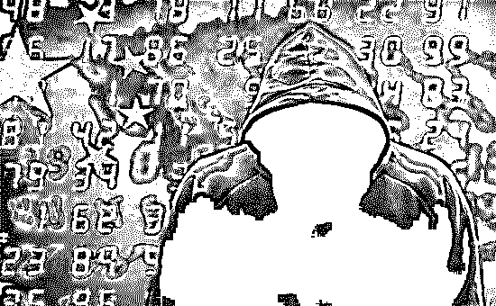
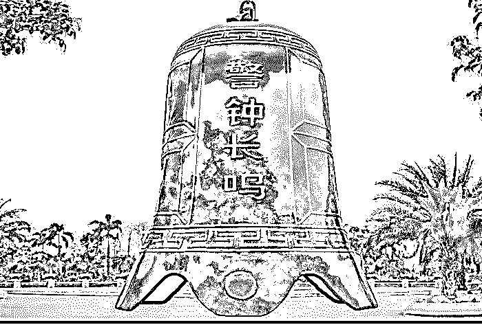
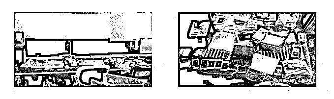
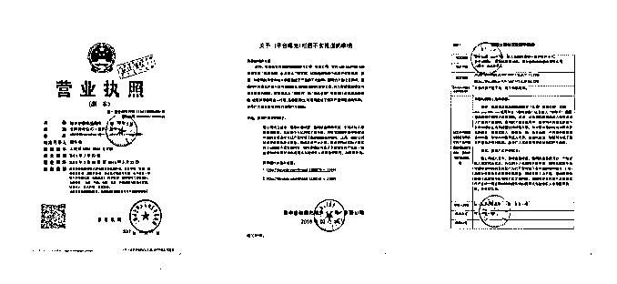
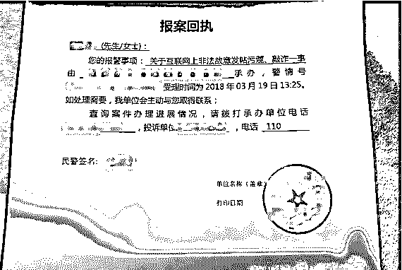
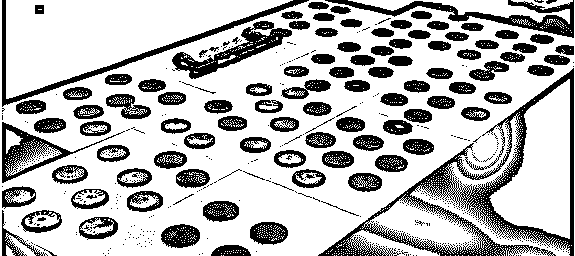
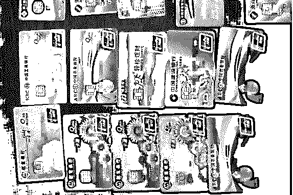

# 水军向左 | 舆论向右

> 原文：[`mp.weixin.qq.com/s?__biz=MzIyMDYwMTk0Mw==&mid=2247494210&idx=1&sn=c9560997e9f0fa13e628da0fef812c32&chksm=97cb217aa0bca86cce2126626f5e7db94b154ab5771678dcefdc3c1a9e16cdd5ed519a3ec9d7&scene=27#wechat_redirect`](http://mp.weixin.qq.com/s?__biz=MzIyMDYwMTk0Mw==&mid=2247494210&idx=1&sn=c9560997e9f0fa13e628da0fef812c32&chksm=97cb217aa0bca86cce2126626f5e7db94b154ab5771678dcefdc3c1a9e16cdd5ed519a3ec9d7&scene=27#wechat_redirect)

**点击上方蓝色字体“灰产圈”关注并置顶本公众号**

导语

近年来，以一些自媒体为代表的“网络水军”违法犯罪活动日趋活跃。

他们打着“舆论监督”“法制监督”“社会监督”等旗号，与不法网站和少数媒体内部人员相互勾结。

利用微博、微信公众号、大鱼号、百家号等网络账号，以及境内外互联网上的自建网站和通信群组，频繁组织实施有偿发帖、有偿删帖、有偿公关、有偿操控舆论等网络行为。

涉嫌从事敲诈勒索、强迫交易、诈骗、非法经营、寻衅滋事、侮辱诽谤、侵犯公民个人信息等违法犯罪活动，严重破坏互联网秩序，干扰国家对互联网的正常管理，危害传统文化、社会道德和公序良俗。

法网恢恢，疏而不漏

对此，公安部部署全国公安机关依法对“网络水军”持续开展专项打击。今年以来全国公安机关查清了一批“网络水军”灰色产业的人员构成、运营模式、盈利方式，发现了一批违法犯罪活动线索，成功侦破自媒体“网络水军”团伙犯罪案件 28 起，抓获犯罪嫌疑人 67 名，关闭涉案网站 31 家，关闭各类网络大 V 账号 1100 余个，涉及被敲诈勒索的企事业单位 80 余家。

一三种人员构成

调查发现，自媒体“网络水军”人员组织化倾向明显。

**一是核心人员**，主要由网络公关公司及其雇用的“写手”和“水军”构成。网络公关公司是“网络水军”的幕后老板，负责接受“客户”请求，策划组织网络炒作、有偿删帖等活动；“写手”熟悉网民心理，专职撰写、提供炒作素材；“水军”是网上炒作活动的具体实施者，以网上有偿发帖牟利。

**二是上游人员**，主要由“网络水军”业务的需求者构成。主要包括广告商、委托人、爆料人。他们通过“水军”炒作提高其投放广告的点击量；委托人、爆料人提供炒点，通过“水军”攻击炒作指定单位、人员，达到自身诉求。

**三是下游人员**，主要由“网络水军”业务的辅助实施者构成。其中包括专业推手、小型非法网站运营者和知名网站“内鬼”。专业推手往往是一些网络“大 V”“网红”等，借助自身在“粉丝”中的影响力，为炒作活动站脚助威；小型非法网站运营者、知名网站的“内鬼”（如编辑、版主）主要是接受“任务”，协助“网络水军”删除、置顶帖文等，从中谋取非法利益。

二四种盈利模式

据了解，自媒体“网络水军”的盈利方式主要有四种。

**一是有偿删帖。**非法建立小型网站，针对地方企事业单位、个人，按照上游人员的需求捏造事实、甚至恶意诽谤，并利用网络推手大肆炒作，胁迫涉事人员和企事业单位出钱“了事”。

**二是有偿发帖。**借助开办的信息发布平台，承接“客户”发帖业务，通过雇用的“网络水军”，有目的有计划地大规模炒作。

**三是非法广告宣传。**通过雇用的“网络水军”，并依托有关系的“网络大 V”、知名博主、论坛版主、网红等，为“客户”转发非法广告、扩大宣传效应。

**四是恶意植入木马病毒，招揽业务。**通过将木马植入网页，刷新网页点击率以博取广告商“眼球”，从而招揽业务、获取经济利益。

三三大行为特点

“利用自媒体敲诈勒索是传统‘网络水军’的变种，相比起来，它比传统手段更隐蔽，案件侦破难度更大。”有关负责人介绍，在群众、企业举报信息的基础上深入调查，发现并总结出自媒体“网络水军”敲诈勒索的行为特点。

**一是作案手段隐蔽，手法隐晦。**一些自媒体“网络水军”团伙为规避打击，将涉案网站搭建在境外，使用虚假身份办理银行卡、支付宝、财付通、4G 网卡，作案手法专业，已形成集假网站制作、假身份销售、假银行卡账号办理于一体的非法产业链条。

**二是冒用新闻媒体名义，借助虚假新闻网站进行炒作。**犯罪团伙通过网上搜索企事业单位负面信息，发布或威胁发布负面帖文炒作，形成舆论压力，实施敲诈勒索活动。虚假新闻网站往往被冠以“法制”“中国”“中华”等字眼来制造影响力。

**三是真假我们勾结串联作案。**真我们主要是借助其我们身份与受害单位接触，假我们主要从事目标选择、炒作等非接触性工作，不直接索要钱财，而是通过“报刊费”“广告宣传费”“会员理事费”等名义变相实施敲诈勒索。

案件呈现，警醒世人

2018 年，上海市公安局在开展“净网 2018”专项行动中，也以严厉打击“网络水军”为重点，有力震慑了网络犯罪的嚣张气焰。

2018 年 1 月，上海市公安局网安总队接市委网信办通报，称有人假冒“上海市互联网违法和不良信息举报中心”的名义，向属地网站发送要求撤稿删帖的邮件，存在有偿删帖的嫌疑。

经缜密侦查，破获了一起假冒企事业单位和媒体等名义，在全国范围实施有偿删帖的网络水军犯罪团伙的案件，抓获魏某某等 4 名犯罪嫌疑人，犯罪金额达 300 万余元，涉及 20 余家媒体及近百家网站被假冒。这起案件的侦破，也成为上海市公安局开展“净网 2018”专项行动以来的一项重大成果。

“这种案子还没碰到过，以前这种类型的案子充其量是花钱有偿删帖，没见过冒充媒体和企事业单位的。”负责侦办此案的上海市公安局网安总队 KK 同志感慨。

**▲该团伙使用的作案电脑与手机**

如此堂而皇之的网络犯罪活动是如何开展的？犯罪团伙使用怎样的手段才能骗过媒体和网站，达到删帖的目的？

一 20 余家媒体被要求删稿

案件初露端倪，来自上海市委网信办的一则通报。

据上海公安网安部门介绍，2018 年 1 月，网安部门接市委网信办通报，称有人假冒“上海市互联网违法和不良信息举报中心”的名义，向属地网站发送要求撤稿删帖的邮件，存在有偿删帖的嫌疑。据此，公安机关随即展开调查。

经过持续 2 个多月的侦查，警方摸清了这一团伙的犯罪事实。KK 同志向我们介绍，犯罪团伙中魏某某是组织的核心人员，他通过单线联系操控团伙，而其他成员则分工协作、互不相识。

犯罪活动的大致脉络是这样的。“魏某某先是对外号称自己可以删帖，从一些被爆负面新闻的公司接单，然后通过其他团伙成员伪造原创媒体的法律文书，甚至国家机关的公文，送到网站平台要求撤稿，得手后获得报酬。”KK 同志说。

公安机关的调查显示，从 2016 年底开始，犯罪嫌疑人魏某某伙同其团伙成员，伪造律师函、报案回执、营业执照等各种各样的法律文书，为有偿删帖准备相关材料和凭证。有时冒充原创的新闻媒体，有时冒充企事业单位，以各种名义要求平台网站撤稿删帖，涉及 20 多家媒体及近百家网站被冒充。截至案发，这一团伙有偿删帖千余篇，非法获利达 300 万余元。

那么，犯罪团伙具体如何操作才使媒体和网站信以为真并删帖呢？

二“放心吧，24 小时内（删）掉”

上海公安相关调查发现，该团伙有偿删帖的内容主要为金融类企业的负面信息。他们从网上接单后，首先以涉事公司名义要求网站删帖，如未得手，则以首发媒体名义要求转载媒体删帖，如仍未得手，则冒充“互联网违法和不良信息举报中心”等部门的名义，向媒体施压要求删帖。

“最常见的方式还是冒充企业，伪造证据，以被曝光企业的名义直接要求媒体撤稿。”KK 同志告诉我们，该案中，这一团伙以企业名义伪造文书，非法删除 700 余篇媒体文章。

伪造企业什么样的法律文书能让媒体撤稿？警方通过一则典型案例作了介绍。

2018 年 3 月，某 P2P 公司法人代表被爆出负面新闻，为避免引发投资人挤兑，该公司希望删除网上的负面文章。很快，魏某某就通过 QQ 获知情况并接单。他的 QQ 聊天记录显示，每条帖子他开价 5000 元，当时该公司这一负面报道共在 6 家平台网站发布。

“放心吧，24 小时内（删）掉”，魏某某通过 QQ 聊天，轻松应承了这家公司所有删帖需求。

紧接着，他先指导卢某以“有人故意造谣、诽谤公司”等理由制作一份该公司申明。然后，指使卢某、郭某某伪造该公司法人的身份证，又私刻公司的印章，制作了一个假的营业执照。甚至他还伪造了一份该公司属地派出所的报案回执单。最后，魏某某把所有伪造好的文件发给了 6 家媒体要求撤稿。

**▲该团伙伪造的各类文书**

“实际上，这些伪造文件显示的信息完全改变了真实信息，”KK 同志向我们解释，案件中，媒体原本报道了这家公司法人代表的负面新闻，犯罪团伙通过改头换面，把公司法人从各个文件中换成了其他人，并加盖公章，使发稿媒体误以为自己报道有错。加上假冒公安机关的报案回执单，制造了企业已就“造谣”之事报案，而且警方已受理的假象，向媒体进一步施压。“这些假文书会让媒体以为真的做了假新闻。”KK 同志说。

删帖得手后，魏某某团伙一天内就非法获利 3 万余元。

**▲该团伙伪造的报案回执单与私刻的公章**

三冒充主体五花八门

还有一些情况，魏某某等人则冒充首发媒体甚至机关单位，要求相关网站平台删帖。

2018 年 2 月，多家媒体转载报道了某公司食品存在安全隐患的负面新闻。魏某某接单后，同样是制造假冒的法律文书，他指使卢某冒充首发媒体名义向多家媒体撰写撤稿函，这次他对措辞稍作修改，以首发媒体名义称“收到有关部门反馈，文章所涉内容目前正在进行司法调查，不适合网络传播”。

“转载网站看到‘首发媒体’发来加盖公章及水印的文书后，就相信了，然后撤了稿。”KK 同志说，该团伙通过冒充首发媒体，要求转载媒体下撤相关报道，删帖数量达 200 余篇。

但如果冒充公司或首发媒体删帖均未得手，这个犯罪团伙便仿冒“中国互联网违法和不良信息举报中心”名义，以“相关报道中存在虚假信息”等理由向媒体再次施压，要求删帖。

KK 同志举例称，2018 年 3 月，魏某某接单后，编造了“相关文章属于未经授权转载，涉及侵权，易引发社会舆论”的理由，以伪造“中国互联网违法和不良信息举报中心”邮件地址的手法，假冒“中国互联网违法和不良信息举报中心”发邮件至相关网站要求撤稿。删帖成功后，该团伙从中非法获利 10 万余元。

**▲该团伙使用的作案银行卡**

据上海公安机关调查，魏某某等人通过冒充“中国互联网违法和不良信息举报中心”的手法，删帖数量超过 50 篇，冒充企事业单位下撤稿函，删帖超千篇。

结尾

随着国家网络监管要求实名制及各平台规范的日趋成熟，水军的生存空间越来越少！

再者水军宣传，有失公平竞争原则，为人不喜，如果是危机公关事件，更是被大众所厌恶，因此这一行业前景并不明朗！

没有赞美，只有人人喊打，水军行业从开始就注定只能藏身幕后，承受万千骂名。

虽然这个行业不会消失，但是没落已经不可避免！

走过最长的路，是你的套路；

排过最长的队，是全是托的队！

经常见各种网红饼店、奶茶店、饭店等，排个大长队，浩浩荡荡，引人瞩目！

还以为多么好吃，多么火爆，不明觉厉，最后才知道都是托，专业排队造人气！

线下消费多，让我背黑锅！

线上也不少，俗称五毛党！

●[“AI 水军”时代到来！](http://mp.weixin.qq.com/s?__biz=MzIyMDYwMTk0Mw==&mid=2247490968&idx=1&sn=3894cf325572f81cf582d9575d48d9ae&chksm=97c8d6a0a0bf5fb638b5747092876b998cde7238f25f5c957d7379508224b3e185e699fd5d2f&scene=21#wechat_redirect)

●[深度 | "恶意注册账号"黑产全揭秘：刷粉，炒信，薅羊毛，卖茶，卖蜜，还荐股！](http://mp.weixin.qq.com/s?__biz=MzIyMDYwMTk0Mw==&mid=2247494095&idx=1&sn=10e63105fd74b13e3755de7f89318bf9&chksm=97cb22f7a0bcabe1ab4e56c886ff1872b24a889e75a6e5afe9ece48d6c471fe217bf4e3a2c33&scene=21#wechat_redirect)

●[100 部手机人工刷、1 个账号收 700，抖音算法滋生群控系统······](http://mp.weixin.qq.com/s?__biz=MzIyMDYwMTk0Mw==&mid=2247493820&idx=2&sn=180e6dbeea4e6d22b86bbb5fb226ffe4&chksm=97cb2384a0bcaa922fbff05234285a2f8c3a9d54a6da0f8a74471f07a07166c693d885b67179&scene=21#wechat_redirect)

●[是谁捅了“马蜂窝”？2100 万"真实点评" ， 1800 万条抄袭，7000 个机器人刷量！](http://mp.weixin.qq.com/s?__biz=MzIyMDYwMTk0Mw==&mid=2247493625&idx=1&sn=e1a90c75f28f0a2d0d5227c381baf6a4&chksm=97cb2cc1a0bca5d7a0ac4e9c36c8378e0c759d4751e8b990503fc7e89936c885ebec6a943615&scene=21#wechat_redirect)

   

**点击加入 ****灰产圈 | 高端社群**