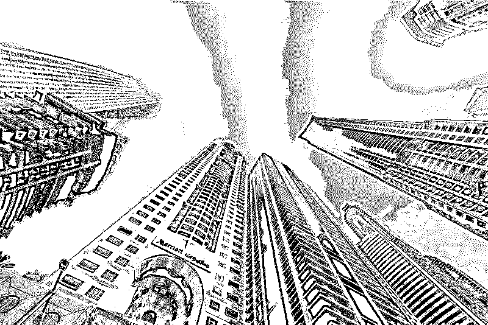
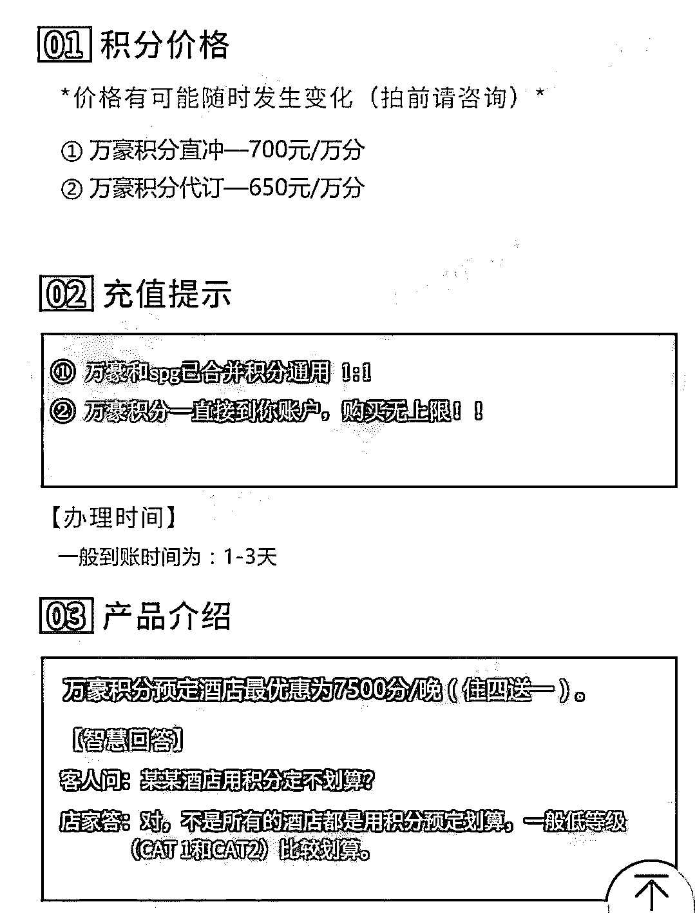
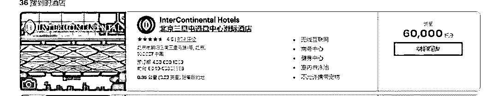
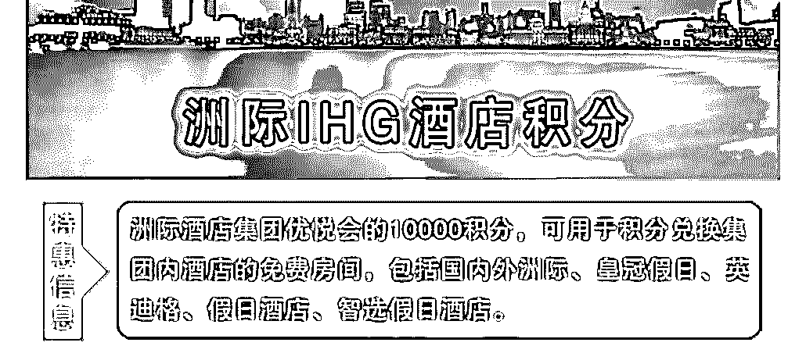

# 黑客连薅万豪集团 5 年“羊毛”，蚕食用户沉淀积分后黑市销赃！

> 原文：[`mp.weixin.qq.com/s?__biz=MzIyMDYwMTk0Mw==&mid=2247494123&idx=1&sn=d3a60417806c944fe046fc55bb240366&chksm=97cb22d3a0bcabc5e0e3c689a7d5e614d7703dbd16d6c75a050665e9e63cf07e649d00661b8b&scene=27#wechat_redirect`](http://mp.weixin.qq.com/s?__biz=MzIyMDYwMTk0Mw==&mid=2247494123&idx=1&sn=d3a60417806c944fe046fc55bb240366&chksm=97cb22d3a0bcabc5e0e3c689a7d5e614d7703dbd16d6c75a050665e9e63cf07e649d00661b8b&scene=27#wechat_redirect)

**点击上方蓝色字体“灰产圈”关注并置顶本公众号**

****

****作者：章蔚玮****

****来源： IT 时报****

**5 亿用户数据被“黑”！近日，万豪国际集团在其官网通告了一则数据安全事件，初步预计将涉及 5 亿用户，成为继雅虎约 3 亿用户信息被黑客窃取以来规模最大的一次信息泄露事件。**

****

**比 5 亿用户数据被“黑”更令人惊讶的是，一条全新的“黑产”链条浮出水面。万豪国际在 2018 年 11 月 19 日的调查中发现，从 2014 年至 2018 年 9 月 10 日，旗下喜达屋酒店预订数据库的住客信息在未经授权的情况下被访问，5 年中，黑客在不惊动酒店集团和酒店顾客的前提下，不断蚕食顾客沉淀积分，并谋取“细水长流”式的黑色利益。**

**01****万豪或面临最高 6.8 亿美元罚款**

**根据万豪国际的通告，这起事件的爆发源于其内部安全工具在今年 11 月 19 日发出的一条安全警报，在进一步的调查中，安全人员发现从 2014 年开始就不断有第三方试图对喜达屋网络进行未授权访问，并企图将数据移至他处。目前，基本可以确认的是，其中有 3.27 亿用户的出生日期、电子邮件地址、护照号码、SPG 俱乐部账户信息、出生日期、性别、到达及离开信息、预订信息和通信偏好已经被泄露。**

**这起跨度达 4 年之久的数据泄露事件目前依然没有得到解决。据万豪国际的官方声明，已将这起事件通知英国信息专员办公室，并向相关执法部门通告，配合调查。**

**“去年已经有白帽子发现了万豪国际存在的数据库漏洞，但万豪国际并未通过官方渠道披露，拖到今年公布应该是担心遭致巨额罚款。”在安全团队网络火刀创始人曲子龙看来，万豪国际之所以选择在现在这个时间点公布，与欧盟在今年 5 月正式推行的《通用数据保护条例》（简称 GDPR）有关。这套被称为史上最严格的个人数据保护条例，对包括欧盟内部企业、在欧盟开展业务的跨国企业以及为欧盟公民提供业务服务的海外企业，在数据采集、数据保护和数据应用上都进行了规范。**

**比如，根据欧盟的 GDPR，涉事公司需在 72 小时内通报数据泄露事件，否则将面临罚款。按条例最高可罚公司去年全球总营收的 4%或 2000 万欧元(约 1.8 亿港元)，以价高者为准。如果按照万豪去年总营收 170 多亿美元计算，万豪则将面临高达 6.8 亿美元的巨额罚款。**

**事件爆发后，万豪国际首席执行官表示将开始逐步淘汰喜达屋整套 IT 系统。据国内安全团队安华金和分析，此次万豪数据库安全事件的根源，应该由 2015 年喜达屋未完全清理 IT 系统木马后门导致。**

**近年来，从国外到国内，从如家酒店、华住酒店到万豪国际，酒店业数据被盗取事件一直层出不穷。安全漏洞为何始终无法堵上？一位酒店业内人士对此也十分无奈，在他看来，这和酒店业天生对外接口多且业务复杂有关，“国内酒店业由于业务需要，有大量通往内网的接口，出于安全考量，会对其中重要接口设置身份认证的关卡，但这套安全体系程序繁琐，对 IT 体系运作效率造成影响，因此在实际运行中，很难全面铺开。这也给黑客留下了更多攻击的机会。”在效益与安全之间，国内外酒店业都在面临拷问。**

**与此同时，随着 GDPR 的推行，将倒推一批在世界范围开展业务的企业率先启动对数据保护的反思。据国内一家安全企业透露，在 GDPR 启动后，一批航空公司已经开始设立新的数据安全保护机制。**

**02****酒店积分是黑客套利目标**

**“黑客组织一直盯着酒店业数据，不是因为酒店业易于入侵的 IT 环境，而是酒店数据中自带的巨大经济效益。”据安华金和的技术专家分析，如今的黑客攻击很大比例是以犯罪风险低、变现速度快为目的，恰好酒店业有一种数据满足黑客的这种需求——酒店会员积分。**

**在此次万豪声明外泄的数据包中除了用户基本身份信息外，还有一条并不显眼的数据类型——SPG 俱乐部账户信息。**

**SPG 俱乐部是万豪国际集团旗下的会员组织，SPG 积分可以直接兑换酒店房费，也可在不同账号之间转入转出。有技术人员发现，在 Dream Market、Olympus and Berlusconi Market 等线上黑市，SPG 积分一度有巨大交易额——在黑市 1 个 SPG 积分价格在 5 美分左右（官网价格 35 美分）。**

**“大部分用户很少关注自己酒店账户中的积分，因此，黑客只要每次转移用户有限的积分，就可以稳定持续地利用 SPG 积分赚钱而不被发现。”在上述技术人士看来，黑客隐藏了 4 年才被发现，说明黑客之前并未大规模贩卖盗取个人信息和信用卡信息。相反，同样可以快速变现的酒店会员积分才是黑客窃取的目标。**

****

**截至发稿前，黑市上的 SPG 积分销售信息都已消失，但我们从国内一位酒店业人士处了解到，类似窃取会员积分的情况并不是孤例，在国内也有黑客悄然进出酒店后台系统，窃取用户会员积分，再出售到市场上，极少有用户发现后主动举报。** 

**03****每一万分积分最高报价 700 元**

**我们尝试在飞猪和闲鱼上搜索“万豪酒店积分出售”，至少出现了十几家销售 SPG 积分的卖家，报价各有不同，每一万积分的报价在 560 元到 700 元之间，我们随机查阅了其中两家的月销售额，基本维持在 40—50 单之间。按每售出 10 万积分计算，收入即可达 5600 元到 7000 元之间，一旦超过 40 单，月收入即有望达到 3 万元。与此同时，不少卖家手中的积分也都十分“宽裕”，20—40 万的积分，2—4 天就能到账。**

****

**究竟是什么人在购买积分呢？我们对比了一下积分兑换与实际房费，北京三里屯洲际酒店标间的市场价是 1950 元，用会员积分兑换是 60000 积分，而购买 60000 积分的兑换价大约在 1560 元，基本等于在市场报价的基础上打了 8 折，其主要目标受众依然集中于中高端消费人群。** 

****

**目前，市场上流通的，除了万豪 SPG 会员积分外，洲际酒店的 IHG 会员积分也十分“热销”。尽管这些卖家不愿透露巨额积分的具体来源，并且都信誓旦旦保证通过“酒店活动”积攒，来源正规，不过在交易过程中却反复提醒我们，千万不要向酒店透露积分的具体来源，“否则酒店一旦追查，就会带来风险。”** 

**采访中发现，酒店对积分兑换房价并没有特别多限制，除了积分转入的会员账户注册时间必须大于 90 天，每个账号每年限制转入转出 10 万积分之外，不同酒店对会员积分是否会员本人使用并没有过多限制。这也给积分交易带来可钻空子。**

****

**●[深度 | "恶意注册账号"黑产全揭秘：刷粉，炒信，薅羊毛，卖茶，卖蜜，还荐股！](http://mp.weixin.qq.com/s?__biz=MzIyMDYwMTk0Mw==&mid=2247494095&idx=1&sn=10e63105fd74b13e3755de7f89318bf9&chksm=97cb22f7a0bcabe1ab4e56c886ff1872b24a889e75a6e5afe9ece48d6c471fe217bf4e3a2c33&scene=21#wechat_redirect)**

**●[「双十一黑产狂欢日」黑客，羊毛党十万军团出动，干上一天，日入十万，够吃一年！](http://mp.weixin.qq.com/s?__biz=MzIyMDYwMTk0Mw==&mid=2247493904&idx=1&sn=9209dd9b23c169190d2a9ff771fe5116&chksm=97cb2228a0bcab3e2b9cdcd3fce48c3561900c27027d9068028f3bbb6d7ff7eae6d9bca546d1&scene=21#wechat_redirect)**

**●[深度|薅羊毛黑产攻防实录：“羊毛党”与“攻城狮”之间的博弈游戏](http://mp.weixin.qq.com/s?__biz=MzIyMDYwMTk0Mw==&mid=2247489704&idx=1&sn=fd723f4a71b42686451bce2641707a67&chksm=97c8d390a0bf5a8659576c4f7fa98f6c43942f61a32de88f9818a6f61f990325ba04964294b9&scene=21#wechat_redirect)**

**●[大揭秘：神秘的 淘宝职业“打假人”  灰色产业链， 年薅“淘宝” 上亿羊毛。](http://mp.weixin.qq.com/s?__biz=MzIyMDYwMTk0Mw==&mid=2247488824&idx=1&sn=87de122c8ffb49dcfd4df5fa1f2872ca&chksm=97c8de00a0bf57168c3c6be6b71fb98b6d0507dc809a04148143cc9044065f1b5bf5c404130c&scene=21#wechat_redirect)**

****

**   **

****点击加入 ****灰产圈 | 高端社群****