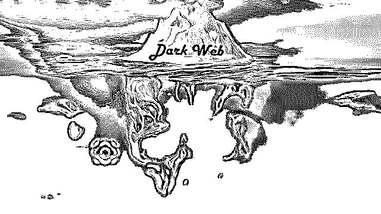

# 黑客雇佣市场｜带你走进“暗网”

> 原文：[`mp.weixin.qq.com/s?__biz=MzIyMDYwMTk0Mw==&mid=2247494101&idx=1&sn=102a64dddf60d7e24490902d8255e598&chksm=97cb22eda0bcabfbcb73e54f8b9d02d9e4f04ec06038732e953a52c0ce5feebd5ab9673bfc22&scene=27#wechat_redirect`](http://mp.weixin.qq.com/s?__biz=MzIyMDYwMTk0Mw==&mid=2247494101&idx=1&sn=102a64dddf60d7e24490902d8255e598&chksm=97cb22eda0bcabfbcb73e54f8b9d02d9e4f04ec06038732e953a52c0ce5feebd5ab9673bfc22&scene=27#wechat_redirect)

**点击上方蓝色字体“灰产圈”关注并置顶本公众号**

导语

据悉宇宙中可见物质为 4%，暗物质和暗能量占 96%，这个比例恰好和表层网络和黑暗网络的比例相同。也就是说，我们每天浏览的网站、论坛、贴吧等内容仅占全部互联网 4%的内容，而其余 96%的内容是我们无法轻易获取的。

听上去似乎有些不可思议，但互联网就是如此，有白天就有黑夜，有阳光就有阴影，无论是好是坏，它都属于世界的一部分。今天笔者就带你走进暗网世界，了解互联网黑暗的一面。

“暗网”更确切的技术名字叫“隐藏的服务器”，域名数量是表层网络的 400 倍到 500 倍，访问者在上面完全匿名，这层网络有部分是合法的，当然大部分是违法的。

“96%的互联网数据无法通过标准搜索引擎访问，虽然其中的大部分属于无用信息，但那上面有一切东西，儿童贩卖、比特币洗钱、致幻剂、大麻、赏金黑客……”

这段话出自美剧《纸牌屋》，但无法被搜索引擎找到的暗网是真实存在的。

华住旗下酒店数据信息疑遭泄露，1.3 亿人的开房记录,暗网公开叫价 35 万出售”“A 站千万用户数据泄露!暗网已流出数据价目表:1 元 800 条”“陌陌 3000 万数据在暗网公开叫卖 35 美元”等诸多新闻让大家对“暗网”如雷贯耳。

走进暗网

在一些影响世界的重大事件中，暗网承担了重要的作用。恐怖组织 ISIS 的网站，几乎全部建立在暗网之上。

暗网这一概念最初源于美国军事机构。1996 年，美国海军研究试验所的科学家提出一个构想，“在某个系统中，任何使用者在连接互联网时都会实时处于匿名状态，而不会向服务器泄露身份。”在这个系统中，保护数据的密码像洋葱一样层层包裹，于是他们将之称为“洋葱网络”。

今天，带大家走进暗网，我们一起来看一看，攻击者如何通过窃取用户密码来发大财…

黑客如果想要访问某个受密码保护的特殊网站时，他们一般都会先去暗网论坛逛一圈，看看能不能从暗网市场商家那里找到相关的 BOT 日志，并定期租用这些日志的访问权限来更方便地窃取网站密码。

这些 BOT 日志卖家指的是一些运行了大型僵尸网络的网络犯罪分子，这些僵尸网络由功能强大的恶意软件驱动，并能够从全网范围内的用户 Web 浏览器以及基于 Web 的登录表单中窃取账号密码。

只需要几美金(等值的虚拟货币)，他们就能够买到这些日志的访问权。而且如果卖家同意的话，犯罪分子可以花更多的钱来直接购买指定账号的凭证信息。

目前僵尸网络主机所收集到的绝大多数被盗凭证仍然处于未使用/未出售的状态(除了某些高价值的银行账号)。实际上，这些“商品”并不能给犯罪分子们提供巨大的短线盈利，而且存在很大程度的浪费现象。

时代变革

现在暗网市场的竞争也越来越激烈，很多黑市网站都开始比拼谁卖的凭证更便宜更准确，而这种类似“价格战”的竞争方式也让很多僵尸网络不再像之前那样受欢迎了。

下图显示的是一个暗网犯罪分子出售盗窃凭证的盈利情况，只有当某人购买被盗凭证时，僵尸网络主机才能得到收入。

到目前为止，他已经出售了超过 35000 份凭证信息，并且在几个月内收入就已经超过了 28.8 万美元，相当于每一份凭证可以帮他赚 8.19 美金。

这个专门出售被盗凭证的暗网服务名叫 Carder’s Paradise，该服务的卖家版名叫 Seller’s Paradise。

需要注意的是，犯罪分子把被盗凭证上传到这里时，并不会第一时间得到收入，只有当他人购买了他上传的被盗凭证之后，他才能得到报酬。

不过这个家伙还算是比较幸运的了，因为已经有差不多 9000 名客户从他这里购买了被盗凭证，但是我们这里无法确定他手上总共有多少被盗凭证(肯定超过了 35000 份)，因为控制面板中只会显示已成功出售的凭证数量。

值得一提的是，这个犯罪分子会在多个不同的暗网服务中出售相同的凭证信息。

根据 Carder’s Paradise 的广告介绍，厂商跟被盗凭证出售人之间是五五分账的，而该暗网服务中不同电商网站以及银行网站的凭证售价平均为 15 美元。

实际上，airbnb.com、comcast.com、creditkarma.com、logmein.com 和 uber.com 的用户凭证价格就是 15 美元，而 AT&T 无线的用户账号+密码+目标用户邮箱访问权套餐价值约为 30 美金。

该服务中售价最贵的被盗凭证就是 frys.com 这种电子商城的了($190)，我不清楚为什么它比其他的都要贵那么多，但毫无疑问的是 frys.com 的用户凭证可以给犯罪分子们带来不小的利益。

除此之外，这个暗网服务不仅只会出售被盗凭证，它还会出售受害者的个人身份信息，目标用户的信征个人消费评分越高，身份信息的售价就越高。

比如说，如果目标用户的个人信征评分为 850 分的话，他的个人信息售价将高达 150 美元。

除此之外，该服务还可以给犯罪分子提供几乎每一位美国公民的完整信用报告(从三大主要的信用机构获取)，每份报告的价格平均为 35 美元。

可能有的同学知道，美国信用机构 Equifax 在今年年初曾泄露了超过 1 亿 4500 万名美国公民的社保安全号码、生日以及其他敏感数据，这可把大家给吓坏了!

但是正如研究人员这么多年来一直在提醒大家的，美国公民的重要个人信息一直都在地下网络犯罪领域中泛滥。

85%暗网关停

2017 年，“匿名者”（**匿名者黑客组织是全球最大的黑客组织，也是全球最大的政治性黑客组织**）组织攻击并拿下了暗网托管商 Freedom Hosting II 后，Daniel’s Hosting 一跃成为最大的暗网托管商。

自从 2 月份一匿名者组织入侵暗网托管商 Freedom Hosting II（FH II）的服务器，导致其托管的所有暗网网站全部下线后，暗网服务开始大幅缩水。根据 OnionScan 的最新报告显示如今的暗网服务只剩下 4400 左右。

根据先前 Deep Light 公司于 2016 年 4 月公布的报告称，暗网服务总量还在 3 万左右。对比两次统计的数据发现，约 85% 的暗网服务已经消失。

根据 OnionScan 报告背后主要的研究人员 Sarah Jamie Lewis 所言，此次戏剧性下降的实质是因为暗网托管商 Freedom Hosting II 的垮台。

上月伊始，一个匿名组织侵入了 Freedom Hosting II 的服务器，导致通过该服务进行托管的所有网站处于离线状态。

根据 Lewis 于 2016 年 10 月发布的一份报告估计，Freedom Hosting II 托管的暗网网站约占整个暗网的 1/5，其中包括一些比特币的托管服务，庞氏骗局和黑客论坛等。他解释称，

我们相信此次 Freedom Hosting II 垮台影响的不仅这 1/5 的暗网网站，还有将一些基础设施托管在 Freedom Hosting II 的其他托管服务商。”

入侵 Freedom Hosting II 的匿名黑客表示，他们发起的首次攻击活动发生在 1 月 30 日，但只是攻克了读取权限。

该黑客表示：

### **最初我并不想破坏 FH2，只是在观察。**

但是后来他们接连发现了好几个大型的儿童色情网站，并且使用超过 Freedom Hosting II 规定的限额。

因为一般情况下，Freedom Hosting II 每个站点的限额为 256MB，而这些非法站点竟然拥有数千兆字节的内容。

**黑客说：**

### 这表明他们收取了托管费，而管理员知道这些网站，所以我才决定黑了它。

据悉，FBI 曾在 2013 年控制了暗网托管商 Freedom Hosting 的服务器，通过收集信息起诉了浏览儿童色情的暗网用户。

根据 OnionScan 最新的统计数据显示，暗网只剩下大约 4,000 个 HTTP 网站、250 个 TLS （HTTPS）端点、270 个 SSH 端点、100 个 SMTP 服务、220 个比特币节点以及不到 10 个 FTP 和 VNC 节点。

Lewis 还指出，他们能够从数据集中提取近 1000 个独有的 IP 地址，这些地址属于公共机构和 clearnet（非 Tor 网络）用户用来访问配置错误的隐藏服务。

OnionScan 发现，这些错误配置的类型包括 Apache mod_status 暴露、开放目录、在图像标题中保持 EXIF 元数据不动以及主机头”co-hosting”泄漏。

总体而言，虽然暗网有其魅力所在，但是在过去一年里暗网服务已经大幅缩水且充斥着各种配置错误的服务器。

如此一来，像暗网匿名邮件服务商 Sigaint 这样在 Freedom Hosting II 被黑后下线且不再回归暗网的情况也就不足为奇了。

结尾

在暗网，你会发现的大量令人震暗网技术构建的惊骇的内容：盗版、黑客、毒品、军火、血腥、暴力、色情、阴谋论、职业打手，恐怖分子、甚至是护照、美国绿卡都可以用比特币交易。有人说“暗网”是罪犯们最爱的交易平台，也有人说，“暗网”是人性最丑陋的地方。

枪支、弹药、毒品、各国伪钞、甚至人体器官、几乎所有违法的东西都可以在暗网中购买。

不仅如此，人家还负责送货上门，提供多个国家的运输服务。如著名暗网交易平台“丝绸之路”就是黑客罗斯·乌布利希创建的以毒品交易为主的网站。作为暗网中最有“品牌价值”的电商，“丝绸之路”几经浮沉。

最近，号称新版的“丝绸之路 3.0”又一次在暗网上线。而这已经是丝绸之路这个奇葩网站的第四次“复活”。每个第一次来到“丝绸之路”的暗网游客，都会震撼于它的自由和嚣张。

最后，要提醒大家的是，作为一名合法公民，无论你有多么好奇千万不要浏览暗网。不要试图去考验自己的欲望，人性的欲望一旦被激活，便会如野草疯长。暗网和现实这两个世界绝无可能完全隔绝。如你所想，暗网世界和每个人都有关，无论它让你自由还是蒙羞。

庆幸的是，由于中国网络的特殊性（被墙），暗网中的中文网站和中国用户少之又少。暗网确实存在着，我们的生活也要继续。

●[起底大数据黑产：华住被“脱裤”，1.3 亿人的开房记录在“裸奔”！](http://mp.weixin.qq.com/s?__biz=MzIyMDYwMTk0Mw==&mid=2247493195&idx=1&sn=d5351fa08473d22e7806f00b67d69018&chksm=97cb2d73a0bca46563076a8619815897601954079ae416c191ae0eba1dfe6b8235825349f78b&scene=21#wechat_redirect)

●[比特币跌破 5000 美元的幕后黑手：暗网消亡、BCH 分叉、美国监管](http://mp.weixin.qq.com/s?__biz=MzIyMDYwMTk0Mw==&mid=2247493973&idx=2&sn=7771e4103be3b7f1b077db83c667d30b&chksm=97cb226da0bcab7b3899cd63969c67da26e139ca1657a02cc89ce85795d63850c1d69e3f0d77&scene=21#wechat_redirect)

●[传说中很黄很暴力的暗网，被黑客灭掉了一半……](http://mp.weixin.qq.com/s?__biz=MzIyMDYwMTk0Mw==&mid=2247493987&idx=2&sn=3c6777cf3651cf548bf551847b51553c&chksm=97cb225ba0bcab4d62141d39caf1515258b4faa7041e32a4a8d5b1d453c71adec4ae3f0c4102&scene=21#wechat_redirect)

●[与黑产作战 | 起底大数据黑产](http://mp.weixin.qq.com/s?__biz=MzIyMDYwMTk0Mw==&mid=2247492962&idx=1&sn=7a21e79f66db38b17f31bca2bb626723&chksm=97cb2e5aa0bca74cd415375606c65edd2bed31a07ea478d583a179e105c65720360fdd2ff24d&scene=21#wechat_redirect)

   

**点击加入 ****灰产圈 | 高端社群**