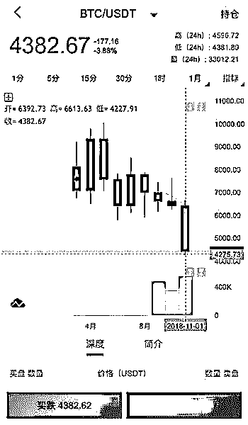

# 血洗比特币：从天堂跌到地狱！

> 原文：[`mp.weixin.qq.com/s?__biz=MzIyMDYwMTk0Mw==&mid=2247494044&idx=1&sn=19da6025120f4c2495d9b61043054486&chksm=97cb22a4a0bcabb2ea09efabc3c2866801fc98b728214d6d35843037554e3eba5728617841f0&scene=27#wechat_redirect`](http://mp.weixin.qq.com/s?__biz=MzIyMDYwMTk0Mw==&mid=2247494044&idx=1&sn=19da6025120f4c2495d9b61043054486&chksm=97cb22a4a0bcabb2ea09efabc3c2866801fc98b728214d6d35843037554e3eba5728617841f0&scene=27#wechat_redirect)

**点击上方蓝色字体“灰产圈”关注并置顶本公众号**

导语

近日，迎来自己十周年的“币王”比特币，突然开启了暴走模式。

数据显示，11 月 14 日 12 时，比特币单价为 6417 美元。

与去年底的 19299 美元相比，比特币已从空中坠落，暴跌 67%。接下来在 11 月 25 日零时，比特币单价 4342 美元，当日 18 时 24 分，比特币单价跌至 3620 美元，不到 24 小时，再次下跌 17%。

## **比特币对美元近期价格走势（数据来源：华尔街见闻）**

仅仅 11 天，比特币已跌 44%，市值蒸发 486 亿美元，与这个数字相比，真正凄惨的是从去年底，伴随着比特币崛起蜂拥进场的参与者们。

血亏的矿工

日前，一幅矿机论斤卖的图片刷爆朋友圈，这是真实个案还是普遍现象？

**近日网曝矿机像垃圾一样被倾倒在地上（视频截图）**

据 btc.com 网站统计数据，2018 年 10 月 4 日，比特币全网算力达到最高，约 74.54EH/s。

11 月 25 日，比特币全网算力已降为 42.09EH/s，降低 32EH/s，跌幅高达 43%。按照今年最流行的蚂蚁矿机 S9 算力为 13.5T 算，等于直接关闭了 237 万台 S9 矿机。

如此巨大的数据，说明本次停机风暴、论斤卖完全不是个案。

鱼池 F2pool 创始人兼 Cobo 钱包联合创始人毛世行近日表示，目前矿机之间的竞争已经进入白热化阶段，譬如我今天拿到一台 DCR 的矿机，1 万多一台，2.4T。

一个月以后，另一个矿机推出了 6T，两个月以后，推出了一台 45T，功耗是 10 倍左右的提升。大家竞争非常激烈，并且矿机芯片 3 到 6 个月换了两代。导致很多矿工遭受了巨大的损失。

2017 年年初的时候，一台比特币矿机 2 万多人民币，而今天同样一台二手矿机只有几百人民币。

“现在是挖矿最痛苦的时候，作为一个强周期的行业，目前的投入产出比并不高。最近采访了几个矿工，大家 2018 年的平均亏损是 1 千万美元。”

**今年 3 月至 11 月，比特币价格一路下挫**

“我就是那个悲剧。”提起近期比特币价格的暴跌，杭州一位知名的比特币玩家 KK（化名）对我们表示，曾经有无数次机会接近财务自由，现在却是两手空空。

在他的朋友圈里，我们还看到了一段小视频，几个工人用搬水泥的小车拖运矿机，像垃圾一样倾倒在地上，乍看以为是工地现场。院子里的矿机已经堆成了一座小山，一片狼藉。

矿机是挖矿的必要设备，曾经，一台主流矿机的价格在 5000 元以上，高的时候达到 3 万元，甚至一机难求。现在，中小型矿场纷纷倒闭，二手矿机被疯狂抛售，当年售价攀升至 3 万元的矿机，转让价仅 1000 元。

萧条的矿场

币价的不断下探，矿机的不断减少，作为主营托管业务、为旷工提供服务的矿场，近几个月来也是风雨不断。

首先是监管问题。本月初有媒体报道，贵州和新疆的正规矿场被要求停电整改，接受税务检查和进行实名制的登记工作。

另外矿场还被要求签署公安部门网络信息安全工作的保障书。对此，我们向国内某大型矿场求证，得到了对方的证实，“新疆这边 9 月份清理了兵团电，现在属于清理的继续。”

其次是效益问题。“矿场位置，云南、贵州、四川，新疆、内蒙、青海，吉尔吉斯。最低 0.38 元/度全包（电费+托管费）”“成本电价+运维团队+手续齐全”“贴地成本电价，这是属于你的矿场”“还剩 2000 机位，矿场国网火电，手续齐全”，作为该大型矿场的销售，近几个月来，KK 的朋友圈几乎天天是这样的内容。

除了急招托管矿机挖矿的客户，KK 还在不断打广告，帮助不愿继续挖矿的客户，出售客户的二手矿机。“帮客户出 5 台 S9I 14T,带官电，5 月份机器，在我们矿场今天发货”、“价格低得不行，不敢明盘”，KK 在朋友圈不断推销。

KK 向我们透露，“我们拿的国电，跟电网拿多少，就得交多少，它不管你有没有消耗，不上（矿机）也是要交电费。”这样看来，纵然电价已如此低廉，但随着币价不断下跌，托管客户减少，消耗不了的电就砸在了矿场自己手里。

面对当前不断下跌的行情，KK 向记者感叹，“现在市场跌成这个样子，都想不到啊。”

返贫的财富自由之路

2017 年底，比特币价格一度突破 2 万美元，创历史新高。此后，加密货币市场持续低迷。11 月开始，比特币一度暴跌，仅 11 月 19 日一天，不到 6 个小时内跌幅近 12%，目前逼近 4000 美元。

这意味着，在最近不到 1 年的时间里，比特币跌了 80%。如此剧烈的价格波动，币圈玩家的心情也是跌宕起伏。

“曾经有无数机会套现。我身边一些 90 后甚至 95 后，在去年卖出，平均套现 5000 万元。而我和一帮 80 后兄弟一直坚守着，守到现在，只能阿弥陀佛了。”KK 一脸无奈。

从距离实现财务自由只有一步之遥，到现在佛系地活着，仅一年时间，“天堂”到了“地狱”。

“具体的金额不方便透露。你可以理解为，账面资产直接抹去了将近两个零，从千万到十万级，现在就剩了点零头。”他向我们透露。

在一个知名比特币论坛里，亏损惨重的玩家也是“哀鸿遍野”，甚至有资深玩家表示自己的资产已经亏损 85%以上，宣布“破产”。

还会继续坚守吗？KK 没有正面回答我们的问题，只是说了句：“这个行业是有信仰的。”

疯狂抛售的矿机

受比特币价格影响，矿机行情也一落千丈，部分小型矿场运营不下去了，便出现上述视频里甩卖的情形。

这位杭州比特币玩家不仅炒币，也挖过币。他回忆，主流的矿机价格在 5000 元左右，有些热门的矿机价格在 1 万元以上。去年底，挖币最热的阶段，矿机价格直接翻倍，甚至一机难求，让深圳华强北卖矿机的商户们狠狠赚了一笔。

据了解，国内主流的几家矿机生产商均在华强北出货。有人统计过，这里成了全球 90%矿机的供销集散地。

鼎盛时期，矿机销售门面占据华强北某大厦 1-7 层。有人这样形容当时的疯狂：“买矿机的要跪在地上求卖矿机的，卖你一台就是很给面子了。”直到今年 2 月，市场人气急转直下。现在，整个华强北的矿机门店仅有十余家，且无人问津。

“去年租了间办公室，投入几十万，买了十几台机器，和几个朋友一起挖矿。跟很多小矿工一样，挖着挖着，然后‘死’了。”KK 解释，“一旦矿机的算力达不到市场上交易的币价，那么这个机器就要关机了，因为电费都付不起。”

小矿工挖矿卖币的收入抵不过巨额电费，加上比特币价格暴跌，小型矿场发现没赚头了，二手矿机便被疯狂抛售。“具体来说，不只是电费，这个是要根据几个变量计算的，当前币价、全网算力、电费、托管费、服务费等。另外，矿机是需要更新迭代的。”KK 说。

他还透露，目前圈里有人在甩货，也有人在低价回收大量二手、接近报废的机器，把它们运到国外去，一些战争国，那边的电几乎不要钱。在超短期回本后，剩下的都是利润，如果出问题，机器就直接报废。

从矿机卖家到微商

受包括比特币在内的虚拟币价格大幅下跌影响，部分矿场已经开始下架矿机，矿场大面积关闭，二手矿机被疯狂甩货。矿工纷纷离场的同时，产业链的上游——矿机销售及矿机托管商开始转行。

当年美国西部的淘金热大潮，大家一窝蜂地去挖金，结果卖得最好的是铁锹和牛仔裤。同样的，在去年下半年比特币价格不断高企的时候，有一部分人盯上了矿机的生意。

CC 是杭州的矿机卖家，直到今年 3 月底，他还在微信朋友圈里吆喝矿机。“现在是订购矿机的最佳时刻，等到下半年就不便宜咯！”“预订矿机，100 台起售，2 周发货。”

事实上，在今年 2 月，随着比特币价格一路下行，矿机价格便开始“跳水”。“一天一个价，有时候一天就跌去 1000 元，简直是一场‘矿难’。”CC 说

CC 卖的矿机是蚂蚁矿机 S9，市场热度较高。据他回忆，最早销售价格就逼近 2 万元，2017 年底的时候达到了 3.5 万元。

年初，趁着 S9 价格略微下调，CC 订了一些期货，企图在市场高位的时候出售。当时，他笃定地认为，价格会回弹，就像之前发生过的那样。

投资大师彼得·林奇说，你无法从后视镜中看到未来。抱着低吸高抛的心，最后血亏，CC 说，原本盘算着一台机器赚个万把块钱，最后倒亏了几千元。

今年 4 月，出掉手头上的囤货，CC 彻底退出了币圈，改行做微商，卖卖手机配件和水果，偶尔转发关于区块链的新闻。

“最早抓住时机的人从这波行情中赚到了钱，晚了一步的人可能就失去了一切。”CC 说。

结尾

对于有梦想的投资者们来说，数字货币还有希望吗？

经历了这一轮崩盘式的暴跌，市场开始出现极度悲观的预期。有业内人士高呼数字货币的冬天来了，还有人说这次下跌只是开始。

彭博资讯分析师麦克隆警告称，加密货币下跌势头可能会变得更糟，他甚至预测比特币价格可能还会蒸发 70%的市值，跌穿 1500 美元关口。

币圈另一位明星人物陈伟星在近日的“重构世界·2018 区块链新经济杭州峰会”上表示，加密货币市场可能会比想象的更糟。

“未来，比特币的价格可能会再跌 50%。如果这个行业的流动性再跌掉 50%，大多数从业者就要喝西北风了。

也许 4 个月后，现在还活跃在大会上的从业者都不好意思上台了。市场冻结的时候，是大家真正去想区块链技术使用的时机。”陈伟星如是说。

表面上币价的暴跌，背后是血洗的矿工、萧索的矿场、冷清的新矿机，所有这一切，都让这个充满争议的行业遭受着前所未有的冲击和变局。

版权声明：“灰产圈”所推送的文章，除非确实无法确认，我们都会注明作者和来源。部分文章推送时未能与原作者取得联系。若涉及版权问题，烦请原作者联系我们，与您共同协商解决) 

●[知乎大神深度解读 : 区块链是不是彻头彻尾的骗局？看完我信了!](http://mp.weixin.qq.com/s?__biz=MzIyMDYwMTk0Mw==&mid=2247493987&idx=1&sn=30790d76bfd36f72f894f88af0d5c358&chksm=97cb225ba0bcab4ddeb4ec51c1917e8f91dafeeacad2c97b4f3b19d78a3b01f43efb46889ccd&scene=21#wechat_redirect)

●["比特币首富"李笑来：一个诈骗者的财富自由之路！](http://mp.weixin.qq.com/s?__biz=MzIyMDYwMTk0Mw==&mid=2247492297&idx=1&sn=e8603af326177886663aed244d7f0a61&chksm=97cb29f1a0bca0e73f5118543cf31d14b8a41b6a43ce0e0683604318420d4401b7a0d72f445d&scene=21#wechat_redirect)

●[比特币跌破 5000 美元的幕后黑手：暗网消亡、BCH 分叉、美国监管](http://mp.weixin.qq.com/s?__biz=MzIyMDYwMTk0Mw==&mid=2247493973&idx=2&sn=7771e4103be3b7f1b077db83c667d30b&chksm=97cb226da0bcab7b3899cd63969c67da26e139ca1657a02cc89ce85795d63850c1d69e3f0d77&scene=21#wechat_redirect)

●[比特币十年：疯狂的币圈，嗜血的贪婪！](http://mp.weixin.qq.com/s?__biz=MzIyMDYwMTk0Mw==&mid=2247493932&idx=1&sn=8776425c3200d413a1c14f0144365384&chksm=97cb2214a0bcab022ed750dd37662da6192cc5d4676a5631a49f30fa5000cc44fd96c9502809&scene=21#wechat_redirect)

   

**点击加入 ****生财有道 | 商学院**