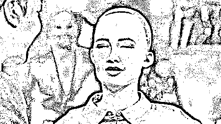
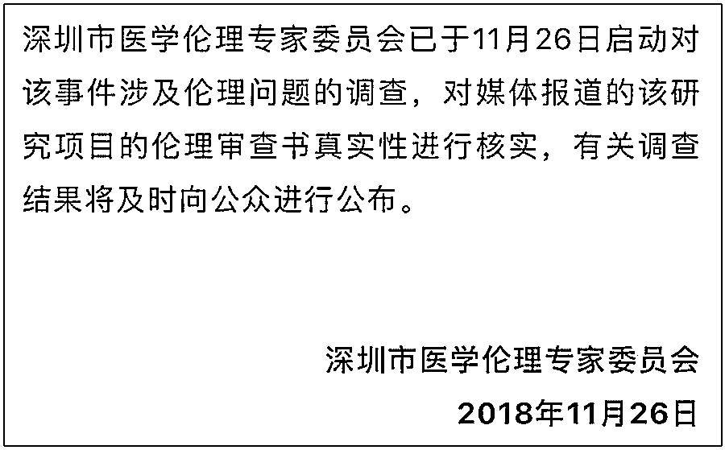
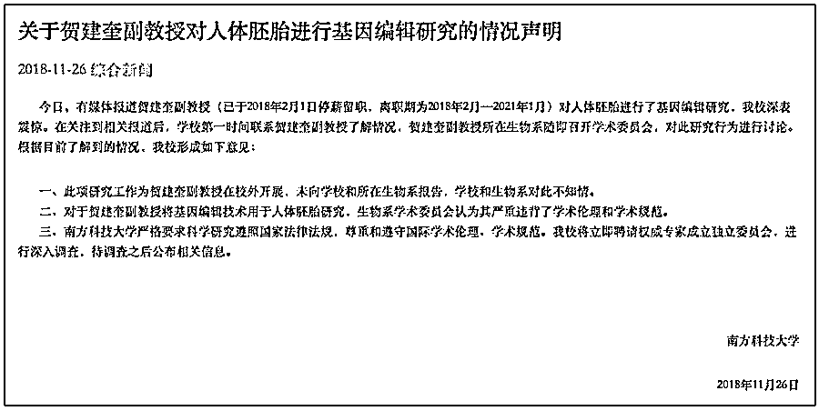
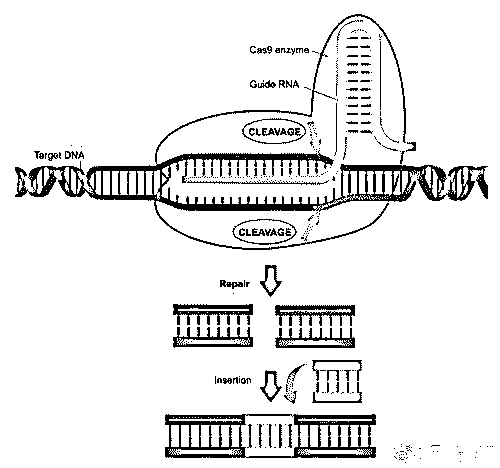
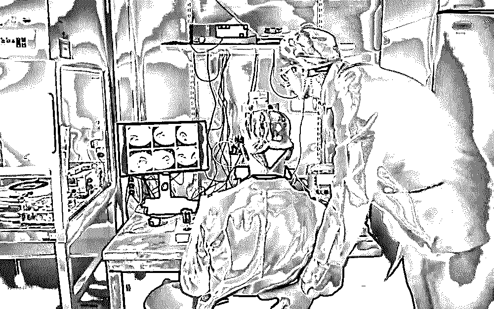
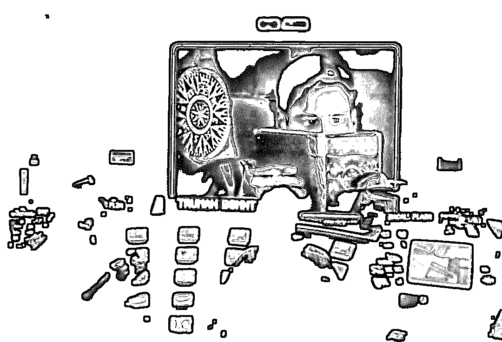
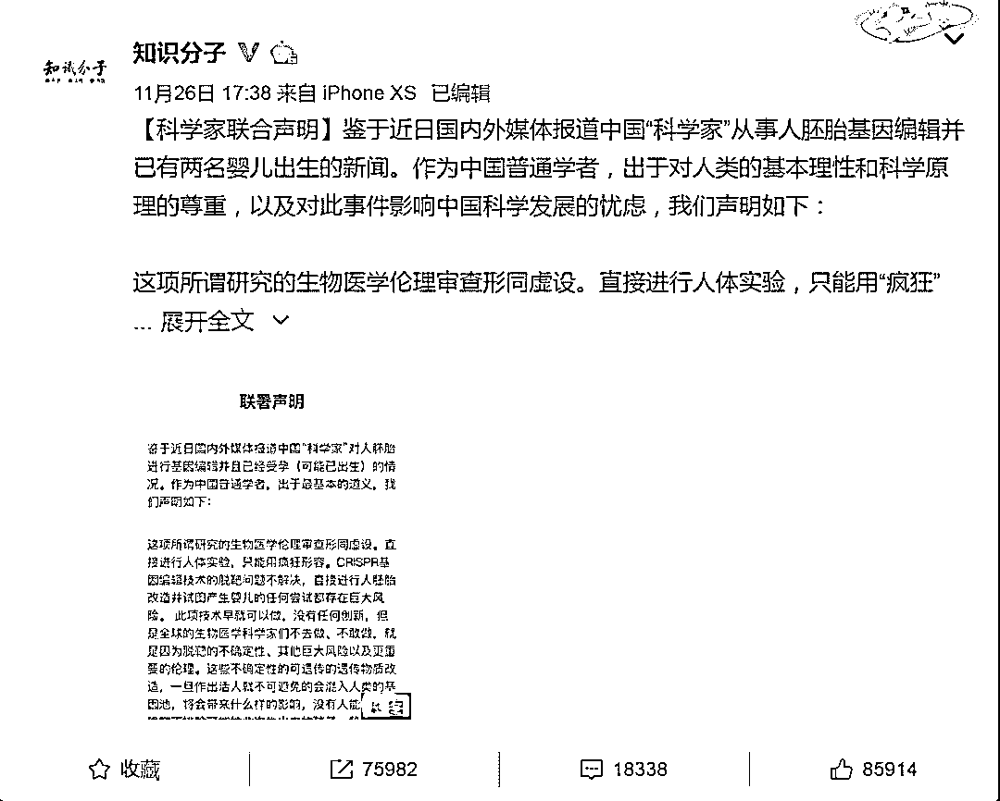
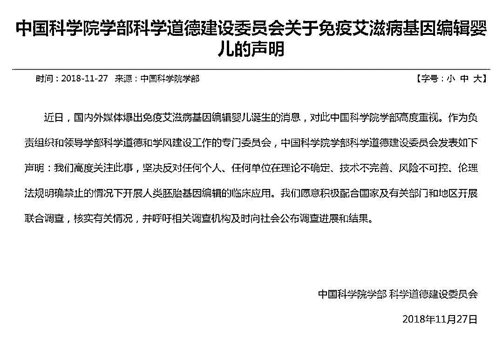

# “基因编辑婴儿”震惊世界：霍金的最后一个预言，正在成为现实！

> 原文：[`mp.weixin.qq.com/s?__biz=MzIyMDYwMTk0Mw==&mid=2247494030&idx=1&sn=12b2dff0143c1d6f6d65bcc577edab75&chksm=97cb22b6a0bcaba0979a13d22e57ad0d98abbd8075d0550ceea757928ae57a7480fb2b3b46f8&scene=27#wechat_redirect`](http://mp.weixin.qq.com/s?__biz=MzIyMDYwMTk0Mw==&mid=2247494030&idx=1&sn=12b2dff0143c1d6f6d65bcc577edab75&chksm=97cb22b6a0bcaba0979a13d22e57ad0d98abbd8075d0550ceea757928ae57a7480fb2b3b46f8&scene=27#wechat_redirect)

**点击上方蓝色字体“灰产圈”关注并置顶本公众号**

霍金的最后一个预言

正在成为现实！

霍金在生前写下的最后文字名为《大问小答》在这本书中霍金预言：一群超级人类将通过基因工程，甩开其他人类，最终接管地球。

“他们通过 CRISPR‘基因剪刀’等基因编辑技术，将其余人类甩到身后。他们将违反基因工程法的规定，通过提升记忆力、增强抗病能力、延长寿命……

“**这种超级人类一出现，未改进的人类就再也不是他们的对手，严重的问题由此产生。**原版人类将逐渐灭绝，或变得无足轻重。一个自我设计的种族将崛起，加速自我改良。而人类若能重新设计自身，就有望向外扩张，殖民其他星球与恒星。”

想不到，霍金的这个担忧正在成为事实！**世界首例免疫艾滋病的基因编辑婴儿在中国诞生！**

“首例”、“艾滋病”、“基因编辑”，让这则只用 21 个字就能概括的新闻瞬间刷屏了。这篇新闻通稿的的话题爆炸程度甚至可以和当年屠呦呦获得诺贝尔奖相媲美，更是为线下的“小团体讨论”提供了更加新鲜的素材。

但是与“屠呦呦获诺奖”相比，贺建奎这位“基因编辑婴儿之父”收获赞美的同时，收到更多的是“砖头”。

**01**

**“基因编辑婴儿之父”**

11 月 26 日，深圳南方科技大学的科学家贺建奎宣布，一对名为露露和娜娜的基因编辑婴儿于 11 月在中国健康诞生。

据贺建奎介绍，基因编辑手术比起常规试管婴儿多一个步骤，即在受精卵时期，把 Cas9 蛋白和特定的引导序列，用 5 微米、约头发二十分之一细的针注射到还处于单细胞的受精卵里，采用“CRISPR/Cas9”基因编辑技术能够精确定位并修改基因，而**这对双胞胎的 CCR5 基因经过修改，使她们出生后即能天然免疫 HIV 病毒。**

根据新闻稿，“这是世界首例免疫艾滋病的基因编辑婴儿，也意味着中国在基因编辑技术用于疾病预防领域实现历史性突破”。

但是显然，人们对与贺建奎团队的这一“历史性突破”犹有疑问。

首先反应的就是深圳的卫生部门，**深圳市卫生计生委医学伦理专家委员会在接受媒体采访时表示，正在介入核实此事。**

而**艾滋病防治的专家们对此也有点懵。**

深圳市疾控中心艾滋病防治科主任杨峥嵘表示，这个基因编辑技术的安全性还没有经过充分证实，而且理论上，父母都是艾滋病患者也可以生健康孩子。

清华大学艾滋病综合研究中心常务副主任张林琦对此评价道：“这事件已经远远超出了技术问题的范畴，后果不可预测，一定是伦理争论的焦点。即使技术是 100%可靠，**人类是否可以或应该编辑自己的生殖细胞和胚胎，**（看到这个消息）绝大多数人肯定大脑一片空白，包括我自己。”

正如张林琦所讲，**伦理争论是焦点。**

新闻稿显示，贺建奎团队提交的基因编辑的伦理审查已经通过，其提供的文件是“深圳和美妇儿科医院医学伦理委员会审查申请书”，上面显示了这家医院伦理委员会成员的签名。

但是深圳和美这家“莆田系医院”也回应说“孩子不是在医院出生，也不是在医院做的实验”，医院多位离职人员也回忆称，自己并没有印象曾在此文件上签字，也就是说这个伦理审查的文件还涉嫌伪造。

**而贺建奎所在的南方科技大学针对此事也作出回应，****学校和生物系对此不知情，生物系学术委员会认为其严重违背了学术伦理和学术规范。**

对此，活跃在医学界以及生物界的百余位科学家在微博上发布了联合声明，**强烈谴责“首例免疫艾滋病基因编辑”，**“这项所谓研究的生物医学伦理审查形同虚设。直接进行人体实验，只能用疯狂形容”。

**02**

**疯狂天才**

如果不是“基因编辑婴儿”的事件，一般人可能根本就不知道贺建奎这个人是谁，但是在基因测序业内，他倒是很“红”。

根据百度百科，**贺建奎是南方科技大学副教授，**主要研究实验室用物理、统计和信息学的交叉技术来研究复杂的生物系统，研究集中于免疫组库测序、个体化医疗、生物信息学和系统生物学。

这样的介绍很官方，而根据与其共事过的业内人士的评价，贺建奎“就是马斯克”，“如果用三个词那就是：**聪明、疯狂、天才，**太适合他了”。

可能就是这份“聪明”、“天才”的劲头，吸引了时任南方科技大学校长的朱清时。在南科大建校之初，朱清时对南科大的教职人员的选拔是在全球范围内的，为此朱清时也多次去美国“拉人”。

贺建奎大约就是彼时与朱清时取得联系的，**那时生物物理学博士毕业的贺建奎正在斯坦福大学生物医学系从事基因测序的博士后研究。**

朱清时对贺建奎颇为赏识，“很年轻、很有思想”的贺建奎虽然没有大学教职经验，但是最终还是被朱清时破格聘为南科大副教授。

2013 年，贺建奎正式回国，进入南科大。“仅用 5 年的时间完成了在美国名校博士到博士后的历程，**年仅 28 岁就成为南方科技大学最年轻的副教授”**的“天才”经历，也是羡煞旁人。

而“天才贺建奎”最大的理想并不是做“中国的马斯克”，而是做“中国的爱因斯坦”。

在他的社交媒体以及私人朋友圈里，几乎都是与基因测序有关，**他把个人基因检测称为即将到来的个体化医学革命。**在接受美联社专访时贺建奎表示：“我感觉自己有很重大的责任，不仅是促成第一个（基因编辑婴儿），而且要让她成为一个榜样。”他认为在是否允许或者禁止基因编辑的问题上，“社会将决定下一步怎么做。”

**03**

**基因商人**

此次风波背后的真相还在调查之中，我们也看到项目操盘人贺建奎除了学术背景之外，还隐藏着一门“基因编辑”生意经。

△贺建奎（图片来源：网络）

可查资料显示，贺建奎除了是一名科学家，名下还拥有多家企业股权。天眼查数据显示，贺建奎是 7 家公司的股东、6 家公司的法定代表人，并且是其中 5 家公司的实际控制人。这 7 家公司的总注册资本为 1.51 亿元。

这 7 家公司中，最早成立的瀚海基因是一家宣称生产第三代基因测序仪的公司。这家公司在 4 月宣布获得 2.18 亿元 A 轮融资，而注册资本最高的是深圳市南科生命科技有限公司，这家公司还获得了南科大旗下深圳市南科大资产经营管理有限公司的入股。

天眼查数据显示，贺建奎担任股东的 7 家公司分别为：

> 深圳市瀚海基因生物科技有限公司
> 
> 深圳市瀚海创业投资管理合伙企业（有限合伙） 
> 
> 珠海瀚海创梦科技管理合伙企业（有限合伙） 
> 
> 深圳因合生物科技有限公司及其子公司 
> 
> 珠海南柒君道科技合伙企业（有限合伙） 
> 
> 深圳因合医学检验实验室 
> 
> 深圳市南科生命科技有限公司

贺建奎参与的注册资本最高的公司是深圳市南科生命科技有限公司。这家公司的注册资本达到 6666.66 万元人民币。

公司的业务为：

> 生物技术开发与基因检测技术开发
> 
> 信息咨询
> 
> 生物技术研发及技术服务
> 
> 技术转让及技术咨询
> 
> 实验室仪器设备及化学试剂及产品的软件研发等

在深圳市南科生命科技有限公司，贺建奎是第一大股东，持股比例 45.5%。另外两大股东分别是深圳市高新技术产业园服务中心，持股 30%；深圳市南科大资产经营管理有限公司，持股比例 24.5%。南科大资产经营管理有限公司系南方科技大学旗下的全资子公司。

贺建奎名下的另一大主要产业为“因合系”公司，包括深圳因合生物科技有限公司、因合生物科技如东有限公司、深圳因合医学检验实验室。深圳因合生物科技有限公司的注册资本达到 4074.08 万元，其中贺建奎认缴 1010.11 万元，为第一大股东。

该公司经营范围依然围绕基因产业展开，包括体外诊断试剂研发、生物技术开发与基因检测技术开发，信息咨询、生物技术研发及技术服务、技术转让及技术咨询，实验室仪器设备及化学试剂及产品的软件研发等。

就在一周前的 11 月 20 日，因合生物刚刚完成了 5000 万的 A 轮融资，投资方为正威集团、乾江资本。

**04**

**四问贺建奎**

但我想从“人性”的角度，来说说几个问题。

**第一个问题：真能天然抵抗艾滋病？**并不是。

很多科学家已经站出来说了：“贺建奎只告诉你这俩孩子可以免疫 HIV，却没告诉你 HIV 也分两个亚型——R5 和 XR4。贺建奎只是更改了 CCR5 基因，所以两个孩子未来只能免疫 R5 型 HIV 的感染，而对另一种 HIV 没有抵抗力。”

也就是说，被改变了基因的露露和娜娜，并不能完全抵抗艾滋病，而且不能免疫中国的主流艾滋病亚种。

**第二个问题：出现脱靶怎么办？**

很多科学家站出来说：“CRISPR/Cas9 技术虽然比较成熟，但依然存在脱靶问题，也就是说，不是每次都能得到我们想要的基因编辑结果，这是一个非常巨大的风险。

而且，你以为改了 CCR5，真的只是改变了这一个免疫艾滋病的性状吗？其他与之相关的基因会不会发生变化？人体相互依存的基因系统会不会发生连锁反应？

我们对此一无所知。万一出现某种意外，很可能导致露露和娜娜出现严重损伤乃至死亡。”

也就是说，贺建奎拿这对婴儿做实验，其实就是拿人家生命在做一个赌注，万一脱靶了，后果谁来承担？

贺建奎说可以保证安全，但是不要忘了墨菲定律：越是担心的事情就越有可能发生。

克隆羊多利不就早夭了吗？

我们当然不希望露露和娜娜出现意外，但如果真的出现了重大意外，贺建奎你能为结果买单吗？你又能拿什么为结果买单？

**第三个问题：会不会影响孩子的生育能力？**

一个很现实很残酷的问题是：如果因为脱靶和基因误伤，两个孩子长大后失去了生育能力，那又该怎么办？

对于一个女人来说，若不能生育，那将是多么残酷的一件事情。贺建奎你能负起这个责任吗？

还有，即便能正常生育，这种被改动基因的人与没有被改动基因的人结婚，生下的后代会不会有缺陷？

如果有缺陷，而这个缺陷刚好和某种致命病毒吻合，那又将给孩子带来多大的伤害？

贺建奎，你想过这个后果吗？

**第四个问题：两个孩子将活在《楚门的世界》里。**

有一部经典电影，叫《楚门的世界》。男主角楚门，从一出生开始，就被剥夺了自由、隐私和自尊，他的一切生活，每天都被无数摄像头监控着，然后向全世界进行现场直播。

我想露露和娜娜将来的生活，也会像楚门一样吧。因为人类怕她俩出现什么变故，所以需要时时刻刻监控她们：比如，定期给她们抽血；比如，定期给她们做 DNA 测序；…………

露露和娜娜，看似被贺建奎赋予了了不起的“天赋”，但其实她们就像养在笼子里的实验动物，从胚胎诞生到最后死亡都是试验品。

这两个孩子到底做错了什么，要被你拿来做这样一个实验，你经过她们的同意了吗？

你这种行为，和电影《毒液》里那个疯狂科学家又有什么本质区别？

**05**

**四大灾难**

这种基因编辑技术是一把双刃剑，一方面，它可以被用来治疗疾病。但另一方面，它可能会带来四大灾难。

**第一个灾难：可能会污染人类基因池。**

被编辑的基因，以及潜在的一切脱靶编辑基因，是可遗传的。换句话说，假如大面积运用这种技术，而又无法控制安全性和预知后果，就可能污染人类基因库，最后造成人类的大灭绝。

**第二个灾难：可能会带来不公平。**

有钱人可以通过修改基因，变得更英俊、更聪明、更强大，从而成为“超级人类”，普通人则成了自然生育的“低端人”，然后沦为社会的底层，永远难有翻身之日。人类社会的天平会就此倾覆。

**第三个灾难：可能会改变物种。**

霍金早就做出过预言：一旦出现基因改造而成的超级人类，人类将会展开“自我设计”的竞争，未来的军队可能由充满敌意、毫无怜悯之心的超级人类组成，我们的社会将变成《黑色孤儿》的样子。

**第四个灾难：弱者可能会被“超人”清除。**

一旦“超级人类”普遍存在，没有经过基因改造的普通人，可能就会因为太劣质，而要被“超级人类”定点清除，那将是一场可怕的大屠杀。真是可怕。

**06**

**伦理问题**

“基因编辑婴儿”还遭到了社会各界的强烈反对。26 日傍晚，122 位国内科学家在微博发布“科学家联合声明”，对此项研究表示坚决反对和强烈谴责。其中包括来自中科院、清华、北大、浙大、复旦、麻省理工等的学者。

声明说道：我们呼吁相关监管部门及研究相关单位一定要迅速立法严格监管，并对此事件做出全面调查及处理，并及时对公众公布后续信息。潘多拉魔盒已经打开，我们可能还有一线机会在不可挽回前，关上它。

对于其将基因编辑技术用于人体胚胎研究，生物系学术委员会认为其严重违背了学术伦理和学术规范。学校将立即聘请权威专家成立独立委员会，进行深入调查，待调查之后公布相关信息。

27 日，第二届国际人类基因组编辑峰会在香港开幕。截至 12 时，贺建奎并未出现。对于明日贺建奎的演讲，峰会组委会主席、诺贝尔奖学者戴维•巴尔的摩回应，峰会不会要求嘉宾提前告知发言内容，选他发言时还无过错。

而对于贺建奎将基因编辑技术用于人体胚胎一事，他认为没有看到任何研究结果，事件不符合伦理，他表示此事很不幸。戴维·巴尔的摩教授同时担任第二届人类基因组编辑峰会的筹委会主席。

生命伦理学家邱仁宗对“基因编辑婴儿”事件也于今日作出回应，提到中国各领域学者都反对贺建奎的研究，称他的研究是违反相关法规的，在道德正当性和可被接受度上都非常低，这项研究也难以保护我们未来的孩子。

**07**

**结尾**

  刚刚，中国科学院针对基因编辑婴儿同时作出声明：

                                          **中科院态度：坚决反对！**

今日 19：29，央视新闻在微博发表声明：

** 科技部：属于被明令禁止的，将按照中国有关法律和条例进行处理**

对于科技上的创新，我们应该支持，毕竟这是人类文明走向明天的方式。不过，也正因为科技中所蕴含的巨大能量，让它可能成为一把杀伤力巨大的“双刃剑”。

所以，在面对科技的突破时，不能不保持足够的敬畏。科学的意义，永远在于展现其天使的一面而非魔鬼的一面，在于为人所用，而非让人类自毁长城。这不是反科学的态度，恰恰是科学的自爱。否则，打开的可能就不是阿里巴巴的山洞，而是潘多拉的盒子。

版权声明：“灰产圈”所推送的文章，除非确实无法确认，我们都会注明作者和来源。部分文章推送时未能与原作者取得联系。若涉及版权问题，烦请原作者联系我们，与您共同协商解决。) 

   

**点击加入 ****生财有道 | 商学院**

# 

> 原文：[`mp.weixin.qq.com/s?__biz=MzIyMDYwMTk0Mw==&mid=2247493987&idx=1&sn=30790d76bfd36f72f894f88af0d5c358&chksm=97cb225ba0bcab4ddeb4ec51c1917e8f91dafeeacad2c97b4f3b19d78a3b01f43efb46889ccd&scene=27#wechat_redirect`](http://mp.weixin.qq.com/s?__biz=MzIyMDYwMTk0Mw==&mid=2247493987&idx=1&sn=30790d76bfd36f72f894f88af0d5c358&chksm=97cb225ba0bcab4ddeb4ec51c1917e8f91dafeeacad2c97b4f3b19d78a3b01f43efb46889ccd&scene=27#wechat_redirect)