# DG 杜嘉班纳设计师讲话涉嫌辱华，之后澄清“我的 Ins 账号被盗了”？

> 原文：[`mp.weixin.qq.com/s?__biz=MzIyMDYwMTk0Mw==&mid=2247493973&idx=1&sn=d9f0b56bd38821f358de2d4053bf1d0b&chksm=97cb226da0bcab7bf71fe1c187b479e18da7ffaf9673972598aeb6d36a1a3ef48cfbaa6447c4&scene=27#wechat_redirect`](http://mp.weixin.qq.com/s?__biz=MzIyMDYwMTk0Mw==&mid=2247493973&idx=1&sn=d9f0b56bd38821f358de2d4053bf1d0b&chksm=97cb226da0bcab7bf71fe1c187b479e18da7ffaf9673972598aeb6d36a1a3ef48cfbaa6447c4&scene=27#wechat_redirect)

**点击上方蓝色字体“灰产圈”关注并置顶本公众号**

**作者：蓝蓝**

**来源：安全圈**

昨日，Dolce&Gabbana 杜嘉班纳上海大秀预告片引发争议，被指有歧视华人嫌疑。

今天，一段“网友与 DG 设计师 Stefano Gabbana 在 instagram 的对话，大意为网友在 ins story 提到 Dolce&Gabbana 杜嘉班纳涉嫌歧视，设计师本人前来争辩，最终恼羞成怒，措辞激烈疑似辱华。 

有网友曝出聊天截图，设计师 Stefano Gabbana 在对话中用到“**the country of shit is china**”的措辞。

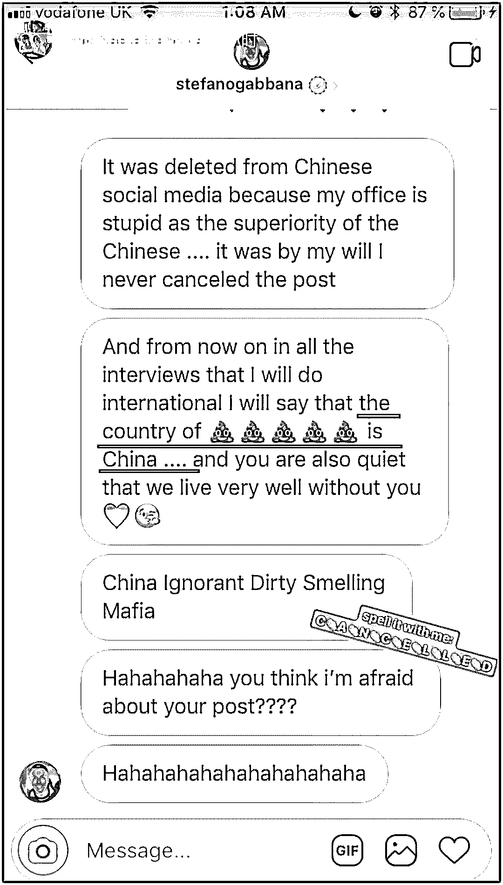

▲网友对话截图

## 

并称微博上删除视频并非他本意，而是团队作出的“愚蠢决定”。紧接着发出了一系列对中国的不满，并且用“**今后的所有采访中我都会说中国是屎之国”、“没有你们我们也能卖得很好”**等言论对网友进行挑衅。

事情的起因是 Dolce & Gabbana 将于 11 月 21 日在上海博览中心举办首个大型时装秀**“The Great Show”**，为此，Dolce &Gabbana 还特别拍摄了一个把**中国传统文化与意大利经典饮食相结合的广告宣传片**，标题为**“起筷吃饭”**。

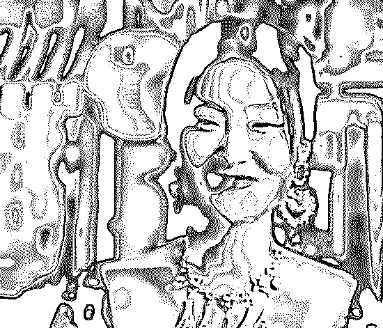

▲视频截图

视频中，穿着 Dolce & Gabbana 的中国女孩坐在中国餐馆中，尝试用筷子品尝超大尺码的三种意大利美食。但由于表演夸张、剧本奇怪，引起了中国网友的不满，认为品牌对中国文化缺乏了解，更有网友认为选择这位小眼睛的模特来出镜完全是对中国人的误解和歧视。

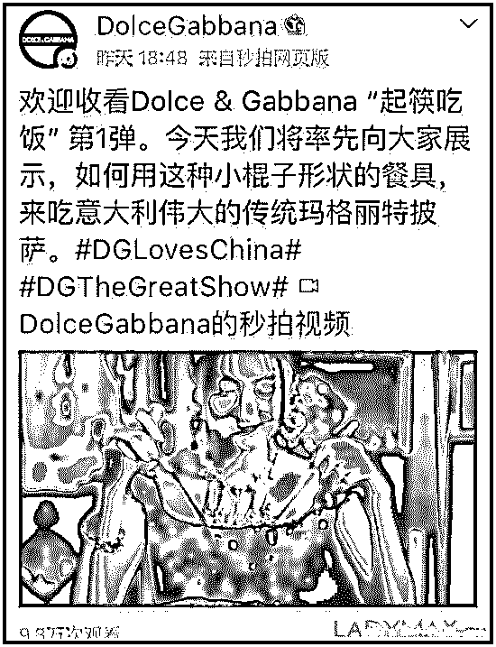

## 

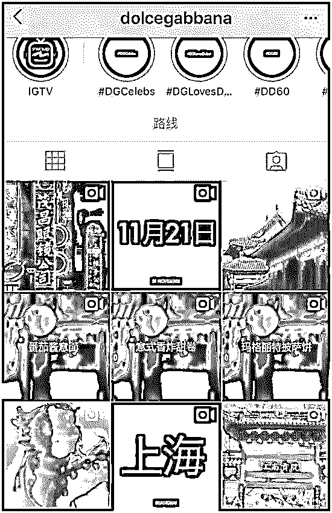

## 

目前，已有微博大 V 对本次事件进行表态。

▲时尚博主 FashionWeek 微博截图

## 

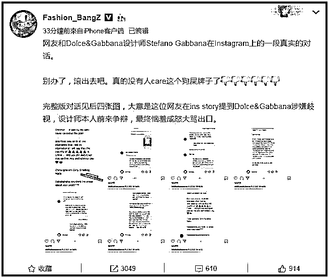

▲Fashion_BangZ 微博截图

以下为网友与杜嘉班纳设计师 Stefano Gabbana 的完整对话：

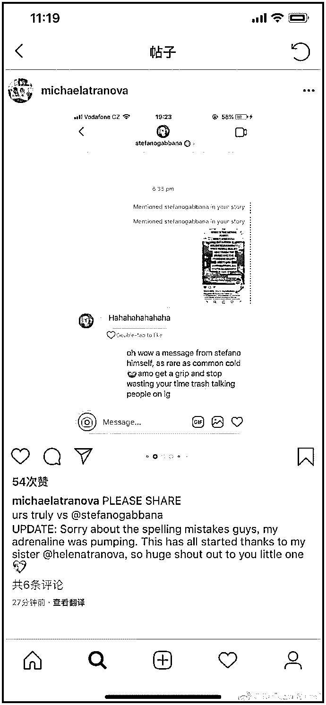

## 

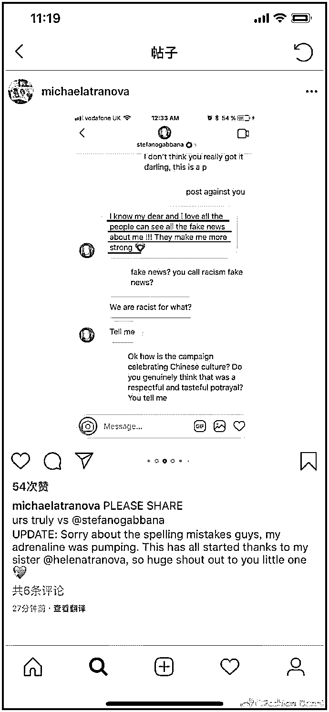

## 

DG 设计师 Stefano Gabbana：**我希望所有人都可以看到关于我的假新闻，这反而让我更加强大。**

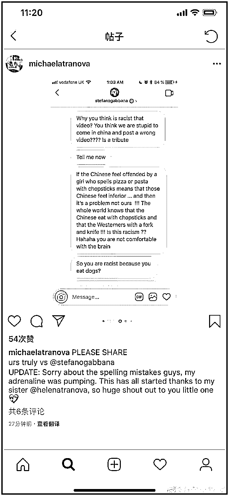

DG 设计师 Stefano Gabbana：**为什么你们会觉得这个视频涉嫌歧视？你认为我们如此愚蠢，会来中国发布一个错误的视频吗？**

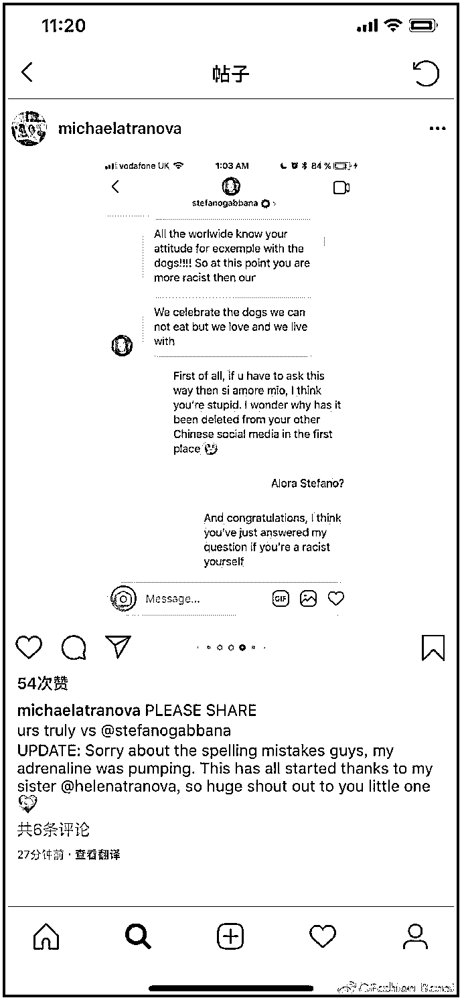

## 

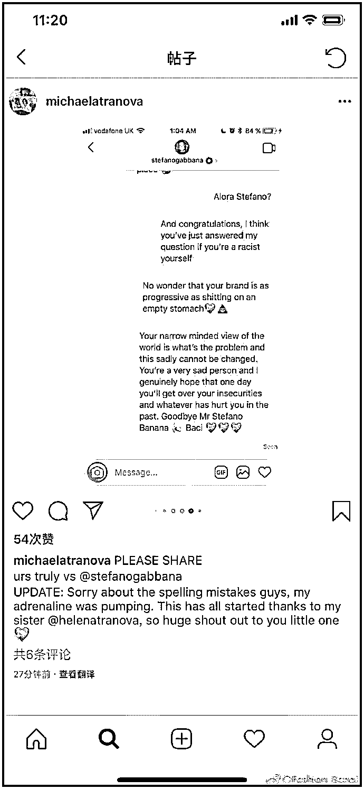

## 

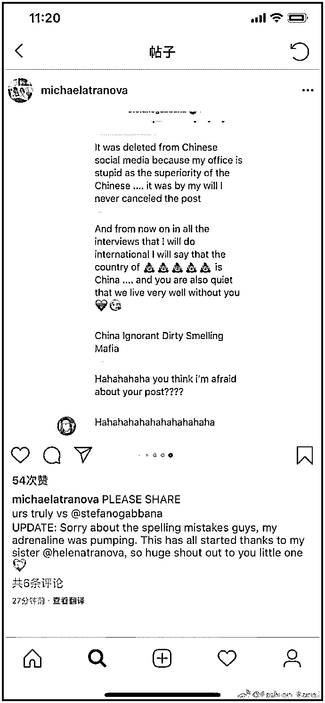

11 月 21 日，针对品牌设计师 Stefano Gabbana 言论涉嫌辱华的风波，章子怡、陈坤、李冰冰、黄晓明、王俊凯、杨紫、迪丽热巴、火箭少女、王大陆、唐艺昕、戚薇、李承铉、范丞丞、纪凌尘、木子洋等表示今晚不会出席杜嘉班纳 DG 大秀活动，不少中国模特也已经宣布罢演。 

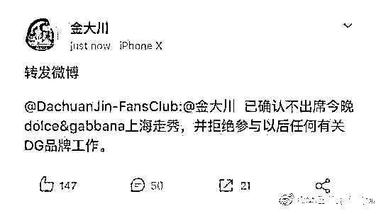

随后 Stefano Gabbana 在社交平台表示，截图中并非自己，自己被盗号，并称自己爱中国。正文称：**官方账号和设计师的账号被盗，我们已经立即通过法律途径解决。我们为这些不实言论给中国和中国人民造成的影响和伤害道歉。我们对中国和中国文化始终一贯的热爱与尊重。 ”**

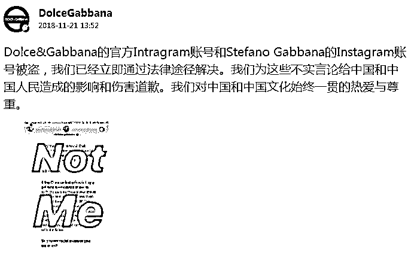

▲微博截图

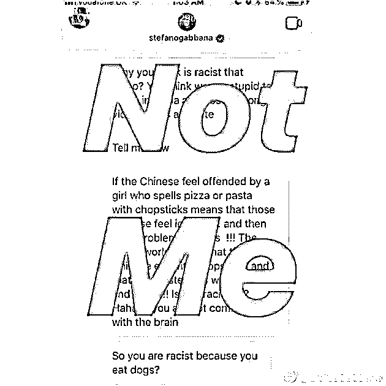

这个理由一出，网友们更激动了。

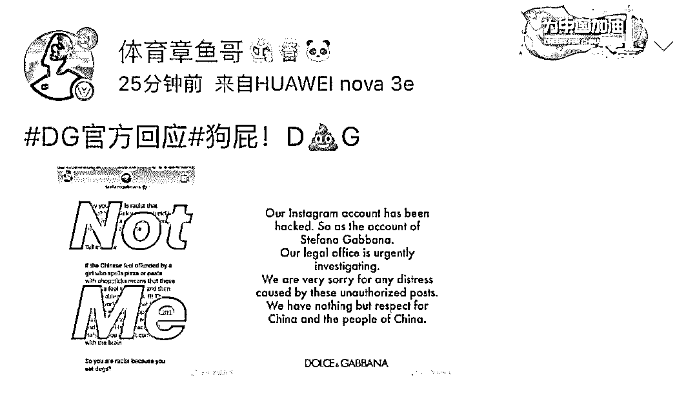

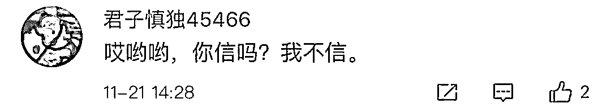

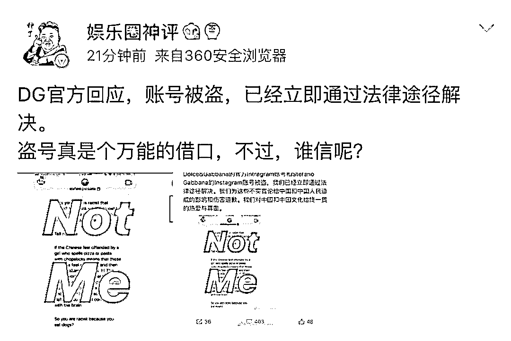

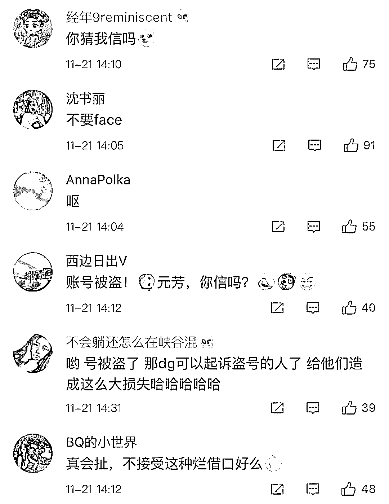

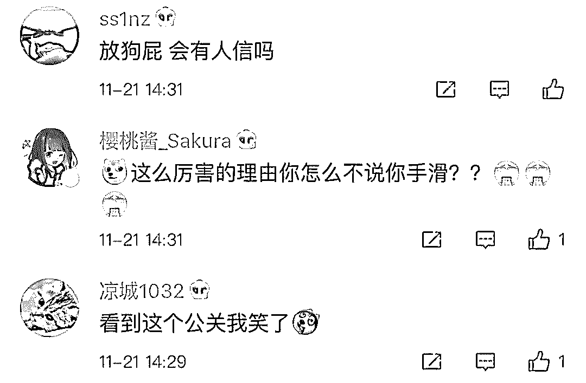

虽然前几天美国科技媒体 The Information 报道过，Facebook 旗下的 Instagram 可能出现用户密码泄露事件。

但 Facebook 告知用户，相关数据已经删除，工具也已经更新，不会再出现类似问题。

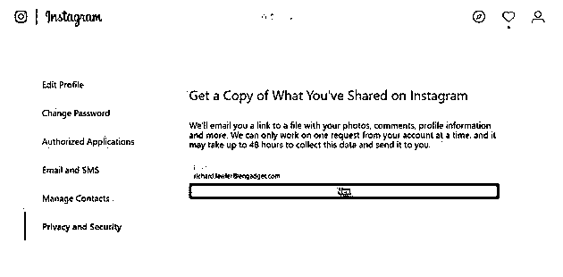

究竟是不是真的被盗号，有网友表示：**请查一下 IP！**

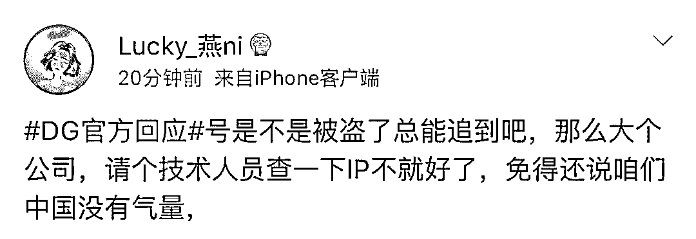

**网友评论：都 8012 年了，号就那么容易被盗？？？**

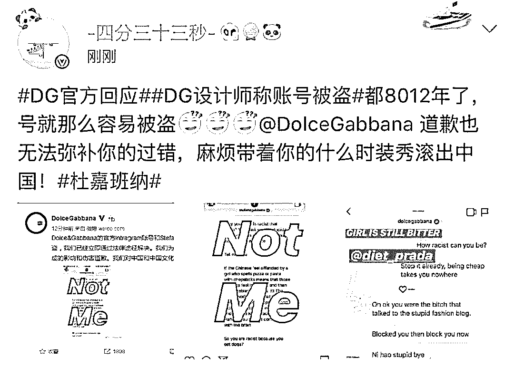

**网友评论：与其事后回应为盗号，不如好好反思有没有尊重中国和中国人。**

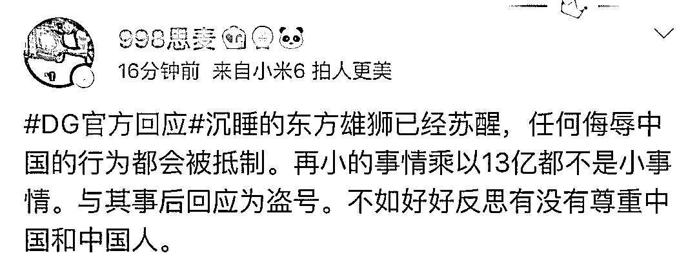

**任何侮辱中国的行为，都会被全中国人抵制！不管你是谁！**

**不尊重中国和中国人的结果只有一个：滚出中国！**

*综合自微博等

   

**点击加入 ****生财有道 | 商学院**