# 女神也躲不开骗子，沈梦辰闲鱼被骗 3000 元，背后真相究竟是什么？

> 原文：[`mp.weixin.qq.com/s?__biz=MzIyMDYwMTk0Mw==&mid=2247493965&idx=1&sn=b5ab7a719d3ec68adc6bb3b8d80b68b8&chksm=97cb2275a0bcab631ba7b88d45e3b3f93b31fd865ef35dca84ad23fba3035f720ce8047a116d&scene=27#wechat_redirect`](http://mp.weixin.qq.com/s?__biz=MzIyMDYwMTk0Mw==&mid=2247493965&idx=1&sn=b5ab7a719d3ec68adc6bb3b8d80b68b8&chksm=97cb2275a0bcab631ba7b88d45e3b3f93b31fd865ef35dca84ad23fba3035f720ce8047a116d&scene=27#wechat_redirect)

**点击上方蓝色字体“灰产圈”关注并置顶本公众号**

导语

昨日一早，沈梦辰被骗、李沁被骗、撒贝宁被骗录音齐齐登上了热搜。

不少吃瓜群众都表示一头雾水，到底发生了什么？明星也能被骗？

    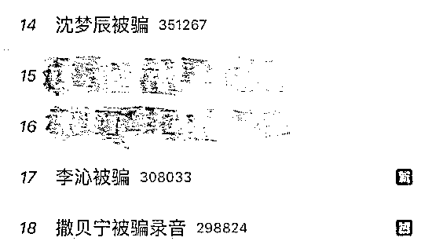

**微博截图**

事件回顾

事情要从此前一天说起：

19 日晚，湖南卫视当红主持人沈梦辰发了一条微博，自曝在网上卖衣服时遭遇骗局，被骗了 3000 元。

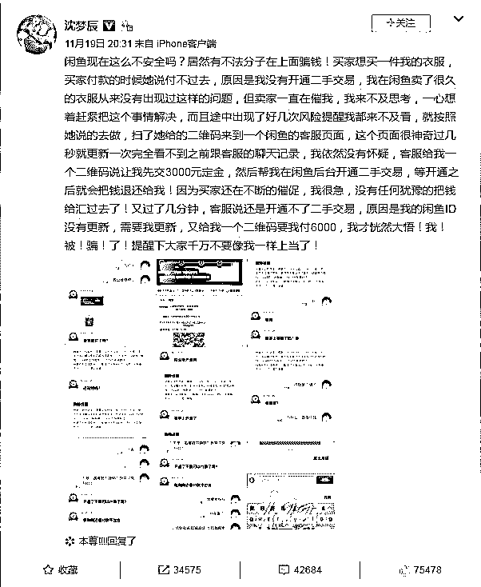

沈梦辰还详细地贴出了被骗的全过程，并提醒大家千万不要像自己一样上当。

以下是被骗聊天截图：

| 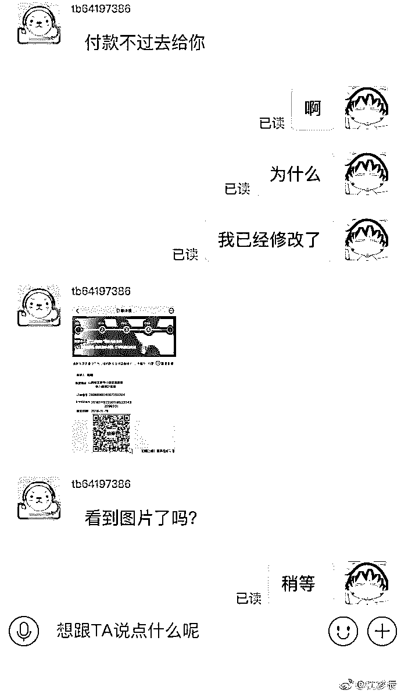 | 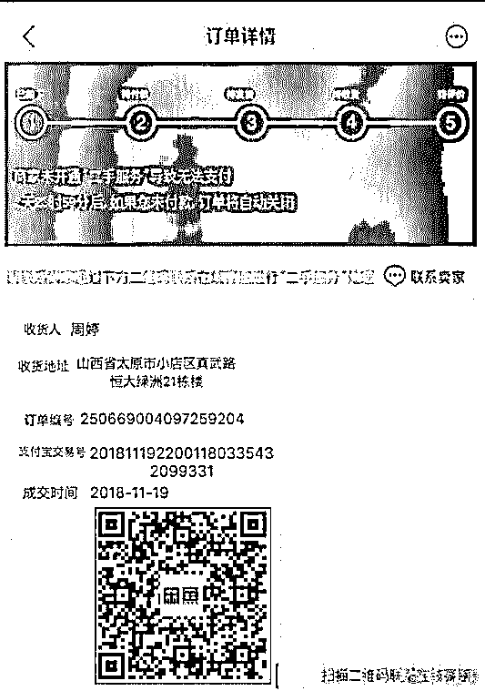 | 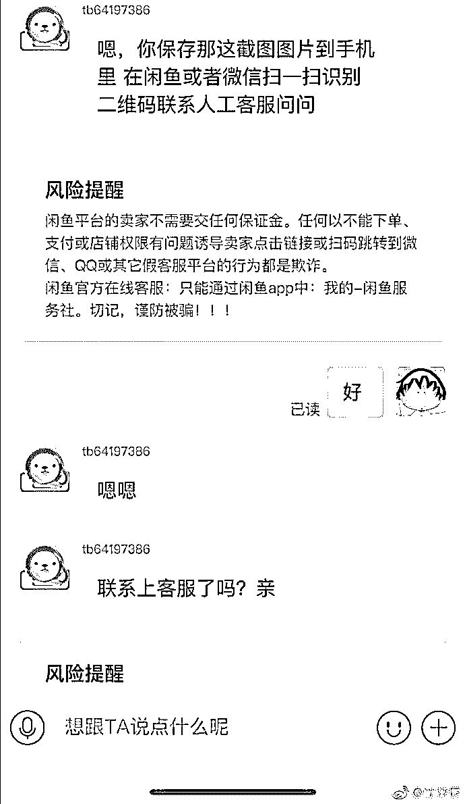 |
| 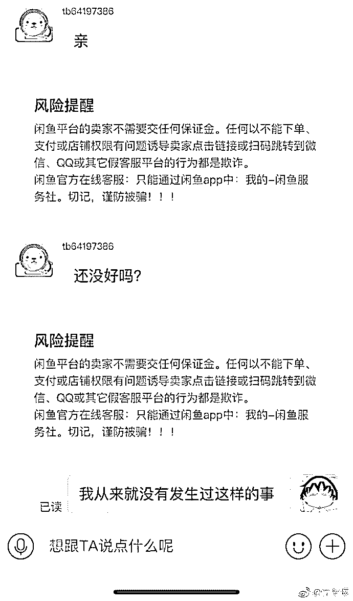 |  | 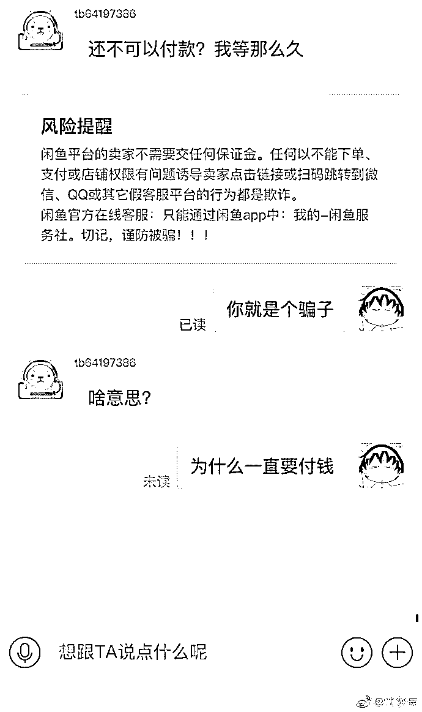 |
| 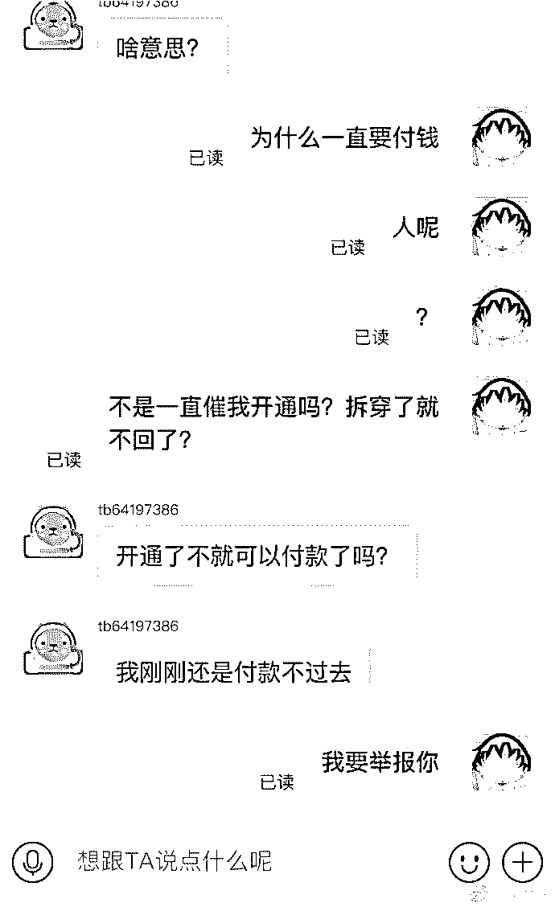 | 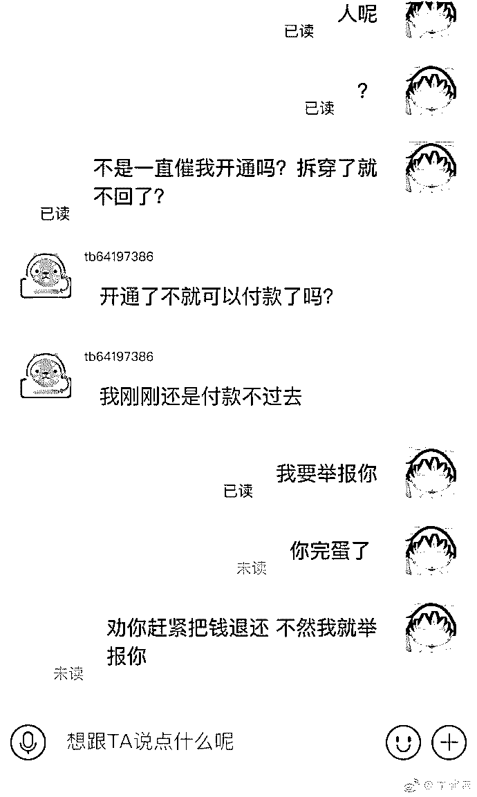 | 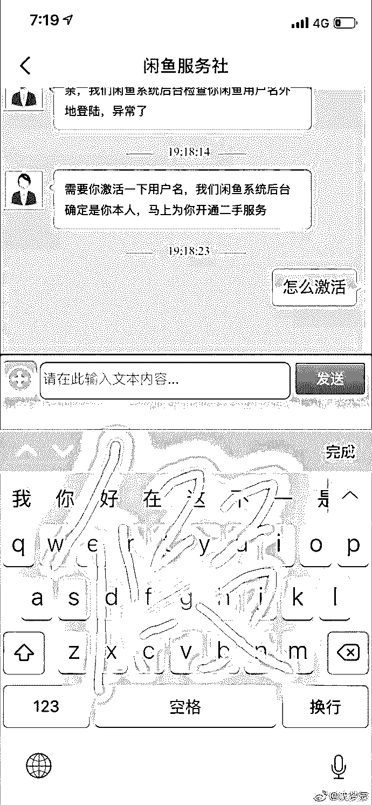 |

**图片来源：微博截图**

虽然闲鱼页面多次进行风险提醒，但她表示，“买家一直在催促，根本就来不及思考和仔细去看提示，一心想着赶紧把事情解决了。”

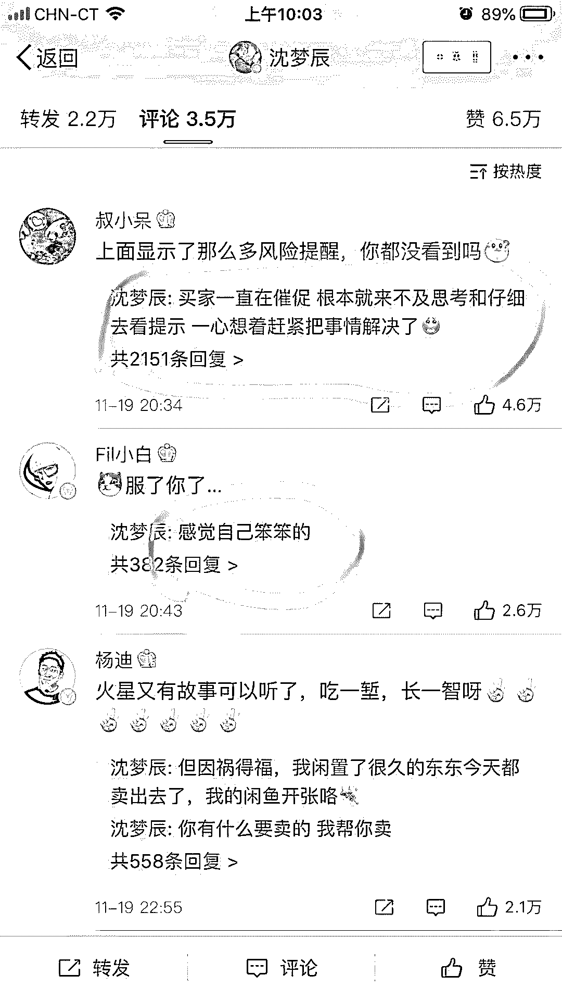

这起被骗事件很快引发了大众的关注。有网友表示慰问，也有网友好奇，为啥平台都提示风险了，还会被骗呢？ 

沈梦辰的答复是：买家一直在催促，根本就来不及思考和仔细去看提示， 一心想着赶紧把事情解决了。

骗局揭秘

之前灰产圈曾经针对 58 同城二手交易平台：“转转”深度报道揭秘过，跟沈梦辰闲鱼被骗如出一辙，大家可以把下方链接复制到浏览器查看

**(由于内容涉及某网站利益，这篇文章被举报删除，只能以链接形式查看，请复制到浏览器)**

**https://mp.weixin.qq.com/s/aAcfBXvpeYuGQGCOeZYGoA**

结尾

# 

# 城市套路深 我想回农村

# 农村路也滑 人心更复杂

国外已整改 套路深似海

不如飞上天太阳肩并肩

   所以，如何杜绝套路呢？

请跟我一起念——

不听，不信，不转账！

●[App“庞氏骗局”新玩法，挤掉微信的「爱情银行」什么鬼？](http://mp.weixin.qq.com/s?__biz=MzIyMDYwMTk0Mw==&mid=2247493279&idx=2&sn=2f0ec7230cd66fd0d51f17059d97e310&chksm=97cb2da7a0bca4b19b0689316be4d4dbe8c4b57bff1c661d53e8a1e13415b0024aad59b98728&scene=21#wechat_redirect)

●[揭秘网赚行业 9 个能够年赚千万的骗局网赚项目](http://mp.weixin.qq.com/s?__biz=MzIyMDYwMTk0Mw==&mid=2247483709&idx=1&sn=bae89f430d444cc068986e8be17eaa04&chksm=97c8ca05a0bf4313d55373eaeafbd4851ff19f220a109ebd5dcecc2d564399469963adbb51ac&scene=21#wechat_redirect)

●[区块链狂欢，虚拟币骗局的背后如何不当韭菜？](http://mp.weixin.qq.com/s?__biz=MzIyMDYwMTk0Mw==&mid=2247491136&idx=2&sn=6440c209de25721fac8b3709b505b35a&chksm=97c8d578a0bf5c6eb03eb4e547f7c5240e69af9616c804d234b00669f0622ea0288b307b99c4&scene=21#wechat_redirect)

●[网赚向左 | 网赌向右](http://mp.weixin.qq.com/s?__biz=MzIyMDYwMTk0Mw==&mid=2247493927&idx=1&sn=39648b3f830537c66998e8d901c121ae&chksm=97cb221fa0bcab0926b42eb2c41a79ad68e8cc2048167d3f82158340ceeae3532f48882c6bb4&scene=21#wechat_redirect)

   

**点击加入 ****生财有道 | 商学院**