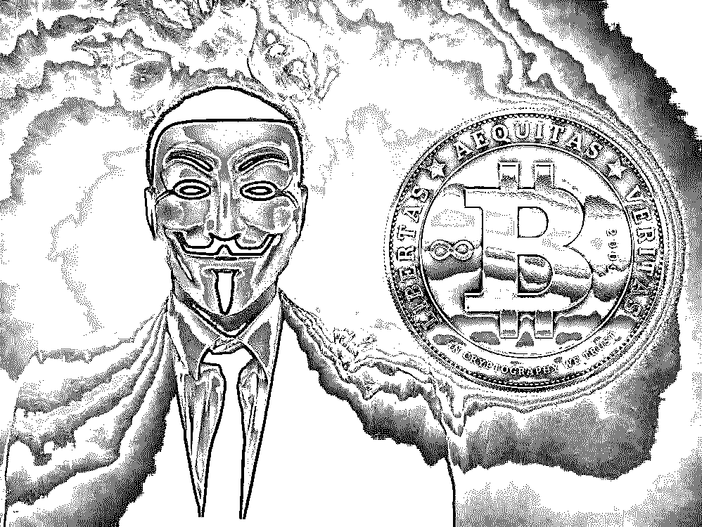
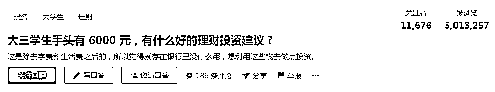
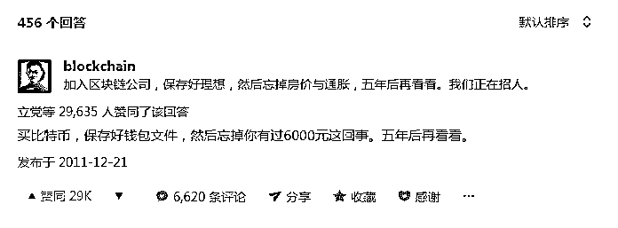
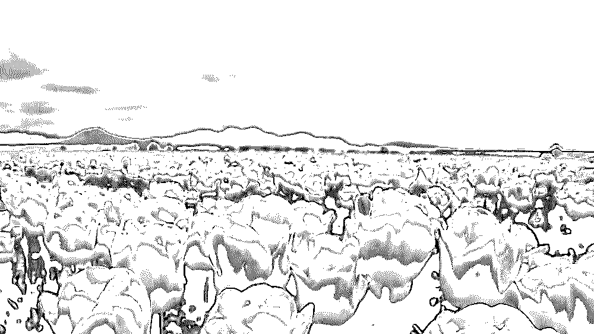
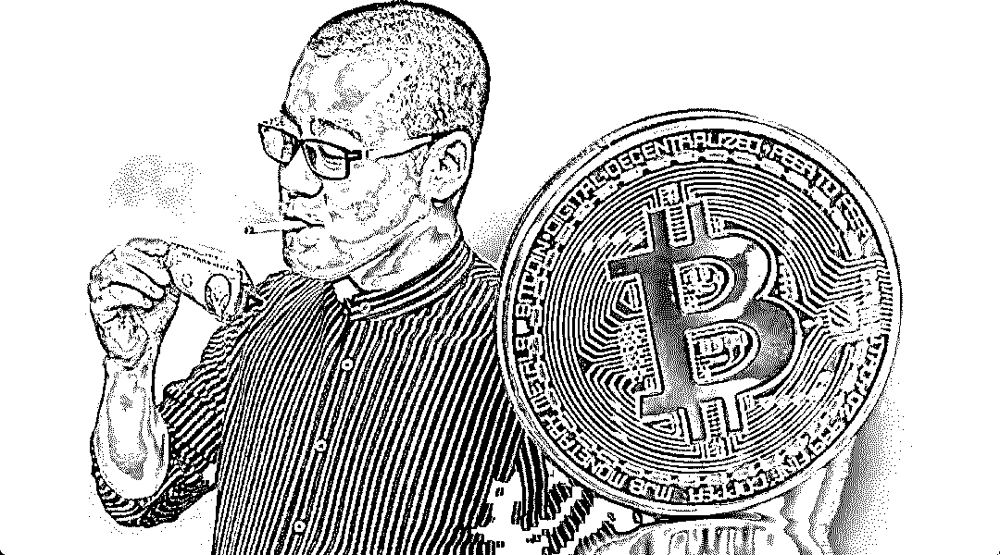
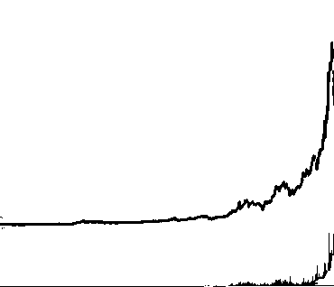
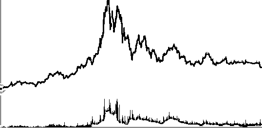
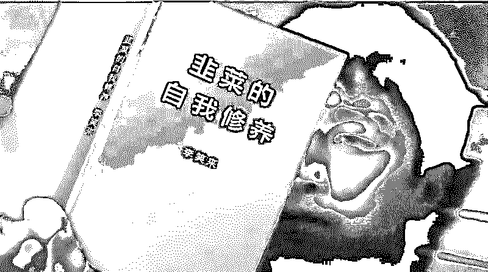
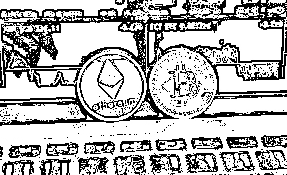

# 比特币十年：疯狂的币圈，嗜血的贪婪！

> 原文：[`mp.weixin.qq.com/s?__biz=MzIyMDYwMTk0Mw==&mid=2247493932&idx=1&sn=8776425c3200d413a1c14f0144365384&chksm=97cb2214a0bcab022ed750dd37662da6192cc5d4676a5631a49f30fa5000cc44fd96c9502809&scene=27#wechat_redirect`](http://mp.weixin.qq.com/s?__biz=MzIyMDYwMTk0Mw==&mid=2247493932&idx=1&sn=8776425c3200d413a1c14f0144365384&chksm=97cb2214a0bcab022ed750dd37662da6192cc5d4676a5631a49f30fa5000cc44fd96c9502809&scene=27#wechat_redirect)

**点击上方蓝色字体“灰产圈”关注并置顶本公众号**

导语

**作者：罗小针 《国英观察》专栏作者**

刚刚过完十周岁生日的比特币，丝毫没有享受到寿星的待遇。

最近，比特币曾一度暴跌至约 5400 美元，这是自 8 月以来首次跌破 6000 美元，创 13 个月来新低。目前，虽有小幅回涨，却仍在 5600 美元左右徘徊。当年曾有多少人为错过比特币而痛心疾首，如今就有多少人不胜唏嘘。

2011 年 12 月 21 日，网友@小竹子曾在知乎提问：大三学生手头有 6000 元，有什么好的理财投资建议？

当天，网友@biockchain（后被证实为中国最早的区块链社区“巴比特”的创始人长铗）回复：买比特币，保存好钱包文件，然后忘掉你有过 6000 元这回事，五年后再看看。

在一众推荐炒股的评论中，长铗的建议显得如此另类且引人注目，于是，@小竹子特意去了解了比特币，但当看到可能遭遇黑客攻击时，一项不喜欢冒险的@小竹子退缩了。

于是，@小竹子收获了一场难忘的旅行，但也因此失去了一个暴富的机会。

2011 年，只需 3 美元便可以买到一枚比特币，而现在却需要 5600 美元。假设，@小竹子当时没有拿着这笔钱去旅行，而是听取长铗的建议把这笔钱全部用来购买比特币（大约可购买 800 枚），那么，**时至今日，这 800 枚比特币的价值已经超过 3100 万人民币！如果@小竹子能够在 2017 年比特币的制高点（每枚价值 1.9 万美元）卖出的话，那么她现在已经是亿万富翁了！**

可惜，没有如果。

货币革命 VS 郁金香泡沫

自 2008 年问世，10 月 31 日比特币终于迎来了自己十周岁的生日，这十年比特币从默默无闻，到闻名天下；从千金难买，到连续暴跌。**比特币，到底是颠覆历史的货币革命，还是洗劫财富的“郁金香泡沫”？**

看多者认为：

比特币去中心化的创举，使其完美解决了政府垄断、肆意发行、通货膨胀、财富贬值的问题！而且，比特币不受中央银行和地域限制的特点，使其能够在全球毫无阻碍的流通，它非实名制的特性，又能够很好的保护个人隐私。此外，由于比特币总量固定（只有 2100 万枚），作为稀缺资源其价值将会愈发昂贵，堪比黄金。

看空者认为：

比特币与逃税、洗钱、毒品、色情、恐怖主义等黑色交易关联密切，而其去中心化的特性，侵犯了政府的职权，绝不会被主权国家认可和保护，那么，谁来保证它的价值？虽然比特币被攻破的可能性极低，但这并不意味着比特币永远安全，它仍旧处于随时遭受黑客袭击的风险之中，而持有者也随时面临着“倾家荡产”的危机。“成也萧何，败也萧何”。比特币 2100 万的上限数量，在具备稀缺性的同时，也制约了其成为通用货币的可能——假设区块链交易能够得到认可与普及，那么比特币必然供不应求。此外，比特币虽具有黄金的稀缺属性，却没有黄金全球认可的价值属性——黄金的价值是全世界认可的，没有任何一种金属能够取代其地位，而比特币却随时面临着被其他电子货币取代的可能。

是的，比特币的槽点众多，前途迷茫，但不可否认的是，它出现的意义已经完成——**无论是理论上还是技术上，它都将对货币制度的改革带来深思与启迪。**

就像是最先从事武侠小说创作的人，曾饱受“下九流”的嘲讽，可如果没有他们对于武侠世界的想象，或许金庸老先生也未必会走上这条道路，从而创造出一个令人向往的江湖。

**抛砖引玉，又何尝不是一种能力与幸运？**

疯狂的“币圈”，嗜血的贪婪

悲哀的是，比特币这块敢于创新的“砖”未能像武侠小说鼻祖一样，引出金庸这样的“玉”，反倒是招来了一帮贪心之徒。

2010 年，比特币的价格仅为 0.003 美元/枚，到 2017 年最高飙至 1.9 万美元/枚，**足足涨了 600 万倍！**

**比特币价格走势图（2010.7.1—2016.10.22）**

**比特币价格走势图（2016.10.10—2018.9.10）**

为暴利所吸引，无数人将一夜暴富的梦想寄托于比特币之上，但比特币设计之初就被设定为具有竞争性质的“游戏”，时间越久算法越难、“挖矿”越难。不是每一个人都具备掌握算法、“开采”比特币的能力，绝大多数人只能靠真金白银购买，但高昂的价格，却不是人人都能负担的，更何况此时早已错过了最佳入场时机。

这时候，一大批拥有粉丝的无良洗脑大佬们开始筹划 ICO，自己发行代币——打着区块链和比特币的名头，把完全照搬的技术包装成高大上的**币，公开融资，找大佬站台、打广告造势、建 qq 群洗脑，而后将不具备任何价值与保护性的山寨币卖给韭菜，坐庄操作价格——**大佬们财务自由走向人生巅峰，被收割的韭菜们倾家荡产尸横遍野。**

**李笑来**

**这种骗术实在不算高明，但却有无数接盘侠前仆后继，为什么？**

焦虑，催生韭菜最好的化肥。良好的教育资源和医疗条件有限，房价在疯涨，财富在贬值，跨越阶层通道在关闭……隔壁老王因为投资了房地产，现在身价千万；同学小宋把握住了互联网，现在公司都准备上市了，就我还是个普通人，为什么就没有风口把我顶上天呢？！当焦虑的情绪在普通人之间不断蔓延，庄家们知道：新一茬韭菜，熟了！

侥幸，收割韭菜最快的一刀。失败者是没有话语权的哑巴，成功者是站在聚光灯下的喇叭——“幸存者偏差”决定了人们会选择性忽视大批战死赌场的 loser，聚焦极少数暴富的 winner。没有人愿意承认这是一个骗局，就算明知道这就是一场击鼓传花的游戏，也坚信总有最后入场的傻瓜，而自己会是收割韭菜的幸运儿。

所以，李笑来这种一无白皮书二无成文规划三无技术创新，全凭一张嘴“空手套白狼”的“知识精英”，才能在短短一个月的时间内，用 EOS 这样的“空气币”融资到 50 亿美元。

暴涨暴跌的投资圈，你怕了吗？

最早投资比特币的“先知”，身价上亿者有，退场太早白玩儿者有，入场晚信心不足，遭遇小风小浪便及时抛售，而至损失惨重者更有。因发行山寨币臭名昭著者有，因被焦虑与侥幸蒙蔽双眼，购买山寨币而血本无归者更有。

但最让人们惋惜的还是那个与亿万财富失之交臂的网友@小竹子：就算一天工作 24 小时，活到 80 岁，再向上天借上五百年也无法挽回损失啊！

但是，这世上根本没有后悔药，也没有人能够未卜先知。就算@小竹子把 6000 元全部买了比特币，但她又能否抵挡得住暴涨的诱惑？恐怕中途抛售的可能性更大；因为享受过一夜暴富的感觉，而再也无法脚踏实地生活的可能性也有。

**有时候，捷径比弯路还要坎坷。**而现在，一项不喜冒险却跨行进入了互联网公司的她，又何尝没有成长和突破呢？

**投资，是一种信仰。**我知道楼市有泡沫，但我坚信某座城市仍有上升空间，那我就果断入手；我知道比特币永远无法取代黄金，但我看好这种货币体系，那任凭你风吹雨打我也仍不放弃，只要还有人认可，那比特币就是我们这个圈子内的流通货币。

**投资，是一种赌博，赌的就是魄力、胸怀和自知之明。**我考察过东南亚，认为金边具备投资价值，那我就海外置业；我大三时错过成为亿万富翁的契机，但我深知当时的自己没有那样的眼界，那我就放下执念，在能力范围内做到最好即可；股市大涨，我周围的朋友全都 All in，但我知道没人给我托底，一旦爆仓，永无翻身之日，那我就合理配置……

**我就是要用坚定的信仰、超人的魄力和可控的风险，去博取一个拥有无限可能的明天。**

●[深度揭秘币圈超级黑幕：掮客荐币，贷款买币，套路重重，人财两空！](http://mp.weixin.qq.com/s?__biz=MzIyMDYwMTk0Mw==&mid=2247492390&idx=1&sn=81d1122932ea7e87306e2a9f3074b567&chksm=97cb281ea0bca1085010faf7cc3ba6307403051628adef845cae325e97029ffc46259fd4fbc4&scene=21#wechat_redirect)

●[深度揭秘韭菜收割场：币圈、ICO、空气币...币圈一天，金融十年！](http://mp.weixin.qq.com/s?__biz=MzIyMDYwMTk0Mw==&mid=2247491793&idx=1&sn=f5f5b116f943aa07ea836b997b7bb320&chksm=97cb2be9a0bca2ff0ea1e2c80f82ca1c06cba04415607d501072a972e8a9b5bc65874fb035b4&scene=21#wechat_redirect)

●[一篇文章读懂区块链：币圈一天,江湖十年!（深度好文）](http://mp.weixin.qq.com/s?__biz=MzIyMDYwMTk0Mw==&mid=2247490389&idx=1&sn=723efdb12fc9c6cfc2d3e84d51f8f385&chksm=97c8d06da0bf597bfdff32d62578c6c43164c53b32b16413ce89a8d57e2bfc8e22e56614083e&scene=21#wechat_redirect)

●["比特币首富"李笑来：一个诈骗者的财富自由之路！](http://mp.weixin.qq.com/s?__biz=MzIyMDYwMTk0Mw==&mid=2247492297&idx=1&sn=e8603af326177886663aed244d7f0a61&chksm=97cb29f1a0bca0e73f5118543cf31d14b8a41b6a43ce0e0683604318420d4401b7a0d72f445d&scene=21#wechat_redirect)

   

**点击加入 ****生财有道 | 商学院**