# 网赚向左 | 网赌向右

> 原文：[`mp.weixin.qq.com/s?__biz=MzIyMDYwMTk0Mw==&mid=2247493927&idx=1&sn=39648b3f830537c66998e8d901c121ae&chksm=97cb221fa0bcab0926b42eb2c41a79ad68e8cc2048167d3f82158340ceeae3532f48882c6bb4&scene=27#wechat_redirect`](http://mp.weixin.qq.com/s?__biz=MzIyMDYwMTk0Mw==&mid=2247493927&idx=1&sn=39648b3f830537c66998e8d901c121ae&chksm=97cb221fa0bcab0926b42eb2c41a79ad68e8cc2048167d3f82158340ceeae3532f48882c6bb4&scene=27#wechat_redirect)

**点击上方蓝色字体“灰产圈”关注并置顶本公众号**

导语

随着互联网发展日新月异，中国网民规模不断壮大，目前已有接近 8 亿的网民徜徉在互联网虚拟空间，通过互联网赚钱成为越来越多社会大众的梦想，由此催生了一个新名词——网赚。

网赚的“发展史”

入行较早从事网赚的人员已经在 PC 端互联网行业挖掘了第一桶金，而在智能手机的普及和移动宽带从 3G 加速到 4G 的大趋势下，网赚方式变得更加多样、攫取利润变得更加快捷，越来越多的企业和网民持续不断地加入网赚这个行业。

在百度指数和 360 趋势查询“网赚”关键词指数时，2011 年，PC 端网赚行业发展到顶峰；2017 年，移动端网赚行业在 4G 普及下迎来了行业大爆发。

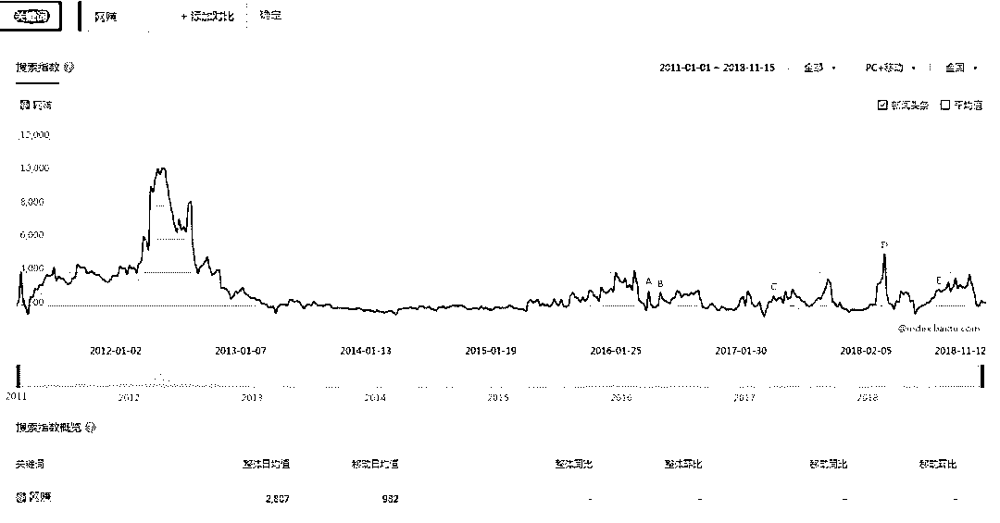

**“网赚”的百度指数图谱**

**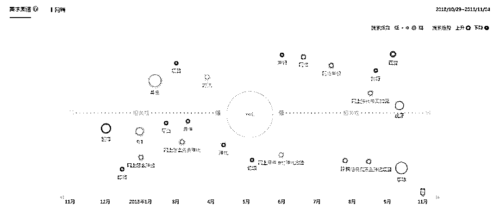网赚相关搜索关键词需求图谱**

**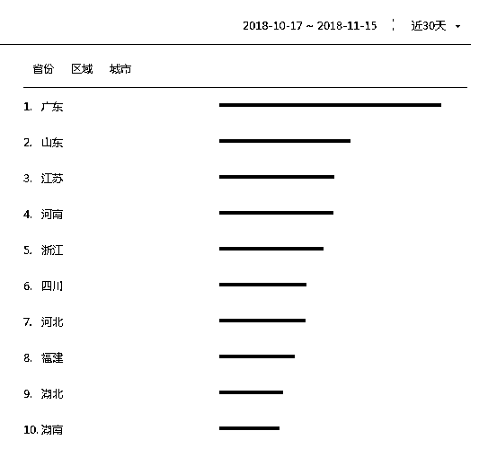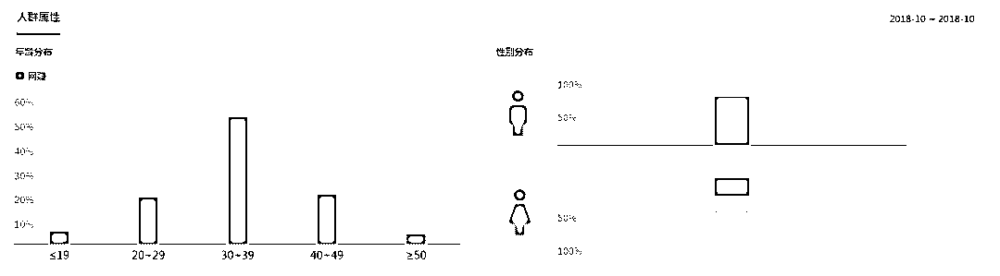**

**“网赚”搜索所属地区和年龄段排行榜**

**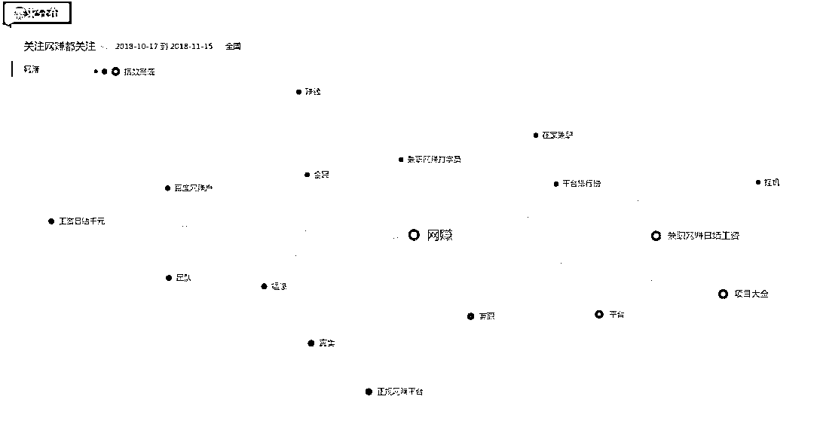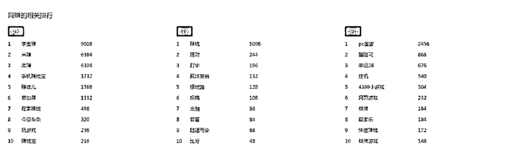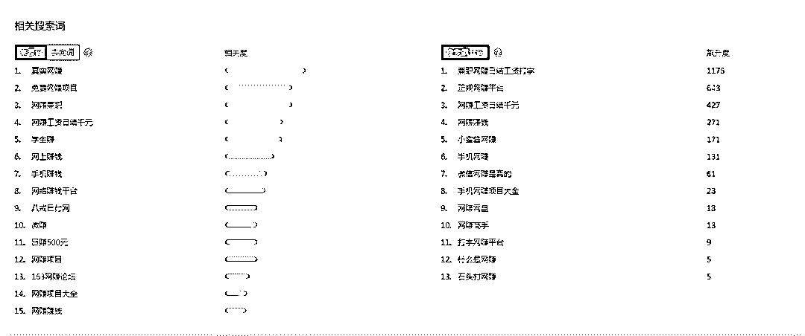**

**360 趋势：“网赚”需求分布，相关排行，相关搜索词数据**

网赚的“黑暗史”

作为一种新生行业，网赚行业产生、发展并且兴起有其合理性，目前各大资讯平台近年兴起的自媒体号，从某种意义上讲也算是网赚行业的一种方式，如运营个人百家号、微信公众号等；

然而，在中国互联网急速发展状况下，瓦玉集糅、鱼龙混杂的现象在网赚行业长久以来也一直存在。

对于非法或者处于灰色地带的网赚方式，国家一直以来不断加大监管力度，严厉打击各种互联网违法行为：

如网络诈骗、网络博彩、网络色情、虚假广告、有偿删帖、刷单刷粉、侵犯公民个人权益等等，特别是 2017 年《中华人民共和国网络安全法》的正式实施以及相关配套法规的陆续出台，为打击网络违法行为提供了保障。

然而，网赚行业快速、简单的盈利模式极具致命吸引力，加上互联网是一个开放而又隐蔽的空间，尽管国家和相关企业平台严厉打击，利用互联网非法获利的现象仍然屡禁不止，特别是博彩类网赚推广 2017 年在搜索引擎和各大资讯类 APP 端几乎实现了霸屏，2018 年以来也屡见不鲜。

“博彩类”网赚的套路

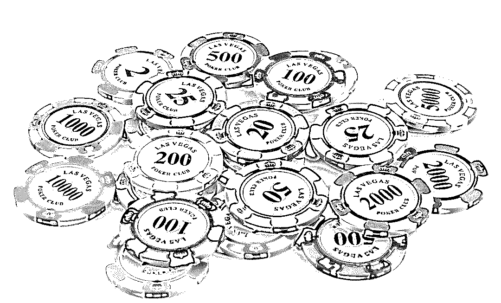

随着国家加大对互联网博彩的打击力度和搜索引擎、浏览器对博彩（博彩）类推广网站的拦截以及中国大规模的手机用户群体，博彩网站推广逐渐把阵地转移到移动端，利用移动端庞大流量吸引眼球，并利用高利润网赚噱头吸引网民参加博彩，有部分网民被吸引加入其中。

一小投入高回报，让你心动

博彩类网赚推广页面常用：“用 100 元刷出 20 万收入”，“这个网赚模式很好，操作非常简单，一天下来可赚 188—888 元”，“好项目，一小时 100 元，好友多的联系我，一天让你赚上千”等为标题内容，以小投入高回报的话术吸引网民，让网民动心加入，一般警惕性不高的网民很容易被吸引。

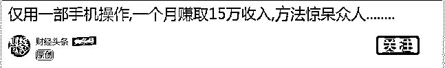

****

**相关标题  **

二屌丝逆袭成创业励志人物，打感情牌

在第一步吸引你以后，推广页面开始下一步上典型案例了：

“张三双亲卧病在床数年，家贫如洗，操作本项目几个月后，父母惊讶发现银行账户多出十几万元存款”, “李某某闺密加入微信朋友圈 3 个月从丑小丫变成变成白富美”，”李四大学毕业月薪不足 2000，运作本项目后月薪过万”，然后再文字下方配上豪彩加人民币的 PS 图片，通过 4-5 个屌丝逆袭成创业励志人物故事，扔出情感牌，从感情上打动你。

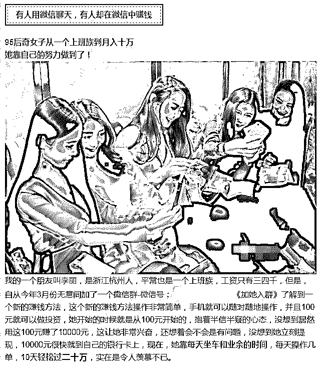**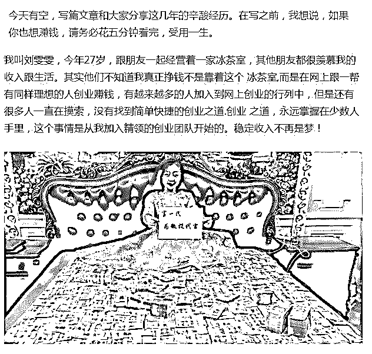**

**屌丝逆袭 文案**

三虚假明星代言，以假乱真

以小博大、屌丝逆袭还打不动你？没关系，还有套路，“知名影视明星某某为本项目代言”，“跨界明星某某倾情向你推荐本项目”，“着名演员某某莅临考察本团队项目” ，有句话叫：不怕套路深，就怕玩的不真，明星代言有图有真相，还不信么？

一假借媒体平台公信力，获取信任，暗示项目火爆

明星代言还不信？没关系，本项目实力很强，资金雄厚，在今日头条、腾讯、爱奇艺、百度甚至人民日报、央视都有广告，这类网赚推广页面把把媒体 LOGO 利用图片格式 ps 到页面显要位置，没有经验或者不明就里的朋友很容易被迷惑而导致上当。

这样操作的目的就是假借媒体平台公信力，获取朋友信任，暗示项目火爆。

**伪装成 今日头条 和搜狗 媒体的页面**

一虚假朋友互动评论，让你感觉真实

前四个套路如果还打不动你，第五个套路开始闪亮登场了，就是每个博彩类网赚推广页面下方模仿新闻评论格式，PS 上巨量的浏览量、点赞量、关注量和朋友回复评论，甚至连评论时间都加上，页面模仿的惟妙惟肖、极其逼真，让没有经验的朋友很难分辨。

评论内容五花八门，但是都是指向一样核心原则：网赚项目好，给我帮助我很多，让我短短几天或者一个月翻身。

以上，基本上是目前互联网博彩类网赚推广主要套路，这种隐蔽式的推广方式，让广大朋友真假难辨，特别是在利益诱惑下，很多朋友被这种网赚推广方式所吸引，在不知不觉中陷入网络博彩的泥潭。

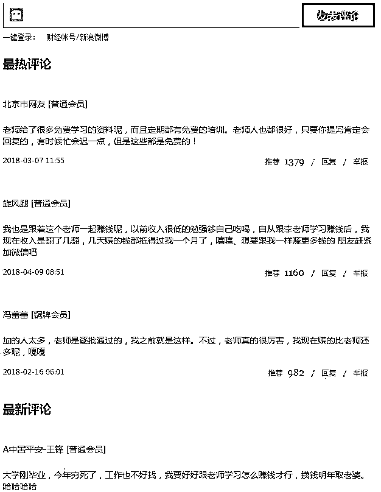

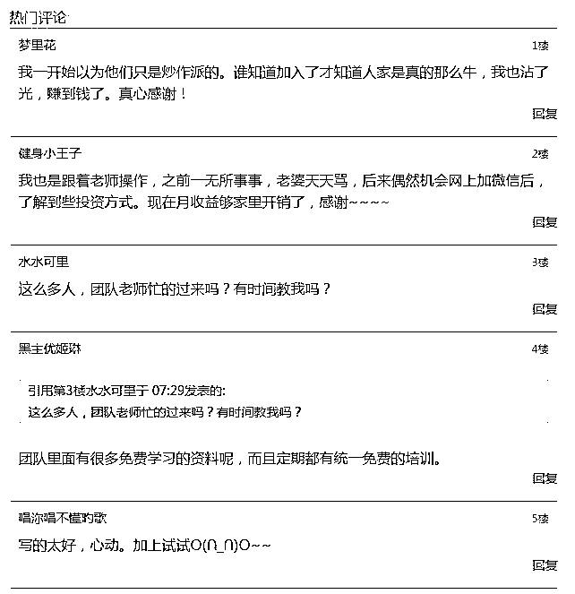

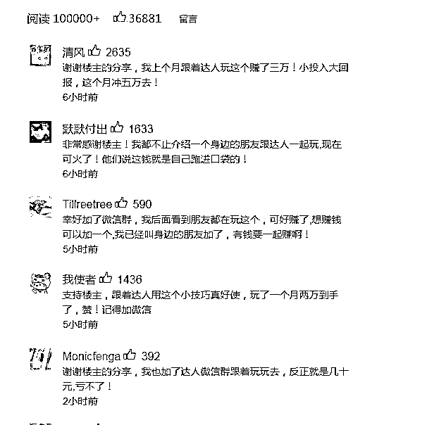

**虚假评论 截图**

博彩类网赚的“运营之道”

那么，有朋友会提出疑问，在目前互联网严格的监管体制下，为何博彩类网赚推广还能在各个互联网平台上线，我们认为有以下几点因素。

一各大网络平台监管不力。

出于经济利益考虑，所有互联网平台最终都是流量变现，有流量才会有广告投入，而在激烈竞争的互联网行业，广告收益是各大平台的命根子，试想，没有收益平台靠什么维持生存，最终会走向末路。

由于不同的平台广告审核机制不同（机器和人工相互使用），在广告审核方面会或多或少的存在一些漏洞，但也不排除有的平台故意而为之。8 月 25 日，我们在国内四家搜索引擎以“网赚”为关键词搜索时，首页前三位呈现页面基本上为博彩类网赚推广的竞价广告。

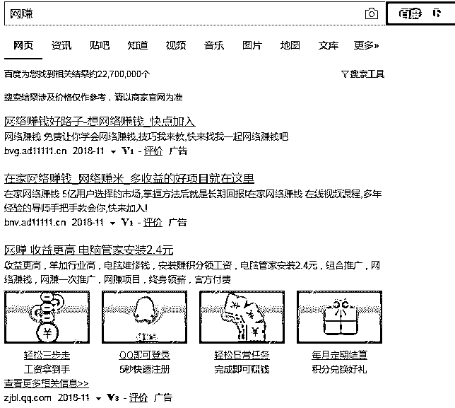

**百度**

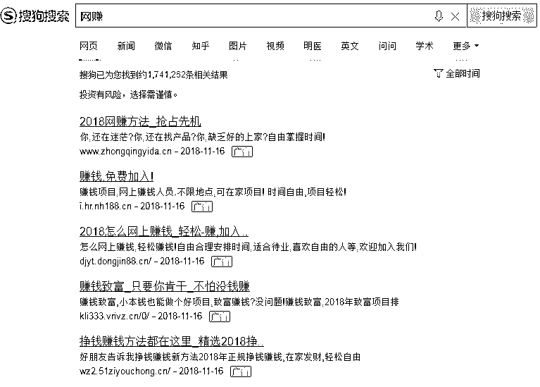

**搜狗**

**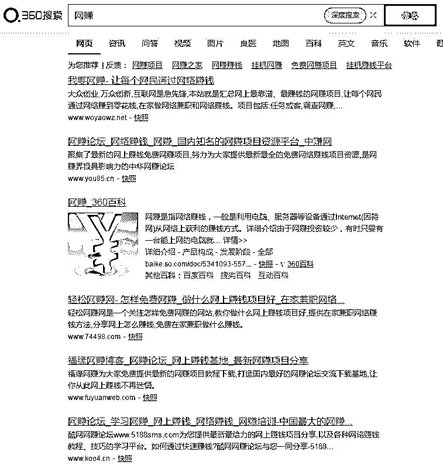**

**360 搜索**

**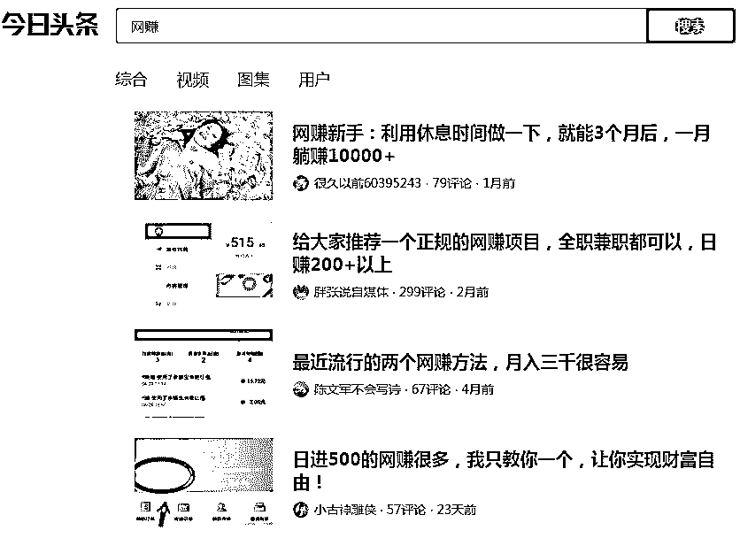**

**今日头条**

**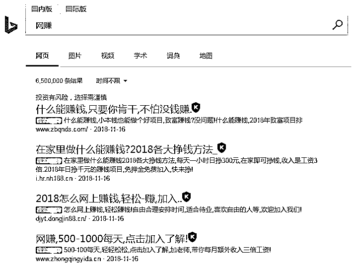**

**必应**

一推广网页更加隐蔽，审核难度较大

博彩类网赚推广页面一方面套路众多，让朋友防不胜防；另一方面是页面全文主要关键词就是“网赚”，不会出现任何“博彩”、“彩票”、“博彩”、“娱乐”、“平台”等关键词，从外观上看就是一个正常的网赚页面，不存在任何违法信息，对于搜索引擎来说极具有欺骗性；

此外，这类页面全部是实行图片格式呈现，而搜索引擎对图片的识别率较低，这样在拦截此类网站方面存在技术因素。

既然内容没问题，做广告竞价又不用考虑网页优化问题，那么这类以图片为主要呈现方式的“网赚”推广网页肯定能堂而皇之地登上各大搜索引擎首页。

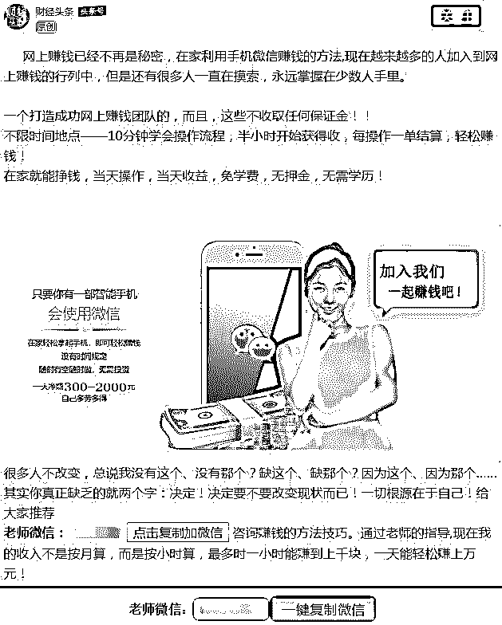

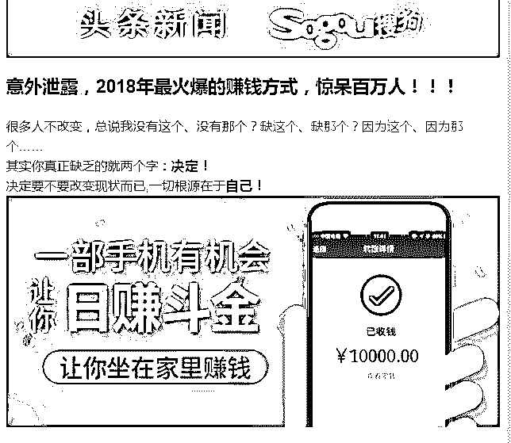

**案例截图，一部手机日赚斗金，实则让你赌博**

一推广成本低 见效快

网站成本主要包括域名、模板页面、服务器，博彩类网赚推网站面主要使用后缀为“.me” 、“.top”等廉价域名，这类域名购买时也就几元一个，成本很低，页面模板费用可以忽略不计，在短期竞价推广下，服务器或者虚拟空间租赁费用也就几十甚至 100-200 元，全部费用加起来也就可能不到 200 元（周期一个月算）。

广告商在接此类业务时，除去给各个投放平台的广告费约占总收入 40%，还有近 60%的利润。

如果广告商有自己的自媒体投放平台，按照目前市场价格利润在成本的 10-15 倍以上。在某广告商提供的收费价格表上，竞价类关键词按照有效点击次数付费或者按照日收费。按照关键词收费费用一般在 2-5 元，其中微推广按照有效点击收费费用一般在 0.5 元左右。

一以微信为媒介，引导上钩朋友进入博彩平台

几乎所有的博彩类网赚推广页面都会引导想做网赚的朋友加入页面的那个微信好友：“加入微信 XXXX，马上赚钱”，“长按复制添加好友 XXXX”,“扫描二维码添加赚钱导师微信 XXXX”，“赶紧加微信 XXXX 学习赚钱方法”，整个页面从头到尾基本上每隔一段就会让你微信，那么有没有上当的呢？

肯定有，而且量很大。某广告商提供的博彩类网赚推广页面引流后台统计数据截图显示，在一个流量周期，接近 7200 个微信咨询量。

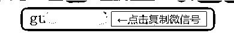

**推广页面 加好友界面截图**

结尾

灰产圈友情提示

 人生自古谁无死，唯有套路得人心

乱花渐欲迷人眼，及时关注灰产圈

防火防盗防套路，点击关注不迷路 

揭秘灰产我当先，传播安全忠可鉴 

●[深度揭秘 | 菲律宾网络博彩：专坑国人的赌局！](http://mp.weixin.qq.com/s?__biz=MzIyMDYwMTk0Mw==&mid=2247493920&idx=2&sn=bc1df12d46cbd070a27aa6987ef07b0c&chksm=97cb2218a0bcab0e074375d5d5b4264fbc222ae48843bb23ec7348dcc8d9777725a5d6fe4925&scene=21#wechat_redirect)

●[第三方支付已彻底沦为涉黄，赌博，诈骗的帮凶！支付宝首当其冲！](http://mp.weixin.qq.com/s?__biz=MzIyMDYwMTk0Mw==&mid=2247493709&idx=1&sn=70e7793df7a17e82d8ebc357c3848405&chksm=97cb2375a0bcaa6312960e24e9b472158eccd9e462edec5498530dd29322d94ccc93992e6f47&scene=21#wechat_redirect)

●[成为博彩网站“代理”后，我把好兄弟坑到跑路！](http://mp.weixin.qq.com/s?__biz=MzIyMDYwMTk0Mw==&mid=2247493820&idx=1&sn=9aef3747b448b984ad4006406a8c29e2&chksm=97cb2384a0bcaa926e10ca9490f195212bc0849f3e723c9a04b7c0c8f818ed7187dc8980ed2f&scene=21#wechat_redirect)

●[深度|揭开层层迷雾,带你走进网络博彩的暗黑世界:500 万赌徒，年输上千亿！](http://mp.weixin.qq.com/s?__biz=MzIyMDYwMTk0Mw==&mid=2247489469&idx=1&sn=068689f941b55b11473a6595f2da08f1&chksm=97c8dc85a0bf5593f4f24fb20775b6448d2bd8a21cc0bc78b95a2fbf64a0e64eebe00449ed68&scene=21#wechat_redirect)

   

**点击加入 ****生财有道 | 商学院**