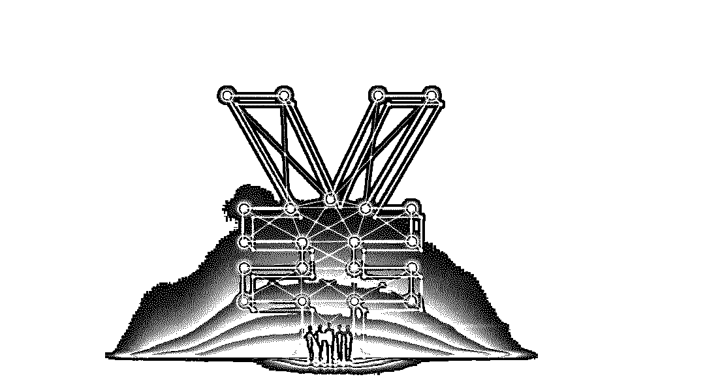

# 揭秘资金掮客的“灰产”狂欢：市值 300 万房产能贷出 240 万！

> 原文：[`mp.weixin.qq.com/s?__biz=MzIyMDYwMTk0Mw==&mid=2247493920&idx=1&sn=40712b003fd340ba0bfd791ec8bf9557&chksm=97cb2218a0bcab0e7cf71229c3a44dd51b20411088965795312923c9aba034a38781aa8f0b55&scene=27#wechat_redirect`](http://mp.weixin.qq.com/s?__biz=MzIyMDYwMTk0Mw==&mid=2247493920&idx=1&sn=40712b003fd340ba0bfd791ec8bf9557&chksm=97cb2218a0bcab0e7cf71229c3a44dd51b20411088965795312923c9aba034a38781aa8f0b55&scene=27#wechat_redirect)

**点击上方蓝色字体“灰产圈”关注并置顶本公众号**

导语

有这样一群人，他们衣着光鲜地出入高档写字楼，坐下来谈的都是百万、千万级别的“大生意”；他们通晓各大银行和贷款公司的贷款细则，并且在这些机构里都有“铁磁”一般的熟人关系；他们有着丰富的民间资金来源和各类“需求”渠道……

“贷款中介”

正常情况下，他们的主要工作是将需要贷款的客户“介绍”到银行、小额贷款公司、P2P 平台等机构，并从中赚取佣金。因此，他们通常被称为“贷款中介”或“资金掮客”。 

目前还没有官方数据统计全国的“贷款中介”到底有多少家，但可以看到的是，在有的地级市，贷款中介机构就有数百家。据业内人士估算：现在全国起码已有上万家贷款中介。

资金掮客们大多来自于线下理财公司和 P2P 网贷平台，也有一些来自于银行等金融机构。可以看到的是，越来越多的人对这个市场趋之若鹜，因为，需求一直都在。

自从央行把对小微企业贷款的投放纳入到了宏观审慎评估体系考核后，银行给小微企业贷款有了“任务指标”，这给了贷款中介生存的空间。他们凭借对各银行贷款规则的了解以及成熟的银行人脉，把客户需求进行整合、外部包装，再去找合适的资金渠道完成融资。 

“我们赚的就是‘信息不对称’的钱。有的客户资质很好，在银行贷款没有问题，只是他不知道途径。我们在同一家银行有好几个支行可以‘进件’，东边不亮西边亮，贷款的成功率就高了。我们跟银行合作很多年了，不会将‘假件’递过去。银行完成了指标，冲高了业绩，应该没理由拒绝。”混迹于资金圈 10 年的中介老手王峰对新金融我们表示。

但有些时候，一些掮客为了做业绩、拿提成，铤而走险为客户包装各种资料。这些人拿着伪造的公司信息、银行流水，甚至是法院判决书游走在资金链的上下游。当然，这只是个例，并非贷款中介的全貌。

这些资金掮客，穿梭于资金链的两端，享受着这个疯狂的市场所带来的资本狂欢。然而，危机却在不远处清晰可见。

“企业”马甲

“一套市值 300 万的房产，你自己去银行贷款只能贷出 100 万，而通过我们能贷出 240 万，这就是我们存在的价值。”一名贷款中介在回答新金融我们业务咨询时说。 

其操作方法就是：把客户包装成一家公司的实际控制人，个人贷包装成企业贷。业内称之为“走实控”。 

“您和您爱人都没有公司，那我们可以给您提供一个正常经营的公司,把您包装成这个公司的实际控制人，实际控制人是不需要到工商局备案的。您作为这个企业的实际控制人，按照企业贷模式去银行贷款。如果不这样做，您只能贷出 100 万。现在有规定，个人消费贷最高贷 100 万。”据该中介介绍，此类贷款的综合利率为月息 6 厘多。 

当新金融我们问及“客户需额外提供什么资料”时，该中介表示：不需要。“流水等一切资料都是我们这边做，公司也是我们提供。整个流程，客户不需要签任何关于公司的文件，只需在银行的贷款合同上签字。银行的工作人员也不会向客户提问任何相关于这个企业的问题。”也就是说，在贷款中介的“帮助”下，一套市值 300 万的房产就能在银行贷出 240 万。

通常，企业在银行申请贷款时，资金方一般会把钱打给与该企业合作的第三方公司，以保证贷款流向。举个例子：一家建材公司要购买一批设备需要 300 万资金，该公司去银行贷款成功的话，银行会将这 300 万打入设备公司的对公账户上。也就是说，在此过程中，想把这笔钱贷出来需要两个公司“协助”——一个申请贷款的公司，一个合作的第三方公司。而这两个公司，上述中介都能提供。

“短期就能还款的话，15 天款就能到账。如果是信用贷款的话，2 个工作日就能到账。”至于费用，该中介表示:中介服务费为实际到账金额的 2 个点。 

我们在采访中了解到，同样的贷款套路，有些中介不提供“壳公司”，他们只是给客户提供“壳公司”渠道，至于费用需要客户与“壳公司”卖家自己谈。 

我们在百度里搜索空壳公司，发现企业的“马甲”并不难找。不少留有联系方式的“渠道商”寻求合作。我们联系了一名“壳公司”卖家，对方表示:只做整体转让，不做单次服务。没有流水的白户（公司）相对便宜一点，有公司流水的（公司）就贵了。 

利益捆绑

为凑够客户的融资需求，除了个人贷变身企业贷，贷款中介还推荐客户办理房值贷。一家贷款中介对新金融我们表示：房值贷也是走银行渠道，北京户口一个人能配资到 150 万，外地户口只能配资到 100 万。但前提条件是，客户或客户直系亲属的房产资产要远远超过贷款金额，这样银行才能授信。“房值贷走的是信用贷款的利息，月息 8 厘多。房值贷比抵押贷的利息高 2-3 厘左右。”该中介说。 

如果融资金额还是达不到，贷款中介还会给客户推荐 P2P 融资，月息 1 分左右，手续费 2%。“一些 P2P 的资方是银行，P2P 代理银行的产品，银行委托 P2P 找客户，签约的时候需要客户去 P2P 公司签。”该中介说。 

一位民间借贷人士直言：贷款中介给客户报的利息通常都是基本利息，加上服务费、咨询费、材料费等额外费用，客户最后支付的资金成本很高。“由于贷款中介本身不放款，所以他们并不承担风险，他们的目标只有一个：帮客户拿到钱。” 

据该民间借贷人士介绍：在贷款中介跟 P2P 或贷款公司的合作中，中介公司通常“两边吃”。贷款成功后，P2P 或贷款公司给贷款中介 1%—2%的劳务费，贷款中介再向客户收取中介费，综合下来，8%—10%的利润空间是有的。 

无疑，资金中介们正在享受暴利的狂欢。

我们致电成都一家资金中介咨询服务费用，对方表示：“服务费是贷款金额的 5%。”另一家位于山东的资金中介则表示：综合费用 8%左右。据了解，目前各地的中介没有统一的标准，收费高的地区综合成本已达到 13%左右。 

一名提供融资服务的市场人士告诉我们，好一点的贷款中介公司一年收入几百万，甚至上千万。有的业务员一个月就能拿到五六万的薪酬。“各条资金线上的人脉是最值钱的。人脉有了，资金、客户就都有了。我认识一个做贷款中介的朋友，去年年薪 80 万，这个圈子里，年薪百万的人有的是。”该市场人士说。 

这是一个“旱的旱死，涝的涝死”的圈子。赚得盘满钵满的贷款中介一般都有较好的人脉资源。

 “签约的时候，我们会陪同客户一起去银行签约，签约之前我们会交代客户一些事情，之后银行让客户签字。几分钟就能办好了。”一家贷款中介如是说。

我们追问：“是否要办假流水？”

该贷款中介回答：“任何证明，我们给你提供都属于造假。这个是行不通的，我们会和银行沟通，这个你就不用管了。在电话里我没法给你明说。你能明白就行。”另一家贷款中介则表示：“把你的资产情况如实提交给我们，我们跟对方（银行）商量看看，需要不需要后续包装。” 

新金融我们在采访中了解到，“返点”已成为这个圈子里的潜规则。 

我们以贷款为由致电山东一家贷款中介。该中介的客户经理直言：“我们的收费并不高，我们还要给渠道（与之‘合作’的银行内部人员）返点，自己挣不了多少。”至于分成比例，目前没有行业规定。一位业内人士直言：一般就是多年“合作”下来的“默契价”——三七分，对方拿三，中介留七。遇上资质很差的客户就四六分，但银行一般不会碰这些危险客户。 

要知道，银行或贷款公司的“内线”们拿钱可不只是提供“放款”这一项服务，他们还负责向中介推荐客户——把那些来银行或公司咨询的客户电话直接过给中介。这些“内线渠道”已经成为中介公司重要的获客资源。 

倒卖数据

其实，对贷款中介而言，获客并不容易。 

一般情况下，贷款中介从同行、房地产销售人员、物业员工、银行客户经理手中批量购入客户信息，从中挖掘潜在客户。圈子里，将各种信息流出的口子称为“信息渠道”。 

拿到客户信息后，中介公司组织工作人员开始电话营销。“我们有专门的系统会自动屏蔽空号。有效号码打一遍，把有贷款需求的客户拉到贷款群。时不时地发些金融新闻或者组织免费讲课，保持群的热度。现在，我们的获客渠道主要是微信群，有业务发个消息就行。”一名业内人士说。

值得注意的是，一些贷款中介花钱购买的数据在“使用完毕”后，会添加一些伪造数据，再次投向市场。而接受这些掺水数据的一般是新入场的中介公司。 

新金融我们在几个贷款微信群中经常看到“个人户籍信息、房产、车辆、电话号码、婚姻信息打包查、低价出”或“手机通讯录及通话记录、手机号定位、带磁身份证实力查询”等个人信息销售广告。

 “银行、小贷、理财、业主、车主、法人、保单、公积金……所有资源定期精确更新。”一名售卖个人信息的卖家在 QQ 群里答复新金融我们问询时表示：“2 毛钱一条，5000 条起卖，1 万条打包价 800 元。”据该卖家介绍，他们的队伍中不乏贷款中介。

我们在采访中了解到，现在，越来越多的贷款中介从一、二线城市开始向三线城市转移。

这似乎是一拍即合的买卖。一家 P2P 网贷平台的负责人称：“一些金融机构或贷款公司到这些经济尚不发达的地区做业务，需要借助贷款中介落地。而对贷款中介而言，一、二线城市竞争压力大，三线城市产品少，很容易做到垄断。” 

贷款中介们在三线城市有了大展拳脚的可能。一家小贷公司员工表示：资金方给出一个贷款利率，一些中介会在此基础上往上调，高出来的部分就揣入自己的腰包。另外，贷款是有套路的。比如中介在贷款过程中告知客户资料需要包装，借此加价。“之前我和中介谈好了 3%的中介费，半截中介说我房产地段不好需要包装，要求加价至 5%。”一位网友在贷款论坛里留言称。 

而一些没有抵押物又没有公司保单、工资流水证明的单子，贷款中介们要么甩给同行，要么介绍到高息公司。这些高息的月利率通常高达 15%或 20%，以 20%计算，其年化利率高达 240%。 

“成也中介，败也中介”。大部分贷款中介履行着自己的职能合法合规地为个人和企业解决了融资难题，而违规的贷款中介在利益的驱使下吹出了一个又一个的危险泡沫，风险一触即发，感谢关注灰产圈！ 

●[深度揭秘币圈超级黑幕：掮客荐币，贷款买币，套路重重，人财两空！](http://mp.weixin.qq.com/s?__biz=MzIyMDYwMTk0Mw==&mid=2247492390&idx=1&sn=81d1122932ea7e87306e2a9f3074b567&chksm=97cb281ea0bca1085010faf7cc3ba6307403051628adef845cae325e97029ffc46259fd4fbc4&scene=21#wechat_redirect)

●[嗜血的“现金贷”：1 人，2 年，20 家平台，深陷漩涡，无法自拔！](http://mp.weixin.qq.com/s?__biz=MzIyMDYwMTk0Mw==&mid=2247493836&idx=1&sn=ae1cf09ed4614a8e0d732019a11fae70&chksm=97cb23f4a0bcaae2b45ac10e0f4964ed5d57411409e1ccc05c8caabfdba314e5ddf8349fa378&scene=21#wechat_redirect)

●[深度|揭秘灰色产业之“嗜血”的现金贷：有人发家致富，也有人家破人亡，光怪陆离,乱象丛生！](http://mp.weixin.qq.com/s?__biz=MzIyMDYwMTk0Mw==&mid=2247488869&idx=1&sn=0900360097d1ba0f8e88d55a1d32439e&chksm=97c8de5da0bf574b41a663d2ba4196584bf5a21e72a598217d1b5e7610e6d5ceed97d2bc6b98&scene=21#wechat_redirect)

●[微粒贷花钱就能开通和提额？你被骗了！](http://mp.weixin.qq.com/s?__biz=MzIyMDYwMTk0Mw==&mid=2247488428&idx=3&sn=c8d5a2b3da58dedbfdc2c0adf26e31d9&chksm=97c8d894a0bf518264ed611ca68d4d1e599087cfe22cde470a5e6121e6df72906b81ed4c5fa7&scene=21#wechat_redirect)

   

**点击加入 ****生财有道 | 商学院**