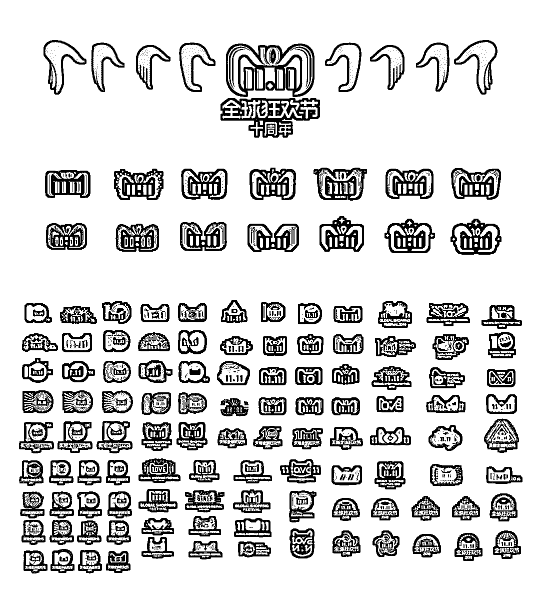

# 「双十一黑产狂欢日」黑客，羊毛党十万军团出动，干上一天，日入十万，够吃一年！

> 原文：[`mp.weixin.qq.com/s?__biz=MzIyMDYwMTk0Mw==&mid=2247493904&idx=1&sn=9209dd9b23c169190d2a9ff771fe5116&chksm=97cb2228a0bcab3e2b9cdcd3fce48c3561900c27027d9068028f3bbb6d7ff7eae6d9bca546d1&scene=27#wechat_redirect`](http://mp.weixin.qq.com/s?__biz=MzIyMDYwMTk0Mw==&mid=2247493904&idx=1&sn=9209dd9b23c169190d2a9ff771fe5116&chksm=97cb2228a0bcab3e2b9cdcd3fce48c3561900c27027d9068028f3bbb6d7ff7eae6d9bca546d1&scene=27#wechat_redirect)

**点击上方蓝色字体“灰产圈”关注并置顶本公众号**

导语

小偷专找人多的地方去偷, 强盗也找灯下黑的地方去抢,每年的双十一不仅是消费者和网购者的狂欢，同事也为不法分子提供可乘之机。

在各大电商平台不断刷新 GMV 背后，“黑产”同时也悄无声息地渗透到了注册、领券、购物、仓配、评价、售后各个网购流程。

抢券薅羊毛、虚假交易、恶意差评、掉包、恶意账号攻击…屡见不鲜，很多非法程序可以被设置为自动模式进行批量入侵。

假如不对黑产引起重视，电商企业一年的辛苦努力将会付之东流！ 

网购用户 5.33 亿

根据《中国互联网络发展状况统计报告》的数据，截至 2018 年 6 月，我国网民规模为 8.02 亿，上半年新增网民 2968 万人，较 2017 年末增加 3.8%，互联网普及率达 57.7%。

截至 2017 年 12 月，我国网络购物用户规模达到 5.33 亿，较 2016 年增长 14.3%，占网民总体的 69.1%。手机网络购物用户规模达到 5.06 亿，同比增长 14.7%，使用比例由 63.4%增至 67.2%。与此同时，网络零售继续保持高速增长，全年交易额达到 71751 亿元，同比增长 32.2%，增速较 2016 年提高 6 个百分点。

网购成为了人们日常生活重要组成部分，同时，黑产同样保持较高增长态势。

某个电商平台负责人透露，网络黑产已形成 15 余工种、160 余万从业人员、产业规模不低于 1000 亿元人民币，同时逐渐向隐蔽、专业、精准发展。

羊毛党太猖狂

根据数据显示，每年的网络黑产造成损失能达到数千亿元，可以吃掉电商平台大多数推广费用和利润。

拿拼车平台为案例，如果每年有 100 万的收入，其中 30%都会被羊毛党拿走。

什么是羊毛党？？

拿共享单车红包活动来说，正常情况每人每天能刷 5 元左右红包，但次数有限制，但是批量软件则可以同时对数百个账号进行操作，一天收入就能达到千元。

**荐**

[大揭秘：神秘的 淘宝职业“打假人”  灰色产业链， 年薅“淘宝” 上亿羊毛。](http://mp.weixin.qq.com/s?__biz=MzIyMDYwMTk0Mw==&mid=2247488824&idx=1&sn=87de122c8ffb49dcfd4df5fa1f2872ca&chksm=97c8de00a0bf57168c3c6be6b71fb98b6d0507dc809a04148143cc9044065f1b5bf5c404130c&scene=21#wechat_redirect)

黑客牟取暴利

再举个例子，不少商家都会在促销时发放大量优惠券，这些红包大部分会被黑客“截胡”后转而以高价卖出。

商家苦心白费不说，让真金白银流入了羊毛党口袋，其在受攻击时还会遭受来自恶意程序峰值承压，甚至会导致平台的瘫痪。

站在消费者角度，假如没有拿到实惠，往往会迁怒于商家，进而影响后者声誉。

**荐**

[双 11 黑产狂欢：数十万撸货大军，薅上一天，够吃一年！](http://mp.weixin.qq.com/s?__biz=MzIyMDYwMTk0Mw==&mid=2247493875&idx=1&sn=c869c8a59e62433f99012c6bef81ade1&chksm=97cb23cba0bcaaddc7f3bad2c1ed35406fb3820dcf6350f2ec86c98cfd1910ccef3411b6d450&scene=21#wechat_redirect)

账号密码泄露

正常情况下，黑客会租用服务器通过不同 IP 地址在短时间内发起大量的请求，还有利用撞库技术窃取消费者用户名和密码，直接消费或提现。

假如此时，不知情的消费者会选择投诉商家或电商平台，会引起不必要的交易纠纷。

**荐**

[iPhone 用户账号集体沦陷：700 多人被盗刷 ，苹果公司 : 无法退款！](http://mp.weixin.qq.com/s?__biz=MzIyMDYwMTk0Mw==&mid=2247493554&idx=1&sn=c42e8e0d41303f4bbebcbd6f178500bc&chksm=97cb2c8aa0bca59c0175213906e817f7d97e0eb3232cad333422ea9dbf9683d82ee0c910e362&scene=21#wechat_redirect)

刷单潜规则

举个例子，所谓黑卡和黑账户可以在很多平台重复使用，这就产生了很多业务的关联，这些账号邮箱、地区、号码存在一定的规律，例如用虚拟运营商 170 号段注册就比较的多。

刷单的同时，会雇人拿着上百台手机刷，也可能会用空包刷订单号，或是“众包打码”，花钱让别人去领任务。据统计，2010 年以来，刷单已成为最常见的黑产行为，有着专业运营流程和明确分工。

**荐**

[深度|2017 天猫双十一成交 1682 亿，刷单 800 亿？ 揭秘真实的刷单世界：有人赚了一辆法拉利！](http://mp.weixin.qq.com/s?__biz=MzIyMDYwMTk0Mw==&mid=2247489054&idx=1&sn=4144474a2229b0fa9c796df43dc45058&chksm=97c8dd26a0bf5430170ebdd82bef40c0ab0165d190daec669f416a6e2eacb13a0d474da267e2&scene=21#wechat_redirect)

用户信息泄露

假如说刷单主要是对商家威胁，那么诈骗则是与消费者密切相关，这需要黑产知道用户手机号以及在哪个商家买过商品，这就是订单信息泄露，不仅涉及买家账户安全、订单、支付信息，还渗透到了卖家商家后台、打单、物流环节。

购物时，消费者成交记录、评价晒单、聊天信息，和使用 APP 都会存在风险。对于社交型的电商来说，除社区、直播等多渠道，内容丰富性也为黑产提供了更多手段。

**荐**

[深度：信息买卖黑链：淘宝 25 页和京东 3 年数据仅需 1 元，揭秘你的信息是如何被黑市买卖的。](http://mp.weixin.qq.com/s?__biz=MzIyMDYwMTk0Mw==&mid=2247489263&idx=1&sn=e1baf7a32570e65968fd8ab3bfee5649&chksm=97c8ddd7a0bf54c151b62d46024846d2eb1e6b07c55d69bc46d515284d275c858aefbc128be4&scene=21#wechat_redirect)

道高一尺魔高一丈

在每年，阿里、腾讯等公司都会为防御黑灰产威胁投入数十亿元和数千的人力。可以说，黑产正从无序、粗暴逐步演化为“团伙化、专业化、细分化、众包化”，黑色产业链也越来越完善。

同时，黑产和云计算、大数据结合愈发紧密。随着黑产专业化，应对措施要更加智能化，例如引入人脸识别技术、AI 机器学习、人工智能技术，借助安全大数据抓住黑产弱点，让风控部门在海量的信息中分辨出哪些是好人，哪些是黑产

**腾讯云服务：**

**快速、便捷、及时的活动防刷服务，有效识别出“羊毛党”，保障企业利益**

**以上为腾讯云防羊毛党刷单安全产品简介**

从云服务商角度来看，要为电商平台提供活动防刷、防恶意注册、防恶意登录、验证码、消息过滤、关键词检测、文件检测能力，以及 CC 攻击防护、Web 入侵防护功能，还有动态调度全网各点冗余带宽和防护能力。

除此之外，数据迁移、灾备服务同样是不容忽视的。

**荐**

刷[深度|薅羊毛黑产攻防实录：“羊毛党”与“攻城狮”之间的博弈游戏](http://mp.weixin.qq.com/s?__biz=MzIyMDYwMTk0Mw==&mid=2247489704&idx=1&sn=fd723f4a71b42686451bce2641707a67&chksm=97c8d390a0bf5a8659576c4f7fa98f6c43942f61a32de88f9818a6f61f990325ba04964294b9&scene=21#wechat_redirect)

结语

总的来说，电商平台、安全服务器、监管机构在黑产面前应同仇敌忾，打通各个部门数据资源，黑产在完整的链条上一定不会只做一件事，他们会黑完电商 A 再去黑电商 B。

电商平台 VS 黑产军团正是在此消彼长的战斗中互相成长，从反面讲，是电商平台成就了“羊毛党”“黄牛党”等电商黑产从业者，同样，黑产也促使了电商平台更加安全，可靠，通过不断的更新安全策略来保护用户的隐私和资产安全！

最后，灰产圈送上美图一张，祝大家剁手快乐！

  知识星球：生财有道商学院      立即关注   

**点击加入 ****生财有道 | 商学院**