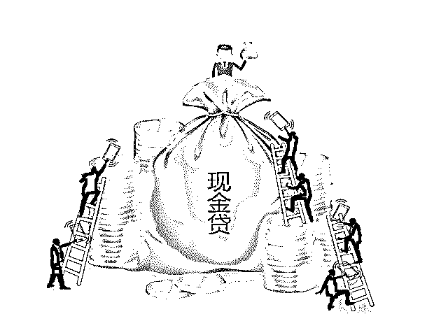
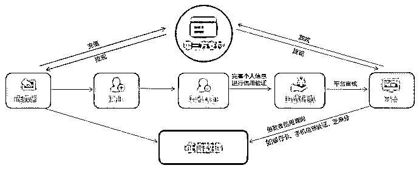
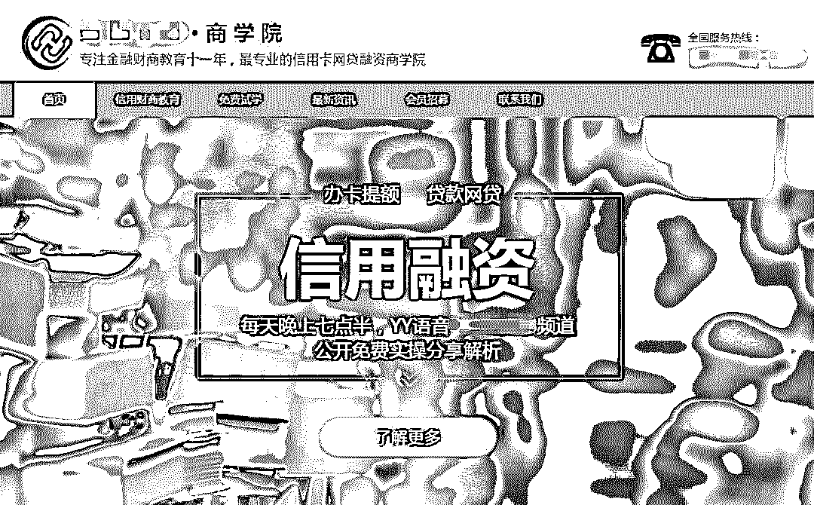
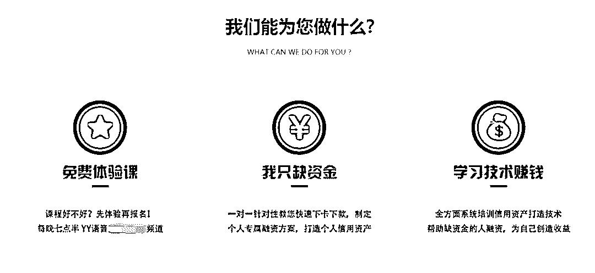
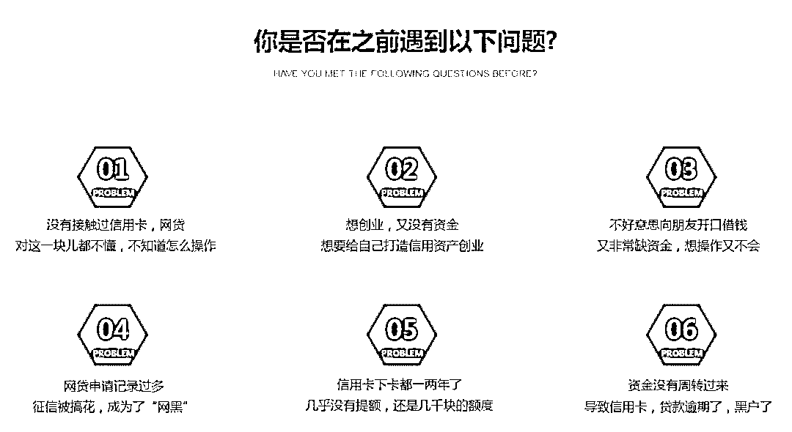
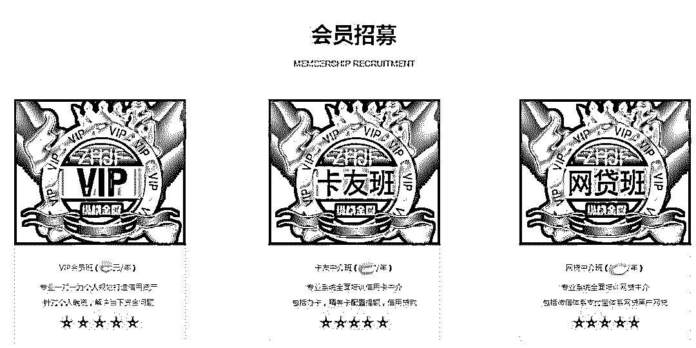
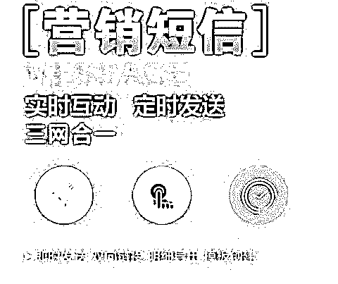
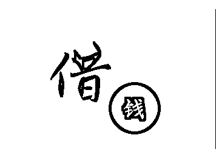
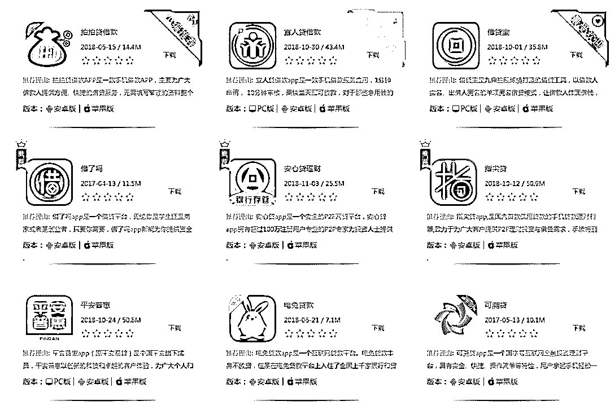
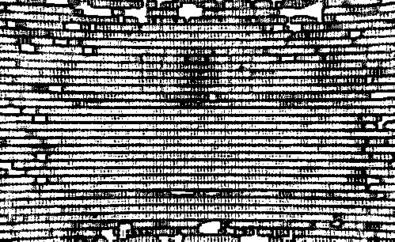

# 嗜血的“现金贷”：1 人，2 年，20 家平台，深陷漩涡，无法自拔！

> 原文：[`mp.weixin.qq.com/s?__biz=MzIyMDYwMTk0Mw==&mid=2247493836&idx=1&sn=ae1cf09ed4614a8e0d732019a11fae70&chksm=97cb23f4a0bcaae2b45ac10e0f4964ed5d57411409e1ccc05c8caabfdba314e5ddf8349fa378&scene=27#wechat_redirect`](http://mp.weixin.qq.com/s?__biz=MzIyMDYwMTk0Mw==&mid=2247493836&idx=1&sn=ae1cf09ed4614a8e0d732019a11fae70&chksm=97cb23f4a0bcaae2b45ac10e0f4964ed5d57411409e1ccc05c8caabfdba314e5ddf8349fa378&scene=27#wechat_redirect)

**点击上方蓝色字体“灰产圈”关注并置顶本公众号**

前情提要

本文通过故事主人公 cc(化名)的故事，为大家讲述现金贷灰色产业链，希望大家远离“高利贷”现金借贷平台，并将这份正能量传播给身边的人！

**导语**

在传统金融机构的风控维度，CC 的信用资质要获得信贷授信的渠道非常有限，但是在数字经济时代，人的行为线上化、金融行为数据化，于是借钱的准入机制变了。

如果按传统金融机构的风控维度，CC 进入不了贷款客户“白名单”：

她没有固定工作，没有固定收入，没有房车作为抵押资产（业内称“三无人员”）。

然而，从 2016 年 6 月开始办理线上贷款到今年 9 月资金链断裂陷入还款危机，中间长达 2 年多时间，CC 通过 13 家网贷平台以及 7 家银行信用卡循环借款，举债还债、以贷养贷。期间，甚至支付 2 万元学费参加了快贷融资、征信“洗白”的培训课程。

**起底现金贷灰产**

CC 觉得借款“口子”更多、门槛似乎更低的同一时期，国内个人消费贷款正迎来规模爆发的加速发展。截至今年 8 月末，不含车房贷的银行个人消费贷余额已达 8 万亿元，个人信用卡贷款余额超过 5 万亿元，还不包括各类消费金融公司、卡代偿平台等的贷款。

在数字经济时代，个人的行为线上化、金融行为数据化，零售信贷业务的普惠覆盖、用户量级扩张成为可能。

但是，随之而来的各类智能化助贷技术产品兴起、准入门槛大幅降低，甚至是网站上频繁弹出的各种贷款导流网页，都在为借款人开了方便之门。

在此情形下，如何抑制助贷灰色产业链蔓延、规避超出个人偿还能力的多头借贷、防范过度授信风险，值得关注。

****2 年借遍 20 家平台****

********

****“不是不想还，手头有钱自然会还。”日前，在一个内陆地区省会城市即将旧改的楼房里，身陷个贷漩涡、欠债累累的 CC 接受了我们的采访。****

****在近 2 个小时的采访中，先后被 16 个微信语音或电话打断，均是贷款逾期提醒或客服催收。这令 CC 陷入恐慌之中。****

****2016 年 6 月 23 日，CC 收到民间借贷传单，通过电话联系之后，第一次贷到 5000 元。数月后，又因做生意需要资金周转，她尝试在 2 家网贷平台上分数次借了 10 多万元。****

****CC 由初涉网贷，发展到开始在多个平台同时举债。****

****然而，需要还的钱越还越多，再加上没有固定收入来源，尽管连年化利率都算不清——等本等息、等额本息、等额本金的还款方式都听不懂，她在举债还债、以贷养贷的路上越走越远。****

****2016 年 6 月到 2018 年 9 月两年多时间，CC 尝试了 13 家网贷平台消费分期、现金贷产品，以及 7 家银行信用卡分期和套现。通过循环举债，拆东墙补西墙。****

****这之中，13 家网贷平台累计举债本息 41.5 万元，单笔额度最高的 19.35 万元来自一家民营信贷公司友信信贷，当前累计未还款 28.63 万元；7 家银行信用卡使用额度 24.05 万元，单卡借款额度最高的为 5.14 万元，当前尚未还款总额 8.59 万元 。****

****一般情况下，信用卡逾期将按 0.05%日利率罚息并收取滞纳金；上述 13 家网贷平台逾期约按日利率 0.05%~0.098%罚息，数家平台甚至会在日利率基础上加收 30%违约金等罚款。****

****不难想象，随着逾期时间的延长，如果不能即时清偿欠款，CC 的未还款额将会继续攀升。****

********灰色产业链蔓延********

****按传统金融机构个人信贷的风控模型，CC 绝不属于“白名单”上的客户，因为她没有固定工作，也没有固定收入，甚至没有房车作为抵押资产。****

****让 CC 的家人感到困惑的是：她怎么能从这些大平台借到钱？****

****CC 告诉我们，她通过朋友介绍，参加了一项仅学费就需近 2 万元的“天价”培训课程。第一课就告知学员哪些“借贷口子”尚未列入央行征信范围；课程内容细致到“多参加微信合作消费，关注某网络银行、转入资金、参与其理财产品；与开通了该网络银行网络贷款权限的人发生资金往来，并进行相关消费等。”****

****“两天一夜的线下课程，学费近 2 万元，缴费一次可以免费多次听课。”CC 参加的课程举办方，是一家工商注册地在深圳龙华的 XX 商学院，每个月在北上广深、重庆、成都多地线下授课，课程内容不一，收费 200 元/次~1.98 万元/次不等。稍加辨别，不难发现“教学内容”无非就是信用融资、快贷、征信洗白。****

********

******CC 所说的 XX 商学院官网截图******

****学费不同则教课内容“含金量”不一，200 元的 1 天课程则不会涉及太细化的内容。我们从该商学院一名“授课老师”获得的课程表显示，内容有分解银行风控体系，逾期车房贷和信用卡、网贷黑户漂白，如何快速养卡、提额等等。据他介绍，该商学院已开业近 8 年时间，不到 10 名“讲师”，每月在全国至少开 4 场，每次“听课学员”80 人、100 人到 300 人不等。****

****从该商学院的往期授课情况介绍来看，“学员”中更多是个体商户。一位“学员”告诉我们，“有一次线下授课时，有学员按课堂上教的步骤、一步步操作，当场就获得近百万的贷款。”****

****在课堂现场，教授学员操作极速秒贷案例，也成了该公司招揽学员、抬高学费的噱头。****

****其实，从 2016 年开始，CC 觉得借款“口子”更多、门槛似乎更低的同一时期，国内个人消费贷款正迎来规模爆发式增长，围绕它的各类灰色产业务链也在迅速发展。****

****这类打着所谓“商学院”旗号涉嫌灰色信用融资的，并不是孤例。我们从一位现金贷业内人士了解到，数家类似机构活跃在深圳龙华和上海浦东，不仅以授课形式收费，还会借此发展新会员，一级级延伸出去，在线上线下推广做灰色信贷或套现业务。****

****律师表示“一旦（上课的‘学员’）从事违法犯罪活动，专门教授套现及灰色融资课程的个人和组织，就有可能成为典型的帮助犯、将被一同定罪量刑。”****

********短信轰炸********

************

******导流推介贷款渠道的信息轰炸，是让 CC 在多个个贷平台借钱的另一个诱因。******

******有了数次线上借贷经历之后，CC 发现自己一打开浏览器网页、打车软件、新闻 APP，就经常能看到网贷导流广告推送页，手机短信里也充斥着这类信息。正如网页导流是通过精准推送技术实现，越来越多的人感受被各类贷款推介导流信息围堵的背后也有一套运行系统。******

******一家主营国际国内短信及验证码群发公司商务人员向我们透露，“现金贷平台、消费金融公司多数会与第三方合作，确定信息内容，由第三方系统或者后台群发出去；群发的内容不同价格不一，按条计费，单条费用一般在 0.5 元以内。”******

******“随着线上获客成本高企，手机短信正成为越来越多平台的选择，业内两家头部网贷平台单月群发短信费用在 300 万元以上。”上述人士透露。即使简单按 1 元/条计算，这两家平台每月发出的信息也在 600 万条以上，而两家平台贷款余额还不到全社会个人消费贷余额的 0.33%。******

******“互联网广告主、广告经营者、发布者是互联网广告法律关系的‘三驾马车’。”肖飒提醒，网贷平台对这些广告的真实性负责。******

******“传统的风控模式在贷前、贷中、贷后三部分中最看重贷前，风控部门希望严格前端审批和授信，令坏账率可控。但是，营销部门则希望业务开展更加高效率——低成本、大规模获客。”上海新颜人工智能科技有限公司首席执行官黄向前称，激烈竞争之下重流量、轻风控，广撒网的模式比较多见。不少人不堪其扰的群发短信，只是随着技术发展而升级的各类助贷、营销工具介入并利用民众隐私信息现象的冰山一角。******

******而且，网站上频繁弹出的各种贷款推荐信息，相当于实时进行着无差异全民覆盖的消费金融“教育”。于是，有越来越多的人习惯了“借钱消费”。******

******多家银行信用卡 2017 年余额同比均增长逾 20%，如浦发银行、兴业银行、平安银行信用卡贷款余额同比增幅超过 50%。今年上半年，A 股上市银行披露的信用卡刷卡交易量逾 13 万亿元。******

********全民借钱********

************

******我们看到，在 CC 的两部手机上，产生过借贷往来记录的有微粒贷、卡卡贷、翼支付（甜橙分期）、微乐分、安逸花、招联金融、京东白条和金条、蚂蚁借呗、拍拍贷等，均属于国内头部消费金融或现金贷平台；有过分期、套现的 7 张信用卡，则来自 3 家国有行及 4 家股份制银行。借贷笔数繁多，借款数目都是千元到数十万元不等。******

************

******在传统金融机构的风控维度，CC 的信用资质要获得信贷授信的渠道非常有限，但是在数字经济时代，人的行为线上化、金融行为数据化，于是借钱的准入机制变了。******

******“先把口子放开，让更多用户使用，相当于准入门槛放低，但给的额度不大，等用户有了行为痕迹之后，凭借用户的日常借贷行为、消费交易情况额度等金融行为，进行数据化模型推演，再决定贷款或者分期额度。”一位资深业内风控人士描述一款知名的消费贷产品的用户筛选机制。******

******这就不难理解，为什么 CC 在数个消费贷平台上使用越久、循环借钱越多，平台给予的额度反而越大。“尽管风控模型也在不断智能化、升级进化，但不排除一些钻漏洞来养卡、套现的新方式不断冒出，尤其在消费信贷‘漫灌’的环境下，用户选择就更多。”上述人士说。******

******央行最新数据显示，截至今年 8 月末，金融机构信贷收支表里的居民短期消费贷款规模已经超过 8 万亿元。这里的居民短期消费贷款为狭义口径，即银行面向居民消费贷款剔房贷、车贷后的部分。******

******兴业研究报告称，“若是考虑到各种互联网金融公司、信用卡及卡代偿平台所进行的消费分期和现金贷业务，8 万亿元的数据还远远被低估了。”******

******从增速上看，银行面向居民的短期消费贷在 2012 年末仅 1.94 万亿元，2015 年突破 4 万亿元，再到 2018 年 8 月末的 8 万亿元——这意味着，不到 3 年时间，居民短期消费贷增长近 2 倍。******

********衍生灰色产业链********

********

****下面我们给你扒一扒贷款灰色产业，可能比你想的更黑更乱。****

****主要集中在四个部分：身份冒用；代办申请；专营贷款规则漏洞；利用高科技突破信贷审查****

****一、身份冒用 ****

****如果哪一天你突然收到法院传票，说你欠下几千万的贷款惹上官司，你的第一反应是什么? 坑爹呀？因为你从来就没有申请过贷款，更何来欠款一说？但如果你的身份被冒用，发生这种事情也并不是没有可能。****

****那这些人是如何冒用身份并申请到贷款的呢？****

****一般来说，申请信用贷款需要的资料除了申请贷款的用途和金额外，还有两类，一类是证明“你是你”：包括姓名，身份证信息，联系方式；****

****第二类是证明“你有能力还款”，包括银行流水，收入证明，其它流水证明等等。如果拥有了这些信息，且之前没有进入黑名单的，下款率都会比较高！****

****那如何获得这些信息呢？****

****首先是个人的实名信息，这类信息一方面是从某些机构获取（比如 Y 行，B 险公司，D 商等），另外就是利用网上的钓鱼网站，或者木马病毒收集用户信息，然后批量出售。****

****这些“信息贩子”通常会游荡在某些论坛上，或加入网上的 QQ，如“私家侦探”、“信息资源”等，你在论坛或群里说需要信息，一般就会有人和你私聊，这样就形成了一个买卖市场。****

****银行流水通过中介也是可以做出来的！因为一般信贷人员只能熟练辨认自家银行的流水，对于其他银行的流水进行审查相对比较困难，再加上有的银行有业绩压力，所以只要纸张和公章没有太大问题，流水便可通过。****

****当然，收入证明就更好做了~（据说有人将网上的收入证明用修图软件修改就通过审核了~）****

****曾经有相关媒体爆料称：实名信息：2 元/份；银行流水：300 元/份；收入证明：100—300/份；办理假身份证：100 元一张；由此可见一斑！****

****二、中介代办申请****

****中介代办申请其实就是索要用户信息，代为申请，然后按照放贷的额度进行分成。比如大家比较常见的信用卡代办。这类黑产一般有三类：****

****1、纯粹骗钱型****

****这种一般都宣称和内部有关系，先把你的“定金”骗到手，然后消失。 而且骗子还有固定营业场所，租好地段大厦的办公室，当你将信息交给他们办，他们会先告诉你需要时间，拖到他们认为“骗够”了，就退掉办公室后一夜间人间蒸发。****

****因为这类事件在我朋友身上发生过，所以可以说的再详细些。当时那位骗子说自己是某行内部员工，可以通过特殊关系办到大额的信用卡，不过需要收取一定的手续费，比如办理额度的百分之几，先付定金。****

****我那位朋友刚开始的时候将信将疑，因为定金比较少最后还是给了。没过几天，就有人来做背景调查，弄的像模像样的。一番闲聊之后背景调查就算过了，之后对方就说需要咨信调查，也就是要转账到某个账户，目的是将银行的流水做的“漂亮”，才能申请到大额的信用卡。让我那位朋友转了 5000，我那位“单纯”的朋友 想了一会，最终也转了~****

****注意，一般这个时候，如果对方是小骗，拿到钱后就应该闪人了，不过这个骗子比较厉害，他将钱又给我那位朋友转回来了。到这个时候，我的那位朋友就相信对方的确“靠的住”，之后对方又说转账 30000，朋友当然继续转了，然后，然后就木有然后了啊......****

****2、骗取资料型****

****他们会收集你的身份证、工作证明等个人资料后，向你未选择的银行申请卡，而地址、电话留的是他们自己的。等批卡后把卡的额度刷光，然后又人间蒸发了。又或者收集了大量个人信息卖给第三方。****

****3、黑中介型****

****他们虽然不骗取你的资料，但可以伪造些资料，帮助不符合标准的申请人通过审核，从而谋利。****

****PS：假如批到了卡，虽然可能能够正常用一段时间，但只要被银行复核的时候查出问题来了，可以随时以提供虚假资料为由停你的卡，一旦发生，这种不良记录会导致至少 5 年内办不到任何银行的信用卡、房贷、车贷了。****

****PS:所以网上的代办大额信用卡之类，都是有猫腻的，这一行讲究的是做熟不做生，如果没有熟人帮着做，最好还是不要轻易去相信网上的中介各种花言巧语的好~****

****三、专研贷款规则漏洞申请贷款****

****不知道大家申请小额贷款的时候，是否经常被拒绝了！但却不会告诉拒绝的具体原因，只是说不满足要求，其实就是防这批人。****

****这批人的每天活跃在各种贷款论坛，QQ 群，贴吧中，打听哪些新的小贷公司上线了，哪些小贷公司的系统有问题，一旦发现有合适的标的，就蜂拥而上，要是对方没有明确给出规则，就各种恐吓威胁，给小贷公司施压，说其信息不透明，操作不规范。****

****所以各位，如果你哪天急需用钱，去申请小额贷款，不幸被拒而贷款公司又不提供具体原因的话，其实不是不规范，只是这些贷款公司要防那些专营漏洞的人。****

****四、利用高科技工具，突破信贷审查****

****最后一种就更高端了。****

****这些人早些年研究 QQ 账号，淘宝刷单，前几年又研究 P2P 的规则刷红包，最近又开始研究贷款平台。****

****他们先大量收集用户资料，再根据贷款系统的漏洞，研发相应的软件，突破信贷的审查，批量注册，批量申请贷款！****

****为什么很多小贷公司宣传是纯线上贷款，几分钟快速审核，当天到账。而在实际中依然会用电话，依然是过几天之后才放款？为什么有的人申请金额几万，但实际下批的额度只有几千甚至几百？****

****其实，在一定程度上就是为了防止这批人！****

****说了这么多，其实我们普通老百姓遇到最大的问题就是由于信息被盗导致被“贷款”，所以，羊毛能薅不能，还得找信得过的，真要是不放心，就别去赚那个小钱了，有时候个人信息是比什么都值钱的了。****

****所以，现在的这个社会，可以一句话概括：防人之心不可无啊!害人之心也不可有!****

******结尾******

********

****人人都想在现金贷时代，分得一杯羹。

这条产业链庞大而且密集，数十万人参与其中，各司其职，分工明确，在这条产业链中各自获取自己的利益。****

****最后送大家一句话：****

****出来混，迟早是要还的！**** 

****参考资料：****

****证券时报：《非白名单客户陷个贷漩涡：灰色产业蔓延 过度授信凸显》****

****重庆晨报《嗜血现金贷让你走向深渊：借一万块，最后竟要还 40 万！》****

********

****●[深度|揭秘灰色产业之“嗜血”的现金贷：有人发家致富，也有人家破人亡，光怪陆离,乱象丛生！](http://mp.weixin.qq.com/s?__biz=MzIyMDYwMTk0Mw==&mid=2247488869&idx=1&sn=0900360097d1ba0f8e88d55a1d32439e&chksm=97c8de5da0bf574b41a663d2ba4196584bf5a21e72a598217d1b5e7610e6d5ceed97d2bc6b98&scene=21#wechat_redirect)****

****●[深度揭秘币圈超级黑幕：掮客荐币，贷款买币，套路重重，人财两空！](http://mp.weixin.qq.com/s?__biz=MzIyMDYwMTk0Mw==&mid=2247492390&idx=1&sn=81d1122932ea7e87306e2a9f3074b567&chksm=97cb281ea0bca1085010faf7cc3ba6307403051628adef845cae325e97029ffc46259fd4fbc4&scene=21#wechat_redirect)****

****●[开扒百度贴吧“戒赌吧”，看完刷新你的三观——触目惊心的赌徒日常](http://mp.weixin.qq.com/s?__biz=MzIyMDYwMTk0Mw==&mid=2247491415&idx=1&sn=b058a341a7218857c40a305ca2be3425&chksm=97c8d46fa0bf5d79f722f9fc56d9f8db634b689fc21f9f0b285c14f21d79b855ae28010d90e1&scene=21#wechat_redirect)****

****●[全中国最堕落的地方，这里聚集了一群「三和大神」：日结一天的工资，阔以玩三天 ！](http://mp.weixin.qq.com/s?__biz=MzIyMDYwMTk0Mw==&mid=2247493563&idx=1&sn=64a31f6c1e65df54ccfdd5faf83c77ec&chksm=97cb2c83a0bca595407f4d449d28064c1453ba9b6e0da5b94d0ace6481c2f992202eb5d461c8&scene=21#wechat_redirect)****

****  知识星球：生财有道商学院      ****************立即关注********   ****

******点击加入 ****生财有道 | 商学院******