# 罗永浩：让“子弹”飞？

> 原文：[`mp.weixin.qq.com/s?__biz=MzIyMDYwMTk0Mw==&mid=2247493370&idx=1&sn=1ba00bcf004bd701e3f84f6f5c1b50fd&chksm=97cb2dc2a0bca4d4fe480e052a03d079d892caf5d580d21362138aa9ba0a96c3f790a2d407d0&scene=27#wechat_redirect`](http://mp.weixin.qq.com/s?__biz=MzIyMDYwMTk0Mw==&mid=2247493370&idx=1&sn=1ba00bcf004bd701e3f84f6f5c1b50fd&chksm=97cb2dc2a0bca4d4fe480e052a03d079d892caf5d580d21362138aa9ba0a96c3f790a2d407d0&scene=27#wechat_redirect)

导语

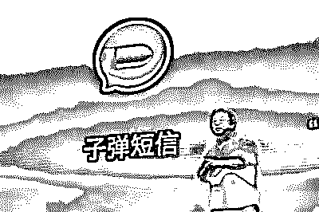

“上线 10 天，注册用户突破 400 万”、“上线 7 天，融资 1.5 亿”……由罗永浩的锤子科技投资的子弹短信 APP 来势汹汹，竞争对手直指微信。但一个月后，该 APP 却被网友举报不断被色情内容骚扰。

“子弹短信”起飞了

这个月，罗永浩的微博不再是他的坚果新机，子弹短信成了他的主要精力所在，这段时间都忙着在微博和公众号上宣传。

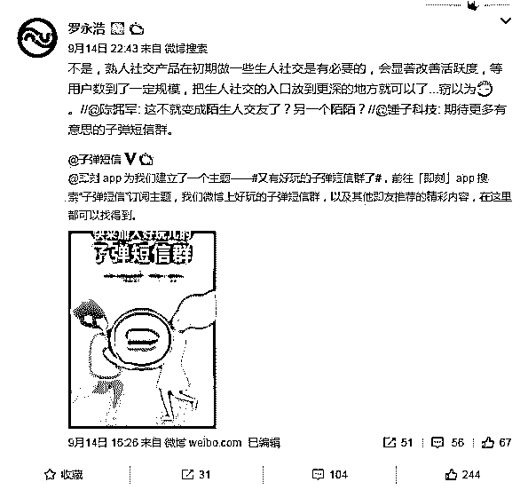

子弹短信上线短短十天，这款在锤子新品发布会发布的社交软件稳居苹果 App Store 社交榜榜首，上线 7 天就完成了 1.5 亿 A 轮融资，估值超 6 亿，甚至被认为有取代微信之势。

以下是子弹短信发布官方数据统计： 

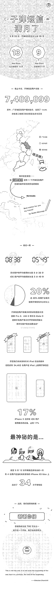

不光用户数大幅增多，同时，资本也向子弹短信所属公司 快如科技抛出了橄榄枝。

子弹短信的 A 轮融资由高榕资本和成为基金投资，目前 B 轮融资也基本完成，还拒绝了巨头的投资意向。此外，他还称，子弹短信不是为了挑战微信，但未来将上线熟人关系链的解决方案，留存上千万甚至 1 亿的用户，拿下 10%-20%的通讯工具市场。

罗永浩介绍，子弹短信的开发商快如科技目前有四十多名员工，其中三分之一是从锤子科技过去。这部分员工起初是想出去创业，最后新做了一个项目子弹短信。

此前，子弹短信已经完成了 1.5 亿元的 A 轮融资。罗永浩称，子弹短信上线的第二天腾讯投资部就打来了电话想投资。最终的 A 轮融资由高榕资本和成为基金投资。

他还透露，目前子弹短信的 B 轮融资也已基本完成，“有巨头想进来，我想缓一缓，让他们 C 轮再进。”

子弹刚飞就出问题？

随着子弹短信影响力的不断扩大，子弹短信的各种安全问题与隐私问题也被一一曝光，现在子弹短信又遇到了另一个问题：色情传播和垃圾广告。

而且这事还是从国外媒体人曝出来的

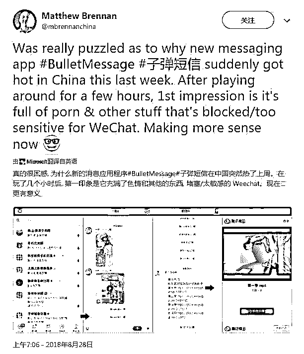

有位国外媒体人在网上晒出了一些子弹短信的色情信息截图，表示自己玩了几个小时，第一印象就是充满了色情和其他被微信屏蔽的敏感内容，他表示终于知道这个 APP 为什么这么快火了。

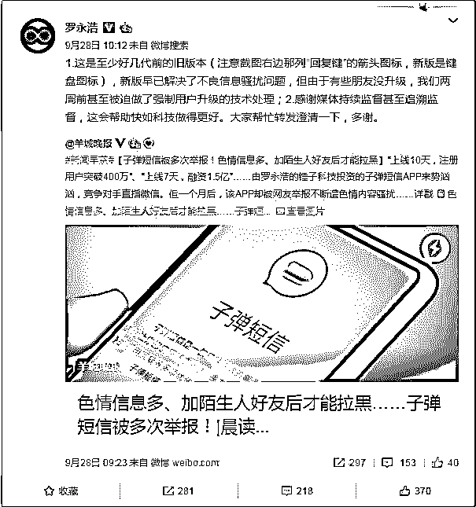

羊城晚报针对“子弹短信”色情信息进行了报道，罗永浩在微博中回复：

> **1.这是至少好几代前的旧版本（注意截图右边那列“回复键”的箭头图标，新版是键盘图标），新版早已解决了不良信息骚扰问题，但由于有些朋友没升级，我们两周前甚至被迫做了强制用户升级的技术处理；**
> 
> **2.感谢媒体持续监督甚至追溯监督，这会帮助快如科技做得更好。大家帮忙转发澄清一下，多谢。**

子弹还能飞多久

其实，早在 8 月 30 日就曾有媒体曝光了子弹短信含有色情和违禁内容。随后，更有多位网友在社交媒体上表示，自己在群聊中常常收到别人发送的黄色信息及图片。

出现这一情况主要是因为子弹短信设置问题。为了使用更加便捷，子弹短信采取了不安装也可以使用的设计。也就是说当其他用户收到了子弹短信之后，可以通过进入网页版直接查看信息并回复。

**想屏蔽骚扰信息 需先加骚扰者好友再拉黑**

据了解，子弹短信的信息是跳转到系统信息页面发送的，内容则是用户所输入的内容+子弹短信邀请+链接。如果有人采用类似格式发送短信，把链接替换为恶意网址，将会对用户安全造成很大威胁。

另外，子弹短信声称自己主打熟人社交，但实际上即使和对方不是好友也可以发送信息。不法分子正是利用了这一点，向子弹短信用户发送涉黄或骚扰信息。而如果想要屏蔽骚扰信息，就需要先加骚扰者为好友，然后再拉黑才行。

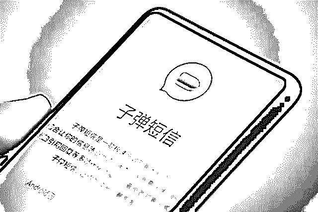

实际上这些色情和垃圾广告信息到现在为止也大量存在，在很多锤友群里，都有它们的影子。

码农群里的撩妹课程

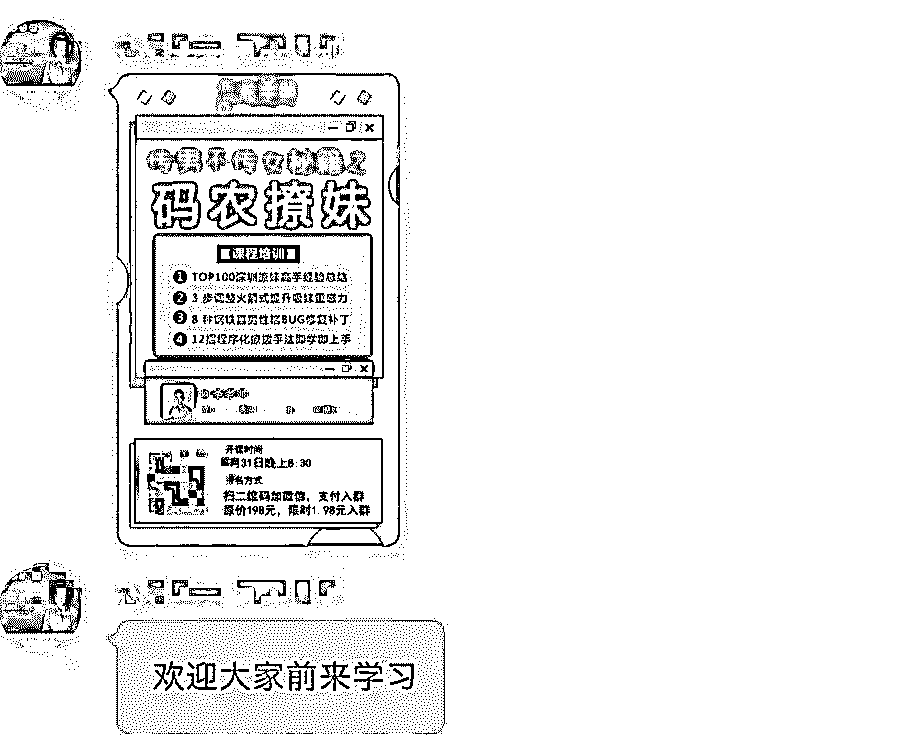

来自拼多多的“杜雷斯”？

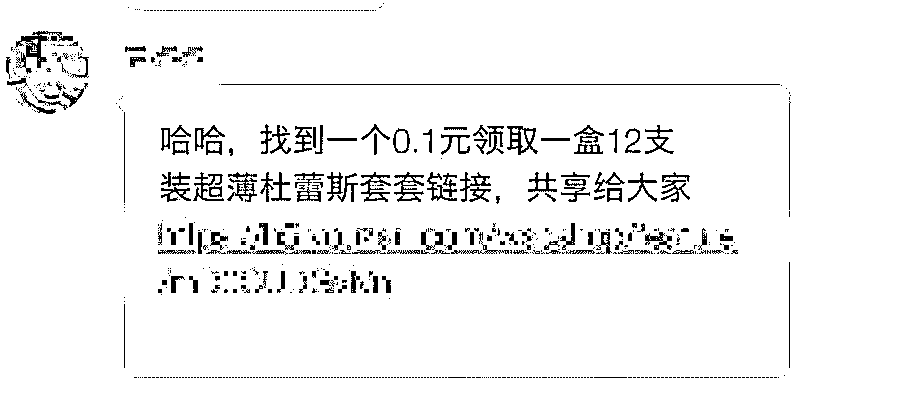

高仿官方账号打广告的

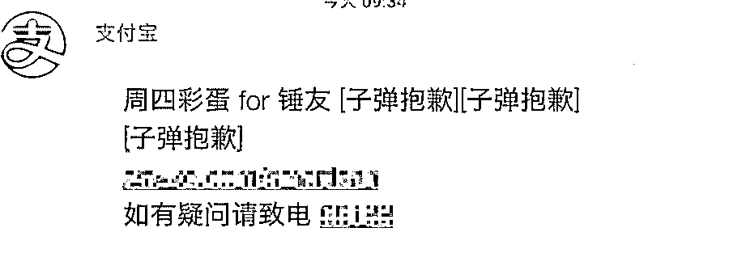

还有些“小姐姐”直接私聊的

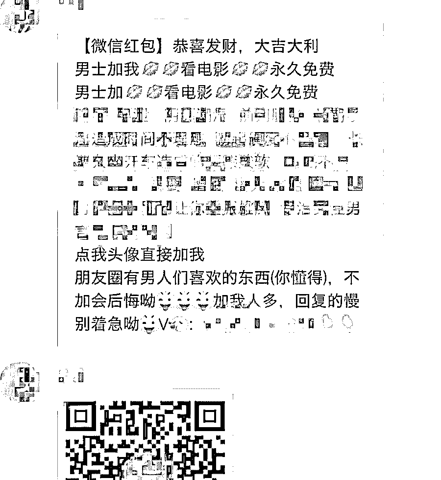

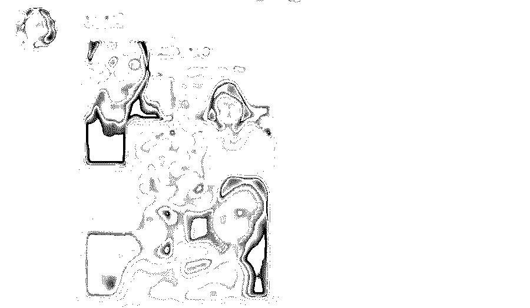

开门见山：加 V 看片

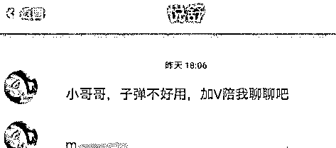

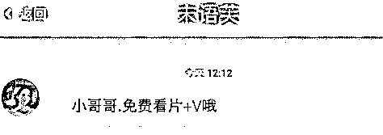

子弹短信的一个功能，可以随意给陌生人发消息。显然，这些卖片、交友达人利用的，就是这个功能。只要知道你的手机号，或者通过附近的锤友，或者同在一个群里，就可以直接给你发消息。

不用申请加好友，也不用经过你同意。这就有点可怕了...想想，我们的手机号，不知道被倒卖过多少次。再想想，前段时间刚被喷过的，苹果 iMessage，也是不用加好友，不用被同意，结果：

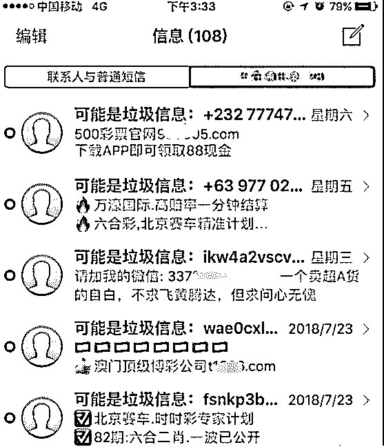

收到无数黄赌毒垃圾信息！而且因为苹果的锅，这种信息还不能拒收，只能在收到后一个个拉黑。子弹短信同样，不能拒收。看了看 App 的设置，只有一个拉黑功能。

如果子弹短信官方不尽快搞点什么措施，估计，黄赌毒的骚扰只会更多。尤其是，官方还会推出网页版和电脑版，到时就更方便啦。

有些网友可能要说了，微信难道没有这种垃圾信息吗？任何一个社交 APP 没有吗？

是，有。但是微信加好友至少需要申请吧？至少需要你同意吧？

然而子弹短信不需要！只要知道你的手机号，不，甚至都不用知道你的手机号，只要通过附近的锤友，或者在同一个群，就可以直接给你发消息。（“小姐姐”就是这样直接私聊的）

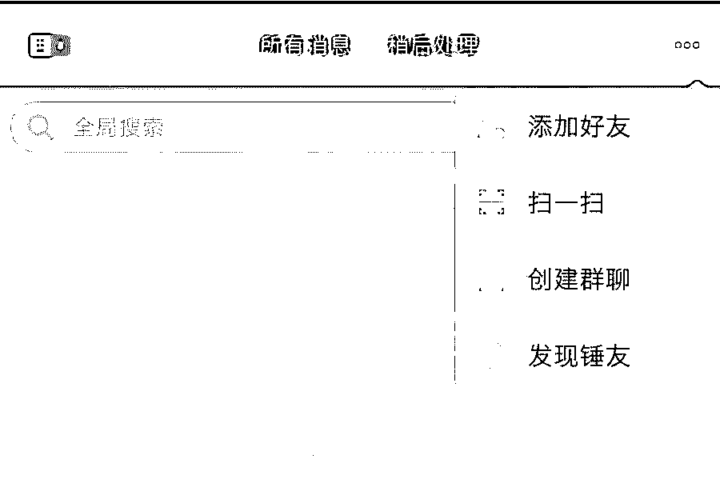

不用申请加好友，也不用经过你同意。

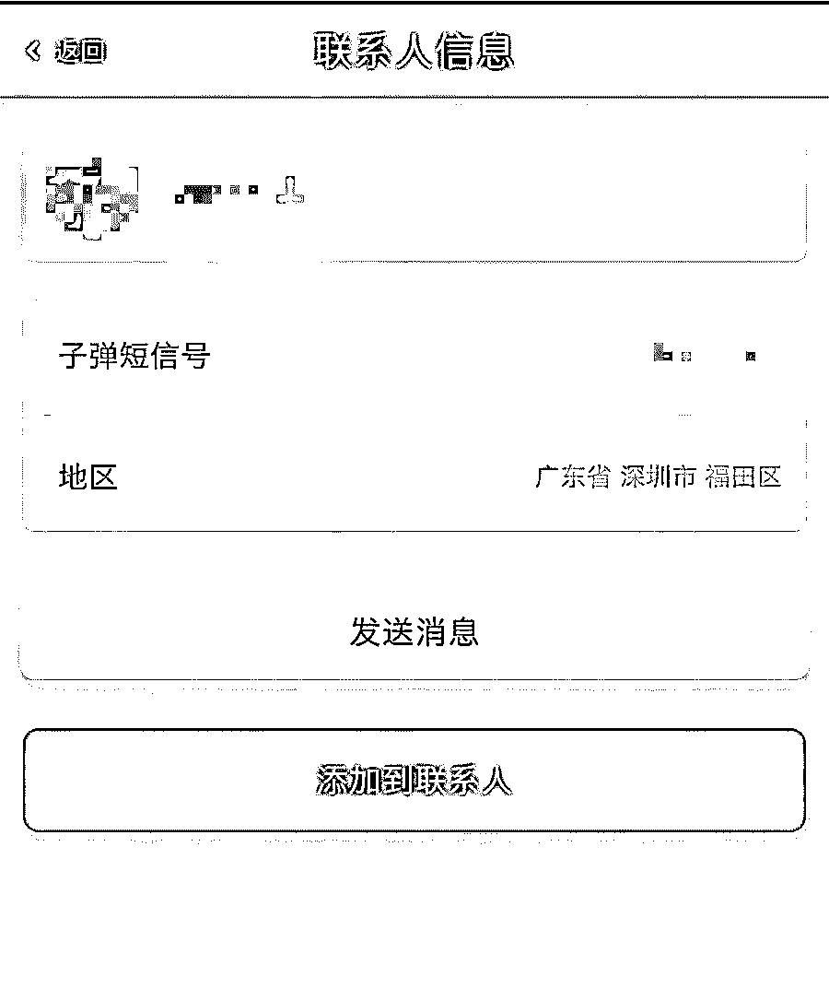

微信群主至少也可以设置入群权限，子弹短信也没有！群主踢了之后，人家照样可以卷土重来。

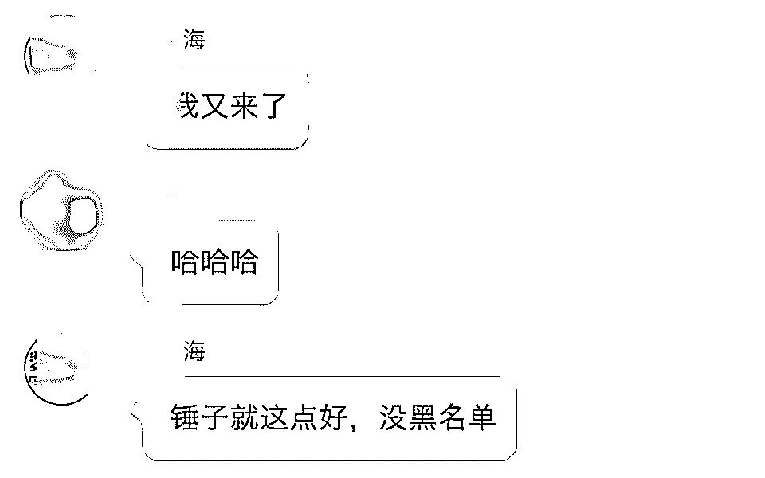

而且目前对于这些垃圾信息，子弹短信的 APP 内并没有举报入口，只能跑去官网、官博进行举报。

尽管子弹短信在加快更迭的速度，填平漏洞，但是大家的新鲜感都是稍纵即逝的。一旦产品不足以吸引用户驻留，曾经的热闹最终也不过是虚幻一场。

**色情内容扎堆竟成行业通病**

严格意义上来说，子弹短信上色情内容扎堆，并非偶然。早在微信上线之初，也曾出现过类似情况。“美女”、“丝袜”、“诱惑”等暗示类关键词就被大量抢注，成功截取大批流量。

灰产圈此前发布过此类文章，再次普及一下，在行业内，利用“色情社交”转化而来的粉丝被称为“色粉”（S 粉），通过其转化的流量称为“色流”（S 流），某些工作室，利用自动摇一摇、自动打招呼等模拟软件（通过美女诱惑的头像，吸引人将其添加至个人微信）成为火爆一时的暴利产业交易软件。

不止微信，陌陌、探探等社交类 APP 全部出现过色情、暴力内容聚集的情况。

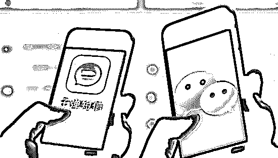

据介绍，不法分子往往利用社交网络和平台，散布“广告”信息，一旦有用户回应或者添加好友，就转入“点对点”的网上对接。更有通过黄色视频或黄色内容对网友进行诈骗的。 

结尾

灰产圈认为，在“流量为王”的时代，流量在某种意义上，就意味着金钱。这条黄金链条上，依附着一种灰色的产业，他们依靠广告、色情、赌博等内容，来截获流量，通过吸睛从而吸金。

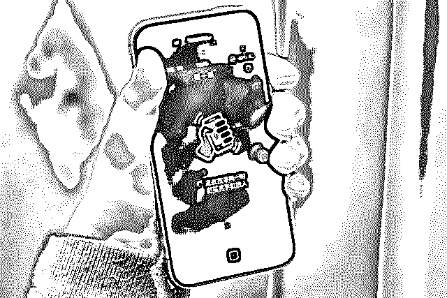

监管不利、可替代性较强 “子弹”继续“飞”并不容易 

灰产圈表示，这类软件类似微信，就是一种天然的流量来源。这种流量来源很容易被对流量最渴求的内容源注意到，也就是我们所说的“黄、赌、毒”。所以一旦有这种突然爆发的软件做出来，就会被盯上。

尽管软件在发展过程中，对内容的全面监管会逐步加强，但在前期，社交软件的监管可能跟不上软件本身的发展，所以，对于子弹短信来说，这也是发展过程中的一大考验。

希望，子弹短信 能飞的更高更远，毕竟 罗永浩 是一个讲情怀的人，而我更喜欢他的这种情怀，就像他说的一样：我们卖手机不赚钱，只是交个朋友！

这句话 我相信 ，苹果公司 CEO 库克 是不敢说的。

* * *

**点击进入**** 生财有道|商学院直播间**