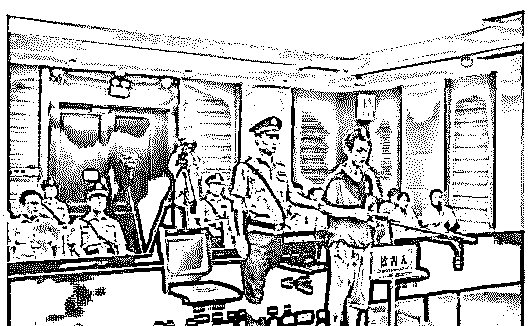
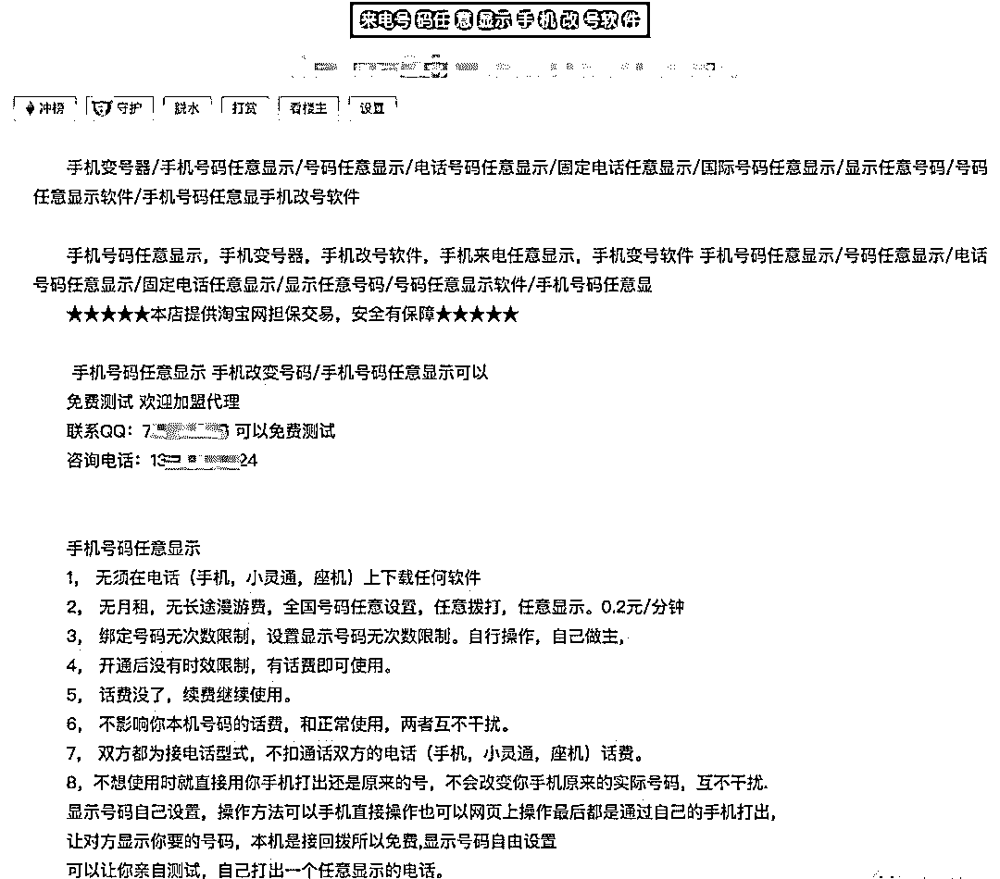
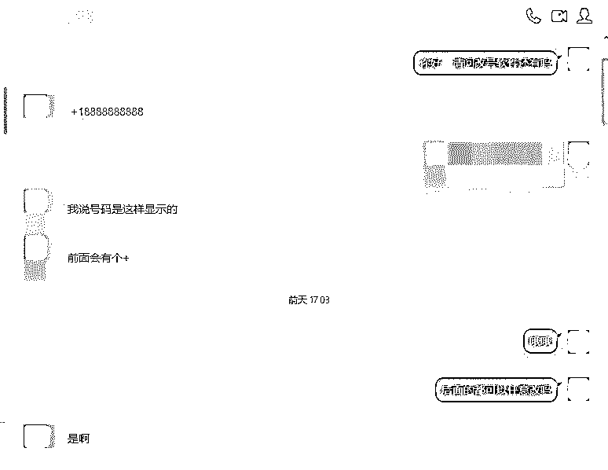
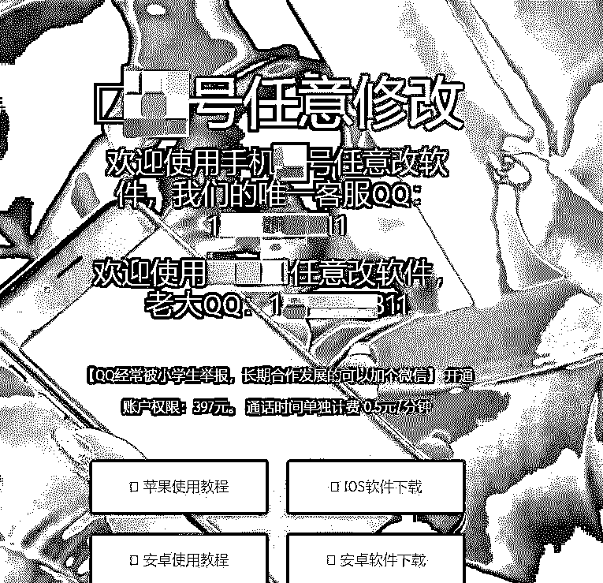
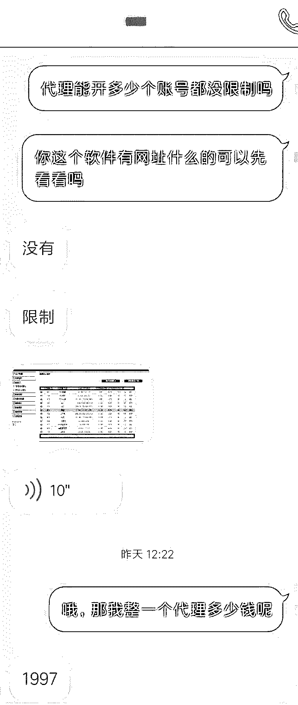
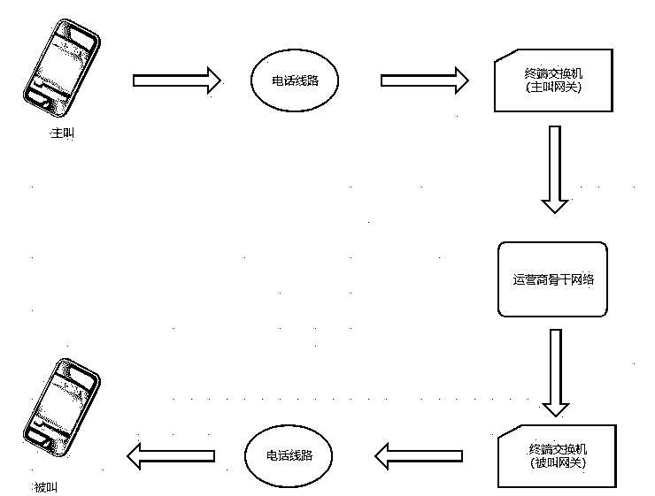
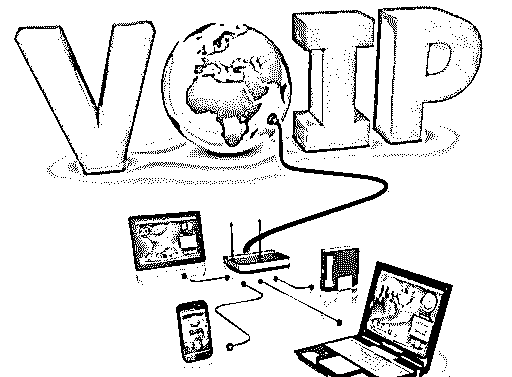

# 任意修改号码？你接的“官方来电”可能都是黑产诈骗......

> 原文：[`mp.weixin.qq.com/s?__biz=MzIyMDYwMTk0Mw==&mid=2247493302&idx=1&sn=80bad76e732bf1a19f6f75459f9bb658&chksm=97cb2d8ea0bca498d244bbe3bf984659f8b401ece280b4ae1fff466166e6d664a413be9db418&scene=27#wechat_redirect`](http://mp.weixin.qq.com/s?__biz=MzIyMDYwMTk0Mw==&mid=2247493302&idx=1&sn=80bad76e732bf1a19f6f75459f9bb658&chksm=97cb2d8ea0bca498d244bbe3bf984659f8b401ece280b4ae1fff466166e6d664a413be9db418&scene=27#wechat_redirect)

**点击上方蓝色字体“灰产圈”关注并置顶本公众号**

**作者：极验**

* * *

上次我们聊了一下黑产如何借用“伪基站”来获取钱财，今天来看看同样能够伪造号码的“来电显示欺诈”又是怎么样被黑产所用的……

* * *

[`v.qq.com/iframe/preview.html?width=500&height=375&auto=0&vid=c1348hc1rtw`](https://v.qq.com/iframe/preview.html?width=500&height=375&auto=0&vid=c1348hc1rtw)

改号貌似“轻而易举”？

电信诈骗的关键一步

最近，中国司法大数据研究院的一份专题报告显示，2017 年全国已结一审电信网络诈骗案件量较 2016 年上升 70.34%。仅 2017 年第二季度电信网络诈骗造成经济损失近 50 亿元，其中单笔案件最高金额达 700 万元：

1.  2016 年 8 月 21 日，诈骗团伙修改来电显示假冒教育部门骗走了山东准大一新生徐玉玉的 9900 元学费。发现被骗后，因为郁结于心，徐玉玉突然晕厥，不省人事，虽经医院全力抢救，但仍没能挽回她 18 岁的生命。

2.  2016 年 8 月，清华大学一名教师遭遇电信诈骗，对方通过伪装成银行客服人员，运用各种手段恐吓威逼，将清华老师的买房款和部分借款骗走，共计 1760 万元。

3.  2018 年 1 月 14 日，在广州某高校做科研工作的女博士被自称“北京市公安局”的骗子盯上，连续 5 天汇款给对方 85 万元。之后骗子逃之夭夭，再也联系不上。

     ……

这样的诈骗事件不断发生，并且受害者不乏受教育程度较高的人。**其中除了诈骗团伙获取了受害者信息之外，来电显示欺诈也成为关键的一步。**比如徐玉玉事件中就是因为对方拨打的电话与之前教育局发放助学金的号码一致，徐玉玉便没有产生怀疑，从而掉入了陷阱。

所谓的**来电显示欺诈（Caller ID Spoofing），主要指更改或操纵来电显示信息的行为， 来电时在你的手机上显示另一个电话号码。**在这种情况下，来电者通常是怀有恶意的。就像伪装他人的电子邮件地址一样，“改号”者可以伪装成任意一个号码来电。

费尽心思来改号

为了搞清楚这个号码是如何修改的，我们在网上大概搜索了一下“改号软件”、“修改号码”等关键词，发现在某宝、贴吧部分平台被屏蔽了，搜索不出相关内容。

仔细了解了之后，原来早在 2016 年，国家面对猖獗电信诈骗出台了相关的政策，通过关键词屏蔽、APP 下架等方式来斩断改号软件的网上发布、搜索、传播、销售、推广渠道。那么……黑产会就此罢休吗？

答案是否定的。经过一番查找，在互联网的小缝缝里，黑产的踪影总是有处可寻。

比如，在各种交流社区里有。

再比如，QQ 里有。

而 APP 无法在正规网站里上架，黑产就自己建下载途径，里面教程都全着呢。

简单看了一下之后，我找一个卖家咨询了一下。目前软件的市场价格在**397**左右，里面还包括详细的教程等附加资料。

除了普通用户直接购买之外，黑产还推出了代理模式。**全款付清 1997 元人民币，并且代理开设账号没有数量限制，也就是说诈骗团伙只要向黑产拿一个代理软件**，后面就可以衍生无数个改号软件，没有任何限制……

就是这样，即便是在不断整顿的情况下，黑产的市场仍然巨大无比，电信诈骗中社会损失的数额越大，黑产售卖此类软件的暴利空间也就越大……

 背后技术是怎么回事？

看了一下上面的展现形式，在用户这边我们并看不出此类软件是如何做到跳过各种限制来修改号码的。那么背后的技术原理到底是怎么回事呢？

首先，**正常的来电显示实际上是现代电信交换网络可以提供的一项服务业务**。就其机理而言，是指交换机对用户提供来电号码专用格式的数据的传送，而用户终端利用符合数据解码格式要求的端机进行接收和显示。

**也就是说电话通讯网络不是依靠电话号码进行用户识别的，而来电显示功能则只是在交换机发出第一次振铃信号后，附加了包含一个主叫用户信息的数据包而已。这个数据包包含着拨号方的电话号码、日期、时间、姓名等信息。**

来电号码显示器在每一次振铃信号的唤醒下，开始接收 FSK 信号，经解码芯片获得其中信息，由单片机进行格式处理并在屏幕上显示出来。这就像是我们在网络聊天时，通过 QQ 号向对方发送消息，我可以决定消息的内容是否包括我的昵称（电话号码等信息），而且这个昵称是完全可以修改的。

而所谓的**改号软件主要通过通过 VoIP（Voice over Internet Protocol）进行的**。VoIP 简而言之是将模拟声音讯号数字化，以数据封包的形式在 IP 数据网络上做实时传递。也就是说 VoIP 电话只是在互联网上的一种应用，网络电话不受管制。 

**所以在这里黑产借用 VoIP 制作了一个网关，夹在主叫方与运营商的网关中间，用自己的网关随意修改主叫号码，再把修改结果送入运营商的网关系统中。**

**整个操作流程如下： **

1.  首先在智能手机或电脑上预置一个 VoIP 软件，该软件指向某预置网关，该网关为非法落地网关。（黑产会利用自己的平台，这个平台与运营商有接口，或者与国外的一些 IP 运营商存在接口）

2.  并且该网关允许并接收客户端发送指定主叫号码，并将此号码传递给被叫号码所属网关。

3.  设置完成就相当于接入了改号软件的平台，当你拨号时，黑产的这个平台就可以帮助实现模拟任意号码呼叫了。

未来该何去何从

当然，黑产利用此类技术来非法牟利的事件，在世界范围内并非个例。各个国家在“来电显示欺诈”方面出台了很多相关政策： 

1.  在**英国**，来电显示号码被称为“显示号码”，必须和拨号者进行绑定。如果一定要显示为一个第三方号码，必须获得这个第三方的明确授权。 

2.  **印度**政府也出台政策对于改号的站点和其他改号行为，一经发现都会立刻关闭站点，对相关事件展开调查。 

3.  **美国**针对 VoIP 网络电话服务，“通过来电显示进行欺骗、造成伤害、或故意误导以牟利......”将被视为非法行为。可处没收（设备）或高达每次$ 10,000（不超过$1,000,000）的刑事罚款。

我国也从 2016 年开始，对于改号软件、骚扰电话、电信诈骗等一系违法行为进行整顿，相关 APP 下架、关键词屏蔽……但是针对屡禁不止的现状来看，未来还有很多路要走。 

*   **加强对 VoIP 网关的管理**，从技术手段上遏制黑产的违法行为；

*   **相关政策需要更加完善**，对于相关设备的制作等管制有待加强；建立举报机制，对于相关产品的售卖、传播等进行举报和查处；

*   个人提高警惕性，面对任何所谓的“官方来电”第一时间去官方网站或者客服中心进行确认。想要确认来电的号码是否真实，**最简便的方式就是回拨检验，如果是通过改号软件修改过的，对方无法接听。**

参考来源：

1.《从技术角度深入剖析：改号软件，电话号码任意显示，伪造来电显示》——nuclearatk

**文章来自合作伙伴：极验**

* * *

 **灰产圈 | 高端社群小程序已开通**

<mp-miniprogram class="miniprogram_element" data-miniprogram-appid="wx4f706964b979122a" data-miniprogram-path="pages/topics/topics?group_id=881854415822" data-miniprogram-nickname="知识星球" data-miniprogram-avatar="http://mmbiz.qpic.cn/mmbiz_png/kialtkOXGKS7D9hZrmO2jzDqryXXTAlhxSpnrKnHGV65KXzicibOppaPic4dCRxftvabB8Iqswo3OuQEDSxE7NicXBg/0?wx_fmt=png" data-miniprogram-title="生财有道 | 商学院" data-miniprogram-imageurl="http://mmbiz.qpic.cn/mmbiz_jpg/WWG78hysZ0YlFJS9lBp1vdRMXbTJibOpfTC6RyCiaUeWub1Kaf9Hq3qQ7rQ9zABfuIhTZYAKP62aYqhh90vibLMBA/0?wx_fmt=jpeg"></mp-miniprogram>

**点击加入【灰产圈】高端社群**