# 流量变现之道亦有道 道法通天 | 特辑

> 原文：[`mp.weixin.qq.com/s?__biz=MzIyMDYwMTk0Mw==&mid=2247493258&idx=1&sn=2a9fde2a59abcf16f5af6dac8d74f92e&chksm=97cb2db2a0bca4a486eae91b7ee9e45ab3ff1426cdb993822ff3fc1436e7cc5296484da6e086&scene=27#wechat_redirect`](http://mp.weixin.qq.com/s?__biz=MzIyMDYwMTk0Mw==&mid=2247493258&idx=1&sn=2a9fde2a59abcf16f5af6dac8d74f92e&chksm=97cb2db2a0bca4a486eae91b7ee9e45ab3ff1426cdb993822ff3fc1436e7cc5296484da6e086&scene=27#wechat_redirect)

**点击上方蓝色字体“灰产圈”关注并置顶本公众号**

**导语**

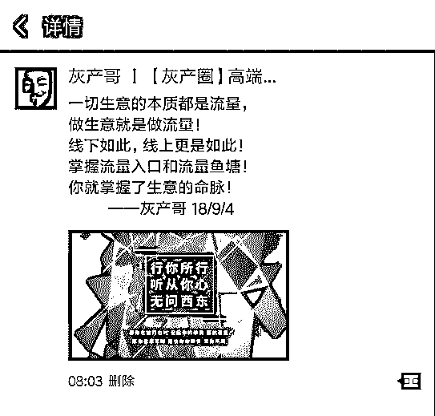

一切生意的本质都是流量，

做生意就是做流量！

线下如此，线上更是如此！

掌握流量入口和流量鱼塘！

你就掌握了生意的命脉！

——灰产哥  18/9/4

这是今天我发表在朋友圈的内容，

今天我们就谈谈流量和变现的核心价值

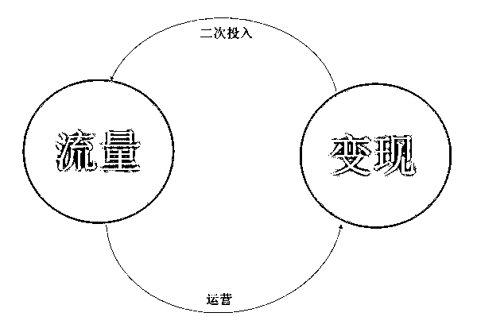

大家不要把流量变现看的很高大上。你想想看，把上千万甚至上亿的人聚集到一起，随便兜售点什么，赚钱就是分分钟的事。

互联网公司，特别是平台型互联网公司，难度最高的不是流量变现，而是吸引流量。

21 世纪实际越来越贵的是什么？是流量。

下面我们将解剖 BAT，讲讲流量变现的秘密配方。

阿里巴巴：天下没有难变现的流量

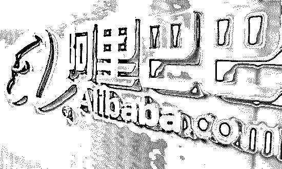

流量变现虽然是个技术活，但再难的事在马老师眼里都不是事，因为天下没有难变现的流量。

马老师别激动，我们当然知道您的原话是“让天下没有难做的生意”。在流量变现方面，您最有发言权。

15 年前，淘宝网面世，来自美国的 eBay 通过易趣网落地中国 C2C 市场，占据国内超过 90%的市场份额。

淘宝网正面和易趣网刚没有胜算，于是打出一招“黑虎掏心”：易趣网不是要对卖家收 2%的交易佣金吗？淘宝网免费！

eBay 最终兵败中国，在退出中国的那天，老板还可能一万个不服气：天下没有免费的午餐，马云你搞免费，看你怎么玩下去。

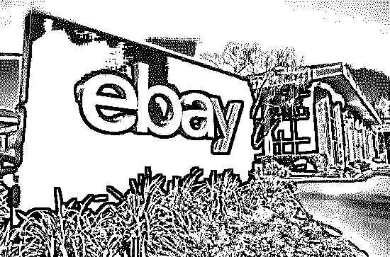

# 在中国市场，eBay 因为葱花钱输掉一顿大餐

事实证明，eBay 的老板错了。

淘宝一统江湖后，开启流量变现模式，淘宝天猫卖家们需要付出的包括技术服务费、装修模板费、会员关系管理费等 9 种费用（保证金和淘宝客费用除外），淘宝卖家相对要少一些。

但要让店铺保证一定的营业额，一年的运营宣传费用超过 20 万元（天猫、淘宝各开一家店）是小意思，详见下图。

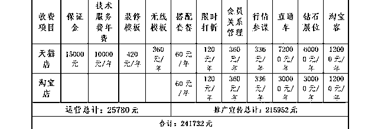

相比之下，2%的交易佣金真的是葱花钱好么。

估计 eBay 的老板都能看傻眼了，马云确实没有提供免费的午餐，要命的是午餐还不便宜。

附：阿里巴巴产业布局

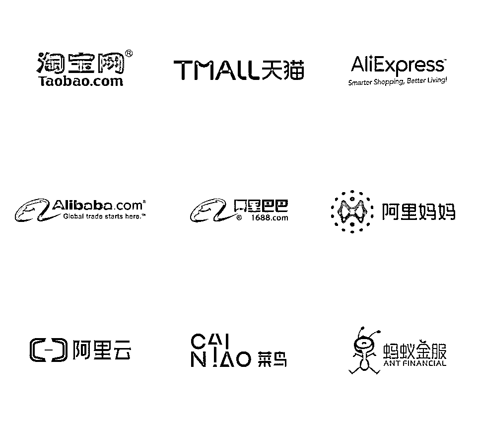

腾讯：只要在我这儿玩，不怕你不花钱

QQ 在网吧青年中流行时，很多人没想明白，一个网络聊天软件能赚到什么钱啊？普通人想不明白，老一辈企业家包括海尔的张瑞敏也没想明白。

2004 年 CCTV 中国经济年度人物颁奖现场，马化腾获得年度新锐奖，当时 QQ 注册用户数 3.55 亿，活跃用户 1.19 亿，央视给小马哥的头衔是“网站站长”，这个头衔今天看来真的很 LOW。

主持人要求马化腾现场说服海尔 CEO 张瑞敏使用 QQ。

大概没搞懂 QQ 如何将流量变现，结果张瑞敏秒拒使用 QQ，马化腾的表情如下图，两个字：尴尬。

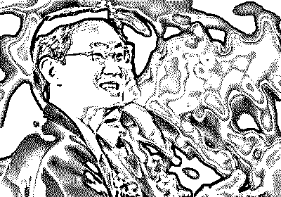

当时互联网经济还很边缘，今天炙手可热的马云老师坐在第二排，没有开煲鸡汤（主要是没人喝），第一排的都是传统企业的老总。

当年想不明白互联网企业如何变现流量的，现在都有廉颇老矣的感觉，想明白的都已买了腾讯股票，赚几百倍收益。

不仅时间是金钱，眼光有时也是金钱。

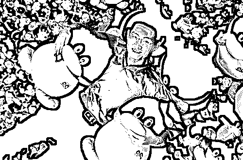

我们回到 QQ 流量变现问题：

卖头像皮肤，有一阵子用户不买 QQ 皮肤，腾讯让你只穿内衣聊天，被用户痛骂之后，腾讯给大伙穿上衣服（推出免费皮肤）；
*   卖广告，在聊天对话框旁边闪呀闪的，想关掉？不可能，否则腾讯怎么赚钱；

*   卖会员等级，QQ 用户谁用谁知道；

……

你以为这就是腾讯变现流量的全部招数？其实，只是 1.0 版。

2.0 版是给自有核心业务导流，比如腾讯游戏、腾讯文学、QQ 音乐、腾讯漫画、腾讯新闻网、QQ 浏览器等。

这些腾讯的亲儿子们有了流量哺育，成长为白白胖胖的独角兽，上市之后让腾讯赚的盆满钵满。流量不仅变现，还增值了。

2.0 版也不是终极版，后来腾讯又搞出流量变现 3.0 版本，从哺育亲儿子到哺育干儿子（腾讯投资的企业），最典型的是京东、拼多多等。从此，腾讯由单一的 QQ 产品演变为以社交为核心的生态帝国。

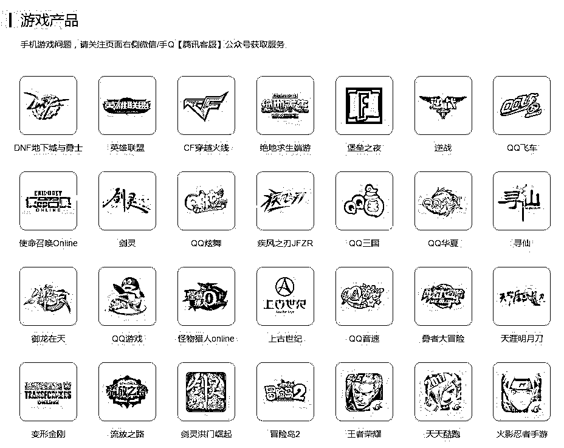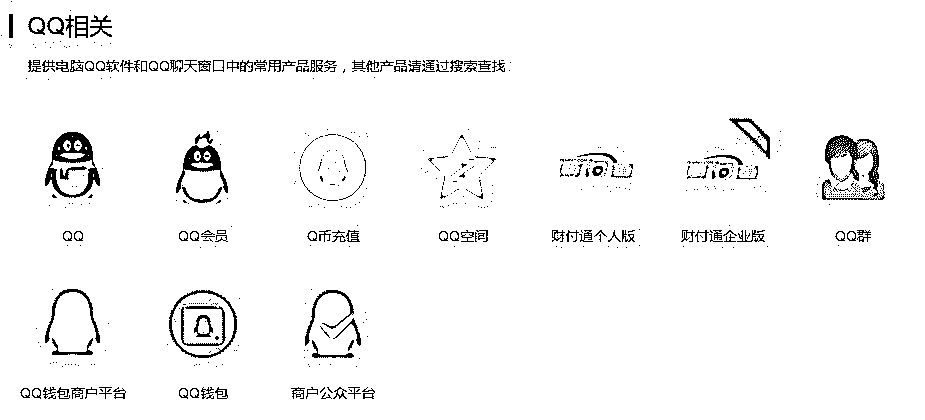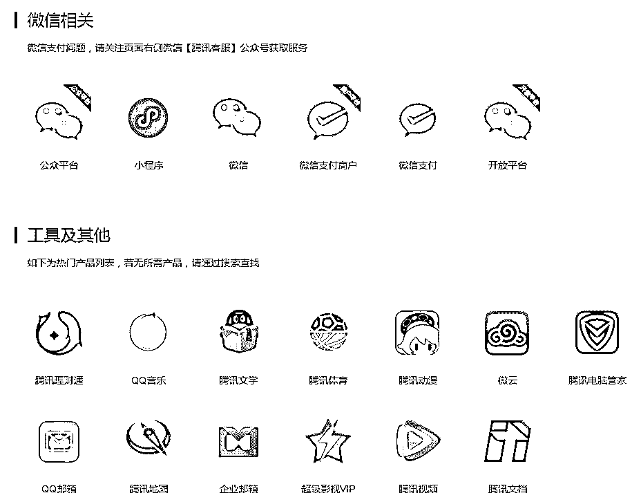

只要你想通过网络聊天、交友、工作，要么选 QQ，要么选微信，反正都是腾讯的产品，逃不掉的。一旦上了腾讯的船，马化腾才不会担心你不花钱纳。

百度：把关键词变成印钞机

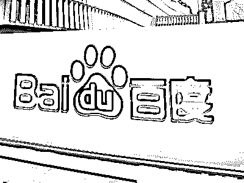

相对于腾讯，百度的流量变现方式简单粗暴：出售关键词。

和百度打交道的公司，对 SEO（Search Engine Optimization，译为搜索引擎优化）这个词应该不会陌生，直白地说，就是购买关键词。

比如“投资、理财、P2P”等词语，你买了的话，用户搜索这些词，你的公司就排在最前面，点击后进入你公司的主页，接下来的事成年人都懂的，这人大概率成为你的菜：客户。

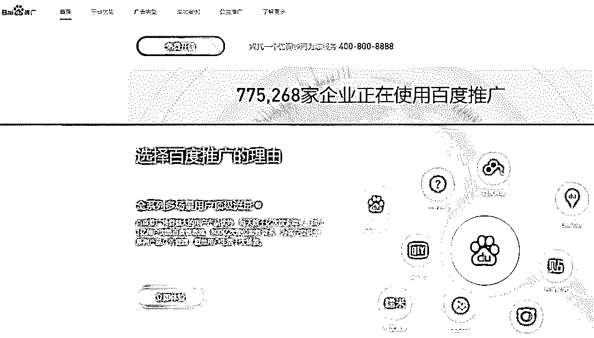

通过关键词引来一个客户要花多少钱呢？几块钱，真的不贵。

当然，这只是最初的情况。当百度垄断 PC 端 80%的流量后，关键词也……涨价了！涨价很好理解，二十年来，房价涨了多少倍，大家心里都有数，何况百度又不是公益慈善机构。

因为点击率高的关键词是稀缺品种，抢的人又多，结果价格就被哄抬上去，贵的时候，点击一次关键词搜索，要花几十元。

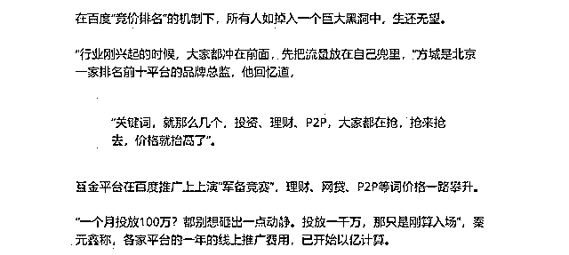

点击鼠标左键还是很轻松的，所以你可以想象一下，随着亿万网民的食指有节奏地点击鼠标左键，在百度那里，一长串阿拉伯数字在不断变化，它们可是实打实地真金白银。

但百度觉得，让大家在关键词上展开军备竞赛还不够，于是又推出“品牌专区”。接地气儿地说就是，李四公司为防止“李四”这个关键词被竞争对手张三公司买走（张三公司买走的话，用户一搜李四，结果出来张三公司，等于李四公司的潜在客户被张三公司撬了），于是花钱向百度购买“品牌专区”。

扯淡之处在于，公司名气越大，这笔保护费也水涨船高，高的一个月能有一百万。嗯，是不是感觉沦为了流量巨头的打工仔？

这种流量变现方式有一个妇孺皆知的名称“竞价排名”，至于如何妇孺皆知，可自行搜索“魏则西事件”。这里不展开。

附：百度产品图谱 

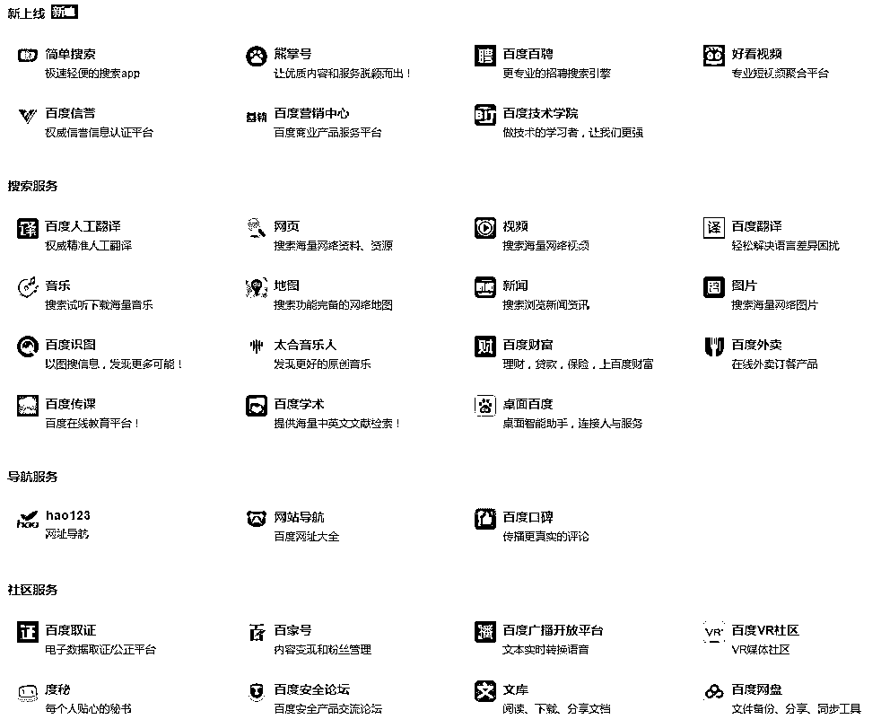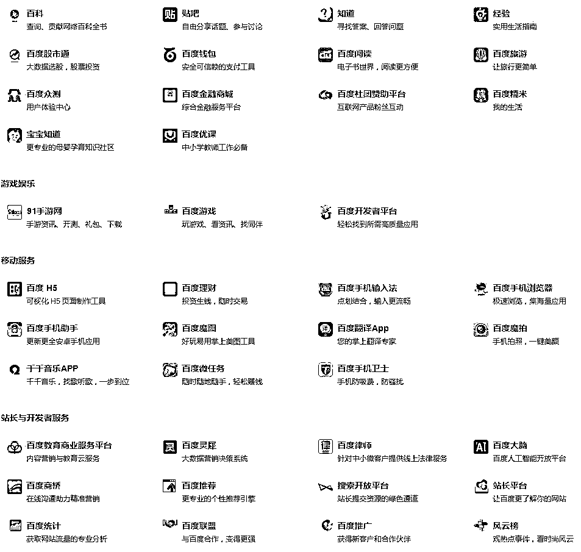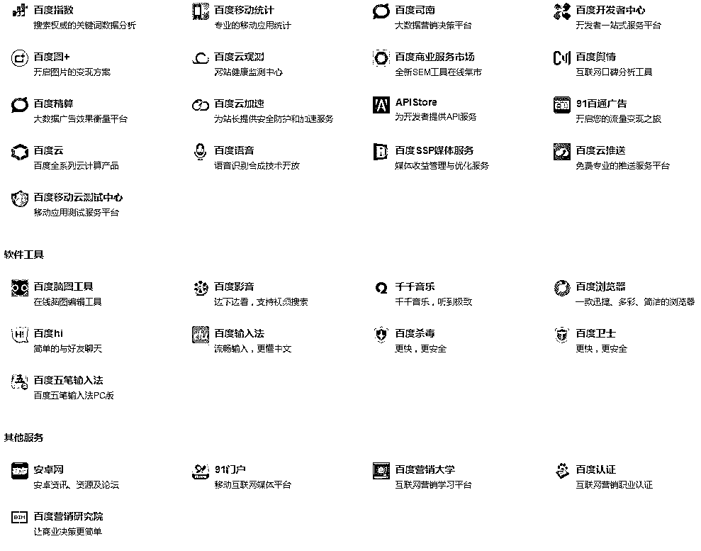

互联网四大最挣钱的生意

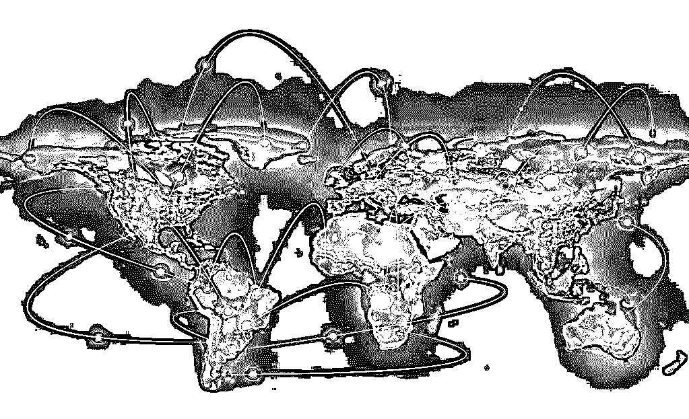

电子商务，网络游戏，广告，增值服务

本质上都是依托于流量的。

下面会从这四种生意的业务流程的角度去分析一下，流量是怎么变成钱的。

1.电子商务

电子商务的主要业务流程就是大家熟悉的去淘宝买东西，网上下单，送货到家。

但实际上除了 2C 的业务，也有一大块是 2B 的，比如阿里巴巴。服务于这种业务流程的产业链，养活了上下游非常多的公司。

以淘宝为例，送快递需要庞大的快递网络，催生出大大 小小的快递公司;开淘宝店需要有客服，需要装修店铺的设计人员，而淘宝庞大的出货量又养活了义乌小商品生产的厂商。

在这个链条中 的每个人的生存都依赖于消费者对淘宝的访问，也就是淘宝的流量。

2.网络游戏:

网络游戏的业务流程更简单，运营商运营网络游戏，玩家在游戏里消费真金白银。

这个链条中，游戏首先需要研发商来开发 完成，研发团队通常包括策划，程序员，美术设计师，而负责运营游戏的公司除了运营人员外，也需要有客服团队服务玩家，搭建和维护 服务器的程序员，负责获取目标玩家的市场推广人员，商务人员等。

这些工作可以简单概括为玩家流量的获取，转化，和付费。

3.广告

互联网广告的原理与传统广告并无二致，只是广告的形式变成了网络上各种各样的链接，图片，视频。

这里除了广告主和承载广 告的各种位置——流量入口外，中间还有许许多多的中间商，他们代替广告主选择最合适的曝光位置，统一向广告主收费，向流量入口付 费，赚取一定差价。

这三方构成互联网广告的基本玩法——买量，买量买量，实际上买的还是广告受众的流量。

4.增值服务

增值服务的种类很多，粗略的可以分为会员类，内容消费类两种。

会员类比如视频网站的付费会员，迅雷下载的会员等，用 户付费可以获得更好的服务。

内容消费类比如今年很火的直播和知识付费。

它们的共同特点是把不付费的流量，转化为付费的流量，从这 个角度上说，网络游戏其实也可以算作一种增值服务。

 互联网是一个有着无数节点的复杂系统，这四类生意并不是互相独立的，这些业务往往都是互相关联相互依存的。

比如网络游戏为了获取 流量需要去买量，要去。去投放广告，玩家在游戏里付费又需要依托支付宝微信等电子商务服务。

用户在网络上的一切行为的数据都可能 被收集统计，被卖给以他们为潜在客户的电商，游戏，广告，增值服务公司。

流量变现：方式，方法，渠道

最开始的流量变现方式就是“人脉变现”。

人脉是狭义的关系，每个人的人脉都是有限的，所以人脉变现是小范围的获利方式。但是星星之火可以燎原，如果我们把所有的人脉聚集在一起就可以进行普遍而且方便的变现。

依托于网络，人脉就变成的更广义的流量。流量越大就有更多的机会进行产业延伸和变现，这就是为什么现在的公司，赔钱在赚取流量。投资人也很看重公司的流量群有多大。

发展到今天，中国的网民已经接近上限，流量也达到了顶峰。所以从以前的各自为王，相安无事变成了对流量的你争我夺。商家对于流量的争抢方式也各用其法，多种多样。

那么流量到底怎么样去变现呢？下面列举了几个：

1.广告变现，现在的老牌公司比如搜狐，百度，网易 到新兴公司如今日头条。在强大的内容信息里，广告成为他们的主要收入。

2.网红流量，网红是新兴起的一批人，他们在自身话题的支撑下积累了大量的流量，他们变现的方式就多种多样，有平台礼物，自身的电商店铺，为其他商家做广告，总得来说，当今社会如果你自带流量，只要稍加运作，便可以获利

3.产品售卖，淘宝，京东等平台型电商；古德雷根，蜜芽，考拉等 以自营为主的电商都是以产品售卖为变现手段的。电商获利的方式是多种多样。自古以来买卖就是最赚钱的方式。

4.知识流量变现，平台以老师自身的特长吸引人来进行知识利润提高。

目前流量变现的方式饱和了吗？远远没有。

目前只能说是大流量变现的方式已经基本出现了。但是小流量怎么去变现呢，比如我只有一个朋友，我怎么让我这一个朋友去变现呢。

这个就涉及到了一种方式，我们暂且称之为“分佣”。即将一个朋友的流量介绍给某个商家或者平台，你会获得永久的福利，我为这种方式总结了一个词语叫做“共享流量”，流量共享很符合当下的共享经济模式，每个人都可以参与其中。

而且这种变现方式带来的利润是巨大的，因为传统的流量变现可能是一次性的，但是这个却是永久性的。

互联网已经回归以用户为中心的营销方式，所以每个人的流量都很珍贵。

能够利用好每个用户的关联流量就一定能在行业内占山为王。

**结尾**

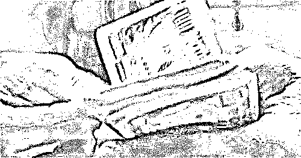

综上所述，互联网上做一切生意的本质都是流量，做生意本就是做流量！

上文仅从正面剖析了互联网生意的流量与变现的几个核心模式，不包含

灰产圈一直致力于研究的互联网黑灰色产业链和生意，因为生意要做长久，必然要回归合理合法合规的健康发展模式中，那些黑灰色产业链虽然暴利，但毕竟不是长久的生意，而且往往所付出的代价也是极大的，灰产哥在这里奉劝各位，君子爱财取之有道，人有人道猫有猫道，想做长久生意，必然要从正规行业入手，当然也有句话说：

## **第一桶金”都是带有原罪的，这种原罪，都带有隐秘性、强制性、违法性、破坏性——总的来说就是“强盗性”。**

## 在《大败局》一书里写道：“草创型的中国企业家群体，在某种意义上算得是‘功利的、不择手段的理想主义者’的俱乐部，在这个特殊的群体中蔓延着一种病态的道德观。”

我也希望，大家能找到自己的流量池和变现模式，同时欢迎加入我们的社群共同探讨流量和变现之道。

* * *

**【灰产圈】高端社群小程序开通，2018 最值得加入的社群！** 

<mp-miniprogram class="miniprogram_element" data-miniprogram-appid="wx4f706964b979122a" data-miniprogram-path="pages/topics/topics?group_id=881854415822" data-miniprogram-nickname="知识星球" data-miniprogram-avatar="http://mmbiz.qpic.cn/mmbiz_png/kialtkOXGKS7D9hZrmO2jzDqryXXTAlhxSpnrKnHGV65KXzicibOppaPic4dCRxftvabB8Iqswo3OuQEDSxE7NicXBg/0?wx_fmt=png" data-miniprogram-title="【灰产圈】高端社群" data-miniprogram-imageurl="http://mmbiz.qpic.cn/mmbiz_jpg/WWG78hysZ0brJkWoyG2VDIacqgQjkDfp6mLiaoPBJ2SgWZHtRuTw7ia8kpoxntsn7PiaFOQO2U23FW6Iry0gS1GnA/0?wx_fmt=jpeg"></mp-miniprogram>

**点击加入【灰产圈】高端社群**