# 起底大数据黑产：华住被“脱裤”，1.3 亿人的开房记录在“裸奔”！

> 原文：[`mp.weixin.qq.com/s?__biz=MzIyMDYwMTk0Mw==&mid=2247493195&idx=1&sn=d5351fa08473d22e7806f00b67d69018&chksm=97cb2d73a0bca46563076a8619815897601954079ae416c191ae0eba1dfe6b8235825349f78b&scene=27#wechat_redirect`](http://mp.weixin.qq.com/s?__biz=MzIyMDYwMTk0Mw==&mid=2247493195&idx=1&sn=d5351fa08473d22e7806f00b67d69018&chksm=97cb2d73a0bca46563076a8619815897601954079ae416c191ae0eba1dfe6b8235825349f78b&scene=27#wechat_redirect)

**点击上方蓝色字体“灰产圈”关注并置顶本公众号**

导语

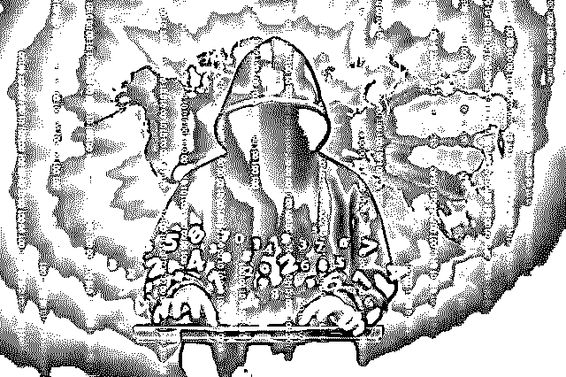

在人们的生活已愈发离不开网络的当下，网络却似乎越来越不安全了。

近来，互联网安全问题一再爆发。弹幕网站 AcFun、摩拜、优酷、前程无忧，甚至中国铁路总公司的 12306，相继被传有上千万用户数据泄露，包括用户的邮箱、密码、真实姓名、身份证号码、电话等被人瞬间摆上“货架”兜售。

更早些时候，暗网上甚至出现了一个高达 41GB 的数据文件，涉及 Gmail、Hotmail、Sina、qq、163 等共 14 亿个邮箱地址，堪称“暗网史上最大的数据库”。

也就是说，若有人想以此牟利，普通消费者在网上的一切信息都可能被瞬间曝光，你的手机、网络银行、股票账户随时都可能被入侵。

工具的使用促进了人类的进化，为人类提供了便利，互联网更是在彻底改变人类生活。然而，在另一面，网络安全正日益捉襟见肘，风险不断上升。相关数据显示，自 2015 年开始，全球的数据泄露规模便成几何式增长。2015 年，7.07 亿条数据泄露；2016，14 亿条；2017 年，50 亿条……2018 年？

风险在上升，技术也会进化。如今，全新的开放式网络安全理念正在悄然崛起，这能否成为挽救网络安全的一剂良方？

华住 1.3 亿开房记录泄露

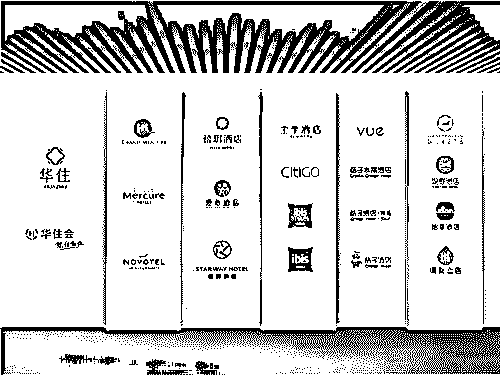

8 月 28 日上午，暗网中文论坛中出现一个帖子，声称售卖华住旗下所有酒店数据，汉庭酒店、美爵、禧玥、漫心、诺富特、美居、CitiGo、桔子、全季、星程、宜必思、怡莱、海友等多家酒店都包含在内。

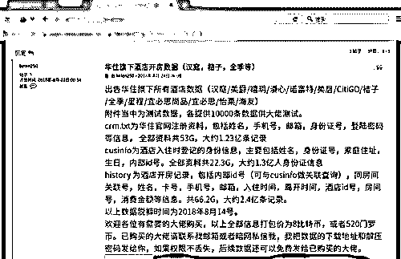

**售卖的数据分为三个部分：**

> **1\. 华住官网注册资料，包括姓名、手机号、邮箱、身份证号、登录密码等，共 53 G，大约 1.23 亿条记录；**
> 
> **2\. 酒店入住登记身份信息，包括姓名、身份证号、家庭住址、生日、内部 ID 号，共 22.3 G，约 1.3 亿人身份证信息；**
> 
> **3\. 酒店开房记录，包括内部 id 号，同房间关联号、姓名、卡号、手机号、邮箱、入住时间、离开时间、酒店 id 号、房间号、消费金额等，共 66.2 G，约 2.4 亿条记录；**

发帖人声称，所有数据脱库时间是 8 月 14 日，每部分数据都提供 10000 条测试数据。所有数据打包售卖 8 比特币，按照当天汇率约约合 37 万人民币。而经过媒体报道之后，该发帖人称要减价至 1 比特币出售……

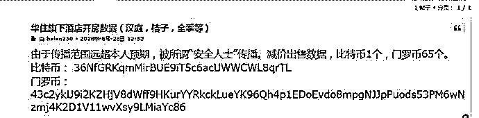

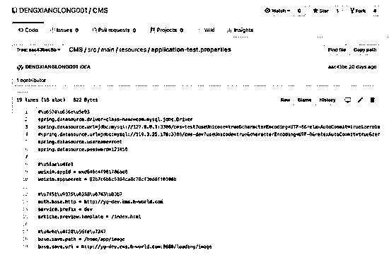

 <strongmargin-left:></strongmargin-left:> 

　　从上述数据库配置库文件可以看出，雅高酒店数据库访问地址为，账号为“root”，密码是“123456”。

　　灰产圈验证了上述信息。IP 地址通往雅高集团内部登录网站，但用户名与密码已经失效。

> **　Github 是一个面向开源和私有软件项目的托管平台，全世界数百万名软件开发者活跃在 Github 上，他们或上传自己写的软件代码供人免费学习和使用，或共同维护完善开源软件项目，Github 因此被开发者们戏称为世界上最大的“同性交友社区”。**

　　不少人怀疑是华住集团 IT 人员在 Github 上上传了数据库配置文件，但并没有确凿证据证明上传文件者来自华住。目前在 Github 上该文件也已经被删除。

紫豹科技风险监控平台情报专家通过技术手段验证了这批数据的真伪。据悉，疑似华住公司程序员将数据库连接方式上传至 github 导致其泄露，目前还无法完全得知到细节。

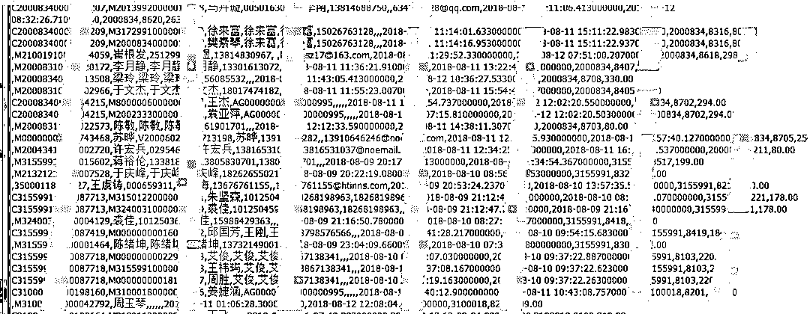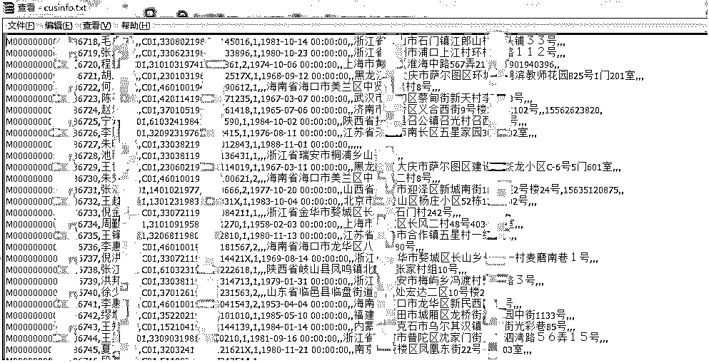

（上述图片灰产圈采集于网络，已打码）

据威胁猎人数据验证结果：

1.从测试数据结果来看，最低的住客年龄在 95 年，最近离店时间是 8 月 13 日。

2.从数据交叉验证来看，可以排除是卖家用老数据欺诈买家的情况，数据绝大部分为新泄露数据，而非老数据混杂售卖。

3.基于此，该份数据的真实性非常高，此次的数据泄露也可能成为近 5 年内国内最大最严重的个人信息泄露事件。

早在 2013 年，汉庭等酒店就出现过数据泄露，当时是因为酒店所使用的 Wi-Fi 管理和认证管理系统存在漏洞，数据传输过程并未加密，导致数据泄漏。此次数据被拖库的原因尚不清楚，华住官方暂无回应。

**华住酒店集团随后发布声明称：**

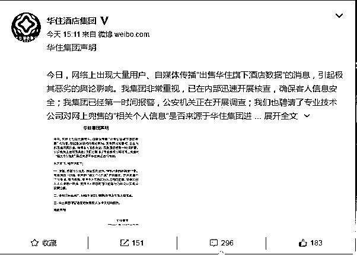  

**（华住酒店微博声明截图）**

已第一时间报警，公安机关正在开展调查，同时聘请人员进行数据是否来源认定。其同时呼吁，请相关网络用户、网络平台立即删除并停止传播上述信息，保留追究相关侵权人法律责任的权利。

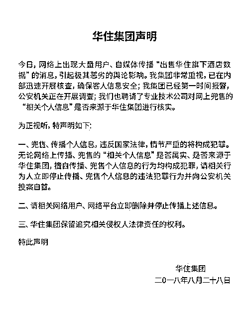

**（华住酒店集团声明）**

一位不愿透露姓名的信息从业者指出，信息售卖者称数据已在 8 月 14 日脱库，此数据库连接方式在 20 天前上传至 github。可能是华住公司程序员将数据库连接方式上传至 github 所致。

2018 年二季度华住酒店集团营收同比增长 26.7%，高于公司指引的 26%，净利润同比增长 38.7%，同时，毛利润率与净利润率都创下史上新高。入住率一直稳定在 90%左右，高于行业平均的 70%。

据其官网介绍，华住酒店集团已有 1.13 亿会员，并且贡献了超过 75%的入住。

  想想 1.13 亿会开房数据泄露，应该是目前国内泄露数据最多的一次事件了！

“裸奔”时代来临

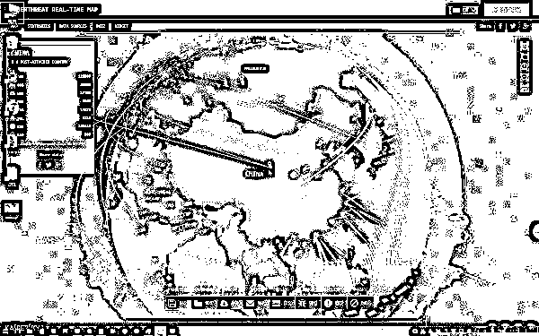

互联网，拉近了人与人之间的距离，也撕碎了人类的遮体布。在网上“裸奔”的网民，不仅被“画了像”，这些“画像”甚至还被出售牟利。

2018 年上半年，被兜售的数据库涉及 AcFun 网站、优酷、摩拜、12306、前程无忧以及各大邮箱网站。其中 AcFun 数据的价格从 7000 元到 12000 元不等；摩拜单车的用户数据整体标价 40 万，12306 的 3000 多万条数据售价 10 个比特币（发稿时每比特币约 6500 美元），5000 万条优酷数据则被黑客要价 80 个比特币。

算下来，一个普通消费者的全部信息，还不到 1 分钱。我们所有的信息，似乎一文不值。可当这些数据落入违法者的手中，对个人造成的损失或以万计。

暗网出售的这些信息并没有被完全证实来源于其所宣称的各大网站或平台。即便如此，面对这些打着各自旗号的所谓泄露信息，各大网站的反应各不相同。

AcFun 的态度最诚恳。该网站承认被泄露的用户数据包括用户 ID、用户昵称、加密存储的密码等。

“根本原因在于我们没有把 AcFun 做得足够安全。”有意思的是，在 AcFun 发布公告后，有黑客即发帖表示，“出于 A 站客服态度诚恳”，他们将无条件删除这次数据库资料，也不会出售任何相关数据和漏洞。

同样被卷入数据泄露风波的摩拜则称，公司在收到情报后第一时间启动全量排查，暂未发现数据泄露和入侵的现象。中国铁路总公司官方微博则表示，网传“12306 数据疑似泄露”，经核查，该网站未发生用户信息泄露。

前程无忧在回应中说，样本数据中只有部分账户密码能够成功登录，因此网站数据库被入侵或整体泄露的可能性不大。“释放出来的样本数据，都是在 2013 年之前注册，大部分来自此前遭泄露的邮箱账户和密码。”

传言和回应，普通的网民真假难辨，但这种不安全的环境却越来越明显。普通消费者至少有权了解，自己在互联网上是如何被变成“裸奔者”的。

“裸奔者”的诞生

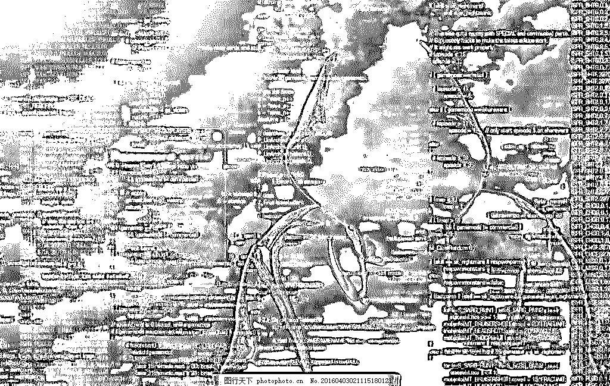

和进化中的人类一样，进化中的互联网也并不完美。从技术派黑客到安全从业者，从政治上的中心权威主义到去中心化的无政府主义，互联网几乎就是现实人性与社会的映射体。

“裸奔者”的诞生，正是这些矛盾的衍生品。比如，网站管理者认为，用户数据是隐私，必须严加保护。而著名的黑客埃里克·雷蒙德却认为，所有的信息都应该是免费的，要打破电脑特权，计算机才会使生活更美好。双方于是产生了进攻和防守，攻防之间，用户数据的泄露在所难免。

在技术上，用户数据的泄露并不神秘。网络安全专家、“漏洞银行”CTOKK 认为，排除内鬼因素，黑客一般是利用漏洞入侵网站服务器，直接将用户数据库导出偷走，这叫“拖库”。

完成“拖库”之后，黑客还会进行“撞库”攻击，就是黑客在获得甲网站的用户账户和密码之后，再用这些账户密码尝试登录乙网站。“多数网民会在不同网站上注册相同的账号和密码，通过撞库，黑客无需入侵乙网站，就能获得一系列可以登录乙网站甚至更多网站的用户数据，而且这一过程是通过程序自动批量来进行的。”

完成“撞库”后，部分无效或者重复的数据将被剔除，只剩下有效的用户数据。这些在不同网站上注册的用户信息相互补充，可以形成更加丰满的“裸奔者画像”，然后再转卖黑产进行价值变现，这个过程就叫“洗库”。“比如传言被泄露的 14 亿邮箱数据，应该是在过去数年中不断地撞库、洗库而累积起来的。”

“冰山”底部的黑产

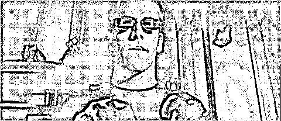

在信息即商机的今天，围绕着网络用户数据，已经形成了一个完整的、极其成熟的网络黑色产业链（简称“黑产”）。根据 2017 年的测算，中国“网络黑产”从业人员已超过 150 万，市场规模达千亿级别。

在这个黑产中，有单个的黑客，也有黑客组织，他们通过网络技术明确分工。比如有人专门负责入侵网站，实施“拖库”，盗取用户数据。有人负责“撞库”或者“洗库”，还有人专门做暗网兜售，将这些数据变现。

在黑产的下游，有政治或者商业竞争对手，也有利用这些数据进行电信诈骗的团伙。

黑产离不开暗网。所谓暗网，是一个完全匿名的、不能被搜索引擎检索、IP 地址很难被跟踪的网络。黑产交易绝大部分都是通过暗网完成的，而且使用的是隐匿性很强的数字货币。正是因为有极强的隐蔽性，暗网成了犯罪者的天堂。

令人吃惊的是，在暗网上收购用户数据的，不仅有黑客、黄牛、诈骗犯以及政商竞争对手，也有正规的网络安全公司和大数据公司。

“网络安全公司主要是购买漏洞技术，为客户提供补漏服务。大数据公司则需要原始数据，比如他们想做网购行为分析，自己没有电商平台，又无法从大的电商平台获取，那就只能从暗网购买。

这种购买肯定不符合法规，但是因为其隐蔽性，很难被查处。”KK 还透露，现在暗网上卖得最火爆的，已经不是邮箱账号、密码之类的数据，而是外卖、快递、购物、理财类的信息。这些信息不仅包含有个人的物理定位，还能反映出个人的消费和资金等情况。

在这些大数据面前，人人都是“裸奔者”，而这却是商家实现精准营销所急需的。

漏洞的价值

暗网和表层网相互交织，加上黑色产业背后的巨大利益，导致要想彻底铲除黑产，几乎不大可能。

人类最美好的健康，是不生病、不吃药，不需要庞大的医疗产业。同样的，大家期待的网络安全，是“夜不闭户、路不拾遗”，不需要任何的防护。

“在纷繁复杂互联网世界里，这样的理想状态几乎就是幻想。就像木桶存在短板一样，任何网站都无法做到固若金汤，肯定有薄弱之处和漏洞。所以，漏洞本身是非常有价值的。”KK 解释说，所有诈骗电话、钓鱼邮件、欺诈短信，都和个人信息泄露有关。

假如金融网站漏洞被黑客掌握，上亿资金瞬间就会被转走；如果城市电力系统的漏洞被掌握，整座城市可能会陷入黑暗。在黑市上，微软的漏洞交易价格从 1 万美元到 30 万美元不等，而各国国防安全系统的漏洞，其价值更是无法预估。

“与其让恶意黑客掌握这些潜在漏洞，流入黑产市场，不如鼓励拥有黑客技术的人发现漏洞，提供给企业和机构，并帮助他们建设更安全的网站。”正是基于这样的理念，才有了漏洞平台的诞生，而这些发现漏洞帮助企业的“黑客”被称为白帽子。白帽子和企业之间的有效合作，可以帮助企业将安全隐患扼杀在萌芽时期。”

结尾

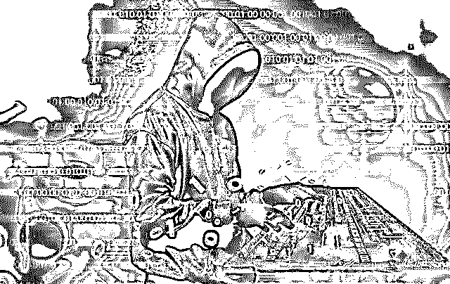

道高一尺，魔高一丈，网络安全技术在提高，但黑客技术也在不断发展。特别是借助近年来出现的大数据、互联网+、人工智能和区块链前沿技术，黑客和白帽子同样都在不断进化，双方对漏洞的争抢更加激烈。

“如果有一天，漏洞变得毫无价值了，互联网也就真正安全了。”KK 说。

* * *

延伸阅读[与黑产作战 | 起底大数据黑产](http://mp.weixin.qq.com/s?__biz=MzIyMDYwMTk0Mw==&mid=2247492962&idx=1&sn=7a21e79f66db38b17f31bca2bb626723&chksm=97cb2e5aa0bca74cd415375606c65edd2bed31a07ea478d583a179e105c65720360fdd2ff24d&scene=21#wechat_redirect)
[揭秘大数据下，久赌必输的秘密：不赌才是赢！](http://mp.weixin.qq.com/s?__biz=MzIyMDYwMTk0Mw==&mid=2247491646&idx=2&sn=fa5c16f70d37d48356979287ce3f0f42&chksm=97cb2b06a0bca210aa446d58aa30ad64112ca575aafc43544e0d95f802e77f29f3266f79874c&scene=21#wechat_redirect)
[真相调查| 门罗币背后“暗网”世界：匿名，黑暗，暴利！](http://mp.weixin.qq.com/s?__biz=MzIyMDYwMTk0Mw==&mid=2247492562&idx=1&sn=6a29d8061a964e7ed31acc38e8a37db8&chksm=97cb28eaa0bca1fc7f162f825cb4229ee7802c115a841e9c06d6c8c9d7525ddff50d2d7430e4&scene=21#wechat_redirect)
[深度| 揭秘赌场高深莫测的黑科技：数据采集 ，人工智能，人脸识别，风水秘术，套路无穷！黑暗无边！](http://mp.weixin.qq.com/s?__biz=MzIyMDYwMTk0Mw==&mid=2247489533&idx=1&sn=89059bccd4390aace68327724cba106e&chksm=97c8dcc5a0bf55d375c953c999ac315380cfc45995959b44e1bb336810107c274b89cbf1b5f2&scene=21#wechat_redirect)
[深度：信息买卖黑链：淘宝 25 页和京东 3 年数据仅需 1 元，揭秘你的信息是如何被黑市买卖的。](http://mp.weixin.qq.com/s?__biz=MzIyMDYwMTk0Mw==&mid=2247489263&idx=1&sn=e1baf7a32570e65968fd8ab3bfee5649&chksm=97c8ddd7a0bf54c151b62d46024846d2eb1e6b07c55d69bc46d515284d275c858aefbc128be4&scene=21#wechat_redirect)

* * *

****【灰产圈】高端社群小程序开通，2018 最值得加入的社群！**** 

**<mp-miniprogram class="miniprogram_element" data-miniprogram-appid="wx4f706964b979122a" data-miniprogram-path="pages/topics/topics?group_id=881854415822" data-miniprogram-nickname="知识星球" data-miniprogram-avatar="http://mmbiz.qpic.cn/mmbiz_png/kialtkOXGKS7D9hZrmO2jzDqryXXTAlhxSpnrKnHGV65KXzicibOppaPic4dCRxftvabB8Iqswo3OuQEDSxE7NicXBg/0?wx_fmt=png" data-miniprogram-title="【灰产圈】高端社群" data-miniprogram-imageurl="http://mmbiz.qpic.cn/mmbiz_jpg/WWG78hysZ0brJkWoyG2VDIacqgQjkDfp6mLiaoPBJ2SgWZHtRuTw7ia8kpoxntsn7PiaFOQO2U23FW6Iry0gS1GnA/0?wx_fmt=jpeg"></mp-miniprogram>**

****

****

****点击加入【灰产圈】高端社群****

 **# 

> 原文：[`mp.weixin.qq.com/s?__biz=MzIyMDYwMTk0Mw==&mid=2247493187&idx=1&sn=c6768fcbf10171ec52f0809aa2d76efc&chksm=97cb2d7ba0bca46dc32028f854afa4c8bb90119c488e1454cac176a072d01122426b7a112ef6&scene=27#wechat_redirect`](http://mp.weixin.qq.com/s?__biz=MzIyMDYwMTk0Mw==&mid=2247493187&idx=1&sn=c6768fcbf10171ec52f0809aa2d76efc&chksm=97cb2d7ba0bca46dc32028f854afa4c8bb90119c488e1454cac176a072d01122426b7a112ef6&scene=27#wechat_redirect)

# 

> 原文：[`mp.weixin.qq.com/s?__biz=MzIyMDYwMTk0Mw==&mid=2247493170&idx=1&sn=2763ef1763c8a1ce6545a35ca98b3edb&chksm=97cb2d0aa0bca41c427ded9acbc4e561b555187415420b2346d3306650d395f4da5a2d823c80&scene=27#wechat_redirect`](http://mp.weixin.qq.com/s?__biz=MzIyMDYwMTk0Mw==&mid=2247493170&idx=1&sn=2763ef1763c8a1ce6545a35ca98b3edb&chksm=97cb2d0aa0bca41c427ded9acbc4e561b555187415420b2346d3306650d395f4da5a2d823c80&scene=27#wechat_redirect)

# 

> 原文：[`mp.weixin.qq.com/s?__biz=MzIyMDYwMTk0Mw==&mid=2247493164&idx=1&sn=af8b9c75371fe2ff4294f4e34f30c5c3&chksm=97cb2d14a0bca4023ae75c9fd411dfe8432478218d5ba0a1701bb8e92eb2eca2df69de85b2f7&scene=27#wechat_redirect`](http://mp.weixin.qq.com/s?__biz=MzIyMDYwMTk0Mw==&mid=2247493164&idx=1&sn=af8b9c75371fe2ff4294f4e34f30c5c3&chksm=97cb2d14a0bca4023ae75c9fd411dfe8432478218d5ba0a1701bb8e92eb2eca2df69de85b2f7&scene=27#wechat_redirect)

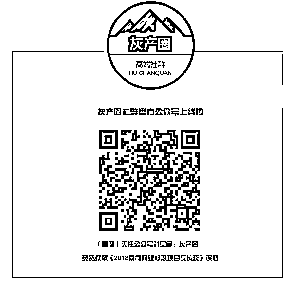

# 

> 原文：[`mp.weixin.qq.com/s?__biz=MzIyMDYwMTk0Mw==&mid=2247493161&idx=1&sn=ff244d66311b52f8420002c9bc240241&chksm=97cb2d11a0bca40797de79cb5a70db3de35e25f201b60e6e521190d07e6d5a5d48dc20f53979&scene=27#wechat_redirect`](http://mp.weixin.qq.com/s?__biz=MzIyMDYwMTk0Mw==&mid=2247493161&idx=1&sn=ff244d66311b52f8420002c9bc240241&chksm=97cb2d11a0bca40797de79cb5a70db3de35e25f201b60e6e521190d07e6d5a5d48dc20f53979&scene=27#wechat_redirect)**