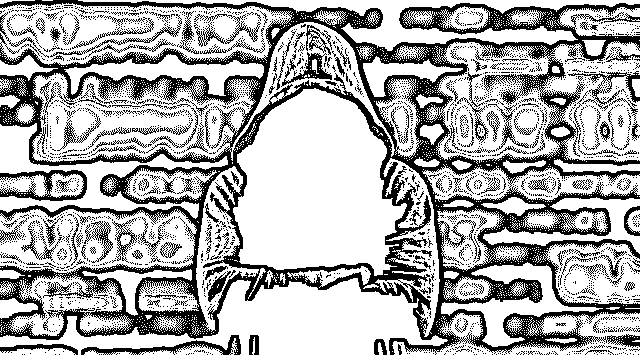
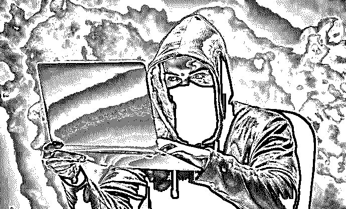
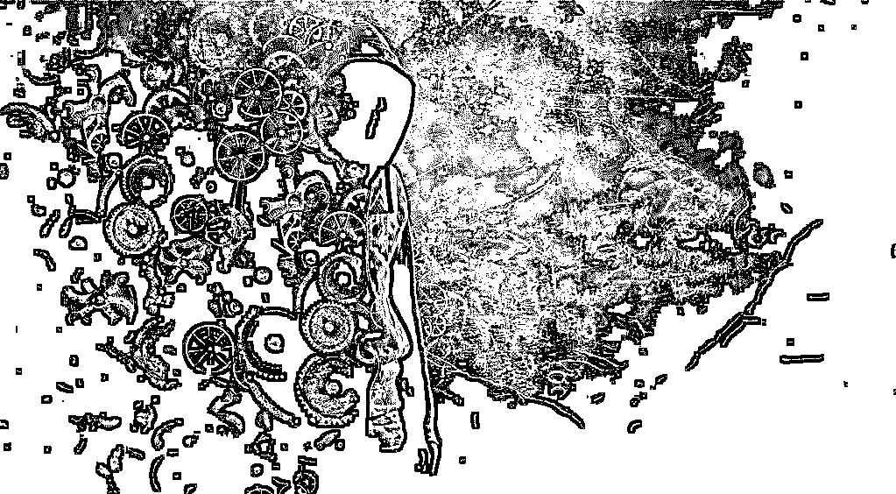
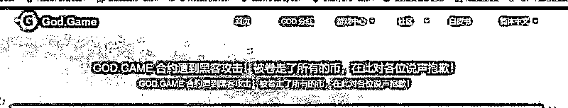
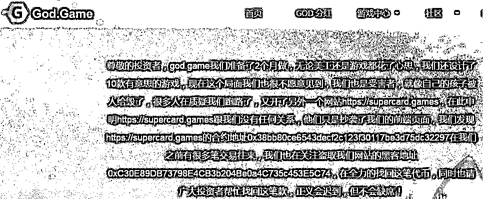
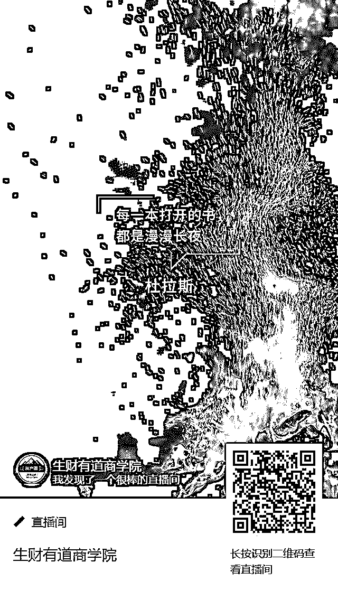

# 区块链黑客：我一天赚了 8000 美元，感觉就像在天堂！

> 原文：[`mp.weixin.qq.com/s?__biz=MzIyMDYwMTk0Mw==&mid=2247493107&idx=1&sn=b4857fae193a6a722d779e2cee99eb31&chksm=97cb2ecba0bca7dd936a0411632d35792e905600e4160a473ad95c751b9a313dfa4cea24e986&scene=27#wechat_redirect`](http://mp.weixin.qq.com/s?__biz=MzIyMDYwMTk0Mw==&mid=2247493107&idx=1&sn=b4857fae193a6a722d779e2cee99eb31&chksm=97cb2ecba0bca7dd936a0411632d35792e905600e4160a473ad95c751b9a313dfa4cea24e986&scene=27#wechat_redirect)

**点击上方蓝色字体“灰产圈”关注并置顶本公众号**

**导语**

哪里有财富，哪里就有盯着财富的劫匪——这一铁律在区块链世界也一样。随着比特币、山寨币和加密交易所如雨后春笋般的出现，黑客们找到了全新的发财路线。

**一、黑客心声**

一个笔名为 Hacker 的黑客曾在 Steem 的上面介绍自己盗取比特币的经历：

在 2013 年 6 月，我无意间制作的一个比特币钓鱼网站给我发回了几十个交易所的登陆账号信息，出于好奇我登陆一下这些账号，很快就发现这家比特币交易所漏洞百出，我可以毫无阻碍地提走他们所有的比特币。

提币之后，我在 localbitcoins.com 上面出售了这些比特币，那一天我赚了 8000 美元的现金，感觉就像天堂，毕竟那是我四个月的工资。之后，我便毫无抵抗力的爱上了黑客的身份，它远比在办公室敲代码有趣的多。

诸如 Hacker 这类的只针对个人的黑客，在加密数字货币领域还属于黑客中的小玩家。他们大多只通过钓鱼网站、假钱包和键盘记录器等手段来盗取个人用户的私匙来实施盗窃行为。

真正威胁加密数字货币市场的并不是这部分小黑客，而是另一部分数量更少但智商更高的黑客，他们并不屑于通过钓鱼的方式来进行小资金上的犯罪，而是更喜欢通过查找交易所、矿池、以及其他小型 token 的智能合约的漏洞，来对比特币及其它加密数字货币发起掠夺式攻击。

在暗网里，黑客的地位是由他攻击后造成的损失价值或者获利价值来进行衡量的。而比特币及交易所被攻击的新闻，也宛如黑客的身价榜，财富和名誉也在不断吸引着新黑客的跃跃欲试。

2018 年 3 月，币安交易所被黑客攻击。但是因为多重验证的关系，黑客只能通过做空手段去场外套现获益。受此事件影响，比特币暴跌 10%。

每次黑客的出击后都会或多或少的引起比特币下跌。比特币期货交易市场的出现，已经让一些比特币作恶基金开始通过雇佣黑客，来实现对比特币价值的操控。尽管这看起来不可接受，但在利益面前，这就是现实。

**二、被攻击过的比特币**

根据腾讯安全提供的数据显示，与加密数字货币有关的黑客攻击事件，从 2013 年到 2018 年（上半年）直接增加了大约五倍的数量，全年预计增加 10 倍左右，其中仅今年上半年，黑客对加密数字货币的攻击就已经直接造成 20 亿美元的损失。

这其中，交易所需要负责的事件越来越多，一方面是缺乏法律监管带来的黑客肆意妄为，另一方面技术防护体系和监控程度也不如证券交易所和银行，再加上加密数字货币的匿名性所带来的低风险、高回报，数字加密货币行业也成为了黑客刀下的完美肥羊。

比特币诞生于 2009 年 1 月，起初的比特币在一群社区的自由信仰者手中度过了其创世期间的最脆弱时期。在 2010 年 5 月初，比特币刚刚获得几美分价值时，这些社区人员便开始宣称：比特币是世界上最安全的货币。

世界之大，也不知道哪个黑客在听说这一说辞后，便和比特币开了一个有史以来最为危险的玩笑。

在 2010 年 8 月 15 日，一名黑客曾在比特币高度为 74,638 的区块上，通过比特币的一个原生 bug 一夜间创造了 1844 亿枚比特币。当然，这名黑客在完成这一壮举后并没有进行后续的攻击动作，让比特币通货膨胀后瘫痪；如果有，那么我们便也见不到今天的比特币。

虽然黑客开完玩笑后，颇为满足的离开了，但这一 bug 却吓坏了当时比特币代码维护团队。比特币社区的首席开发者 Wladimir Van Der Laan 在回忆时直言：「这是有史以来最严重的问题」。

黑客放弃攻击有着许多原因，但其中颇为重要的一点是：2010 年 10 月时的比特币并没有多少价值，其暗网的流通市场还尚未建立，愿意买入和持有的人更是少之又少。如果这名黑客当时采取进一步动作，除了将这个本就没有太多价值的比特币归零外，并不会对这名黑客产生一丁点的利益和好处。

中本聪早在白皮书里预测过：

即使有黑客成功了，他大概率只是途一时之爽，不会继续攻击，

因为：

1、那需要他计算机的算力一直超过整个诚实链条的算力，这个代价太大了；

2、他通过破坏创造的财富不会多于他通过贡献创造的财富，所以他会失去持续制造破坏的动力。

在经历这次和黑客的较量后，比特币在安全方面快速得到了技术人员的修补，比特币社区也在很长一段时间再也没提起「比特币是全世界最安全加密数字货币」的壮大宣言。随后几年黑客对比特币主网攻击均以失败告终，这倒是让一些媒体开始重提「比特币是全世界最安全的加密货币」的言论。

**三、无助的受害者**

2011 年 6 月 13 日，

一位在黑客攻击中损失了 2.5 万枚比特币的用户发了一个求助帖：

「我现在想自杀，尝试恢复钱包备份，但一点用都没有。除了跳楼自尽之外，请你们告诉我下一步该怎么做？」。

这个帖子的用户是幸运的，在这个已经拥有 7 年历史，长达 32 页的回复中，他通过发起捐款重新获得了一部分比特币。

然而，在媒体没有注意到的情况下，又有多少损失了资产，又有多少人找回了资产？在牛市的时候，所有人都放松了警惕，也让黑客有了可乘之机，如今进入熊市后，黑客更有动力来进行攻击。

**结尾**

在常规的运作中，区块链技术是比较安全的。然而，随着大家对区块链技术的不断研究、应用，区块链技术也面临着众多的挑战。

**1、对共识机制的挑战**

当前的区块链技术中已经出现了多种共识机制，最常见的有 PoW、PoS、DPos。但这些共识机制是否能实现并保障真正的安全，需要更严格的证明和时间的考验。

**2、51%攻击**

在比特币中，如果一个人控制节点中绝大多数的计算资源，他就能掌控整个比特网络并可以按照自己的意愿修改公有账本。这被称为 51%攻击，这也是比特币系统中倍受诟病的设计之一。

**3、秘钥安全隐患**

私钥是每个用户自己生成并且自己负责保管的，理论上没有第三方的参与，所以私钥一旦丢失，便无法对账户的资产做任何操作。虽然多重签名能解决一些问题，但是比较复杂。所以用户一旦秘钥丢失，想要找回是比较麻烦的事情。

**最后的最后 ，给大家看两张图片：**

**灰产圈****愿：**

**天堂没有区块链！**

**注：文章素材源于网络**

* * *

**【灰产圈】高端社群知识星球小程序已开通**

<mp-miniprogram class="miniprogram_element" data-miniprogram-appid="wx4f706964b979122a" data-miniprogram-path="pages/topics/topics?group_id=881854415822" data-miniprogram-nickname="知识星球" data-miniprogram-avatar="http://mmbiz.qpic.cn/mmbiz_png/kialtkOXGKS7D9hZrmO2jzDqryXXTAlhxSpnrKnHGV65KXzicibOppaPic4dCRxftvabB8Iqswo3OuQEDSxE7NicXBg/0?wx_fmt=png" data-miniprogram-title="【灰产圈】高端社群" data-miniprogram-imageurl="http://mmbiz.qpic.cn/mmbiz_jpg/WWG78hysZ0brJkWoyG2VDIacqgQjkDfp6mLiaoPBJ2SgWZHtRuTw7ia8kpoxntsn7PiaFOQO2U23FW6Iry0gS1GnA/0?wx_fmt=jpeg"></mp-miniprogram>

**【灰产圈】高端社群直播间已开通**

**点击加入【灰产圈】高端社群**